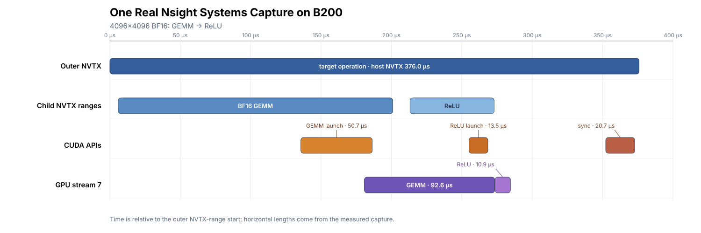

(chap_benchmarking)=
# Measuring and Analyzing GPU Kernel Performance

GPU kernel optimization involves two separate questions: how fast the operation is, and where its
time goes. A benchmark answers the first question; a profile helps answer the second. Because a
profiler changes the execution environment, final claims about complete-operator or application
latency should be confirmed with an unprofiled measurement.

One Python call does not necessarily correspond to one GPU kernel. It may launch several kernels,
enqueue memory copies, or wait for GPU work to finish. Before timing, define which of those steps
belong to the operation and use the same boundary for every implementation.

In practice, first verify correctness and establish an unprofiled baseline, then use a profiler to
investigate where the time goes. After changing the implementation, repeat the same measurement. An
optimization is successful only when it improves the unprofiled baseline.

The performance chapter ({ref}`chap_performance`) uses roofline analysis to reason about compute and
memory limits. Here the focus shifts to experiments: defining the timing boundary, choosing warm-up
and repeat budgets, and reading profiler reports.

## Separate Measurement from Diagnosis

The tools used in this workflow have different jobs:

| Tool | Primary question |
|---|---|
| CUDA Events | How much GPU-stream time elapsed across the measured region? A stream is an ordered queue of GPU work. |
| Proton (provided by Triton) | Which GPU kernels were launched, how often, and which kernels account for most of the time? |
| Nsight Systems | How do host work, streams, copies, kernels, and communication overlap on a timeline? |
| Nsight Compute (`ncu`) | Why does one selected GPU kernel spend its cycles the way it does? |
| IKET (optional) | Which named phases or warp roles consume time inside one selected kernel? |

### Three Profile Views

A profile is not a single number or a single report format. The tools in this chapter produce three
complementary views:

| View | Tools | How to read it |
|---|---|---|
| Aggregation tree | Proton | Compare call count, average duration, and total duration to locate expensive kernels. |
| Timeline | Nsight Systems; IKET inside one kernel | Read time from left to right across tracks; inspect gaps, overlap, and dependencies. |
| Per-kernel metric report | Nsight Compute | Read launch configuration, utilization, scheduler state, memory traffic, and source/SASS evidence for one launch. |

Profiles explain where time is spent; they do not replace the performance measurement. After changing
an implementation, disable profiling and measure it again with the same timing boundary used for the
baseline.

## Verify Correctness Before Timing

Verify correctness separately before collecting performance:

1. Construct representative inputs, including relevant boundary cases.
2. Run the implementation and synchronize so that GPU work has completed.
3. Compare the output with a reference under a stated tolerance.
4. If the kernel accumulates into an existing output or modifies an input in place, restore the same
   initial state before each correctness check.

Reference computation and result comparison stay outside performance timing. Design the benchmark
only after correctness passes; whether state reset is timed depends on the operation boundary defined
in the next section.

## Define the Timing Boundary

Before timing, define the work that constitutes one measured operation. It may contain only one
kernel, or it may include every kernel, memory copy, and state reset required to produce the complete
result. State explicitly whether compilation, input construction, allocation, or data conversion is
part of that operation. Implementations are directly comparable only when they perform the same work
inside the measured boundary.

After fixing the scope, choose the timer:

- **CUDA Events** record timestamps when a GPU stream reaches two points. They can measure the
  device-timeline interval around one kernel or a complete operator. Kernels, memory copies, and idle
  stream gaps inside that interval all count. For a multi-stream operation, measured work on every
  participating stream must begin after the start event and join before the end event is recorded.
- A **synchronized wall-clock timer** starts before the host call and stops after all GPU work required
  by that call has completed. It also includes Python dispatch, CUDA launch, and the wait for GPU
  completion, so it is appropriate for end-to-end call latency.

For example, if the GPU executes the start event before the host submits the next launch, that idle
stream time remains inside the CUDA Event interval. An Event interval is therefore not necessarily
the same as a kernel's start-to-finish execution interval in a profiler. Profilers are useful for
examining execution and overlap, but diagnostic profiles do not directly replace unprofiled timing at
the same boundary.

## Measure GPU Time with CUDA Events

CUDA launches are normally asynchronous. Python can continue after submitting work to a CUDA stream,
before the GPU has finished. A CPU timer placed immediately around that Python call can therefore
stop too early and mostly measure host submission time. Use CUDA Events to measure elapsed time on a
GPU stream. Use the synchronized wall-clock timer shown later when the boundary runs from the Python
call through GPU completion. The
[PyTorch CUDA semantics documentation](https://docs.pytorch.org/docs/stable/notes/cuda.html#asynchronous-execution)
describes this behavior in more detail.

Start with a complete CUDA Event benchmark. The following runnable example allocates its matrices,
runs a warm-up, and then measures five rounds of one FP16 GEMM before reporting their median:

```python
from statistics import median

import torch


a = torch.randn((2048, 2048), device="cuda", dtype=torch.float16)
b = torch.randn((2048, 2048), device="cuda", dtype=torch.float16)
c = torch.empty((2048, 2048), device="cuda", dtype=torch.float16)


def gemm():
    torch.mm(a, b, out=c)


def measure_batch_ms(fn, calls):
    """Return mean CUDA Event time per call over one consecutive batch, in ms."""
    start = torch.cuda.Event(enable_timing=True)
    end = torch.cuda.Event(enable_timing=True)

    start.record()
    for _ in range(calls):
        fn()
    end.record()
    end.synchronize()
    return start.elapsed_time(end) / calls


warmup_calls = 500
repeat = 100
rounds = 5

for _ in range(warmup_calls):
    gemm()
torch.cuda.synchronize()

samples_ms = [measure_batch_ms(gemm, repeat) for _ in range(rounds)]

print(f"device: {torch.cuda.get_device_name()}")
print(f"calls per round: {repeat}")
print("round samples (ms):", [round(x, 4) for x in samples_ms])
print(f"median CUDA Event time: {median(samples_ms):.4f} ms")
```

`measure_batch_ms` records start and end events in the current CUDA stream and divides their elapsed
time by the number of calls. The result is the mean GPU-stream time per GEMM during consecutive
execution. `end.synchronize()` only makes the CPU wait for that round of GPU work so that the Event
result can be read.

Here `warmup_calls=500`, `repeat=100`, and `rounds=5` are invocation or measurement counts. They are
example values selected from measurements of this GEMM on a B200, not universal defaults. In a
ten-round calibration, 50 warm-up calls still produced a first-to-last decline from 0.01425 ms to
0.01296 ms. At 500 calls, the change narrowed to 0.01332 ms to 0.01301 ms. Results with `repeat=100`
were also more stable than with `repeat=10`.

For another workload, increase `warmup_calls` until the first rounds no longer become consistently
faster or slower. Then increase `repeat` or `rounds` until the variation is acceptable for the
experiment. Larger counts are not automatically better: if longer runs systematically shift the
timing level, inspect temperature, power, and clock behavior and decide whether the experiment should
represent short bursts or sustained execution. Long-running kernels generally need smaller counts.

This code reuses the same matrices, so later calls may find some data in cache. It therefore represents
a warm-cache workload. A published result should also record the GPU model, software versions, and
clock settings.

When benchmarking the TIRx kernels in this book, there is no need to rewrite the warm-up, repeated
timing, and statistics loop for every kernel. TVM's
[`tvm.tirx.bench.bench`](https://github.com/apache/tvm/blob/v0.26.0/python/tvm/tirx/bench.py)
already provides those steps. Pass it a function that launches the prepared implementation; inputs,
outputs, and workspace remain allocated outside the measured interval.

The helper uses a different cache policy from the manual example. The example repeatedly reuses the
same matrices, whereas `bench` evicts L2 before each measured invocation and records an independent
CUDA Event interval. Invoke it as follows:

```python
from tvm.tirx.bench import bench


# run is a no-argument function that launches the operation on preallocated tensors.
result = bench(
    {"tirx": run},
    timer="event",
    warmup=25,
    repeat=100,
    rounds=5,
    cooldown_s=1.0,
)

print(result["impls"]["tirx"])           # five-round mean, in us
print(result["round_samples"]["tirx"])  # result from each round
```

Here `warmup=25` and `repeat=100` are time budgets in milliseconds, not invocation counts. The Event
timer first performs a short estimate, then converts the 25 ms warm-up budget and 100 ms measurement
budget into iteration counts. That estimate includes both L2 eviction and the measured call, so the
resulting counts are approximate. In the reported samples, the L2 eviction occurs before the start
event and only the invocation is timed. Short kernels therefore run more times than long kernels.
`rounds=5` repeats the complete measurement five times, while `cooldown_s=1.0` waits one second before
measuring an implementation in each round. `impls` contains the five-round mean and `round_samples`
retains the individual results. The 25/100 ms values are the Event timer defaults. Five rounds are the
default used by the TIRx-kernels CLI; `bench` itself defaults to one round.

These values are starting points rather than a standard for every workload. Increase the warm-up
budget if results continue to drift between rounds. Increase the measurement budget or number of
rounds if the results remain noisy. Use the same timer, budgets, and rounds for every implementation,
and retain all round results instead of reporting only the fastest one.

TIRx-kernels uses this helper in its `run_bench` entry points; see
[`tirx_kernels/attention/flash_attention4.py`](https://github.com/mlc-ai/tirx-kernels/blob/5be39749e7dfd2c4bdae9b4d396f8ec35af07126/tirx_kernels/attention/flash_attention4.py).
The local benchmark defaults to Proton when `timer` is omitted. Specify `timer="event"` as above when
the intended result is a CUDA Event interval. The two timers report different quantities, so a result
must identify which one was used.

The function passed to `bench` is invoked repeatedly. If a kernel accumulates into its output or
modifies an input in place, restore equivalent state before every call or ensure that every measured
invocation receives fresh preallocated state. A reset inside the measured function belongs to the
operation boundary defined earlier. Otherwise later calls no longer represent the same workload.

### Measure End-to-End Time for One Call

Use a synchronized wall-clock timer when the target is the complete interval from one Python call
until its GPU work finishes. The following code continues with the `gemm()` defined and warmed up
above:

```python
from statistics import median
import time

import torch


def measure_single_call_ms(fn, samples=20):
    values = []
    for _ in range(samples):
        torch.cuda.synchronize()  # exclude unfinished work from earlier calls
        t0 = time.perf_counter()
        fn()
        torch.cuda.synchronize()  # wait for this call's GPU work
        values.append((time.perf_counter() - t0) * 1e3)
    return values


host_samples_ms = measure_single_call_ms(gemm)
print("single-call samples (ms):", [round(x, 4) for x in host_samples_ms])
print(f"median end-to-end time: {median(host_samples_ms):.4f} ms")
```

The first synchronization keeps unfinished earlier work outside the measurement. The second ensures
that this GEMM finishes before the timer stops. Each sample contains exactly one call, so the result
includes the Python call, CUDA launch, GPU execution, and the wait for completion. The CUDA Event
benchmark above instead reports mean GPU-stream time per GEMM during consecutive execution.

Every implementation in a comparison must use the same timer and boundary. If both results are
reported, name them separately as *CUDA Event GPU time* and *single-call end-to-end time* rather than
placing values from different timers under one generic latency label.

### Timing Overlapping GPU Work

The GEMM examples above run entirely in the current CUDA stream, so their start and end events cover
all of the work. An operator that uses several streams needs additional synchronization. Events
recorded only in the current stream do not automatically include work elsewhere, which may begin
before the start event or remain unfinished after the end event.

To time the complete operator, use the start event as a common starting signal. Every work stream
waits for start before beginning the measured work and signals completion when it finishes. The stream
that records the end event waits for all of those completion signals first. The resulting interval
then spans the operation from its earliest start through its final completion.

Programmatic Dependent Launch (PDL) is another source of possible overlap. On GPUs with compute
capability 9.0 or newer, it can start a later kernel early in the same stream. That kernel may perform
preparation that does not depend on earlier results, then wait before consuming those results. PDL
must be enabled explicitly and follow its trigger-and-wait contract; see the
[CUDA Programming Guide](https://docs.nvidia.com/cuda/cuda-programming-guide/04-special-topics/programmatic-dependent-launch.html)
for the API details.

The timing rule is the same whether overlap comes from multiple streams or PDL: place CUDA Events
around the complete operation. Overlapping kernels can cover the same time interval, so adding their
profiler durations does not produce operator latency. A Nsight Systems timeline shows the actual
ordering and overlap. Because PDL overlap is opportunistic, program correctness cannot require it to
occur.

## Keep Experimental Conditions Consistent

The preceding sections established the timing boundary and timer. The remaining experimental
conditions must also be held constant. The examples above start after allocation and warm-up, so they
measure subsequent repeated calls. A first call may also include CUDA initialization, JIT compilation,
autotuning, or other one-time work. If first-call latency or a complete application path is the target,
include those steps in the boundary and report the result separately from repeated-call performance.

One measurement is not enough to establish stability. The manual CUDA Event example retains five
rounds and reports their median. `bench` reports the mean across rounds and also stores the raw values
in `round_samples`. Whichever summary is used, keep the per-round results, inspect them for trends and
outliers, and state whether the reported value is a median or mean rather than selecting only the
fastest round. When comparing implementations, repeat the experiment in a different order so that one
implementation is not always measured on a colder or hotter device.

Cache conditions also affect the result. The manual example repeatedly uses the same matrices and
therefore measures a warm-cache workload.
The TVM 0.26 Event and Proton timers instead write a 256 MiB buffer before every measured invocation
to evict existing L2 data; that write remains outside the timed interval. Either policy can be valid.
Choose the one that represents the target application and apply it consistently to every
implementation. `torch.cuda.empty_cache()` releases unused blocks from PyTorch's caching allocator.
It does not clear GPU L2 and cannot implement a cold-L2 measurement.

Finally, record the GPU model, driver, CUDA runtime, framework and compiler versions, and the workload
dtype and shape. Also record clock and power settings, keep unrelated processes off the device, and
watch for thermal throttling. If clocks are locked, provide the actual values and command; "fixed
clocks" alone is not enough to reproduce the experiment.

Matching tensor shapes alone does not make two implementations comparable. Align at least three
classes of conditions:

- **Numerical semantics:** input and output dtype, layout, transpose convention, alignment,
  accumulation precision, scale, mask, epilogue, output definition, and accuracy tolerance;
- **Measured scope:** inclusion or exclusion of allocation, conversion, state reset, auxiliary
  kernels, communication, and synchronization;
- **Tuning conditions:** workspace limits, whether per-shape autotuning is allowed, and the search
  budget available to each implementation.

Every implementation should also use the same cache, clock, warm-up, sampling, and timing policies.
For a library baseline, record its version, selected algorithm, and workspace. Autotuning may run
outside the timed interval, but its search budget and final configuration remain part of the
experimental record.

## Convert Latency to Throughput

Throughput is not measured directly by the timer. It is computed by dividing a defined amount of work
by the measured latency. A table that reports TFLOP/s, GB/s, or tokens/s should therefore retain the
original latency and explain how the work was counted. This book counts GEMM as $2MNK$ FLOPs. For
attention and fused kernels, specify whether the count represents the full dense problem, the elements
actually selected, or the work executed by the kernel. See {ref}`chap_performance` for the corresponding
formulas and roofline analysis.

## Use Proton to Find Expensive Kernels

The preceding benchmark tells us how long the complete operation takes. If it launches several kernels,
we still need to determine where that time is spent. Proton reports each kernel's call count, average
time, and cumulative time.

Proton is a GPU profiler provided by the Triton project. It observes CUDA kernel activity and can
therefore analyze TIRx kernels compiled by TVM. The `bench(timer="proton")` helper introduced above
returns an aggregate kernel-time result. Here we create a separate Proton session to inspect each
kernel's call count and execution time.

The following example reuses the matrices allocated above and combines GEMM with ReLU in one
operation. It finishes warm-up, collects the next 100 calls, and writes `operator.hatchet` in the
current directory:

```python
import torch
import triton.profiler as proton


def operation():
    torch.mm(a, b, out=c)
    torch.clamp_min(c, 0, out=c)


def collect_proton(run, *, warmup_calls, profile_calls):
    for _ in range(warmup_calls):
        run()
    torch.cuda.synchronize()

    session = proton.start("operator", context="shadow", data="tree")
    if session is None:
        raise RuntimeError("Proton session could not be created")
    try:
        with proton.scope("target_operation"):
            for _ in range(profile_calls):
                run()
        torch.cuda.synchronize()
    finally:
        proton.finalize(session)


collect_proton(operation, warmup_calls=500, profile_calls=100)
```

Here `warmup_calls` and `profile_calls` are invocation counts, not the millisecond budgets used by
`bench`. Install a Triton version compatible with TVM and record that version with the experiment.

First list the stored metrics. The next two commands print call counts, total time, and average time:

```bash
proton-viewer --list operator.hatchet
proton-viewer --metrics time/ms,count --print-sorted operator.hatchet
proton-viewer --metrics avg_time/us,time/ms --print-sorted operator.hatchet
```

If `proton-viewer` reports missing optional dependencies, install them with:

```bash
python -m pip install pandas llnl-hatchet
```

The following is one real B200 result from this code; kernel names are shortened for readability:

```text
target_operation               calls    avg/us    total/ms
├── GEMM kernel                  100      14.83        1.483
└── ReLU kernel                  100       4.23        0.423
```

First confirm that all expected kernels appear with the correct call counts, then compare their
average and cumulative times. GEMM has the largest cumulative time in this example, so it should be
the first kernel examined with Nsight Compute. Also watch for short kernels that are launched often:
their individual calls may be inexpensive while their cumulative cost is substantial.

Proton includes only the captured kernel times, not memory copies, synchronization, or stream gaps.
When kernels overlap, summing their durations also counts the overlapping interval more than once.
These data therefore identify kernels for further analysis; they are not the latency of the complete
operation.

This capture repeatedly uses the same matrices, whereas the earlier TVM timer evicts L2 before each
measurement, so the two experiments also have different cache conditions. Measure complete-operation
latency with CUDA Events or a synchronized wall-clock timer.

## Analyze an Application Timeline with Nsight Systems

Proton can aggregate kernel time, but it cannot show execution order, gaps between kernels, copies,
or host waits. Use the Nsight Systems timeline to examine those relationships.

### Capture the Target Operation Timeline

The following example shows how to restrict Nsight Systems collection to one target operation. In
`appendix/nsys_example.py`, that operation performs three steps in sequence: it copies a
$4096\times4096$ BF16 matrix from pinned host memory to the GPU in a host-to-device (H2D) copy, runs
GEMM, and applies ReLU. All required tensors are allocated before collection, so the report focuses
on these three steps. The core of the script is:

```python
import torch


def run():
    with torch.cuda.nvtx.range("H2D input"):
        a.copy_(host_a, non_blocking=True)
    with torch.cuda.nvtx.range("BF16 GEMM"):
        torch.mm(a, b, out=c)
    with torch.cuda.nvtx.range("ReLU"):
        torch.clamp_min(c, 0, out=output)


def run_once_for_profiler(run, *, warmup_calls):
    for _ in range(warmup_calls):
        run()
    torch.cuda.synchronize()

    cudart = torch.cuda.cudart()
    cudart.cudaProfilerStart()
    with torch.cuda.nvtx.range("target operation"):
        run()
        torch.cuda.synchronize()
    cudart.cudaProfilerStop()
```

`run_once_for_profiler` completes warm-up before the profiler starts and waits for the warm-up work on
the GPU to finish. It then calls `cudaProfilerStart()` and labels the measured invocation with the
`target operation` NVTX range, making it easy to locate in the timeline. The synchronization inside
the range ensures that all three GPU operations finish before `cudaProfilerStop()`. These profiler
APIs define the collection range; they do not measure performance.

The following command runs the script and writes `reports/target-timeline.nsys-rep`:

```bash
mkdir -p reports
nsys profile \
  --trace=cuda,nvtx \
  --sample=none \
  --cpuctxsw=none \
  --capture-range=cudaProfilerApi \
  --capture-range-end=stop \
  --output=reports/target-timeline \
  --force-overwrite=true \
  python appendix/nsys_example.py --profile-once
```

`--capture-range=cudaProfilerApi` restricts collection to the interval between
`cudaProfilerStart()` and `cudaProfilerStop()`. `--trace=cuda,nvtx` records CUDA APIs, GPU activity,
and NVTX ranges. CPU sampling and context-switch tracing are disabled here to keep the report focused
on the CUDA timeline. If that timeline contains a long GPU gap, collect a separate report with the
relevant host-scheduling or OS runtime tracing enabled.

Once the report has been generated, open its timeline in the Nsight Systems GUI:

```bash
nsys-ui reports/target-timeline.nsys-rep
```

### Copy, Queue, and Execution Time in the Timeline

This example uses PyTorch to construct a copy-plus-multiple-kernel workload with little setup. The
same timeline-reading method applies to a TIRx operation.

The following real report illustrates how to interpret Nsight Systems results. It was collected on an
NVIDIA B200 with NVIDIA driver 595.58.03, CUDA 13.0, PyTorch 2.12.0+cu130, and Nsight Systems 2025.6.3.



*This figure was redrawn from an actual capture. Each bar is scaled to the measured duration of the
corresponding activity.*

The `7` in `GPU stream 7` is the stream identifier shown by Nsight Systems for this capture. It does
not mean the seventh execution stage and may differ in another run. The H2D copy, GEMM, and ReLU share
that stream and therefore execute in submission order.

In addition to viewing the timeline in the GUI, use `nsys stats` to extract the timing data used
below from the same report:

```bash
nsys stats \
  --format=column \
  --timeunit=us \
  --report nvtx_gpu_proj_sum \
  --report nvtx_pushpop_trace \
  --report cuda_gpu_sum \
  --report cuda_kern_exec_trace \
  --report cuda_api_sum \
  reports/target-timeline.nsys-rep
```

The names following `--report` refer to summaries built into Nsight Systems.
`nvtx_gpu_proj_sum` and `nvtx_pushpop_trace` report the GPU projection of an NVTX range and its
host-side range records, respectively. `cuda_gpu_sum` summarizes kernels and CUDA memory operations;
`cuda_kern_exec_trace` correlates host launch APIs with their GPU kernels; and `cuda_api_sum`
summarizes host-side CUDA API calls. Run `nsys stats --help-reports` to list the names and definitions
available in the installed version.

`cuda_gpu_sum` reports the three GPU activities:

| GPU activity | Count | GPU duration | Share of listed GPU time |
|---|---:|---:|---:|
| 32 MiB H2D copy | 1 | 607.230 μs | 85.4% |
| BF16 GEMM | 1 | 93.152 μs | 13.1% |
| ReLU | 1 | 11.072 μs | 1.6% |

`cuda_kern_exec_trace` correlates each kernel with its launch API and reports API time, positive queue
time, and GPU execution separately. Positive queue time is the interval from API return to a later
kernel start; it has no positive value when the kernel starts earlier.

| Kernel | API time | Positive queue time | GPU execution |
|---|---:|---:|---:|
| BF16 GEMM | 34.270 μs | 403.214 μs | 93.152 μs |
| ReLU | 11.064 μs | 442.166 μs | 11.072 μs |

This report supports four concrete observations:

1. **The H2D copy dominates this region.** It accounts for 85.4% of the three GPU-duration sum.
   Looking only at `cuda_gpu_kern_sum` would omit the copy entirely, so this example uses
   `cuda_gpu_sum`, which includes both kernels and memory operations.
2. **Queue time is not launch overhead.** GEMM and ReLU wait behind earlier work on the same stream.
   Their queue intervals are long because they follow the H2D copy and GEMM, not because their launch
   APIs took hundreds of microseconds.
3. **A long synchronization interval usually means that the host is waiting for the GPU.**
   `cudaDeviceSynchronize` occupied 384.821 μs on the CPU because GPU work remained unfinished when
   the host called it. That number is neither one kernel's duration nor the complete operation
   latency.
4. **Intervals at different scopes cannot be added.** The three GPU durations sum to 711.454 μs.
   `nvtx_gpu_proj_sum` measures from the first enclosed GPU operation's start to the last one's end,
   producing 715.582 μs; the roughly 4.1 μs difference is gaps between activities. The original
   `target operation` range on the CPU is 870.561 μs because it also includes dispatch and the final
   synchronization wait.

In a separate unprofiled run, 20 CUDA Event samples of the same operation had a median of 722.816 μs
and a range of 718.400–726.336 μs. The same measurement method can be rerun with:

```bash
python appendix/nsys_example.py --event-samples 20
```

That unprofiled result is the appropriate performance number to report. The single Nsight Systems
timeline explains where time went; the two numbers need not match exactly.

These numbers also show why the timing boundary matters. If the production operation truly includes
the H2D copy, reducing or overlapping the transfer is the first place to look. If the application
already holds its input on the GPU, the copy does not belong inside the measured region. Do not
assume that GEMM is the first target merely because it is the main compute kernel.

Apply the same reading order to other reports: first confirm that the NVTX range excludes warm-up and
initialization; inspect kernels, copies, gaps, and overlap on the GPU streams; then follow correlation
back to launch or synchronization APIs on the host. Durations on different streams cannot simply be
added, and visible overlap proves only that it occurred in this capture. Verify any claimed latency
benefit with the same unprofiled boundary.

Report scripts vary across Nsight Systems releases. Run `nsys stats --help-reports` to list those
available in the installed version, and record `nsys --version` with the experiment. The
[Nsight Systems User Guide](https://docs.nvidia.com/nsight-systems/UserGuide/index.html) covers the
CLI and GUI; the [Analysis Guide](https://docs.nvidia.com/nsight-systems/AnalysisGuide/index.html)
explains API, queue, and kernel-execution intervals in more detail.

## Collect an Nsight Compute Report for One Kernel

Nsight Systems shows when kernels run; Nsight Compute explains why one selected kernel behaves as it
does. It collects launch configuration, occupancy, compute and memory throughput, scheduler state,
and other hardware metrics. NCU can replay the kernel several times while collecting those metrics,
so it is a diagnostic tool: do not substitute the report's `Duration` for latency measured during a
normal run.

The timeline above showed that the H2D copy dominates the example operation. The NCU walkthrough
still selects the 93.152 μs BF16 GEMM—not because it is the operation's primary bottleneck, but to
show how the metrics from one launch determine what to inspect next.

### Select One Target Kernel Launch

Reuse the `--profile-once` path from the Nsight Systems example. Warm-up stays outside the capture
range, and only one target operation runs inside it. That operation launches a GEMM followed by
ReLU. The kernel-name filter below selects the GEMM, and `--launch-count 1` collects only the first
matching launch. Kernel replay is appropriate only when the selected kernel can be replayed in
isolation. Inspect a dependent or concurrent multi-kernel region in Nsight Systems before choosing a
different replay mode.

Start with the `basic` section set:

```bash
mkdir -p reports
ncu \
  --config-file off \
  --target-processes application-only \
  --profile-from-start off \
  --kernel-name-base function \
  --kernel-name 'regex:.*nvjet_sm100.*' \
  --launch-count 1 \
  --set basic \
  --replay-mode kernel \
  --cache-control all \
  --clock-control boost \
  --pipeline-boost-state stable \
  --export reports/bf16-gemm-basic \
  --force-overwrite \
  python appendix/nsys_example.py --profile-once
```

`--profile-from-start off` makes NCU wait for the profiler API range in the script. The regular
expression then selects the GEMM whose name contains `nvjet_sm100`. Generated kernel names can change
with PyTorch and CUDA versions, so copy the actual name from Nsight Systems before writing a narrower
filter for another program.

`--set basic` collects launch, occupancy, workload-distribution, and high-level throughput sections.
Cache and clock controls are explicit because they change the profiling conditions. In particular,
`--cache-control all` flushes the GPU caches that NCU can control before every replay iteration. That
helps stabilize counter collection but does not reproduce the hot-cache policy of the headline
benchmark. Section sets and defaults can change between releases, so record `ncu --version` and
inspect `ncu --config-file off --list-sets` on the collection machine.

If the script cannot use profiler start/stop, rerun the command with `--profile-from-start on` (or
remove `--profile-from-start off`) and use `--launch-skip N --launch-count 1` to select an invocation
after warm-up. `--launch-skip` counts matching kernel launches, so a changed filter or launch order
can select a different invocation. The
[Nsight Compute CLI documentation](https://docs.nvidia.com/nsight-compute/NsightComputeCli/)
describes the kernel and launch filters in detail.

Open the report in the GUI:

```bash
ncu-ui reports/bf16-gemm-basic.ncu-rep
```

or inspect it in the terminal:

```bash
ncu --import reports/bf16-gemm-basic.ncu-rep \
    --page details \
    --print-details header \
    --print-metric-name label-name
```

`header` is a compact first view. Expand the Work ID/CLC and throughput tables in the GUI, or replace
`header` with `all` to print the complete details used below.

## Analyze an Nsight Compute Report

The following values come from a real capture on the same B200 with Nsight Compute 2026.1. NCU used
nine replay passes to build the `basic` report. The percentages are NCU throughput metrics relative
to the sustained peak of the corresponding hardware subsystem; they are not application FLOPs
divided by the chip's advertised peak.

| Metric | Measured value |
|---|---:|
| Kernel duration | 95.87 μs |
| Grid / block size | 512 blocks / 256 threads |
| Cluster size | 4 blocks |
| Registers | 255 / thread |
| Dynamic shared memory | 213.28 KB / block |
| Waves per SM | 3.46 |
| Theoretical / achieved occupancy | 12.50% / 8.98% |
| SM compute-throughput metric | 77.34% |
| Memory-throughput metric | 38.51% |
| DRAM / L2 / L1-TEX throughput metrics | 20.42% / 34.60% / 46.93% |

NCU's 95.87 μs differs slightly from the 93.152 μs captured by Nsight Systems above. The values come
from separate profiling runs, and NCU also changes cache, clock, and replay conditions. This is why
the report's `Duration` cannot replace the headline benchmark.

Read the table in three passes: verify the selected launch, see how its work covers the GPU, and only
then choose which throughput breakdown to expand.

### 1. Launch Statistics and Workload Distribution

The captured name is `nvjet_sm100_tst_128x256_64x6_2x2_2cta_h_bz_NNT`, which matches the GEMM in the
timeline above. It launches 512 blocks of 256 threads and groups four blocks into each cluster.
`Waves Per SM = 3.46` means that the grid requires three full waves and one partial wave. It describes
how the grid covers the GPU over time; it is not occupancy.

This report also carries a Work ID/Cluster Launch Control warning. Although the nominal launch has
512 CTAs, only 380 were granted. When this warning appears, treat metrics derived from block, warp,
or thread counts cautiously rather than assuming that the nominal launch count is the executed
count.

### 2. Occupancy

This kernel uses 255 registers per thread and 213.28 KB of dynamic shared memory per block. Both the
register and shared-memory limits allow only one block to reside on an SM. The resulting theoretical
occupancy is 12.50%, and the measured achieved occupancy is 8.98%.

Those values show that few warps are resident; they do not establish occupancy as the bottleneck.
This GEMM deliberately uses four-CTA clusters and an asynchronous pipeline. Reducing registers or
shared memory merely to raise occupancy can introduce spills or sacrifice tile reuse and make the
kernel slower.

NCU also emits rule-based `Est. Speedup` suggestions. They are local upper bounds under simplified
assumptions and are useful as investigation prompts, not as expected speedups from changing the
kernel.

### 3. Speed of Light

The basic report shows an SM compute-throughput metric of 77.34% and a memory-throughput metric of
38.51%, with DRAM at only 20.42%. The evidence therefore does not support calling the kernel
DRAM-bound; expanding the compute pipelines is the more useful next step.

For another kernel, compare the high-level compute and memory metrics against their respective
sustained peaks:

- high compute and lower memory throughput suggests a compute-pipeline limit;
- high memory and lower compute throughput suggests investigating the memory hierarchy;
- both low suggests underfill, dependency latency, synchronization, imbalance, or too few eligible
  warps before it suggests a peak-throughput limit.

"Memory throughput" is not synonymous with DRAM throughput. Its limiting contributor can be L1,
L2, shared memory, or a memory-instruction pipeline. Expand the breakdown before calling a kernel
DRAM-bound.

### Choose the Next Metrics from the Basic Report

The `basic` report covers steps 1–3. Use its evidence to collect only the sections needed for the
next question:

| Evidence from the basic report | Add next |
|---|---|
| Register, shared-memory, or resident-block limit | `LaunchStats`, `Occupancy` are already in `basic`; inspect their limit tables before collecting more |
| Compute path appears dominant | `ComputeWorkloadAnalysis` |
| Memory hierarchy appears dominant | `MemoryWorkloadAnalysis`; add `_Chart` for the visual breakdown or `_Tables` for detailed requests and sectors |
| Too few eligible warps or unexplained issue gaps | `SchedulerStats`, then `WarpStateStats` |
| A source or instruction location is required | `SourceCounters` |

The compute metric is higher in this report, so add `ComputeWorkloadAnalysis` for the same isolated
launch:

```bash
mkdir -p reports
ncu \
  --config-file off \
  --target-processes application-only \
  --profile-from-start off \
  --kernel-name-base function \
  --kernel-name 'regex:.*nvjet_sm100.*' \
  --launch-count 1 \
  --section ComputeWorkloadAnalysis \
  --replay-mode kernel \
  --cache-control all \
  --clock-control boost \
  --pipeline-boost-state stable \
  --export reports/bf16-gemm-compute \
  --force-overwrite \
  python appendix/nsys_example.py --profile-once
```

The follow-up report contains these values:

| Pipeline | Throughput metric |
|---|---:|
| TMEM | 77.23% |
| Tensor Core | 77.04% |
| Tensor FP | 76.90% |
| ALU / TMA / FMA | all below 2% |

That evidence resolves the basic report's aggregate 77.34% compute metric to the Tensor Core and
Tensor Memory path. For another hypothesis, keep the command shape and replace the `--section` lines
rather than accumulating every section in one report. This keeps the report smaller and reduces
replay overhead.

### 4. Compute and Memory Workload Analysis

Compute Workload Analysis identifies which execution pipelines are active. Check the Tensor Core,
FMA, ALU, special-function, and relevant asynchronous pipelines rather than inferring Tensor Core
utilization from one aggregate compute percentage.

Memory Workload Analysis separates DRAM, L2, L1/TEX, shared memory, and local-memory effects. Read
traffic volume together with bandwidth, cache hit rate, and local-memory spill. Detailed sector and
request tables require `MemoryWorkloadAnalysis_Tables`; source-level coalescing and shared-memory
conflict evidence can require `SourceCounters`. A high cache hit rate alone says little when the
traffic volume is small.

### 5. Scheduler and Warp States

Scheduler Statistics shows active, eligible, and issued warps. First determine whether schedulers
often have no eligible instruction to issue. Only then use Warp State Statistics to investigate why.
The NCU guide explicitly warns that stalls are not all avoidable and do not automatically limit
performance.

Common states should be interpreted as clues:

| State | Useful interpretation | Do not conclude from it alone |
|---|---|---|
| Long Scoreboard | Waiting on a dependency associated with the L1TEX path | Every wait reached DRAM |
| Short Scoreboard | Waiting on an MIO-path dependency, often involving shared memory | A bank conflict definitely exists |
| Barrier | Waiting for a synchronization dependency | The barrier is unnecessary |
| Not Selected | The warp was eligible but another warp issued | The scheduler is starved |
| Math/MIO Throttle | A pipeline or queue is under pressure | Removing arbitrary instructions will improve runtime |

For warp-specialized kernels, aggregate stall percentages also combine roles with intentionally
different behavior. Relate the result to the producer, MMA, softmax, or writeback role before changing
synchronization.

### 6. Source and SASS Correlation

The SASS view and instruction attribution do not require CUDA line information. Correlating generated
CUDA source back to SASS does: the binary needs line information, and NCU must be able to find the
source file. For a TIRx module compiled through NVCC, dump the generated source before compilation:

```bash
export TVM_CUDA_COMPILE_MODE=nvcc
export TVM_KERNEL_DUMP="$PWD/reports/tvm-kernels"
mkdir -p "$TVM_KERNEL_DUMP"
```

When `TVM_KERNEL_DUMP` is set, TVM retains the generated files and passes `-lineinfo` to NVCC. Add
`--import-source yes --source-folders "$TVM_KERNEL_DUMP"` to the NCU collection command. Saving
`inspect_source("cuda")` is still useful for manual comparison, but by itself it cannot add line
information to a compiled binary. A Python line may lower to many CUDA or SASS instructions, and an
asynchronous tile primitive may be understandable only in those lower-level views.

### Effects of NCU Collection on Experimental Conditions

NCU collection can change the execution conditions:

- it can replay a kernel to collect counter groups;
- its default cache control can flush GPU caches between replay iterations;
- it can control GPU clocks;
- replay can serialize or otherwise alter concurrent work;
- application replay reruns the entire program and requires deterministic execution and launch
  matching; it is not a remedy for a nondeterministic launch order;
- a dependent multi-kernel region may require range replay rather than replaying one kernel in
  isolation.

Record the NCU version, replay mode, cache control, clock control, selected sections, and kernel
filter. Do not compare NCU's `Duration` column directly with an unprofiled hot-cache CUDA Event result.
Do not run Proton and NCU in the same profiling process.

If NCU reports `ERR_NVGPUCTRPERM`, hardware-counter access is restricted. Follow NVIDIA's
[counter-permission guidance](https://developer.nvidia.com/nvidia-development-tools-solutions-err-nvgpuctrperm-nsightcompute)
or ask the system administrator to enable the required access; do not make running every experiment as
root the default solution.

## Analyze In-Kernel Stages with IKET (Optional)

Nsight Systems represents one kernel as a single GPU activity, while NCU aggregates hardware metrics
across the kernel. Neither produces a named timeline for load, compute, and wait phases inside a
warp-specialized kernel. A TIRx kernel with phase annotations can use IKET (In-Kernel Event Tracing)
to show when different warp roles work, wait, or overlap.

TVM 0.26 integrates IKET for SM90-or-newer CUDA targets and validates a strict set of CUTLASS DSL,
NVRTC, and related tool versions. The instrumentation changes the generated kernel, so its timing is
useful for understanding phase relationships, not for reporting latency. See
[`python/tvm/backend/cuda/iket.py`](https://github.com/apache/tvm/blob/v0.26.0/python/tvm/backend/cuda/iket.py)
and the
[NVIDIA IKET guide](https://github.com/NVIDIA/cutlass/blob/v4.6.0/media/docs/pythonDSL/cute_dsl_general/iket_profiling.rst)
for the required versions, annotations, and Perfetto trace workflow.

## Benchmark Checklist

Before publishing a benchmark table or pull request, use this checklist to ensure that another person
can reconstruct the measurement:

| Category | Record |
|---|---|
| Hardware | Exact GPU, number of devices, topology when relevant, clock and power policy |
| Software | Driver, CUDA, framework, compiler, library versions, and source commit |
| Workload | Shapes, dtype, layouts, mask, scale, epilogue, input distribution, batch/sequence details, state and reset policy |
| Correctness | Reference, tolerance, accumulation and output dtype, exceptional-input policy |
| Timing | Timer type, kernel/operator/end-to-end boundary, stream policy, CUDA Graph use, values and units for `warmup`/`repeat`, `rounds`, and raw per-round results |
| Cache | Reused inputs, rotating inputs, explicit flush policy, and whether the policy models the application |
| Statistics | Raw latency unit, median or mean, spread, independent runs, implementation order |
| Baseline | Library and algorithm, workspace, tuning budget, selected configuration |
| Profiling | Proton/IKET/Nsight Systems/NCU versions, kernel filters, IKET ranges and trace format, Nsight Systems capture options and trace, NCU sections and replay/cache/clock controls |

The final workflow is deliberately circular. A benchmark establishes that a change matters; a profile
suggests why; the next unprofiled benchmark determines whether the explanation led to a real
improvement.
