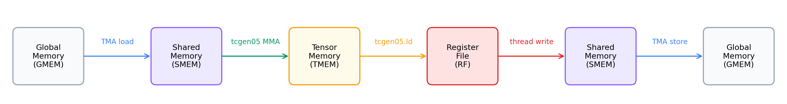

# Building a Tiled GEMM
:label:`chap_gemm_basics`

This chapter turns the tile-primitive model into working GEMM kernels. It starts with one 128 x 128 output tile, then adds the two pieces needed for larger matrices: accumulation over K and spatial tiling across CTAs.

Chapters 3, 4, and 5 follow one optimization path for GEMM: build a correct tiled kernel, replace thread copies with TMA and pipelining, then add warp specialization and CTA clusters.

## GEMM

GEMM is the dense matrix multiply behind linear layers, attention projections, and many convolution implementations. The examples in this tutorial use $D = A B^{\top}$:

- $A$ has shape $M \times K$.
- $B$ has shape $N \times K$.
- $D$ has shape $M \times N$.
- $D[m,n] = \sum_k A[m,k] \cdot B[n,k]$.

The transpose appears because the examples store $B$ as $N$ rows of length $K$, which matches common linear-layer weight layouts.

We report GEMM throughput in TFLOPS:

$$\text{TFLOPS} = \frac{2 \times M \times N \times K}{t_{\text{seconds}} \times 10^{12}}$$

### GEMM Data Path

A Blackwell GEMM kernel is organized around tile movement and tile compute:



Operand tiles move from GMEM to SMEM. `tcgen05.mma` consumes the SMEM operands and writes accumulators to TMEM. The epilogue reads TMEM back into registers, then stores the final result to GMEM.

## Optimization Path

After the basic GEMM path works, the rest of the tutorial adds Blackwell features through TIRX tile primitives:

- **TMA async movement:** move GMEM <-> SMEM tiles through Blackwell's hardware copy path, with barriers tracking completion.
- **Software pipelining:** use multiple SMEM stages so data movement for the next K tile can overlap Tensor Core compute on the current tile.
- **Persistent scheduling:** let CTAs pull output tiles dynamically instead of relying only on a fixed launch-grid mapping.
- **Warp specialization:** split producer, MMA consumer, and writeback roles across warpgroups.
- **CTA clusters:** let two CTAs cooperate on a larger Blackwell MMA tile.
- **Multi-consumer execution:** use multiple consumer warpgroups to compute different parts of the tile, increasing compute density.

---

## Step 1: Sequential Single-Tile GEMM
:label:`chap_single_tile`

Step 1 computes one 128 x 128 output tile with K = 64.

### Single-Tile Dataflow

The first kernel follows the core GEMM data path once for a single 128 x 128 output tile.

1. **Allocate**: SMEM (pool allocator), TMEM (`tcgen05.alloc`), mbarrier
2. **Load**: All 128 threads cooperatively copy A and B tiles from GMEM to SMEM (sync `Tx.copy`)
3. **Compute**: Single elected thread issues `Tx.gemm_async` + `tcgen05.commit`; all threads wait on mbarrier
4. **Writeback**: Warpgroup reads TMEM → registers; each thread casts fp32→fp16 and writes to GMEM
5. **Deallocate**: TMEM deallocation

### Four Pieces of the First Kernel

Before the full runnable source, read the kernel in four pieces: memory allocation, synchronous load, MMA dispatch, and writeback. The API names used here follow the vocabulary introduced at the end of the previous chapter.

**Memory allocation.**

```python
pool = Tx.SMEMPool()
tmem_addr = pool.alloc((1,), "uint32")           # TMEM address (4 bytes)
mma_bar = pool.alloc((1,), "uint64", align=8)    # mbarrier (8 bytes)
pool.move_base_to(1024)                           # Skip to offset 1024
Asmem = pool.alloc((BLK_M, BLK_K), a_type, layout=A_layout)  # 128×64 fp16
Bsmem = pool.alloc((BLK_N, BLK_K), b_type, layout=B_layout)  # 128×64 fp16
pool.commit()
```

The `pool.move_base_to(1024)` ensures Asmem/Bsmem start at offset 1024, leaving room for metadata. The `layout=A_layout` uses `tma_shared_layout` for a swizzled SMEM placement compatible with TMA and `tcgen05.mma`; SMEM layout is part of the tile primitive contract.

**Synchronous load.**

```python
with Tx.cta():
    Tx.copy(Asmem[:, :], A[:, :])
    Tx.copy(Bsmem[:, :], B[:, :])
Tx.cuda.cta_sync()
```

Step 1 only has one tile (M=N=128, K=64), so we copy the entire A and B. `with Tx.cta()` means the CTA cooperates on the copy, with each thread handling a portion of the data. `Tx.cuda.cta_sync()` waits for the CTA and makes the shared-memory writes visible before MMA reads `Asmem` and `Bsmem`. The asynchronous GEMM chapter replaces this thread-copy path with TMA.

**MMA dispatch.**

```python
if warp_id == 0:
    with Tx.thread(parent="warp")[Tx.ptx.elect_sync()]:
        Tx.gemm_async(tmem[:, :BLK_N], Asmem[:, :], Bsmem[:, :],
                      accum=False, dispatch="tcgen05", cta_group=1)
        Tx.ptx.tcgen05.commit(mma_bar.ptr_to([0]), cta_group=1)
```

Read the issuer selection in two steps. First, `if warp_id == 0` restricts the code to warp 0 inside the warpgroup. Then `Tx.ptx.elect_sync()` elects one active lane inside that warp. `Tx.filter(lane_id, ...)` turns that elected-lane predicate into a TIRX thread guard, so only the elected lane enters the block.

The result is that one thread issues `Tx.gemm_async` and `tcgen05.commit`. The computation is still a tile-level MMA: the instruction is issued by one elected thread, but the hardware performs the cooperative MMA for the tile described by the SMEM operand layouts and the TMEM accumulator layout. `accum=False` means this MMA overwrites the TMEM destination instead of adding into an existing accumulator.

**Writeback.**

```python
Dreg_wg = Dreg.view(128, BLK_N, layout=TileLayout(S[(128, BLK_N) : (1@tid_in_wg, 1)]))
with Tx.warpgroup():
    Tx.copy_async(Dreg_wg[:, :], tmem[:, :BLK_N])
    Tx.ptx.tcgen05.wait.ld()
with Tx.thread():
    Tx.cast(Dreg_f16[:], Dreg[:])
    m_thr = Tx.meta_var(m_st + warp_id * 32 + lane_id)
    Tx.copy(D[m_thr, n_st : n_st + BLK_N], Dreg_f16[:])
```

The MMA result is in TMEM as a 128 x 128 fp32 accumulator tile. The accumulator uses fp32 because GEMM sums many products along K, and keeping the running sum in higher precision reduces rounding error. The output buffer `D` is declared as fp16, so the epilogue has to move the accumulator to registers, cast it to fp16, and store it to `D`.

`Dreg` is a per-thread register buffer with `BLK_N` elements. `Dreg_wg` is a warpgroup view of those registers:

```python
TileLayout(S[(128, BLK_N) : (1@tid_in_wg, 1)])
```

In this layout, the first dimension of the tile is mapped to warpgroup threads. Row 0 is owned by warpgroup thread 0, row 1 by warpgroup thread 1, and so on through row 127. The second dimension stays inside each thread's local register buffer, so each thread holds the columns for its own row. Since a warpgroup has 128 threads, the whole 128 x 128 output tile is split row-by-row across the warpgroup.

Under `with Tx.warpgroup()`, the `Tx.copy_async(Dreg_wg, tmem)` readback lowers to the Blackwell TMEM load path (`tcgen05.ld`). It is asynchronous, so `Tx.ptx.tcgen05.wait.ld()` is required before the code reads `Dreg`.

After the wait, each thread's private `Dreg[:]` holds the fp32 values for one logical output row. The thread casts those values to fp16 in `Dreg_f16`, computes its global output row,

```python
m_thr = m_st + warp_id * 32 + lane_id
```

and writes `D[m_thr, n_st:n_st + BLK_N]`. Warp 0 writes rows 0-31, warp 1 writes rows 32-63, warp 2 writes rows 64-95, and warp 3 writes rows 96-127.

### Complete Kernel

With the walkthrough in mind, here is the complete runnable kernel (M=N=128, K=64):

```{.python .input}

import tvm
from tvm.script import tirx as Tx
from tvm.tirx.operator.tile_primitive.cuda.tma_utils import tma_shared_layout, SwizzleMode
from tvm.tirx.layout import TileLayout, S, TLane, TCol, tid_in_wg
```

The kernel is wrapped in the same `hgemm_vX(M, N, K)` style used by the later steps. Step 1 still runs with `M=N=128, K=64`, so the launch contains exactly one output tile:

```{.python .input}
def hgemm_v1(M, N, K):
    a_type = tvm.DataType("float16")
    b_type = tvm.DataType("float16")
    d_type = tvm.DataType("float16")
    acc_type = tvm.DataType("float32")

    BLK_M, BLK_N, BLK_K = 128, 128, 64
    MMA_M, MMA_N, MMA_K = 128, 128, 16

    A_layout = tma_shared_layout(a_type, SwizzleMode.SWIZZLE_128B_ATOM, (BLK_M, BLK_K))
    B_layout = tma_shared_layout(b_type, SwizzleMode.SWIZZLE_128B_ATOM, (BLK_N, BLK_K))

    @Tx.prim_func(tirx=True)
    def kernel(
        A: Tx.Buffer((M, K), a_type),
        B: Tx.Buffer((N, K), b_type),
        D: Tx.Buffer((M, N), d_type),
    ):
        with Tx.kernel():
            # Step 1 is a single-tile kernel: M = BLK_M and N = BLK_N, so the grid
            # is 1x1. Starting with a 1x1 grid keeps the per-CTA tile offsets
            # (m_st, n_st) trivially zero; Steps 3+ generalise this to larger M / N.
            bx, by = Tx.cta_id([M // BLK_M, N // BLK_N], parent="kernel")
            _ = Tx.warpgroup_id([1], parent="cta")          # single warpgroup, index never used inside the kernel
            warp_id = Tx.warp_id([4], parent="warpgroup")
            lane_id = Tx.thread_id([32], parent="warp")
    
            # --- SMEM allocation ---
            pool = Tx.SMEMPool()
            tmem_addr = pool.alloc((1,), "uint32")
            mma_bar = pool.alloc((1,), "uint64", align=8)
            pool.move_base_to(1024)
            Asmem = pool.alloc((BLK_M, BLK_K), a_type, layout=A_layout)
            Bsmem = pool.alloc((BLK_N, BLK_K), b_type, layout=B_layout)
            pool.commit()
    
            # --- Barrier + TMEM init (warp 0 only) ---
            if warp_id == 0:
                if lane_id == 0:
                    Tx.ptx.mbarrier.init(mma_bar.ptr_to([0]), 1)
                Tx.ptx.tcgen05.alloc(Tx.address_of(tmem_addr), n_cols=512, cta_group=1)
    
            Tx.ptx.fence.proxy_async("shared::cta")
            Tx.ptx.fence.mbarrier_init()
            Tx.cuda.cta_sync()
    
            tmem = Tx.decl_buffer(
                (128, 512), "float32", scope="tmem", allocated_addr=tmem_addr[0],
                layout=TileLayout(S[(128, 512) : (1@TLane, 1@TCol)])
            )
    
            m_st = Tx.meta_var(bx * BLK_M)
            n_st = Tx.meta_var(by * BLK_N)
            phase_mma: Tx.int32 = 0
    
            # --- Load: all threads copy global -> shared (synchronous).
            # With M=BLK_M and N=BLK_N the slices below cover the full matrices;
            # the slice form is kept so the diff to Step 3 (multi-tile) is minimal.
            with Tx.cta():
                Tx.copy(Asmem[:, :], A[m_st:m_st + BLK_M, :])
                Tx.copy(Bsmem[:, :], B[n_st:n_st + BLK_N, :])
            Tx.cuda.cta_sync()
    
            # --- Compute: single elected thread issues MMA ---
            if warp_id == 0:
                with Tx.thread(parent="warp")[Tx.ptx.elect_sync()]:
                    Tx.gemm_async(
                        tmem[:, :BLK_N], Asmem[:, :], Bsmem[:, :],
                        accum=False, dispatch="tcgen05", cta_group=1
                    )
                    Tx.ptx.tcgen05.commit(mma_bar.ptr_to([0]), cta_group=1)
    
            Tx.ptx.mbarrier.try_wait(mma_bar.ptr_to([0]), phase_mma)
    
            # --- Writeback: TMEM -> RF -> GMEM ---
            Dreg = Tx.alloc_local((BLK_N,), acc_type)
            Dreg_f16 = Tx.alloc_local((BLK_N,), d_type)
            Dreg_wg = Dreg.view(128, BLK_N,
                                layout=TileLayout(S[(128, BLK_N) : (1@tid_in_wg, 1)]))
            with Tx.warpgroup():
                Tx.copy_async(Dreg_wg[:, :], tmem[:, :BLK_N])
                Tx.ptx.tcgen05.wait.ld()
            with Tx.thread():
                Tx.cast(Dreg_f16[:], Dreg[:])
                m_thr = Tx.meta_var(m_st + warp_id * 32 + lane_id)
                Tx.copy(D[m_thr, n_st : n_st + BLK_N], Dreg_f16[:])
    
            # --- Deallocate TMEM ---
            Tx.cuda.cta_sync()
            if warp_id == 0:
                Tx.ptx.tcgen05.relinquish_alloc_permit(cta_group=1)
                Tx.ptx.tcgen05.dealloc(tmem_addr[0], n_cols=512, cta_group=1)

    return kernel
```

The compile/run/check pattern is the same for every GEMM step, so the tutorial shows it once. Later sections only show the kernel; to run another step, replace `hgemm_v1` and the problem size below with the kernel and shape you want to test.

```{.python .input}
import torch

target = tvm.target.Target("cuda")
device = torch.device('cuda')  # gpu(0)

M, N, K = 128, 128, 64
kernel = hgemm_v1(M, N, K)
with target:
    mod = tvm.IRModule({"main": kernel})
    lib = tvm.compile(mod, target=target, tir_pipeline="tirx")

torch.cuda.empty_cache()
torch.cuda.synchronize()
A_tensor = torch.randn(M, K, dtype=torch.float16, device=device)
B_tensor = torch.randn(N, K, dtype=torch.float16, device=device)
D_tensor = torch.zeros(M, N, dtype=torch.float16, device=device)

args = [
    tvm.runtime.from_dlpack(A_tensor),
    tvm.runtime.from_dlpack(B_tensor),
    tvm.runtime.from_dlpack(D_tensor),
]
lib["main"](*args)

D_ref = (A_tensor.float() @ B_tensor.float().T).half()
max_err = float((D_tensor - D_ref).abs().max())
print(f"Max error vs torch reference: {max_err:.6f}")
assert max_err < 0.1, f"FAIL: max_err={max_err}"
print("PASS")

# Optional timing for larger kernels.
ITERS = 10
for _ in range(3):
    lib["main"](*args)
torch.cuda.synchronize()
start = torch.cuda.Event(enable_timing=True)
end = torch.cuda.Event(enable_timing=True)
start.record()
for _ in range(ITERS):
    lib["main"](*args)
end.record()
torch.cuda.synchronize()
ms = start.elapsed_time(end) / ITERS
tflops = 2 * M * N * K / ms / 1e9
print(f"Performance: {ms:.3f} ms, {tflops:.1f} TFLOPS")
```

### Limits of the Single-Tile Kernel

The first kernel computes the right result, but it still has four deliberate limits:

- It handles only one K tile.
- It handles only one output tile.
- It uses synchronous GMEM -> SMEM copies instead of TMA.
- It does not overlap data movement and compute.

---

## Step 2: K-Loop Accumulation
:label:`chap_k_loop`

Step 1 computes one K tile. Step 2 keeps one output tile but lets K contain multiple 64-wide chunks. The kernel repeats the same load -> MMA -> wait sequence for each K chunk and accumulates the result in TMEM.

### K-Loop Mechanics

To handle matrices where K > 64, we loop over K in chunks of `BLK_K=64`. Each iteration loads the next A and B K-slice into SMEM, then issues `Tx.gemm_async`. On the first K chunk, `accum=False` initializes the TMEM accumulator. On later chunks, `accum=True` adds the new MMA result into the existing TMEM accumulator.

The same mbarrier is reused for every MMA completion. To reuse it safely, the code must track which barrier phase it is waiting for. An mbarrier has a 1-bit phase, either 0 or 1. Each time the expected arrival happens, the barrier flips to the other phase. `try_wait(bar, phase)` waits until the barrier's internal phase is different from the `phase` argument:

| K iteration | Local `phase_mma` before wait | What `try_wait` waits for | Local update after wait |
|---|---:|---|---:|
| 0 | 0 | barrier flips to 1 | `phase_mma = 1` |
| 1 | 1 | barrier flips to 0 | `phase_mma = 0` |
| 2 | 0 | barrier flips to 1 | `phase_mma = 1` |

Without `phase_mma ^= 1`, the second iteration would still call `try_wait(bar, 0)`. The barrier is already at phase 1 from the previous MMA, so the wait would pass immediately after the second MMA is issued, instead of waiting for the second MMA to finish.

### Complete Kernel

```{.python .input}

import tvm
from tvm.script import tirx as Tx
from tvm.tirx.operator.tile_primitive.cuda.tma_utils import tma_shared_layout, SwizzleMode
from tvm.tirx.layout import TileLayout, S, TLane, TCol, tid_in_wg as axis_tid_in_wg
```

The kernel is wrapped in a function `hgemm_v2(M, N, K)` that returns a TIRX kernel for the given dimensions. The grid is still `[1, 1]` because this step only handles one output tile:

```{.python .input}
def hgemm_v2(M, N, K):
    a_type = tvm.DataType("float16")
    b_type = tvm.DataType("float16")
    d_type = tvm.DataType("float16")
    acc_type = tvm.DataType("float32")

    BLK_M, BLK_N, BLK_K = 128, 128, 64
    K_TILES = K // BLK_K

    A_layout = tma_shared_layout(a_type, SwizzleMode.SWIZZLE_128B_ATOM, (BLK_M, BLK_K))
    B_layout = tma_shared_layout(b_type, SwizzleMode.SWIZZLE_128B_ATOM, (BLK_N, BLK_K))

    @Tx.prim_func(tirx=True)
    def kernel(
        A: Tx.Buffer((M, K), a_type),
        B: Tx.Buffer((N, K), b_type),
        D: Tx.Buffer((M, N), d_type),
    ):
        with Tx.kernel():
            bx, by = Tx.cta_id([1, 1], parent="kernel")  # Single CTA
            _ = Tx.warpgroup_id([1], parent="cta")
            warp_id = Tx.warp_id([4], parent="warpgroup")
            lane_id = Tx.thread_id([32], parent="warp")

            pool = Tx.SMEMPool()
            tmem_addr = pool.alloc((1,), "uint32")
            mma_bar = pool.alloc((1,), "uint64", align=8)
            pool.move_base_to(1024)
            Asmem = pool.alloc((BLK_M, BLK_K), a_type, layout=A_layout)
            Bsmem = pool.alloc((BLK_N, BLK_K), b_type, layout=B_layout)
            pool.commit()

            if warp_id == 0:
                if lane_id == 0:
                    Tx.ptx.mbarrier.init(mma_bar.ptr_to([0]), 1)
                Tx.ptx.tcgen05.alloc(Tx.address_of(tmem_addr), n_cols=512, cta_group=1)

            Tx.ptx.fence.proxy_async("shared::cta")
            Tx.ptx.fence.mbarrier_init()
            Tx.cuda.cta_sync()

            tmem = Tx.decl_buffer(
            (128, 512), "float32", scope="tmem", allocated_addr=tmem_addr[0],
            layout=TileLayout(S[(128, 512) : (1@TLane, 1@TCol)]))

            phase_mma: Tx.int32 = 0
            m_st = Tx.meta_var(bx * BLK_M)
            n_st = Tx.meta_var(by * BLK_N)

            # === K-loop: iterate over K in chunks of BLK_K ===
            for i in range(K_TILES):
                # Load the i-th K chunk
                with Tx.cta():
                    Tx.copy(Asmem[:, :], A[:, i*BLK_K:(i+1)*BLK_K])
                    Tx.copy(Bsmem[:, :], B[:, i*BLK_K:(i+1)*BLK_K])

                Tx.cuda.cta_sync()

                # MMA: accum=False for first tile, True for rest
                if warp_id == 0:
                    with Tx.thread(parent="warp")[Tx.ptx.elect_sync()]:
                        Tx.gemm_async(tmem[:, :128], Asmem[:], Bsmem[:],
                                      accum=(i != 0), dispatch="tcgen05", cta_group=1)
                        Tx.ptx.tcgen05.commit(mma_bar.ptr_to([0]), cta_group=1)

                # Wait for MMA, then flip phase
                Tx.ptx.mbarrier.try_wait(mma_bar.ptr_to([0]), phase_mma)
                phase_mma ^= 1

            # === Writeback (same as Step 1) ===
            reg = Tx.alloc_local((128,), acc_type)
            reg_f16 = Tx.alloc_local((128,), d_type)
            reg_wg = reg.view(128, 128,
                              layout=TileLayout(S[(128, BLK_N) : (1@axis_tid_in_wg, 1)]))

            with Tx.warpgroup():
                Tx.copy_async(reg_wg[:], tmem[:, :128])
                Tx.ptx.tcgen05.wait.ld()
                Tx.cuda.cta_sync()

            with Tx.thread():
                Tx.cast(reg_f16[:], reg[:])
                m_thr = Tx.meta_var(m_st + 32 * warp_id + lane_id)
                Tx.copy(D[m_thr, :], reg_f16[:])

            if warp_id == 0:
                Tx.ptx.tcgen05.relinquish_alloc_permit(cta_group=1)
                Tx.ptx.tcgen05.dealloc(tmem_addr[0], n_cols=512, cta_group=1)

    return kernel
```

---

K-loop accumulation still leaves one missing piece: tiling over M and N to support larger matrices.

## Step 3: Spatial Tiling (Multi-CTA)
:label:`chap_spatial_tiling`

Steps 1-2 compute one output tile. Step 3 launches a 2D grid of CTAs so larger M and N dimensions are covered by multiple 128 x 128 output tiles. The example uses M=N=K=256.

### Grid Mapping

To support larger matrices, we launch a 2D grid of CTAs: `[M // BLK_M, N // BLK_N]`. Each CTA computes one 128 x 128 output tile.

CTA `(bx, by)` owns this output region:

```text
D[bx * BLK_M : (bx + 1) * BLK_M,
  by * BLK_N : (by + 1) * BLK_N]
```

Inside the K-loop, that CTA repeatedly loads the matching K-slices:

```text
A[bx * BLK_M : (bx + 1) * BLK_M, k : k + BLK_K]
B[by * BLK_N : (by + 1) * BLK_N, k : k + BLK_K]
```

This matches the tutorial's `D = A @ B.T` convention: `bx` selects rows of A and D, while `by` selects rows of B and columns of D.

**Try with your agent**: With `M=N=K=256`, `BLK_M=BLK_N=128`, and `BLK_K=64`, ask it to trace CTA `(1, 0)` and CTA `(0, 1)`. For each CTA, list `m_st`, `n_st`, the A and B slices loaded for each K iteration, and the D region written. Which B rows become D columns because the kernel computes `D = A @ B.T`?

### Complete Kernel

```{.python .input}

import tvm
from tvm.script import tirx as Tx
from tvm.tirx.operator.tile_primitive.cuda.tma_utils import tma_shared_layout, SwizzleMode
from tvm.tirx.layout import TileLayout, S, TLane, TCol, tid_in_wg as axis_tid_in_wg
```

Step 3 changes the grid to `[M // BLK_M, N // BLK_N]` instead of `[1, 1]`, and loads/stores use per-CTA offsets `m_st` and `n_st`:

```{.python .input}
def hgemm_v3(M, N, K):
    a_type = tvm.DataType("float16")
    b_type = tvm.DataType("float16")
    d_type = tvm.DataType("float16")
    acc_type = tvm.DataType("float32")

    BLK_M, BLK_N, BLK_K = 128, 128, 64
    K_TILES = K // BLK_K

    A_layout = tma_shared_layout(a_type, SwizzleMode.SWIZZLE_128B_ATOM, (BLK_M, BLK_K))
    B_layout = tma_shared_layout(b_type, SwizzleMode.SWIZZLE_128B_ATOM, (BLK_N, BLK_K))

    @Tx.prim_func(tirx=True)
    def kernel(
        A: Tx.Buffer((M, K), a_type),
        B: Tx.Buffer((N, K), b_type),
        D: Tx.Buffer((M, N), d_type),
    ):
        with Tx.kernel():
            # 2D grid: one CTA per 128x128 output tile
            bx, by = Tx.cta_id([M // BLK_M, N // BLK_N], parent="kernel")
            _ = Tx.warpgroup_id([1], parent="cta")
            warp_id = Tx.warp_id([4], parent="warpgroup")
            lane_id = Tx.thread_id([32], parent="warp")

            pool = Tx.SMEMPool()
            tmem_addr = pool.alloc((1,), "uint32")
            mma_bar = pool.alloc((1,), "uint64", align=8)
            pool.move_base_to(1024)
            Asmem = pool.alloc((BLK_M, BLK_K), a_type, layout=A_layout)
            Bsmem = pool.alloc((BLK_N, BLK_K), b_type, layout=B_layout)
            pool.commit()

            if warp_id == 0:
                if lane_id == 0:
                    Tx.ptx.mbarrier.init(mma_bar.ptr_to([0]), 1)
                Tx.ptx.tcgen05.alloc(Tx.address_of(tmem_addr), n_cols=512, cta_group=1)

            Tx.ptx.fence.proxy_async("shared::cta")
            Tx.ptx.fence.mbarrier_init()
            Tx.cuda.cta_sync()

            tmem = Tx.decl_buffer(
            (128, 512), "float32", scope="tmem", allocated_addr=tmem_addr[0],
            layout=TileLayout(S[(128, 512) : (1@TLane, 1@TCol)]))

            phase_mma: Tx.int32 = 0

            # Per-CTA tile offsets
            m_st = Tx.meta_var(bx * BLK_M)
            n_st = Tx.meta_var(by * BLK_N)

            # K-loop with offset A and B slices
            for i in range(K_TILES):
                with Tx.cta():
                    Tx.copy(Asmem[:, :], A[m_st:m_st+BLK_M, i*BLK_K:(i+1)*BLK_K])
                    Tx.copy(Bsmem[:, :], B[n_st:n_st+BLK_N, i*BLK_K:(i+1)*BLK_K])

                Tx.cuda.cta_sync()

                if warp_id == 0:
                    with Tx.thread(parent="warp")[Tx.ptx.elect_sync()]:
                        Tx.gemm_async(tmem[:, :128], Asmem[:], Bsmem[:],
                                      accum=(i != 0), dispatch="tcgen05", cta_group=1)
                        Tx.ptx.tcgen05.commit(mma_bar.ptr_to([0]), cta_group=1)

                Tx.ptx.mbarrier.try_wait(mma_bar.ptr_to([0]), phase_mma)
                phase_mma ^= 1

            # Writeback to the correct output tile
            reg = Tx.alloc_local((128,), acc_type)
            reg_f16 = Tx.alloc_local((128,), d_type)
            reg_wg = reg.view(128, 128,
                              layout=TileLayout(S[(128, BLK_N) : (1@axis_tid_in_wg, 1)]))

            with Tx.warpgroup():
                Tx.copy_async(reg_wg[:], tmem[:, :128])
                Tx.ptx.tcgen05.wait.ld()
                Tx.cuda.cta_sync()

            with Tx.thread():
                Tx.cast(reg_f16[:], reg[:])
                m_thr = Tx.meta_var(m_st + 32 * warp_id + lane_id)
                Tx.copy(D[m_thr, n_st:n_st+BLK_N], reg_f16[:])

            if warp_id == 0:
                Tx.ptx.tcgen05.relinquish_alloc_permit(cta_group=1)
                Tx.ptx.tcgen05.dealloc(tmem_addr[0], n_cols=512, cta_group=1)

    return kernel
```

## Exercises

1. In Steps 1-3, `Tx.copy` moves A and B tiles into SMEM before MMA. Why does the kernel need `Tx.cuda.cta_sync()` before `Tx.gemm_async` reads those SMEM tiles?
2. In Step 2, what happens if `phase_mma ^= 1` is removed from the K-loop? Does the kernel wait for every MMA, or can a later wait pass too early?
3. For M=N=4096 with BLK_M=BLK_N=128, how many CTAs are launched in Step 3? Which operand tiles are logically reused across neighboring CTAs, and does Step 3 exploit that reuse?
