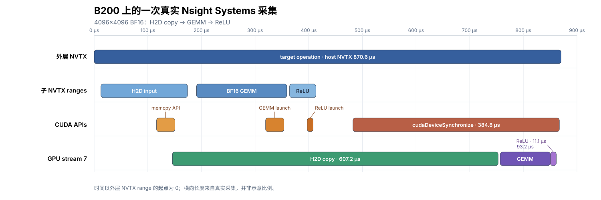

(chap_benchmarking)=
# GPU Kernel 性能测量与分析

优化 GPU kernel 时，需要分别回答两个问题：运行一次要多久，时间主要花在哪里。Benchmark 负责测前者，profile 用来分析后者。Profiler 会改变程序的执行条件，因此涉及整个 operator 或应用路径的最终性能数字应回到关闭 profiler 后的测量中确认。

一次 Python 调用不一定只对应一个 GPU kernel。它可能启动多个 kernels、提交内存拷贝，或者等待 GPU 完成工作。计时前要先确定被测 operation 包含哪些步骤，并让所有实现采用相同的边界。

实际操作时，先验证结果并测出无 profiler 的基线，再用 profiler 查找耗时的原因。修改实现后，使用相同的计时方法重新测量；只有基线时间确实缩短，才能说明优化有效。

{ref}`chap_performance` 介绍了如何用 roofline 判断性能受计算吞吐还是内存带宽限制。接下来讨论实验方法：如何确定计时范围、选择 warm-up 和 repeat，以及解读 profiler 报告。

## 区分性能测量与性能诊断

这套流程中的工具各自回答不同问题：

| 工具 | 主要回答的问题 |
|---|---|
| CUDA Events | 被测区间在 GPU stream 上经过了多长时间？Stream 是按提交顺序执行 GPU 工作的队列。 |
| Proton（Triton 提供的 profiler） | 启动了哪些 GPU kernels、各被调用多少次，哪些 kernel 占用了主要时间？ |
| Nsight Systems | Host、streams、拷贝、kernels 和通信如何在时间线上重叠？ |
| Nsight Compute（`ncu`） | 一个选定的 GPU kernel 主要受哪类硬件资源或等待限制？ |
| IKET（可选） | 一个选定的 kernel 内部，哪些命名阶段或 warp roles 占用了时间？ |

### Profile 结果的三种常见形式

Profile 不是一个数字，也不只有一种报告格式。本章使用的工具会生成三种互补的视图：

| 视图 | 工具 | 阅读重点 |
|---|---|---|
| 聚合树 | Proton | 比较调用次数、平均时间和总时间，找出主要耗时的 kernels。 |
| 时间线 | Nsight Systems；单个 kernel 内部使用 IKET | 沿横轴阅读不同 tracks 上的事件，检查空隙、重叠和依赖关系。 |
| 单 kernel 指标报告 | Nsight Compute | 查看一次 launch 的配置、利用率、scheduler 状态、内存流量以及 source/SASS 证据。 |

这些 profile 用来解释时间花在哪里，不能替代正式的性能测量。修改实现后，应关闭 profiler，并使用与基线相同的计时边界重新测量。

## 计时前先验证正确性

性能计时前，先单独验证正确性：

1. 构造有代表性的输入，并覆盖相关的边界情况。
2. 运行被测实现并同步，确保 GPU 已经完成计算。
3. 使用明确的 tolerance，将结果与 reference 比较。
4. 如果 kernel 会在已有 output 上累加或原地修改输入，每次验证前都恢复相同的初始状态。

Reference 计算和结果比较不属于性能计时。正确性通过后，再开始设计 benchmark；是否把状态重置计入时间，由下一节定义的 operation 边界决定。

## 明确计时边界

计时前，先写清楚一次被测 operation 包含哪些工作。它可以只包含一个 kernel，也可以包含得到完整结果所需的全部 kernels、内存拷贝和状态重置。编译、输入构造、内存分配或数据格式转换是否属于这次 operation，也要明确说明。不同实现只有在测量相同工作时才能直接比较。

范围确定后，再选择计时方法：

- **CUDA Events** 记录 GPU stream 执行到两个位置时的时间戳，适合测量一个 kernel 或整个 operator 在 device 时间线上的区间。区间内的 kernels、内存拷贝和 stream 空隙都会被计入。对于多 stream operation，所有参与计算的 streams 都必须在 start event 之后开始被测工作，并在记录 end event 前完成汇合。
- **同步的 wall-clock timer** 从 host 发起调用前开始计时，在调用所需的 GPU 工作全部完成后停止。它还会计入 Python dispatch、CUDA launch 和等待 GPU 完成的时间，适合测量一次调用的端到端 latency。

例如，GPU 已经执行 start event，但 host 还没有提交下一个 launch 时，这段 stream 空闲时间仍会落在 CUDA Event 区间内。因此，CUDA Event 区间不一定等于 profiler 中某个 kernel 从开始到结束的执行区间。诊断型 profiler 适合观察 kernel 执行和重叠关系，但其结果不能直接替代相同边界下的无 profiler 计时。

## 使用 CUDA Events 测量 GPU 时间

CUDA launch 通常是异步的：Python 把工作提交到 CUDA stream 后就可以继续运行，此时 GPU 不一定已经完成。如果只用 CPU 时钟记录这次 Python 调用前后的时间，计时可能在 GPU 完成前就已经停止，得到的主要是 host 提交耗时。测量 GPU stream 上经过的时间时，应使用 CUDA Events；测量从 Python 发起调用到 GPU 完成的完整时间时，则使用后面介绍的同步 wall-clock timer。[PyTorch CUDA semantics 文档](https://docs.pytorch.org/docs/stable/notes/cuda.html#asynchronous-execution)也说明了这种异步行为。

先看一份可以直接运行的 CUDA Event benchmark。它在计时前分配矩阵，先执行 warm-up，再测量五轮 FP16 GEMM 并报告中位数：

```python
from statistics import median

import torch


a = torch.randn((2048, 2048), device="cuda", dtype=torch.float16)
b = torch.randn((2048, 2048), device="cuda", dtype=torch.float16)
c = torch.empty((2048, 2048), device="cuda", dtype=torch.float16)


def gemm():
    torch.mm(a, b, out=c)


def measure_batch_ms(fn, calls):
    """返回连续 calls 次调用的平均 CUDA Event 时间，单位为 ms。"""
    start = torch.cuda.Event(enable_timing=True)
    end = torch.cuda.Event(enable_timing=True)

    start.record()
    for _ in range(calls):
        fn()
    end.record()
    end.synchronize()
    return start.elapsed_time(end) / calls


warmup_calls = 500
repeat = 100
rounds = 5

for _ in range(warmup_calls):
    gemm()
torch.cuda.synchronize()

samples_ms = [measure_batch_ms(gemm, repeat) for _ in range(rounds)]

print(f"device: {torch.cuda.get_device_name()}")
print(f"calls per round: {repeat}")
print("round samples (ms):", [round(x, 4) for x in samples_ms])
print(f"median CUDA Event time: {median(samples_ms):.4f} ms")
```

`measure_batch_ms` 在当前 CUDA stream 中记录 start 和 end events，并用两者之间的时间除以调用次数。这样得到的是连续执行时每次 GEMM 的平均 GPU stream 时间。`end.synchronize()` 只是让 CPU 等到这轮 GPU 工作完成，以便读取 Event 结果。

这里的 `warmup_calls=500`、`repeat=100` 和 `rounds=5` 都表示调用或测量次数。它们不是通用标准，而是根据这个 GEMM 在 B200 上的实测结果选出的示例值。在一次 10 轮校准中，warm-up 50 次时，第一轮到最后一轮仍从 0.01425 ms 降到 0.01296 ms；增加到 500 次后，变化缩小为 0.01332 ms 到 0.01301 ms。`repeat=100` 的结果也比 `repeat=10` 更稳定。

选择其他 workload 的参数时，可以逐步增加 `warmup_calls`，直到前几轮不再持续变快或变慢；再增加 `repeat` 或 `rounds`，直到波动已经满足实验需要。次数也不是越多越好：如果延长实验后整体时间系统性变化，应检查温度、功耗和时钟频率，并先确定实验要表示短时运行还是持续运行。耗时较长的 kernel 通常可以使用更小的次数。

这段代码始终复用同一组矩阵，因此后续调用可能从 cache 中读取部分数据，测得的是 warm-cache 场景。发布结果时，还应记录 GPU 型号、软件版本和时钟设置。

实际测量本书中的 TIRx kernels 时，不需要为每个 kernel 重新编写 warm-up、重复计时和统计逻辑。TVM 的 [`tvm.tirx.bench.bench`](https://github.com/apache/tvm/blob/v0.26.0/python/tvm/tirx/bench.py) 已经封装了这些步骤。只需传入一个负责启动被测实现的函数，输入、输出和 workspace 仍在计时前分配。

这个 helper 与上例采用不同的 cache 策略：上例连续复用同一组矩阵，而 `bench` 会在每次正式调用前驱逐 L2 cache，再用一对独立的 CUDA Events 测量被测实现。调用方式如下：

```python
from tvm.tirx.bench import bench


# run 是无参数函数；它只使用已经分配好的 tensors 启动被测实现。
result = bench(
    {"tirx": run},
    timer="event",
    warmup=25,
    repeat=100,
    rounds=5,
    cooldown_s=1.0,
)

print(result["impls"]["tirx"])           # 五轮平均值，单位为 us
print(result["round_samples"]["tirx"])  # 每轮结果
```

这里的 `warmup=25` 和 `repeat=100` 表示毫秒预算，不是固定的调用次数。Event timer 会先做一轮短测，再把 25 ms 的 warm-up 预算和 100 ms 的正式测量预算换算成实际次数。短测包含 L2 驱逐和被测调用，因此换算出的次数只是近似值；正式报告的 Event 时间只覆盖被测调用，L2 驱逐发生在 start event 之前。短 kernel 会自动执行更多次，长 kernel 则执行较少次。`rounds=5` 表示完整测量五轮，`cooldown_s=1.0` 表示每轮测量一个实现前暂停一秒。最终结果是五轮的平均值，每轮结果仍保存在 `round_samples` 中。25/100 ms 是 Event timer 的默认预算；五轮测量则是 TIRx-kernels 命令行工具采用的默认设置，`bench` 函数本身默认只运行一轮。

这些数值只是默认起点。若各轮结果仍持续漂移，应增加 warm-up 预算；若各轮波动很大，应增加正式测量预算或轮数。所有实现必须使用相同的 timer、预算和轮数，并保留每轮结果，而不是只报告最快的一次。

TIRx-kernels 中的 `run_bench` 也调用这个 helper，例如 [`tirx_kernels/attention/flash_attention4.py`](https://github.com/mlc-ai/tirx-kernels/blob/5be39749e7dfd2c4bdae9b4d396f8ec35af07126/tirx_kernels/attention/flash_attention4.py)。省略 `timer` 时，本地 benchmark 默认使用 Proton；需要 CUDA Event 区间时，应像上面一样显式指定 `timer="event"`。两种 timer 的结果含义不同，报告时必须注明。

传给 `bench` 的函数会被反复调用。如果 kernel 会累加 output 或原地修改输入，就要在每次调用前恢复相同状态，或者保证每次正式测量都使用一份尚未修改的预分配输入。若恢复操作放在被测函数中，它的时间也属于前面定义的 operation 边界。否则后一次调用面对的已经不是同一个 workload。

### 测量一次调用的端到端时间

如果关心的是从 Python 发起一次调用到 GPU 完成这次工作所经过的完整时间，可以使用同步的 wall-clock timer。下面继续测量前面已经定义并 warm-up 的 `gemm()`：

```python
from statistics import median
import time

import torch


def measure_single_call_ms(fn, samples=20):
    values = []
    for _ in range(samples):
        torch.cuda.synchronize()  # 排除此前尚未完成的 GPU 工作
        t0 = time.perf_counter()
        fn()
        torch.cuda.synchronize()  # 等待本次调用的 GPU 工作完成
        values.append((time.perf_counter() - t0) * 1e3)
    return values


host_samples_ms = measure_single_call_ms(gemm)
print("single-call samples (ms):", [round(x, 4) for x in host_samples_ms])
print(f"median end-to-end time: {median(host_samples_ms):.4f} ms")
```

第一个同步确保计时开始前没有更早的 GPU 工作残留；第二个同步保证计时停止前，这次 GEMM 已经完成。每个 sample 只包含一次调用，因此结果包括 Python 调用、CUDA launch、GPU 执行以及等待完成的开销。前面的 CUDA Event benchmark 测量的则是连续调用时每次 GEMM 的平均 GPU stream 时间。

比较多个实现时，所有实现必须使用相同的计时方法和边界。如果同时报告这两种结果，应分别命名为“CUDA Event GPU 时间”和“单次端到端时间”，而不是把使用不同 timer 得到的数字都写成同一种 latency。

### 重叠执行时如何计时

前面的 GEMM 只在当前 CUDA stream 上运行，因此 start 和 end events 可以直接包住全部工作。如果一个 operator 同时使用多个 streams，仅在当前 stream 记录 events 就不够了：其他 stream 上的工作可能在 start 之前已经开始，也可能在 end 之后仍未完成。

要测量整个 operator，可以把 start event 作为所有工作 streams 的共同起点：每个 stream 先等待 start，再开始被测工作，并在完成后各自记录一个 event。最后，当前 stream 等待这些完成 events，再记录 end。这样得到的区间才覆盖从最早开始到全部完成的整个 operation。

PDL（Programmatic Dependent Launch）是另一种可能产生重叠的情况。它允许 compute capability 9.0 或更新的 GPU 在同一 stream 中提前启动后一个 kernel：后一个 kernel 可以先完成不依赖前序结果的准备工作，在真正读取这些结果前再等待。这个过程需要显式启用，并遵守相应的 trigger 和 wait 约定；具体 API 见 [CUDA Programming Guide](https://docs.nvidia.com/cuda/cuda-programming-guide/04-special-topics/programmatic-dependent-launch.html)。

无论重叠来自多个 streams 还是 PDL，计时原则都相同：用 CUDA Events 包住完整 operation。重叠的 kernels 可能覆盖同一段时间，因此不能把 profiler 中各 kernel 的 duration 直接相加作为 operator latency。实际的执行顺序和重叠情况可以在 Nsight Systems 时间线中查看。PDL 是否产生重叠由运行时决定，程序正确性不能依赖它一定发生。

## 固定实验条件

前面确定了计时边界和计时器，接下来还要固定会影响结果的实验条件。前面的示例都在输入分配和 warm-up 完成后开始计时，测量的是后续重复调用的性能。首次调用则可能包含 CUDA 初始化、JIT、autotuning 或其他只发生一次的工作。如果研究目标是首次调用或完整应用路径，就应把相应步骤纳入计时边界并单独报告，不能与重复调用的结果混在一起。

一次测量不足以说明结果是否稳定。手写 CUDA Event 示例保留五轮结果并报告中位数；`bench` 则报告各轮的平均值，同时把原始结果保存在 `round_samples` 中。无论采用哪种汇总方式，都应保留每轮结果、检查是否存在趋势或异常波动，并明确报告使用的是中位数还是平均值，而不是只挑最快的一轮。比较多个实现时，还可以更换测量顺序后再运行一次，避免某个实现总是在设备较冷或较热时被测量。

缓存状态也会改变结果。前面的手写示例反复使用同一组矩阵，属于 warm-cache 测量。TVM 0.26 的 Event 和 Proton timers 则会在每次正式调用前写入一个 256 MiB buffer，以驱逐 L2 中已有的数据；这次写入发生在计时区间之外。两种策略都可以使用，关键是选择符合目标应用的一种，并让所有实现保持一致。`torch.cuda.empty_cache()` 只会释放 PyTorch caching allocator 中未使用的 blocks，不会清空 GPU L2 cache，因此不能用它实现 cold-L2 测量。

最后，记录 GPU 型号、driver、CUDA runtime、framework 和 compiler 版本，以及被测 workload 的 dtype 与 shape。还要记录时钟和功耗设置，避免其他进程占用设备，并留意热降频。若锁定时钟，应给出具体数值与命令；只写“fixed clocks”不足以复现实验。

相同的 tensor shape 并不代表两个实现可以直接比较。至少要对齐三类条件：

- **数值语义：** 输入与输出的数据类型、布局、转置方式、对齐要求、累加精度、缩放、mask、epilogue、输出定义和误差阈值；
- **被测范围：** 是否包含 allocation、数据转换、状态重置、辅助 kernels、通信和同步；
- **调优条件：** workspace 上限、是否允许针对每个 shape 自动调优，以及各实现可使用的搜索预算。

所有实现还应采用相同的 cache、时钟、warm-up、采样和计时策略。使用库实现作为 baseline 时，需要记录版本、所选算法和 workspace；自动调优可以放在计时区间之外，但搜索预算与最终配置仍应写入实验记录。

## 由延迟换算吞吐率

吞吐率不是计时器直接测出来的，而是用约定的工作量除以延迟得到的。因此，性能表在给出 TFLOP/s、GB/s 或 tokens/s 时，也应保留原始延迟，并说明工作量如何计算。本书将 GEMM 的工作量记为 $2MNK$ FLOPs；对于 attention 和 fused kernels，则需注明统计的是完整的稠密问题、实际选中的元素，还是 kernel 真正执行的工作。相关公式和 roofline 分析见 {ref}`chap_performance`。

## 使用 Proton 找出耗时的 kernel

前面的 benchmark 只告诉我们整个 operation 用了多长时间。如果它会启动多个 kernels，还需要找出时间具体花在哪些 kernels 上。Proton 可以列出每个 kernel 的调用次数、平均时间和累计时间。

Proton 是 Triton 项目提供的 GPU profiler。它记录 CUDA kernel 活动，因此也能看到由 TVM 编译的 TIRx kernels；这些 kernels 并不是由 Triton 编译的。前面介绍的 `bench` 也支持 `timer="proton"`：它会汇总每次调用中的 kernel 执行时间，并返回多次测量的统计结果。如果想知道其中有哪些 kernels、各调用了多少次，就需要单独采集一棵 kernel 树。

下面继续使用前面分配好的矩阵，并把 GEMM 和 ReLU 组成一个两-kernel operation。代码先完成 warm-up，只采集后面的 100 次调用，最后在当前目录生成 `operator.hatchet`：

```python
import torch
import triton.profiler as proton


def operation():
    torch.mm(a, b, out=c)
    torch.clamp_min(c, 0, out=c)


def collect_proton(run, *, warmup_calls, profile_calls):
    for _ in range(warmup_calls):
        run()
    torch.cuda.synchronize()

    session = proton.start("operator", context="shadow", data="tree")
    if session is None:
        raise RuntimeError("Proton session could not be created")
    try:
        with proton.scope("target_operation"):
            for _ in range(profile_calls):
                run()
        torch.cuda.synchronize()
    finally:
        proton.finalize(session)


collect_proton(operation, warmup_calls=500, profile_calls=100)
```

这里的 `warmup_calls` 和 `profile_calls` 都是调用次数，不是 `bench` 使用的毫秒预算。运行代码需要安装与 TVM 兼容的 Triton，并在实验记录中注明 Triton 版本。

先查看文件中有哪些 metrics，再用后两条命令分别打印调用次数、总时间和平均时间：

```bash
proton-viewer --list operator.hatchet
proton-viewer --metrics time/ms,count --print-sorted operator.hatchet
proton-viewer --metrics avg_time/us,time/ms --print-sorted operator.hatchet
```

如果 viewer 提示缺少 `pandas` 或 `hatchet`，可在 profiling 环境中运行 `python -m pip install pandas llnl-hatchet`。下面是这段代码在 B200 上的一次实际结果；为了便于阅读，缩短了 kernel 名称：

```text
target_operation               calls    avg/us    total/ms
├── GEMM kernel                  100      14.83        1.483
└── ReLU kernel                  100       4.23        0.423
```

先确认预期的 kernels 和调用次数是否正确，再比较叶节点的平均时间与总时间。这个例子中 GEMM 的总时间最大，因此它是更值得继续使用 Nsight Compute 分析的对象。一个 kernel 即使单次很短，也可能因为调用次数很多而占用大量总时间；父 scope 的平均值则不能当作一次完整 operation 的 latency。

这棵树适合寻找耗时的 kernel，不能替代前面的计时结果。存在重叠时，各 kernel 的时间会重复覆盖同一段区间；内存拷贝、同步和 stream 空隙也不一定出现在树中。此外，这段采集会复用同一组矩阵，没有采用前面 TVM timer 的 L2 驱逐策略，因此两处数字不能直接比较。完整 operation 的时间仍由前面的 CUDA Event 或 wall-clock benchmark 给出。

## 使用 Nsight Systems 阅读应用时间线

Proton 可以汇总各 kernel 的时间，却看不到它们以什么顺序执行，也看不到 kernel 之间的空隙、数据拷贝和 host 等待。分析这些问题时，需要使用 Nsight Systems 的时间线。

### 采集一份可复现的报告

仓库中的 `appendix/nsys_example.py` 构造了一个简单的三阶段 operation：先把一个 $4096\times4096$ 的 BF16 matrix 从 pinned host memory 复制到 GPU，再执行 GEMM 和 ReLU。输入和输出都在采集前分配。脚本中的核心代码是：

```python
import torch


def run():
    with torch.cuda.nvtx.range("H2D input"):
        a.copy_(host_a, non_blocking=True)
    with torch.cuda.nvtx.range("BF16 GEMM"):
        torch.mm(a, b, out=c)
    with torch.cuda.nvtx.range("ReLU"):
        torch.clamp_min(c, 0, out=output)


def run_once_for_profiler(run, *, warmup_calls):
    for _ in range(warmup_calls):
        run()
    torch.cuda.synchronize()

    cudart = torch.cuda.cudart()
    cudart.cudaProfilerStart()
    with torch.cuda.nvtx.range("target operation"):
        run()
        torch.cuda.synchronize()
    cudart.cudaProfilerStop()
```

Warm-up 位于采集范围之外，`target operation` 则为这次调用提供一个容易识别的 NVTX 名称。同步放在这个 range 内，保证三个 GPU operations 都在 range 结束前完成。`cudaProfilerStart()` 和 `cudaProfilerStop()` 只控制采集范围，不负责性能计时。

运行下面的命令会生成 `reports/target-timeline.nsys-rep`：

```bash
mkdir -p reports
nsys profile \
  --trace=cuda,nvtx \
  --sample=none \
  --cpuctxsw=none \
  --capture-range=cudaProfilerApi \
  --capture-range-end=stop \
  --output=reports/target-timeline \
  --force-overwrite=true \
  python appendix/nsys_example.py --profile-once
```

`--trace=cuda,nvtx` 记录 CUDA API、GPU activity 和 NVTX ranges。这里关闭 CPU sampling 与 context-switch tracing，让第一份报告只聚焦 CUDA 时间线。如果报告显示 GPU 长时间没有工作，再单独采集 host scheduling 或 OS runtime 信息。

可以在 GUI 中打开报告，也可以从命令行打印这次采集最有用的五张表：

```bash
nsys-ui reports/target-timeline.nsys-rep

nsys stats \
  --format=column \
  --timeunit=us \
  --report nvtx_gpu_proj_sum \
  --report nvtx_pushpop_trace \
  --report cuda_gpu_sum \
  --report cuda_kern_exec_trace \
  --report cuda_api_sum \
  reports/target-timeline.nsys-rep
```

### 读懂一份真实报告

下面的数据来自一次真实采集：NVIDIA B200、driver 595.58.03、CUDA 13.0、PyTorch 2.12.0+cu130 和 Nsight Systems 2025.6.3。数值只用于演示读法，不能作为这个 workload 的性能基准。



*时间线根据这份报告中的 `cuda_api_trace`、`nvtx_pushpop_trace` 和 `cuda_gpu_trace` 时间戳重绘。横条长度与实测时长成比例。*

`cuda_gpu_sum` 给出三项 GPU activity 的时间：

| GPU activity | 次数 | GPU duration | 占所列 GPU 时长总和的比例 |
|---|---:|---:|---:|
| 32 MiB H2D copy | 1 | 607.230 μs | 85.4% |
| BF16 GEMM | 1 | 93.152 μs | 13.1% |
| ReLU | 1 | 11.072 μs | 1.6% |

`cuda_kern_exec_trace` 把每个 kernel 与对应的 launch API 关联起来，并分别给出 API time、positive queue time 和 GPU execution。这里的 positive queue time 是 launch API 返回后到 kernel 开始前的等待时间；如果 kernel 更早开始，这一项就没有正值。

| Kernel | API time | Positive queue time | GPU execution |
|---|---:|---:|---:|
| BF16 GEMM | 34.270 μs | 403.214 μs | 93.152 μs |
| ReLU | 11.064 μs | 442.166 μs | 11.072 μs |

这份报告可以读出以下结论：

1. **主要时间花在 H2D copy。** 它占三项 GPU duration 之和的 85.4%。若只看 `cuda_gpu_kern_sum`，这次 copy 会被完全漏掉；因此这里使用同时包含 kernels 和 memory operations 的 `cuda_gpu_sum`。
2. **Queue time 不是 launch overhead。** GEMM 与 ReLU 都在同一条 stream 上等待更早提交的工作。它们分别排在 H2D copy 和 GEMM 后面，所以 queue time 远大于各自的 API time。
3. **较长的同步 API 区间通常表示 host 正在等待 GPU。** `cudaDeviceSynchronize` 在 CPU 上持续了 384.821 μs，说明调用它时仍有 GPU 工作没有完成；这个数字不是某个 kernel 的时间，也不是整个 operation 的 latency。
4. **不同范围的时间不能相加。** 三项 GPU duration 相加是 711.454 μs。`nvtx_gpu_proj_sum` 以该 NVTX range 中第一项 GPU work 的开始为起点、最后一项的结束为终点，得到 715.582 μs；约 4.1 μs 的差值是 activities 之间的空隙。CPU 上的原始 `target operation` NVTX range 则是 870.561 μs，其中还包含 dispatch 和最后的同步等待。

在另一轮关闭 profiler 的测量中，同一 operation 的 20 个 CUDA Event samples 得到 722.816 μs 的 median，范围为 718.400–726.336 μs。可以用下面的命令复现相同的测量方法：

```bash
python appendix/nsys_example.py --event-samples 20
```

这个无 profiler 结果才适合报告性能；Nsight Systems 的一次时间线用于解释时间花在哪里，两者不要求数值完全相同。

这组数据也说明了为什么必须先确定计时边界。如果实际应用中的 operation 确实包含 H2D copy，优化重点应首先考虑减少或重叠传输；如果输入早已位于 GPU，这次 copy 就不应放进被测范围。不能因为 GEMM 是主要的计算 kernel，就默认它是首要优化对象。

分析其他报告时也采用同样的顺序：先确认 NVTX range 中没有 warm-up 和初始化，再查看 GPU streams 上的 kernels、copies、空隙与重叠，随后沿 correlation 回到 host 上的 launch 或同步 API。不同 streams 上的 duration 不能直接相加；看见重叠也只说明它在这次采集中发生，是否降低了 latency 仍要通过相同边界的无 profiler 测量验证。

Report scripts 会随 Nsight Systems 版本变化。运行 `nsys stats --help-reports` 可以查看当前版本支持的名称，并应在实验记录中保留 `nsys --version`。[Nsight Systems User Guide](https://docs.nvidia.com/nsight-systems/UserGuide/index.html) 介绍了 CLI 和 GUI，[Analysis Guide](https://docs.nvidia.com/nsight-systems/AnalysisGuide/index.html) 则进一步解释 API、queue 和 kernel execution time。

## 使用 Nsight Compute 分析单个 kernel

Nsight Systems 告诉我们各个 kernel 在什么时候运行；选定一个 kernel 后，Nsight Compute 可以继续查看它的启动配置、occupancy、计算与访存吞吐，以及 scheduler 状态。采集这些指标时，NCU 可能多次重放同一个 kernel，因此它适合诊断原因，不应使用报告中的 `Duration` 代替正常运行时测得的 latency。

上一节的时间线表明，示例 operation 的主要时间花在 H2D copy。下面选择其中耗时 93.152 μs 的 BF16 GEMM 演示 NCU 的读法；这并不表示 GEMM 是整个 operation 最该优化的部分。

### 只采集一次目标 kernel

继续使用上一节脚本的 `--profile-once` 模式，可以把 warm-up 留在采集范围之外，并且只执行一次目标 operation。这个 operation 会依次启动 GEMM 和 ReLU；下面通过 kernel-name filter 选中 GEMM，并用 `--launch-count 1` 只采集第一个匹配的 launch。命令采用 kernel replay，因此只适合能够独立重放的 kernel。若一段工作包含跨 kernel 依赖或并发，应先查看 Nsight Systems 时间线，再决定是否需要后文介绍的其他 replay mode。

先收集 `basic` section set：

```bash
mkdir -p reports
ncu \
  --config-file off \
  --target-processes application-only \
  --profile-from-start off \
  --kernel-name-base function \
  --kernel-name 'regex:.*nvjet_sm100.*' \
  --launch-count 1 \
  --set basic \
  --replay-mode kernel \
  --cache-control all \
  --clock-control boost \
  --pipeline-boost-state stable \
  --export reports/bf16-gemm-basic \
  --force-overwrite \
  python appendix/nsys_example.py --profile-once
```

`--profile-from-start off` 让 NCU 等待脚本中的 profiler API；正则表达式再从该范围中选出名称包含 `nvjet_sm100` 的 GEMM。生成的完整 kernel 名称会随 PyTorch 和 CUDA 版本变化，因此分析其他程序时，应先从 Nsight Systems 抄下实际名称，再编写更精确的 filter。

`--set basic` 采集 launch、occupancy、workload distribution 和高层 throughput sections。Cache 与 clock controls 会改变 profiling 条件，因此命令中将它们显式写出。`--cache-control all` 会在每次 kernel replay 前清理 NCU 能够控制的 GPU caches；这有助于稳定 counter 采集，却不等同于正式 benchmark 的 hot-cache 条件。不同 NCU release 的 section sets 和 defaults 可能变化；采集时应记录 `ncu --version`，并在目标机器上运行 `ncu --config-file off --list-sets` 查看实际配置。

如果脚本不能调用 profiler start/stop，应把命令改为 `--profile-from-start on`（或删除 `--profile-from-start off`），再用 `--launch-skip N --launch-count 1` 选择 warm-up 后的某次调用。`--launch-skip` 只统计匹配 kernel 的 launches；filter 或 launch 顺序变化时，它可能选中另一个实例。[Nsight Compute CLI 文档](https://docs.nvidia.com/nsight-compute/NsightComputeCli/)
详细说明了 kernel 与 launch filters。

在 GUI 中打开报告：

```bash
ncu-ui reports/bf16-gemm-basic.ncu-rep
```

也可以直接在 terminal 中查看：

```bash
ncu --import reports/bf16-gemm-basic.ncu-rep \
    --page details \
    --print-details header \
    --print-metric-name label-name
```

`header` 适合先查看主要指标；后文使用的 Work ID/CLC 明细和完整 throughput breakdown 可在 GUI 中展开，或把命令中的 `header` 改为 `all` 后打印。

## 读懂一份真实的 NCU 报告

下面的数据来自同一台 B200 上的一次真实采集，使用 Nsight Compute 2026.1。NCU 用 9 个 replay passes 完成了 `basic` 报告。表中的百分比表示相应 throughput 指标占硬件子系统可持续峰值的比例，不是直接用应用 FLOPs 除以芯片标称峰值得到的利用率。

| 指标 | 实测值 |
|---|---:|
| Kernel duration | 95.87 μs |
| Grid / block size | 512 blocks / 256 threads |
| Cluster size | 4 blocks |
| Registers | 255 / thread |
| Dynamic shared memory | 213.28 KB / block |
| Waves per SM | 3.46 |
| Theoretical / achieved occupancy | 12.50% / 8.98% |
| SM compute throughput 指标 | 77.34% |
| Memory throughput 指标 | 38.51% |
| DRAM / L2 / L1-TEX throughput 指标 | 20.42% / 34.60% / 46.93% |

NCU 中的 95.87 μs 与上一节 Nsight Systems 采集到的 93.152 μs 不完全相同。两者来自不同的 profiling run，而且 NCU 还改变了 cache、clock 和 replay 条件；这种差异正说明 profile 中的 `Duration` 不能替代正式 benchmark。

阅读这张表时，先确认捕获对象，再看工作怎样铺满 GPU，最后才判断应展开哪类指标。

### 1. Launch Statistics 与 Workload Distribution

报告中的名称是 `nvjet_sm100_tst_128x256_64x6_2x2_2cta_h_bz_NNT`，与上一节时间线中的 GEMM 一致。它以 512 个 blocks、每 block 256 个 threads 启动，并把 4 个 blocks 组成一个 cluster。`Waves Per SM = 3.46` 表示整张 grid 需要三个完整 waves，再加一个不完整 wave 才能执行完；它描述的是 grid 在时间上覆盖 GPU 的方式，不是 occupancy。

这次报告还给出了 Work ID/Cluster Launch Control 警告：名义上启动 512 个 CTAs，报告只记录到 380 个获准执行的 CTAs。只要出现这种警告，依赖 block、warp 或 thread 数量的指标都要谨慎解释，不能把名义 launch 数量直接当作实际执行数量。

### 2. Occupancy

这个 kernel 每个 thread 使用 255 个 registers，每个 block 使用 213.28 KB dynamic shared memory。报告中的 register limit 和 shared-memory limit 都只允许每个 SM 驻留一个 block，因此 theoretical occupancy 为 12.50%，实际采集到 8.98%。

这只能说明同时驻留的 warps 较少，不能单独证明 occupancy 是性能瓶颈。这个 GEMM 本来就采用 4-CTA clusters 和异步流水线；如果只为提高 occupancy 而减少 registers 或 shared memory，可能引入 spills、减少 tile reuse，反而变慢。

NCU 还会显示 `Est. Speedup` 等规则生成的提示。它们是在若干简化假设下估算的局部上限，用来提示值得调查的方向，不是修改 kernel 后可以期待的实际加速比。

### 3. Speed of Light

这次 basic 报告中的 SM compute throughput 指标为 77.34%，memory throughput 指标为 38.51%，其中 DRAM 只有 20.42%。因此，现有证据不支持把它称为 DRAM-bound；下一步更合理的是展开 compute pipelines。

对其他 kernel，仍可先比较 compute 和 memory throughput 相对于各自 sustained peak 的比例：

- Compute 高而 memory 较低，说明应继续检查 compute pipelines；
- Memory 高而 compute 较低，说明应继续检查 memory hierarchy；
- 两者都低，通常应先检查 underfill、dependency latency、synchronization、imbalance 或缺少
  eligible warps，而不是直接归因于 peak throughput。

“Memory throughput 高”不等于“DRAM-bound”。限制项也可能来自 L1、L2、shared memory 或
memory-instruction pipeline。展开 breakdown 后才能判断。

### 继续阅读前，先按需扩展报告

`basic` 报告只覆盖前 3 步。根据其中的线索，只采集回答下一个问题所需的 sections：

| `basic` 报告中的线索 | 下一步加入 |
|---|---|
| Registers、shared memory 或 resident blocks 构成限制 | `LaunchStats` 和 `Occupancy` 已包含在 `basic` 中；先阅读其中的 limit tables |
| Compute path 更可能构成限制 | `ComputeWorkloadAnalysis` |
| Memory hierarchy 更可能构成限制 | `MemoryWorkloadAnalysis`；用 `_Chart` 查看图形 breakdown，用 `_Tables` 查看详细 requests 与 sectors |
| Eligible warps 太少，或指令发射存在无法解释的空隙 | `SchedulerStats`，再根据结果加入 `WarpStateStats` |
| 需要定位到 source 或 instruction | `SourceCounters` |

这次报告中的 compute 指标更高，因此对同一次隔离 launch 加入 `ComputeWorkloadAnalysis`：

```bash
mkdir -p reports
ncu \
  --config-file off \
  --target-processes application-only \
  --profile-from-start off \
  --kernel-name-base function \
  --kernel-name 'regex:.*nvjet_sm100.*' \
  --launch-count 1 \
  --section ComputeWorkloadAnalysis \
  --replay-mode kernel \
  --cache-control all \
  --clock-control boost \
  --pipeline-boost-state stable \
  --export reports/bf16-gemm-compute \
  --force-overwrite \
  python appendix/nsys_example.py --profile-once
```

这份进一步采集的报告给出：

| Pipeline | Throughput 指标 |
|---|---:|
| TMEM | 77.23% |
| Tensor Core | 77.04% |
| Tensor FP | 76.90% |
| ALU / TMA / FMA | 均低于 2% |

这些数据才把 basic 报告中笼统的 77.34% compute 指标落实到 Tensor Core 和 Tensor Memory 路径上。分析其他假设时沿用同一命令结构，并替换其中的 `--section` 行，不要把所有 sections 逐次累加到一份报告中。这样可以缩小报告并减少 replay overhead。

### 4. Compute 与 Memory Workload Analysis

Compute Workload Analysis 会显示哪些 execution pipelines 正在工作。应分别检查 Tensor Core、
FMA、ALU、special-function，以及相关的 asynchronous pipelines，不要从一个 aggregate compute
百分比推断 Tensor Core utilization。

Memory Workload Analysis 会区分 DRAM、L2、L1/TEX、shared memory 和 local-memory effects。将实际 traffic volume 与 bandwidth、cache hit rate 和 local-memory spill 放在一起看。更详细的
sector 与 request tables 需要 `MemoryWorkloadAnalysis_Tables`；source-level coalescing 和
shared-memory conflict 证据可能需要 `SourceCounters`。若 traffic 很小，单独一个高 cache hit
rate 并不能说明性能良好。

### 5. Scheduler 与 Warp States

Scheduler Statistics 展示 active、eligible 和 issued warps。首先判断 scheduler 是否经常没有
eligible instruction 可以发出；只有这时，才需要使用 Warp State Statistics 深挖原因。NCU
文档明确提醒，并非所有 stalls 都可避免，它们也不会自动成为性能瓶颈。

常见状态只应作为线索：

| 状态 | 可以帮助判断 | 不能单独推出 |
|---|---|---|
| Long Scoreboard | 正在等待与 L1TEX 路径相关的数据依赖 | 每次等待都访问了 DRAM |
| Short Scoreboard | 正在等待 MIO 路径依赖，常见于 shared memory | 一定存在 bank conflict |
| Barrier | Warp 正在等待 synchronization dependency | 这个 barrier 没有必要 |
| Not Selected | Warp 已 eligible，但 scheduler 发出了另一个 warp | Scheduler 缺少可执行工作 |
| Math/MIO Throttle | 某个 pipeline 或 queue 承受较高压力 | 随意删掉几条指令就会变快 |

对于 warp-specialized kernels，aggregate stall percentage 还混合了行为刻意不同的 roles。修改
synchronization 前，应先将结果对应到 producer、MMA、softmax 或 writeback role。

### 6. Source 与 SASS 对应关系

SASS 视图和 instruction attribution 不依赖 CUDA line information；要把生成的 CUDA source
对应到 SASS，则 binary 必须包含 line information，而且 NCU 必须能找到 source 文件。通过 NVCC
编译 TIRx module 时，可以在编译前设置：

```bash
export TVM_CUDA_COMPILE_MODE=nvcc
export TVM_KERNEL_DUMP="$PWD/reports/tvm-kernels"
mkdir -p "$TVM_KERNEL_DUMP"
```

设置 `TVM_KERNEL_DUMP` 后，TVM 会保留生成文件，并在 NVCC 编译时加入 `-lineinfo`。NCU 采集命令还要加入 `--import-source yes --source-folders "$TVM_KERNEL_DUMP"`。保存
`inspect_source("cuda")` 仍便于手工对照，但它本身不能给已经编译的 binary 补上 line information。一个 Python line 可能 lower 成多条 CUDA 或 SASS instructions，异步 tile primitive 也可能只能在这些 lower-level views 中看清。

### 高级情况：NCU 会改变实验条件

NCU 采集会改变执行条件：

- 它可能重放 kernel，以收集不同 counter groups；
- 默认 cache control 可能在 replay iterations 之间清理 GPU caches；
- 它可以控制 GPU clocks；
- Replay 可能串行化或改变原本并发的工作；
- Application replay 会重新运行整个程序，并要求各次运行的执行过程和 launch matching 具有确定性；它不能解决不确定的 launch 顺序；
- 具有跨 kernel 依赖的一段工作可能需要 range replay，而不适合只隔离重放一个 kernel。

报告中应记录 NCU version、replay mode、cache control、clock control、所选 sections 与 kernel
filter。不要将 NCU 的 `Duration` 直接与无 profiler 的 hot-cache CUDA Event 结果比较，也不要在同一个 profiling 进程中同时启动 Proton 和 NCU。

如果 NCU 报告 `ERR_NVGPUCTRPERM`，说明 hardware-counter access 受到限制。应按照 NVIDIA 的
[counter permission 指南](https://developer.nvidia.com/nvidia-development-tools-solutions-err-nvgpuctrperm-nsightcompute)
配置权限，或请系统管理员开放所需访问；不应把所有实验长期使用 root 运行作为默认方案。

## 可选工具：IKET

在 Nsight Systems 时间线中，一个 kernel 只显示为完整的 GPU 执行区间；NCU 给出的指标也覆盖整个 kernel。对于已经加入阶段标记的 warp-specialized TIRx kernel，可以使用 IKET（In-Kernel Event Tracing）查看不同 warp 分工在何时工作、等待或发生重叠。

TVM 0.26 已为 TIRx 接入 IKET，目前要求 SM90 或更新的 CUDA target，并对 CUTLASS DSL、NVRTC 等工具版本有严格要求。IKET 会在 kernel 中加入记录代码，因此得到的时间只适合分析阶段关系，不能作为正式 latency。具体的版本要求、标记方法和 Perfetto trace 生成流程见 [`python/tvm/backend/cuda/iket.py`](https://github.com/apache/tvm/blob/v0.26.0/python/tvm/backend/cuda/iket.py) 和 [NVIDIA IKET 文档](https://github.com/NVIDIA/cutlass/blob/v4.6.0/media/docs/pythonDSL/cute_dsl_general/iket_profiling.rst)。

## 性能实验检查清单

发布 benchmark table 或 pull request 前，可以用下面的清单确认其他人能够重建这次测量：

| 类别 | 需要记录的内容 |
|---|---|
| Hardware | 准确的 GPU、设备数量、相关 topology、clock 与 power policy |
| Software | Driver、CUDA、framework、compiler、library versions 与 source commit |
| Workload | Shapes、dtype、layouts、mask、scale、epilogue、输入分布、batch/sequence 信息、状态与重置策略 |
| Correctness | Reference、tolerance、accumulation/output dtype、异常输入策略 |
| Timing | Timer 类型、kernel/operator/end-to-end 边界、stream policy、CUDA Graph、`warmup`/`repeat` 的数值与单位、`rounds` 以及每轮原始结果 |
| Cache | 是否复用输入、是否轮换输入、显式 flush policy，以及该策略是否符合应用 |
| Statistics | 原始 latency 单位、median/mean、spread、独立 runs、实现顺序 |
| Baseline | Library 与 algorithm、workspace、tuning budget、最终 configuration |
| Profiling | Proton/IKET/Nsight Systems/NCU versions、kernel filters、IKET ranges 与 trace 格式、Nsight Systems 采集选项与 trace、NCU sections 与 replay/cache/clock controls |

整套流程是一个循环：benchmark 证明变化确实影响性能；profile 提供原因线索；下一次无 profiler
benchmark 再判断这个解释是否带来了真实改进。
