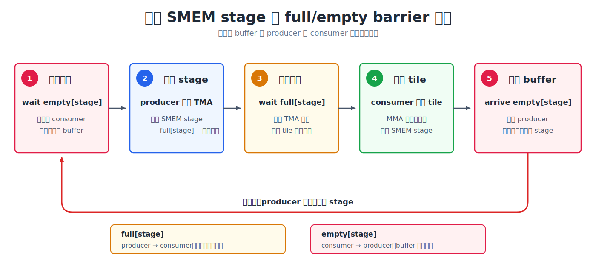

(chap_async_barriers)=
# 异步协作：mbarrier

:::{admonition} 概览
:class: overview

- 发出 TMA 或 Tensor Core 指令，只表示异步操作已经启动。consumer 必须等待对应的完成信号，才能读取结果或复用相关资源。
- `mbarrier` 将 producer 的 `arrive` 与 consumer 的 `wait` 分开，并把普通 thread 的 arrival 和异步硬件的完成状态纳入同一个条件；对于 TMA，它还会追踪尚未传输的字节数。
- 在多级 pipeline 中，每个 stage 通常使用 `full` barrier 交付数据、使用 `empty` barrier 归还 buffer。barrier 可以通过 phase 反复使用，kernel 需要跟踪 phase parity，避免把上一轮的完成状态误认为当前轮已经完成。
:::

前面的 TMA 和 Blackwell Tensor Core 章节介绍了两类异步操作。它们有一个共同特点：thread 只负责发出指令，实际的数据搬运或矩阵乘累加由硬件继续执行。发出指令的 thread 不必留在原地等待。

以 TMA load 为例。程序可以先发出 TMA 指令，再执行读取 SMEM tile 的 MMA；但这个先后顺序只能说明 TMA **先开始**，不能说明它在 MMA 读取数据时已经**完成**。如果 TMA 仍在写入，MMA 就可能读到不完整的 tile。`tcgen05.mma` 与 epilogue 之间也有同样的问题：epilogue 必须等到 Tensor Core 写完 TMEM accumulator 后才能读取结果。

这类异步数据交接需要一个明确的完成信号：producer 在工作完成时发出通知，consumer 收到通知后才能使用数据或复用资源。下面介绍用于传递这个信号的 `mbarrier`。

## `mbarrier`

`mbarrier` 是 memory barrier 的简称，是一个存放在 shared memory 中的硬件同步对象。它的内部编码是不透明的；理解其行为时，可以先关注 arrival counter 和 phase。Arrival counter 表示当前这一轮还差多少次 arrival，phase 则表示 barrier 当前处于第几轮。使用 parity 形式的 wait 时，kernel 只需要跟踪 `phase % 2`，这个 0 或 1 的值称为 phase parity。对于 TMA load，barrier 还会使用 tx-count 追踪尚未完成的传输字节数。

```{raw} html
<div style="overflow-x:auto;">
<iframe src="../demo_zh/mbarrier_mechanism.html?v=review-20260720" title="mbarrier 的状态与操作" loading="lazy"
        style="width:100%; min-width:1320px; height:700px; border:1px solid var(--pst-color-border, #d0d0d0); border-radius:6px;"></iframe>
</div>
```
*点击任意字段，可以单独查看它在 barrier 状态中的含义。*

`mbarrier` 首先需要初始化。执行 `init` 时，kernel 指定 barrier 每轮需要等待多少次 arrival。barrier 从 phase 0 开始，pending arrival count 会被设为 expected arrival count。从这一刻起，它开始等待相关的 producer 或资源使用者报告完成。

每次 arrival 都会减少 barrier 当前仍在等待的工作量。kernel 中的不同参与者会以不同方式发出 arrival。

对于 TMA load，常见的路径是执行 `mbarrier.arrive.expect_tx(bytes)`。这项操作同时完成两件事：首先，发起指令的 thread 完成一次 arrival，使 pending arrival count 减少一次；其次，它把 TMA engine 预计传输的字节数登记到 tx-count 中。

因此，发起指令的 thread 完成 arrival，并不代表 barrier 已经完成。TMA engine 每完成一部分传输，都会通过 complete-tx 扣减相应的 tx-count。只有下面两个条件同时满足，barrier 才会完成当前 phase、进入下一 phase；对应的 phase parity 也会随之在 0 和 1 之间切换：

```text
pending arrival count == 0
tx-count              == 0
```

所以，`expect_tx` 不能简单理解为“又一次普通 arrival”。它还为异步 copy 登记了需要等待的传输字节数。barrier 既要等所有 arrival 发生，也要等相关数据全部传输完成。

Tensor Core 使用另一条 arrival 路径。仅仅发出 `tcgen05.mma` 并不会更新 barrier。kernel 还需要通过 `tcgen05.commit...mbarrier::arrive`，把一次 barrier arrival 关联到此前发出的异步 tcgen05 操作。这些操作完成后，硬件才会在 barrier 上报告 arrival；如果缺少这一步，等待该 arrival 的 consumer 就无法继续。

普通 thread 也可以直接执行 `mbarrier.arrive`。例如，consumer 读完一个 shared-memory buffer 后，可以通过 arrival 通知 producer：这块 buffer 已经可以覆盖并复用。

`wait` 是同一套协议的 consumer 端。consumer 会等待 barrier 完成当前 iteration 对应的 phase；只有等待结束后，才能读取数据或复用 barrier 所保护的资源。原始 PTX `mbarrier.try_wait.parity` 可能在 phase 完成前返回 `false`，因此需要反复检查；本书使用的 `T.ptx.mbarrier.try_wait` 已经在内部封装了这个循环，会一直等到指定 phase 完成。

关键在于，异步硬件不仅在后台继续执行，还会通过 barrier 报告完成。TMA 可以通知 shared-memory tile 已经准备好，Tensor Core 可以通知 TMEM 中的结果已经写完，普通 threads 也可以通知某块 buffer 已经不再使用。它们最终都遵循同一种 producer-consumer 协议：producer 报告 arrival，consumer 执行 wait。

## 为什么要把 arrive 和 wait 分开

`__syncthreads()` 是 CUDA 中最常用的 CTA 范围同步屏障。CTA 中的所有 threads 都必须到达这个同步点；先到达的 thread 会停在这里，直到其他 threads 也到达，随后大家才能继续执行。对于 `__syncthreads()`，报告到达和等待其他 threads 发生在同一个位置。

`mbarrier` 则可以把这两步分开。假设多个 threads 分别写入同一个 SMEM tile，之后还要共同读取这块数据。每个 thread 写完自己负责的部分后，可以先执行 `arrive`，报告自己已经完成本轮写入。此时它不必立即等待其他 threads，而是可以继续执行下一轮 tile 的地址计算等独立工作。直到真正需要读取当前 SMEM tile 时，它才执行 `try_wait`。

如果 barrier 在执行 `try_wait` 时已经完成，consumer 可以直接继续；否则当前 thread 才需要等待。这样，`arrive` 和 `try_wait` 之间的地址计算或其他独立工作，就可以和其余 threads 尚未完成的 SMEM 写入重叠。实际能够隐藏多少等待时间，取决于两者之间是否有足够多不依赖同步结果的工作。

## phase 如何区分不同轮次

前面提到，同一个 `mbarrier` 可以反复使用，每一轮称为一个 phase。一个 phase 完成后，barrier 会自动进入下一 phase，并重新开始等待新一轮的 arrivals。如果只记录“这个 barrier 曾经完成过”，consumer 就可能把上一轮留下的完成状态误认为当前数据已经准备好。phase parity 用 0 和 1 区分相邻两轮，让 consumer 明确自己等待的是哪一次完成。

```{raw} html
<div style="overflow-x:auto;">
<iframe src="../demo_zh/phase_tracking.html?v=restore-original-20260717-2" title="复用 mbarrier 时的 phase tracking" loading="lazy"
        style="width:100%; min-width:1320px; height:640px; border:1px solid var(--pst-color-border, #d0d0d0); border-radius:6px;"></iframe>
</div>
```
*点击不同 iteration，可以观察同一个 barrier 在每轮完成后，phase parity 如何在 0 和 1 之间交替。*

上图展示了一个 barrier 如何在 phase 0 和 phase 1 之间切换，从而被反复使用。在两级 TMA pipeline 中，stage 0 和 stage 1 各有一块 SMEM buffer，也各有一个 TMA barrier。这样，consumer 可以分别等待每个 stage 的数据。

当两个 stages 按 stage 0、stage 1 的顺序循环访问时，可以用一个 `phase_tma` 记录当前轮次。每访问完两个 stages，就翻转一次 parity：

```text
stage = iteration % 2
T.ptx.mbarrier.try_wait(tma_bar[stage], phase_tma)

if stage == 1:
    phase_tma ^= 1
```

两个 barriers 初始化后都处于 phase 0，`phase_tma` 也从 0 开始。前四次 iterations 的完整状态变化如下：

| iteration | stage | 本轮等待的 phase parity | 该 barrier 完成后的当前 parity | iteration 结束后的 `phase_tma` |
|---:|---:|---:|---:|---:|
| 0 | 0 | 0 | 1 | 0 |
| 1 | 1 | 0 | 1 | 1 |
| 2 | 0 | 1 | 0 | 1 |
| 3 | 1 | 1 | 0 | 0 |

Iteration 0 等待 stage 0 的 phase 0。该 phase 完成后，stage 0 的 barrier 进入 phase 1，但这一轮 circular buffer 还没有遍历完，所以 `phase_tma` 仍为 0。Iteration 1 等待 stage 1 的 phase 0；等待完两个 stages 后，`phase_tma` 翻转为 1。

Iteration 2 回到 stage 0，这次等待 phase 1；完成后，stage 0 的 barrier 回到 phase 0。Iteration 3 同样等待 stage 1 的 phase 1。第二轮两个 stages 都完成后，`phase_tma` 也翻转回 0。

`phase_tma` 描述的是软件访问 circular buffer 的轮次，与两次 TMA 传输在硬件上谁先完成无关。因此，深度为 `S` 的 TMA pipeline 通常为每个 stage 准备一个 barrier，再通过 phase parity 区分同一个 stage 的前后两轮。

## 常见的同步规则

在 Tensor Core kernel 中，`mbarrier` 主要用于协调以下三种数据交接。

**threads 向异步硬件交接数据。** 如果 threads 先写入 shared memory，随后由 TMA store 或 MMA 读取这块数据，kernel 必须先完成相应的同步和顺序保证。否则，异步操作可能在 shared-memory buffer 尚未写完时就开始读取。

**TMA 向 MMA 交接数据。** TMA load 异步填充 SMEM tile。producer 让 `mbarrier` 同时追踪 arrival 和传输字节数；执行 MMA 的 consumer 等到 barrier 完成当前 phase，并满足相应指令的顺序要求后，才能读取这个 tile。下面的交互图展示了这条时间线。

```{raw} html
<div style="overflow-x:auto;">
<iframe src="../demo_zh/mbarrier_tma_timeline.html?v=review-20260720" title="通过 mbarrier 追踪 TMA load" loading="lazy"
        style="width:100%; min-width:1320px; height:500px; border:1px solid var(--pst-color-border, #d0d0d0); border-radius:6px;"></iframe>
</div>
```
*沿时间线逐步执行，可以看到两次 TMA copy 分别完成 2048 bytes 的传输；pending arrival count 和 tx-count 都归零后，barrier 原子地进入下一 phase，consumer 的等待才会成功。*

**MMA 向 epilogue 交接数据。** `tcgen05.mma` 异步更新 TMEM accumulator，负责发起 MMA 的 thread 通过 `tcgen05.commit` 将完成通知关联到 `mbarrier`。epilogue 等待 barrier 完成，并按照 `tcgen05` 的顺序要求执行相应 fence 后，才能从 TMEM 读取结果。

## 用 barrier 管理 stage 复用

barrier 不仅可以表示“数据已经准备好”，也可以表示“buffer 已经用完”。因此，pipelined kernel 通常会为每个 SMEM stage 准备一对 barriers：`full[stage]` 表示 TMA 已经填好该 stage，`empty[stage]` 表示 consumer 已经用完这块 buffer。在 pipeline 稳定运行时，一个 stage 的循环可以概括为：



`full` 负责从 producer 向 consumer 交接数据，`empty` 负责从 consumer 向 producer 归还 buffer。每个 barrier 的 expected arrival count 取决于有多少个 threads 负责报告完成。pipeline 循环复用同一对 barriers 时，还需要分别跟踪 `full` 和 `empty` 的 phase parity。

因此，阅读 pipelined kernel 中的 wait 和 arrival 时，可以先找出三个对象：谁是 producer，谁是 consumer，它们交接的是哪块数据或资源。确定这三点后，每个 wait 和 arrival 的作用就能对应到一次具体的数据准备、结果读取或 buffer 复用。
