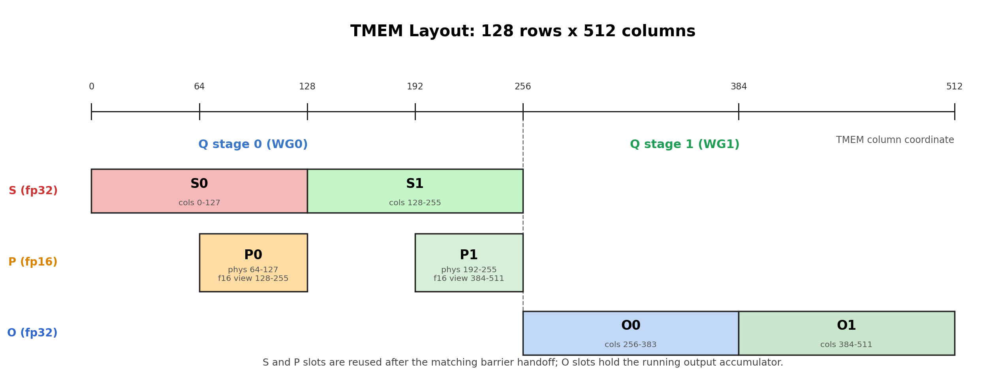
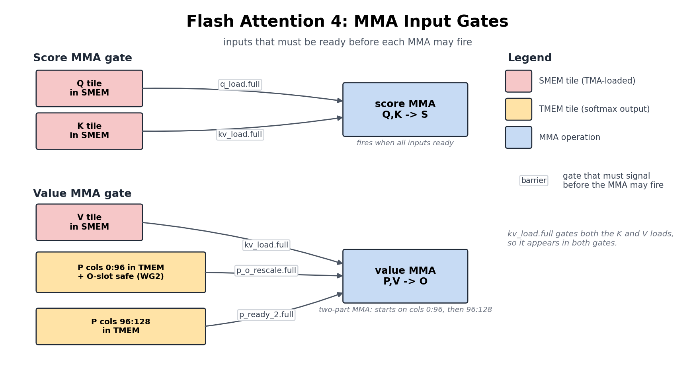
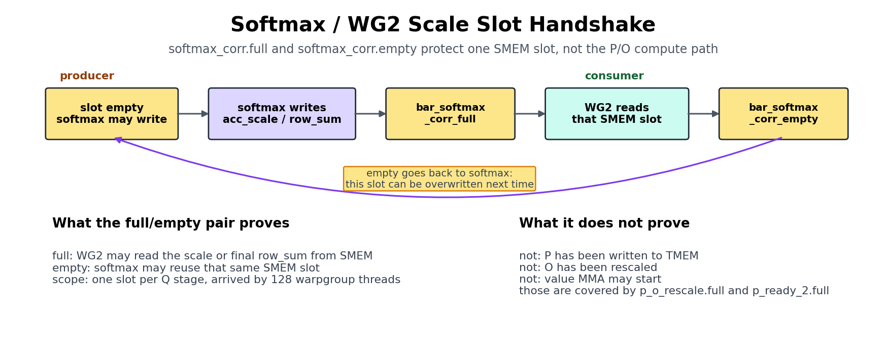
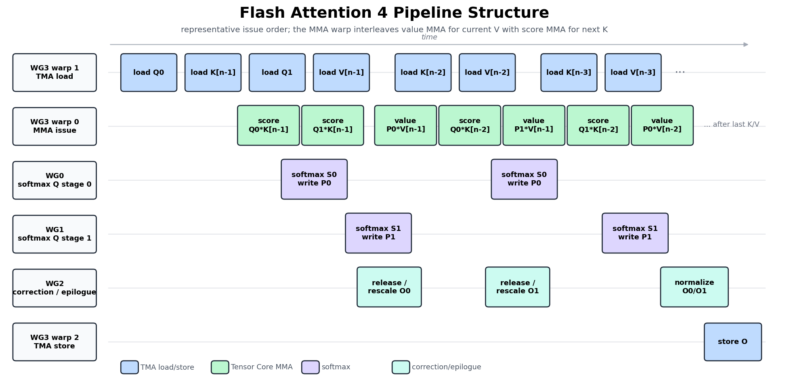

(chap_flash_attention)=
# Flash Attention 4

:::{admonition} 概览
:class: overview

- Attention 会运行两个 MMA，中间夹着 softmax，因此它不能像 GEMM 那样只是重复一个 MMA。
- Kernel 会把第一部分的硬件 primitive（TMA、`tcgen05`、TMEM、barrier）和第三部分的 GEMM 技术组合起来，再加入 warp role、online-softmax rescaling、causal masking 和 GQA。
:::

Attention 是决定 transformer 能否运行的 kernel，也是前面构建的所有东西最终必须协同工作的地方。我们为 GEMM 组装的每个部件都会带到这里：TMA tile movement、`tcgen05` MMA、TMEM、warpgroup register tile，以及显式 barrier。

挑战在于 attention 不是一个 MMA 的重复。它是两个 MMA，中间夹着真正的工作：online softmax、causal masking，以及让早期 block 和后续 block 保持同一尺度的 rescaling。

新的难点就在中间这一段。普通 matmul 只会加到 accumulator；attention 必须在新的 key 和 value stream in 时，重新访问并 rescale 已经计算过的结果。Softmax 本身也在两个 Tensor Core MMA 之间运行在 CUDA core 上，因此 exponential 和 row-wise reduction 直接位于关键路径上。

这就是为什么 attention 优化很大程度上就是 softmax 优化：重写 `exp`，并让 softmax 与 MMA 重叠，而不是在 softmax 上停住。

本章目标不是从零重新推导 Flash Attention。我们会保留足够算法背景，让 kernel 可读，然后把注意力放在真正的新内容上：这个算法如何变成 TIRx。

最清晰的入口是跟随一个 tile 在 kernel 中流动。`Q`、`K` 和 `V` 作为 input tile 进入，从 GMEM 加载到 SMEM。Score MMA 把 `Q` 和 `K` 相乘，得到 TMEM 中的 score tile `S`。Softmax 把 `S` 变成 numerator tile `P`，value MMA 再把 `P` 和 `V` 组合起来更新 output accumulator `O`。

到目前为止，这看起来像两个 matmul 粘在一起，但这里有一个 GEMM 从不需要处理的 twist：每当 running softmax maximum 改变，已经累加的 `O` 就突然处在错误尺度上。它必须先被 rescale，下一次 value MMA 才能安全地加到其中。下面各节会先追踪这条路径，然后展示 TIRx 如何把每个 stage 交给 warpgroup，并把 stage 串接起来。

## 算法形状

在把 tile 放进内存之前，我们需要知道这些 tile 服务的算法。对于一个 query block，Flash Attention 计算：

$$O = \text{softmax}(QK^{\top} / \sqrt{d})V$$

字面看，公式说要构造完整 score matrix `S = QKᵀ`，对它做 softmax，再乘以 `V`。这正是我们不能使用的方法，因为完整 `S` 太大。seq=4096 时，每个 head 大约有 16M 个元素，fp32 下约 64 MB，比 SMEM 或单个 128×512 TMEM region 大几个数量级。片上根本没有地方放它。Flash Attention 的答案是永远不 materialize `S`。相反，它按 block stream `K/V`，并携带三个 per-row running state 来总结目前为止看到的全部内容：

- `row_max`：目前见过的最大 score。
- `row_sum`：softmax 的 running denominator。
- `O`：running output accumulator。

Streaming update 会在新 block 到达时保持这些 state 正确。微妙之处在于，每处理一个 block，running max 都可能上升；一旦上升，在旧 max 下计算的一切都处在错误尺度上。因此在加入新贡献之前，我们必须先把旧状态拉回新尺度：

```text
S = Q_block @ K_block.T
m_new = max(row_max, rowmax(S))
scale = exp((row_max - m_new) / sqrt(d))
P = exp((S - m_new) / sqrt(d))
row_sum = row_sum * scale + rowsum(P)
O = O * scale + P @ V_block
row_max = m_new
```

单个 `scale` 因子在这里有双重作用：它同时 rescale running denominator 和 running output，使早期 block 和后续 block 的贡献最终位于同一尺度。

上面的 pseudocode 使用自然 `exp` 和显式 `/sqrt(d)`，因为这样最容易读，但 kernel 采用更便宜的路径。它把 `1/sqrt(d)` 和 `log2(e)` 合成一个常量 `scale_log2 = log2(e)/sqrt(d)`，并用硬件 `exp2` 对 raw score 计算所有 exponential，使用恒等式 `exp(x/sqrt(d)) = exp2(x · scale_log2)`。原因很简单：在这个硬件上，`exp2` 比自然 `exp` 更快。

继续之前，有一点要明确：这里的 `P` *不是*最终 normalized attention matrix。它只是当前 K/V block 的 softmax numerator。Normalization 被故意推迟，只有最后一个 block 之后，kernel 才写出 `O / row_sum`。

对于 TIRx，知道算法计算什么只是一半。另一半是 kernel 运行时*每个 tile 位于哪里*，因为这决定 layout 和 barrier 代码。`S`、`P` 和 `O` 都是 tile value，并且各自有家：

- `S` 是 score tile。Score MMA 把它写入 TMEM。
- `P` 是 softmax numerator tile。Softmax 从 TMEM 把 `S` 读入寄存器，计算 `P = exp((S - m_new) / sqrt(d))`，再把 `P` 写回 TMEM。
- `O` 是 output accumulator tile。Value MMA 从 TMEM 读取 `P`，从 SMEM 读取 `V`，然后累加到 TMEM 中的 `O`。

前面提到的 rescale 也是一个 tile operation，不是 scalar bookkeeping：当 `row_max` 改变时，旧 `O` 会从 TMEM 读出，在寄存器中乘上 scale，再写回 TMEM，然后下一次 value MMA 才能累加进去。后面每节都会沿着同一结构展开：tile placement、hardware path，以及证明下一个 consumer 可以运行的 barrier。

## Tile-Primitive Graph

有了 running state 和它们的位置，我们可以把算法展开成具体的 tile movement 序列。对于一个 K/V block，kernel 从上到下走这条 tile 路径：

```text
Q, K, V in GMEM
  -> Q, K, V in SMEM        by TMA load
  -> S in TMEM              by score MMA: QK^T
  -> P in TMEM              by softmax numerator: TMEM -> RF -> TMEM
  -> O in TMEM              by value MMA: P V
  -> O in GMEM              by normalization, SMEM staging, and TMA store
```

与 GEMM 的差异归结为一行。GEMM 是重复的一条 MMA chain；FA4 有两个 MMA phase，中间夹着 softmax。后面几乎所有内容都是这个额外 stage 的后果。

如果把短路径展开成显式 producer-consumer edge，就得到完整 graph：

| Stage | Tile movement or compute | TIRx primitive | Hardware path |
|-------|--------------------------|----------------|---------------|
| Load Q/K/V | GMEM tiles -> SMEM tiles | `Tx.copy_async(..., dispatch="tma")` | TMA load |
| Score MMA | SMEM 中的 Q 和 SMEM 中的 K -> TMEM 中的 score tile `S` | `Tx.warp.gemm_async(..., dispatch="tcgen05")` | `tcgen05.mma` |
| Softmax read | TMEM 中的 `S` -> warpgroup register tile | `Tx.wg.copy_async(reg, tmem)` | `tcgen05.ld` |
| Softmax write | registers 中的 numerator tile `P` -> fp16 TMEM view | `Tx.copy_async(tmem_as_f16, reg)` | TMEM store，随后 `tcgen05.wait.st()` |
| Value MMA | TMEM 中的 `P` 和 SMEM 中的 V -> TMEM 中的 output accumulator `O` | `Tx.warp.gemm_async(..., dispatch="tcgen05")` | 带 TMEM operand 的 `tcgen05.mma` |
| Correction | TMEM 中的 `O` -> registers -> TMEM 中的 `O` | TMEM readback、register multiply、TMEM store | `tcgen05.ld` / TMEM store |
| Epilogue | 最终 TMEM 中的 `O` -> registers -> SMEM -> GMEM | TMEM readback、`Tx.copy`、TMA store | `tcgen05.ld` + TMA store |

新增行是 softmax 和 correction。二者都会加入 TMEM -> register -> TMEM 流量，也会在 score MMA 和 value MMA 之间创建额外交接。

**Try with your agent**：让它只 trace 上面的短路径。对每个箭头，命名 producer stage、consumer stage、source tile、destination tile 和 hardware path。然后问哪些箭头在 GEMM 章节中不存在。

## Warp 角色和 Scope

数据路径确定后，自然的问题是谁实际运行每个 stage。这里每个 CTA 有 4 个 warpgroup，总共 512 个线程，它们不是按触碰的数据来切分，而是按 warpgroup 执行的*工作类型*切分：

- WG3 驱动硬件引擎：TMA load、MMA 和 TMA store。
- WG0、WG1 和 WG2 执行这些 engine 调用之间发生的 register-heavy math：softmax、correction 和 epilogue。

精确角色表是：

| Owner | Role | What it does |
|-------|------|--------------|
| WG3, warp 1 | TMA load | 从 GMEM 加载 Q、K、V tile 到 SMEM |
| WG3, warp 0 | MMA | 发起 score MMA 和 value MMA |
| WG3, warp 2 | TMA store | 把最终 O tile 从 SMEM store 到 GMEM |
| WG0 | Q stage 0 的 softmax | 读取 TMEM 中的 S，计算 P，把 P 写回 TMEM |
| WG1 | Q stage 1 的 softmax | 为第二个 Q pipeline stage 执行同样工作 |
| WG2 | Correction 和 epilogue | Rescale TMEM 中的 O，normalize，并 stage 输出 |

很容易把 “两个 Q stage” 误读成两个 attention head，但它们不是。它们只是 Q pipeline 中的两个 slot，由 WG0 拥有一个、WG1 拥有另一个，因此两个 Q tile 可以同时在飞行中。这就是 softmax 工作出现两次的原因：WG0 一次，WG1 一次。

代码用符号坐标选择这些角色：

```python
wg_id = T.warpgroup_id([4])
warp_id = T.warp_id_in_wg([4])
```

阅读 kernel 时，先找到 role branch。它会告诉你嵌套在其中的每个 tile primitive 由哪一队线程拥有。

- WG3 warp 1 启动 TMA load 命令。一个 elected lane 发起 copy，TMA engine 移动 tile。
- WG3 warp 0 发起 `tcgen05.mma` 指令。
- WG0 和 WG1 以完整 warpgroup scope 运行 softmax。
- WG2 以完整 warpgroup scope 运行 correction 和 epilogue。

有一个不对称性会塑造整个 barrier graph：*所有* MMA，无论 score 还是 value，都只由 WG3 warp 0 发起。WG0 和 WG1 完全不发起 MMA。它们只消费 score tile，运行 softmax，并把 `P` 写回 TMEM。

正因为这种分离，softmax 周围需要 barrier。`s_ready` 把 score tile 从 MMA warp 传给 softmax；`p_o_rescale` 传递 `P`，以及一个对 value MMA 安全的 `O` slot：要么已经 rescale，要么因为不需要 rescale 而被 release。本章后面会反复回到这两个名字。

## 读取代码片段

本章的代码片段摘自 [`flash_attention4.py`](https://github.com/mlc-ai/tirx-kernels/blob/main/tirx_kernels/attention/flash_attention4.py)，因此不可避免会引用一些没有在本章完整复现的 kernel 名称。自解释的名字（`wg_id`、`warp_id`、`BLK_M`/`BLK_N`、`HEAD_DIM`、`kv_stage`、`SMEM_PIPE_DEPTH_*` / `TMEM_PIPE_DEPTH` 深度、`should_accumulate`，以及这里为 1 的 `CTA_GROUP`）会在第一次相关时引入。其他名字在下表给出一行说明，这样当片段出现陌生名字时可以立即查到：

| Name | Meaning |
|------|---------|
| `q_stage`, `i_q` | Q pipeline stage，0 或 1，即哪个 Q tile slot（`SMEM_PIPE_DEPTH_Q = 2`）。在 WG0/WG1 softmax 内部，warpgroup 自己的 `wg_id`（0 或 1）就是这个 stage index，因此 `S_region[q_stage]`、`P_region[wg_id]` 和 `O_region[i_q]` 都选择同一个 Q stage |
| `MMA_N` | score/output tile 在 TMEM column 上的宽度（128） |
| `MMA_K` | `P`/`V` column 上的 MMA inner-K step（16）；`K_SPLIT = 6 * MMA_K = 96` |
| `K_SPLIT` | value-MMA schedule 的 split point（见 *The Two MMA Phases*）；第一次 value MMA 覆盖 columns `0:K_SPLIT`（`6 * MMA_K = 96`） |
| `should_rescale` | WG2 per-row flag：旧 `O` 是否需要在下一次 value MMA 前 rescale（通过 `any_sync` 跨 warpgroup reduce） |
| `rescale_threshold` | 小 row-max 变化的 skip threshold；当前 kernel 使用 `8.0`，被跳过的 rescale 会把 `acc_scale` 精确设为 `1.0` |
| `scale_log2` | log2 单位下的 softmax scale，`log2(e)/√d`，因此 `P = exp2((S - m) · scale_log2)` |
| `acc_scale` | softmax 通过 SMEM mailbox 传给 WG2 的 per-row rescale factor |
| `chunk_start`/`chunk_end`, `p_start`/`p_end` | 正在读/写的 32-wide softmax chunk 的 column range |

## 两个 MMA Phase

对于每个 streamed K/V tile，Flash Attention 会运行两个 MMA phase，并由 softmax 连接：

```text
Q, K -> score MMA -> S
S    -> softmax   -> P
P, V -> value MMA -> O
```

可以把它看成三个连续 producer 的 pipeline。第一个 MMA 产生 attention score `S`，softmax 把 `S` 变成 numerator `P`，第二个 MMA 消费 `P` 来更新 output accumulator `O`。对 `row_sum` 的 normalization 会推迟到 epilogue，等每个 K/V tile 都贡献之后再做。

下面每个 tile op 都会得到和 GEMM step 一样的 **scope / layout / dispatch** 卡片，并额外加入 **Handoff**，命名把 tile 交给下一角色的 barrier。

Compute 代码从不直接说 raw TMEM column number。Kernel 会把单个 TMEM allocation 切成 per-stage view（`S_region`、`P_region`、`O_region`），并用 pipeline stage 索引它们（`S_region[q_stage]`、`O_region[i_q]`、`P_region[i_q, 0:K_SPLIT]`）。这些 view 在 [TMEM Layout and Reuse](#tmem-layout-and-reuse) 一节中用 `T.TMEMStages` 定义；目前把每个 region 当作同一块物理 TMEM 的命名 slice 即可。

### Score MMA

两个 phase 中的第一个是 score MMA，也就是每个 K/V iteration 开头的 matmul。它计算：

$$S = Q_{\text{block}}K_{\text{block}}^{\top}$$

并把 `128 x 128` score tile 写入 TMEM：

```python
Tx.warp.gemm_async(
    S_region[q_stage],
    Q_smem[q_stage, 0:BLK_M, 0:HEAD_DIM],
    K_smem[kv_stage, 0:BLK_N, 0:HEAD_DIM],
    dispatch="tcgen05",
    cta_group=CTA_GROUP,
)
if T.ptx.elect_sync():
    s_ready.arrive(q_stage)
```

我们可以问 GEMM 章节对每个 tile op 都问过的四个问题：谁运行它、tile 位于哪里、如何 dispatch、如何 handoff：

> **Tile-primitive readout：Score MMA**
> - Scope：WG3 warp 0 发起；一个 elected lane arrive `s_ready`。
> - Layout：SMEM 中的 Q、K -> TMEM 中的 `S`（`S_region[q_stage]`）。
> - Dispatch：`tcgen05`。
> - Handoff：`s_ready`（-> softmax）。

单个 elected thread 在 `s_ready` 上 arrive，就是整个 handoff。它宣布这个 score tile 已经完成，softmax warpgroup 现在可以读取它。

### 两个 MMA 之间的 Softmax

两个 MMA 中间是 softmax，它把 score tile `S` 变成 numerator tile `P`。它的 readout card 是：

> **Tile-primitive readout：Softmax**
> - Scope：WG0（Q stage 0）/ WG1（Q stage 1），完整 warpgroup。
> - Layout：TMEM 中的 `S` -> registers -> fp16 TMEM 中的 `P`（`P_region[wg_id]`）。
> - Dispatch：用 `tcgen05.ld` 读取，用 TMEM store 写入；中间在 registers 中做 row-wise math。
> - Handoff：等待 `s_ready`；arrive `p_o_rescale`（前 96 列）和 `p_ready_2`（最后 32 列）。

这个 stage 完全没有 GEMM 对应物。WG0/WG1 等待 score tile 在 `s_ready` 上到达，然后按 register-sized chunk 从 TMEM 读出：

```python
Tx.copy_async(
    s_chunk[:, chunk_start : chunk_end],
    S_region[wg_id, chunk_start : chunk_end],
)
```

这是一个 warpgroup scope 下的 TMEM-to-register tile read。Scores 进入寄存器后，softmax warpgroup 按顺序做三件事：

1. 计算 row max 和 row sum，
2. 计算 softmax numerator tile `P`，
3. 把 `P` 作为 fp16 写回 TMEM。

最后一步如下：

```python
Tx.copy_async(
    P_region[wg_id, p_start : p_end],
    p_chunk[:, p_start : p_end],
)
```

既然刚刚在寄存器中算出了 `P`，为什么还要写回 TMEM？因为 value MMA 需要 `P` 作为一个 *tile operand*，而 MMA 不能把散落在每个线程中的 scalar register 当成矩阵读取。在这个 kernel 中，`P` 的 MMA-readable 形式是 `P_region`，也就是 fp16 TMEM alias `tmem_as_f16` 上的一个 view。因此这个 writeback 不是多余移动，而是把 `P` 放到下一次 MMA 真正能消费的唯一形状中。

### Value MMA

第二个 phase，也是每个 K/V iteration 收尾的 phase，是 value MMA。它计算：

$$O = O + P_{\text{block}}V_{\text{block}}$$

当这个 MMA 运行时，`O` 已经处在当前 K/V block 所需的正确状态：第一个 block 上被初始化，后续 block 上被 rescale。因此 MMA 只需要累加。它与 GEMM 的区别在于 operand 位于哪里：A operand 是 TMEM 中的 `P`，B operand 是 SMEM 中的 `V`，accumulator `O` 也在 TMEM 中：

```python
# First sub-MMA: columns 0:K_SPLIT (the first 96 of P / rows of V).
Tx.warp.gemm_async(
    O_region[i_q],
    P_region[i_q, 0:K_SPLIT],
    V_smem[kv_stage, 0:K_SPLIT, 0:HEAD_DIM],
    transB=True,
    accum=should_accumulate,
    dispatch="tcgen05",
    cta_group=CTA_GROUP,
)
# The second sub-MMA (same form, accum=True, gated on p_ready_2) covers the
# remaining columns K_SPLIT:BLK_N.
```

> **Tile-primitive readout：Value MMA**
> - Scope：WG3 warp 0。
> - Layout：TMEM 中的 `P` + SMEM 中的 V -> TMEM 中的 `O`（`O_region[i_q]`）。
> - Dispatch：带 TMEM operand 的 `tcgen05`。
> - Handoff：等待 `p_o_rescale`、`p_ready_2`、`kv_load.full`；arrive `o_ready`（-> epilogue）。

这个 operand placement 是两个 MMA 之间的硬件差异：

- Score MMA 从 SMEM 读取两个 operand：Q 和 K。
- Value MMA 从 TMEM 读取一个 operand：`P`。
- Value MMA 从 SMEM 读取另一个 operand：V。
- 结果累加到 TMEM 中的 `O`。

`accum=should_accumulate` flag 实现了算法中的“初始化或累加”选择：它在 query block 的第一个 K/V tile 上为 false，在后续每个 tile 上为 true。

你还会注意到，value MMA 不是一次性运行，而是拆成 `96 + 32` schedule：

1. Softmax 以四个 32-column chunk 写入 `P`。
2. 前三个 chunk 就绪后，value MMA 立即开始处理 `P` 的前 96 列以及 V 中匹配的行。
3. 最后 32 列等待 `p_ready_2`。
4. 第二次 MMA 消费最后这个 chunk，并完成 tile。

拆分的原因是让 Tensor Core 保持忙碌。如果把 value MMA 作为一次单独指令运行，整个 phase 都会停到所有四个 32-column `P` chunk 都 exponentiate 并 store 完成。先对前三个 chunk firing，kernel 就能把最后一个 chunk 的 `exp` 和 TMEM write 与一个已经在飞行中的 96-wide MMA 重叠起来，把原本的空闲时间变成有用工作。

## TMEM Layout and Reuse

`S`、`P` 和 `O` 都必须共享同一个 `128 x 512` TMEM allocation，而它们如何打包进这块空间，正是 barrier 和 layout 在这个 kernel 中不可分割的原因。

下图直接展示这种 packing：score slot、numerator slot 和 output slot 全都共享同一个 TMEM allocation，因此 barrier protocol 才能让复用合法。



这张图可以读作一组 tile slot：

- Score slot 保存 `S = QK^T`。
- Numerator slot 保存 softmax exponentiation 之后的 `P` tile。
- Output slot 保存 fp32 `O` accumulator。

这些不是独立 buffer。它们是*同一个* allocation 的区域，而这种共享不是风格选择，而是被迫的。Q-pipeline depth 为 2 时，两个 `S` slot（2 × MMA_N = 256 列）和两个 `O` slot（2 × MMA_N = 256 列）已经占满全部 512 个 fp32 列。没有剩余空间给 `P`，所以 `P` 只能通过更窄的 fp16 view alias 同一批 byte。这样安全的唯一原因是每个 region 都严格在前一个 consumer 完成后才复用，而这个时机正是 barrier 保证的。因此在 FA4 中，barrier 不只是 scheduling；它们首先让 layout 合法。

Aliasing 通过 `T.TMEMPool` 设置。Kernel 先取一个 fp32 view（`tmem`）用于 score 和 output accumulator，然后把 pool base rewind 回 0，再在*同一批*物理 byte 上取第二个 fp16 view（`tmem_as_f16`）：

```python
tmem_pool = T.TMEMPool(pool, total_cols=N_COLS_TMEM, cta_group=CTA_GROUP, tmem_addr=tmem_addr)
tmem = tmem_pool.alloc((128, N_COLS_TMEM), "float32")
tmem_pool.move_base_to(0)
tmem_as_f16 = tmem_pool.alloc((128, N_COLS_TMEM * 2), "float16")
tmem_pool.commit()
```

因为 fp16 元素宽度只有一半，fp16 view 会在同样 byte 上暴露出两倍数量的可索引 column，这正是 `P` 所处的空间，也是 fp32 layout 没有空间容纳的区域。有了两个 view 后，kernel 用 `T.TMEMStages` 把 `S`、`P` 和 `O` slot 切成 staged region，使 compute 代码可以按 pipeline stage 索引，而不是按 raw column：

```python
S_region = T.TMEMStages(tmem,        col_start=0,                       width=MMA_N, stages=SMEM_PIPE_DEPTH_Q, stride=MMA_N)
O_region = T.TMEMStages(tmem,        col_start=MMA_N * SMEM_PIPE_DEPTH_Q, width=MMA_N, stages=SMEM_PIPE_DEPTH_Q, stride=MMA_N)
P_region = T.TMEMStages(tmem_as_f16, col_start=MMA_N,                   width=BLK_N, stages=SMEM_PIPE_DEPTH_Q, stride=MMA_N * 2)
```

`P_region` stride 中的 `* 2` 是 aliasing 在代码中可见的地方。`S_region` 和 `O_region` 以 fp32 `tmem` column 计量，而 `P_region` 以 fp16 `tmem_as_f16` column 计量，后者宽度只有一半，因此 stage-to-stage movement 需要 doubled stride 才能落到同一批物理 byte 上。不过一旦 region 定义好，compute 代码就很干净：它写 `S_region[q_stage]`、读 `S_region[wg_id, ...]`、写 `P_region[wg_id, ...]`，并累加到 `O_region[i_q]`，完全不触碰 raw column index。

**Try with your agent**：让它解释这个 FA4 kernel 中的 fp32（`tmem`）和 fp16（`tmem_as_f16`）view。哪些物理 TMEM region 保存 `S`、`P` 和 `O`？为什么 `P_region` 的 stride 使用 `MMA_N * 2`？复用问题留到下一节：看完 barrier table 后，再检查每个 region 复用前必须等哪些 consumer 完成。

## Barrier 如何连接角色

这是 kernel 最难的部分，所以最好循序渐进。先从沿主 compute path 移动数据的几组 barrier 开始，把其他 barrier 当作稍后可查的 bookkeeping。Data-ready handoff 是：

| Handoff | Meaning |
|---------|---------|
| TMA load -> score/value MMA | Q、K 或 V 已经到达 SMEM，可以喂给 MMA |
| score MMA -> softmax | `S` 已经在 TMEM 中 ready |
| softmax/correction -> value MMA | `P` 已经在 TMEM 中 ready，且 `O` 可以安全 accumulation |
| value MMA -> epilogue | 最终 `O` 已经在 TMEM 中 ready |
| epilogue -> TMA store | `O_smem` 已经 ready，可以 store |

不在这个列表里的都是 pipeline bookkeeping：release 某个 SMEM、TMEM 或 staging buffer，让另一个角色可以复用它。有用之处在于，每个 barrier 无论传递数据还是只做 bookkeeping，都可以按同一种 tile handoff 来读。你只要问谁生产数据、谁消费数据，以及双方完成后哪个 buffer 变得空闲。

下一张图把这些 handoff 压缩成两个 MMA phase 的精确 readiness gate：score MMA 等待什么，value MMA 累加前必须等待什么。



把这张图看成 correctness gate，而不是 schedule。它回答“这个 MMA firing 前必须满足什么”，不说明 timing。Score MMA 等待 Q 和 K 在 SMEM 中 ready，然后产生 `S`。Value MMA 同时等待三件事：SMEM 中的 V、softmax 产生的 `P` tile，以及 WG2 已经 release 或 rescale 过的 `O` slot。Softmax-to-value gate 被拆分，原因前面已经见过：当 `P` 的前 96 列就位时 value MMA 可以开始，`p_ready_2` 释放最后 32 列。

有一个 handoff 不符合 tile-readiness 模型：softmax-to-correction edge。Softmax 不是传递 tile，而是通过一个 one-slot SMEM mailbox 向 WG2 传递单个 scalar（K/V loop 中是 `acc_scale`，epilogue 中是最终 `row_sum`）。由于这个 slot 每次 iteration 都会复用，一对 `full`/`empty` barrier 必须保护它。

下图放大了 mailbox handshake，因此这对 barrier 应该读作 scalar producer-consumer channel，而不是 tile-ready gate。



把 `softmax_corr.full` 和 `softmax_corr.empty` 读作一对 producer-consumer：

1. Softmax 在复用 scale/sum slot 前等待 `softmax_corr.empty`。
2. Softmax 把 `acc_scale` 或最终 `row_sum` 写入这个 slot。
3. Softmax arrive `softmax_corr.full`。
4. WG2 等待 `softmax_corr.full`，然后读取这个 slot。
5. WG2 arrive `softmax_corr.empty`。
6. Softmax warpgroup 可以在下一阶段复用这个 slot。

要小心 `softmax_corr.empty` 的含义和不含义。它只表示 WG2 已经消费 scale/sum slot。它不表示 `P` 已经 ready，更*不是*允许 value MMA 启动的 gate。那个 gate 是 `p_o_rescale`，它在 `P` 的前 96 列写入、且 `O` slot 可以安全累加时触发。混淆二者是经典 wrong-result bug 来源。

有了主路径之后，完整 barrier list 可以作为参考：

| Barrier | Producer -> consumer | What becomes safe |
|---------|----------------------|-------------------|
| `q_load.full` | TMA load -> score MMA | Q SMEM tile 可以喂给 MMA |
| `q_load.empty` | 这个 Q stage 的所有 score MMA -> TMA load | Q SMEM stage 可以为下一个 task 复用 |
| `kv_load.full` | TMA load -> score/value MMA | K 或 V SMEM tile 可以喂给 MMA |
| `kv_load.empty` | score/value MMA -> TMA load | K/V SMEM stage 可以复用 |
| `s_ready` | score MMA -> softmax | S TMEM tile 可以读取 |
| `p_o_rescale` | softmax + WG2 -> value MMA | P 的前 96 列在 TMEM 中，且 O slot 可用于 value MMA |
| `p_ready_2` | softmax -> value MMA | P 的最后四分之一在 TMEM 中 |
| `o_ready` | value MMA -> epilogue | 最终 O accumulator ready |
| `softmax_corr.full` | softmax -> WG2 | `acc_scale` 或最终 `row_sum` 在 SMEM mailbox 中 ready |
| `softmax_corr.empty` | WG2 -> softmax | WG2 读取后，同一个 SMEM mailbox slot 可以复用 |
| `corr_epi.full` | epilogue -> TMA store | O_smem ready，可以 store |
| `corr_epi.empty` | TMA store -> epilogue | O_smem stage 可以复用 |

和 GEMM 一样，可以从 signal producer 推断 barrier type：

- TMA load 使用 `TMABar`，因为 TMA engine 会 byte-count 自己的完成。
- MMA completion 使用 `TCGen05Bar`，因为 `tcgen05.commit` signal completion group。
- 纯 thread-to-thread handoff 使用 `MBarrier`，参与线程显式 arrive。

拆分的 softmax-to-value handoff 值得再仔细看。它使用两个 gate：

- `p_o_rescale` 在 `P` 的前 96 列写入且 `O` tile 可以安全累加时，允许 value MMA 开始。
- `p_ready_2` 释放 `P` 的最后 32 列，匹配上一节的 `96 + 32` value-MMA schedule。

第一个 K/V block 是简单情况。WG2 会 pre-arrive `p_o_rescale`，因为还没有旧的 `O` tile 需要 rescale。

后续 block 必须更小心。WG2 只有在跳过不必要 rescale 或完成旧 `O` 的 rescale 后，才 arrive `p_o_rescale`。Skip test 故意保守：softmax 计算 log2-scaled delta `(m_old - m_new) * scale_log2`；如果这个值仍高于 `-rescale_threshold`，新 max 没有移动到值得 rescale 的程度，因此 kernel 保留旧 max，并把 `acc_scale` 精确设为 1.0。只有更大的 max jump 才会走 `exp2` 路径，并要求 WG2 rescale `O`。

WG2 随后用 `any_sync` 在 warpgroup 内 reduce `should_rescale`。如果没有 row 需要更新，它就让 `O` 保持原样。这个 skip 很重要，因为 rescale `O` 是覆盖整个 accumulator 的完整 TMEM -> RF -> TMEM read-modify-write；当 threshold logic 已经把 `acc_scale` 保持在 1.0 时，这就是纯浪费。

注意，所有新 barrier 都聚集在一个地方。`s_ready`、`p_o_rescale`、`p_ready_2` 和 softmax/correction pair 都是 softmax 周围的 barrier。它们存在的唯一原因是：score MMA 和 value MMA 不再相邻。Register math、TMEM rewrite 和 output rescaling 现在位于两者之间，每一步都需要自己的 handoff。

**Try with your agent**：让它 trace 一个 K/V block 穿过 `s_ready`、`p_o_rescale`、`p_ready_2` 和 `o_ready`。对每个 barrier，问谁 wait、谁 arrive、哪个 tile 变得可读，以及之后哪个 storage 可以复用。

## Pipelining Structure

Barrier 告诉我们角色消费 tile 前必须有什么*ready*。但它们没有告诉我们实际有哪些东西*并发*运行，这正是现在要讨论的问题。二者确实不同：一个 correctness gate 可能在 producer 实际运行之前很久或之后很久才满足。

这里没有单一 pipeline depth，因为不同 tile stream 以不同速度移动。因此 kernel 为每类 stream 保持单独的 ring：

- Q pipeline depth 2：一个 CTA 处理两个 Q stage。WG0 处理一个 stage，WG1 处理另一个。
- KV pipeline depth 3：K 和 V block 在 inner loop 中 streaming，而同一批 Q stage 会复用。
- TMEM pipeline depth 2：每个 Q stage 有自己的 S/P/O TMEM slot，这些 slot 会在匹配 barrier 触发后复用。

下图从 correctness gate 切换到 timeline view，展示这些独立 ring 进入飞行状态后，哪些角色可以大致同时 active。



把它读作 timeline，而不是 barrier graph。它展示大致同一时间哪些角色 active；前面的 barrier-flow 图则用于检查精确 producer-consumer wait。两张图分别回答本节开头提出的两个不同问题。

每一行对应代码中的一个 role branch：

- WG3 warp 1 发起 TMA load。
- WG3 warp 0 发起 score MMA 和 value MMA。
- WG0 和 WG1 为两个 Q stage 运行 softmax。
- WG2 release 或 rescale `O`，稍后 normalize 最终输出。
- WG3 warp 2 发起 TMA store。

从左到右沿图走，可以看到一个代表性的 pipeline wave。Load warp 从 `Q0`、`K[n-1]`、`Q1`、`V[n-1]` 开始，然后继续 stream 更低索引的 K/V block。MMA warp 发起第一批 score MMA 来产生 `S0` 和 `S1`，WG0/WG1 把它们变成 `P0` 和 `P1`。

重要的是，MMA warp 并不会先运行所有 score MMA，再运行所有 value MMA。一旦两个 Q stage 都 primed，它就会交错两类 MMA：当前 `V` block 的 value MMA，然后下一个 `K` block 的 score MMA，如此继续：

```text
score Q0*K[n-1]
score Q1*K[n-1]
value P0*V[n-1]
score Q0*K[n-2]
value P1*V[n-1]
score Q1*K[n-2]
value P0*V[n-2]
...
```

这种 interleaving 正是图中 score、softmax、correction 和 value 行重叠，而不是整齐依次运行的原因。

WG2 行标注为 `release / rescale`，两个半部分对应我们已经见过的两种情况。第一个 K/V block 上还没有旧 `O`，因此 WG2 只参与让 value MMA 继续的 handoff；后续 block 上，它可能在 value MMA 累加前 rescale 旧 `O`。Normalization 和 TMA store 只在 attention task 的最后一个 K/V block 之后发生一次。

没有单个 GEMM-style pipeline 可以描述 FA4，因为 Q、K/V 和 TMEM slot 都按独立 schedule 前进。TIRx 把这些 schedule 显式保留下来，表现为单独的 tile buffer、`PipelineState` cursor 和 barrier phase，而不是把 kernel 藏在一个 monolithic primitive 后面。代价是 moving parts 更多；收益是复杂性保持可见、可检查。

## Rescaling 和 Writeback

Rescale 是强制需要的，不是可以去掉的优化。Online softmax 可能随着每个新 score tile 抬高 per-row maximum；一旦抬高，早期 block 累加出的 `O` 是按*旧* maximum 缩放的。这会让早期每一项都比正确值大 `exp(m_new - m_old)` 倍。跳过 correction 后，这些 block 会被过度加权，最终输出就是错的。修复是一次 TMEM -> registers -> TMEM tile operation：

$$O_{\text{old}} \leftarrow O_{\text{old}} \cdot e^{(m_{\text{old}} - m_{\text{new}}) / \sqrt{d}}$$

工作由两个角色拆分。Softmax 计算 per-row scale，并把它放入 SMEM mailbox；WG2 等待 `softmax_corr.full`，从 TMEM 读出当前 `O`，乘上这个 scale，再把 `O` 写回：

```python
RESCALE_TILE = T.meta_var(16)
o_row = T.wg_reg_tile(RESCALE_TILE)
Tx.copy_async(o_row, O_region[i_q, d_start : d_start + RESCALE_TILE])
Tx.mul(o_row, o_row, acc_scale)
Tx.copy_async(O_region[i_q, d_start : d_start + RESCALE_TILE], o_row)
T.ptx.tcgen05.wait.st()
```

需要强调，这是覆盖完整 `O` accumulator 的 TMEM -> registers -> TMEM tile operation，不是一点 scalar bookkeeping，它和其他 stage 一样有 readout card：

> **Tile-primitive readout：Correction（rescale）**
> - Scope：WG2，完整 warpgroup。
> - Layout：TMEM 中的 `O` -> registers -> TMEM 中的 `O`（`O_region[i_q]`）。
> - Dispatch：用 `tcgen05.ld` 读取，用 TMEM store 写入；中间做 register multiply。
> - Handoff：等待 `softmax_corr.full`；arrive `p_o_rescale`（-> value MMA）和 `softmax_corr.empty`（-> softmax）。

端到端同步如下：

1. Softmax 把 scale value 写入 SMEM。
2. WG2 等待 `softmax_corr.full`。
3. WG2 在 TMEM 中 rescale `O`。
4. WG2 arrive `p_o_rescale`。
5. WG3 的 value MMA 现在可以消费 `P` 并累加到 rescaled `O` tile 中。

WG2 读取完 SMEM slot 后，`softmax_corr.empty` release 这个 slot，loop 闭合，softmax 可以在下一次 iteration 复用 mailbox。

K/V loop 结束后，WG2 从 correction 切换到 epilogue。它等待最终 `row_sum` 和 `o_ready`，从 TMEM 读取最终 `O`，乘以 `1 / row_sum`（最开始被我们推迟的 normalization），cast 到 fp16，并写入 `O_smem`。WG3 的 TMA store warp 随后把 `O_smem` 带回 GMEM。

对打算扩展这个 kernel 的人，有一个限制值得标明。它只计算 forward output，而 training forward pass 通常还会保存 backward pass 需要的 log-sum-exp（LSE）。加入 LSE 时有一个 scaling 细节要记住：这个 kernel 把 `row_max` 保持为*未缩放* raw `QK^T` score 的最大值，而 `row_sum` 累加的是 `exp((S - row_max) / sqrt(d))`。因此形成 natural-log LSE 时，必须把 `1/\sqrt{d}` 因子重新应用到 `row_max` 上：

$$\mathrm{LSE}_i = \log(\mathrm{row\_sum}_i) + \mathrm{row\_max}_i / \sqrt{d}$$

这个实现只输出 forward result，不写 LSE。

## Causal Masking

Causal attention 增加了一个约束：query 只能 attend 到自己位置及之前的 key。Kernel 用两个互补方式满足这个约束，一个便宜，一个精确。

便宜方式是完全跳过 work。很多 K/V block 对某个 Q block 来说完全位于 diagonal 上方，没有任何贡献，因此 `get_n_block_max(...)` 会计算这个 block 可能需要的最后一个 block，loop 直接不加载也不计算剩下部分。

精确方式处理跨越 diagonal 的 block，其中有些 column 有效，有些无效。这些 block 仍然运行 score MMA，但 softmax 会在 exponentiation 前 mask 掉无效 column。对于每一行，它从该行 query 位置和 block offset 推导 column limit，保留不超过这个 limit 的 column，并把超过它的每个 column 在寄存器中设为 `-inf`，因此这些 column 不会贡献 row max，也不会贡献 `exp2` numerator。

实现不会逐元素 branch，而是用 `mask_r2p(...)` 应用这个 limit，把它变成覆盖整个 32-wide score chunk 的 bit mask，并一次性 mask 这个 chunk。完全位于 diagonal 下方的 block 保留所有 column，不需要 mask。

从 tile-primitive 视角看，causal mode 完全不重写数据路径。它只裁剪 K/V trip count，并在 register-resident softmax 中、score MMA 和 `P` writeback 之间插入一个 masking step。

## GQA 支持

Grouped Query Attention 让多个 query head 共享一个 K/V head。这节省 memory bandwidth，但提出一个 packing 问题：如何保持只有一个 K/V tile，同时仍然把许多 query head 喂给它？Kernel 的答案是一次处理一个 query-head group，让它们共同使用一个 scheduled `kv_head_idx`：

```python
GQA_RATIO = num_qo_heads // num_kv_heads
SEQ_Q_PER_TILE = BLK_M // GQA_RATIO
```

技巧是重新解释 128 个 Q-tile row。对于 `GQA_RATIO=4`，它们不再表示 128 个 sequence position；而是表示 32 个 sequence position 乘以 4 个 query head，并打包在一起，使四个 head 搭乘同一个 K/V tile。Row 解码为：

```text
seq_pos = row // GQA_RATIO
q_head  = row % GQA_RATIO
```

Q load 用一个 3D view 表达这种 packing。Source 是自然的 `Q[batch, seq, qo_head, dim]` 布局，destination 是稍后 score MMA 会作为 flat `128 x HEAD_DIM` operand 读取的同一个 SMEM tile。View 负责调和两者，而且不需要任何 copy：

```python
Q_smem_3d = Q_smem.view(SMEM_PIPE_DEPTH_Q, SEQ_Q_PER_TILE, GQA_RATIO, HEAD_DIM)
Tx.copy_async(
    Q_smem_3d[i_q, :, :, :],
    Q[batch_idx,
      m_start : m_start + SEQ_Q_PER_TILE,
      kv_head_idx * GQA_RATIO : (kv_head_idx + 1) * GQA_RATIO,
      :],
    **tma_copy_q,
)
```

K 和 V 从不在内存中扩展，这正是 GQA 的意义：`kv_head_idx` 对应的单个 K/V tile 被打包到 Q row 中的所有 `GQA_RATIO` query head 复用。输出侧镜像输入：epilogue 后用匹配的 3D view 把 packed row store 回 `O[batch, seq, qo_head, dim]`。

结果是 GQA 完全存在于 Q-load 和 O-store 边界。Compute path 内部，score MMA 仍然看到普通的 `128 x HEAD_DIM` Q tile，tile-primitive graph 的其余部分不变。

## Tile Scheduling

Scheduler 的工作是把每个 CTA 映射到一个 `(batch, kv_head, m_block)` attention task，正确策略取决于 masking 是否让这些 task 成本相同：

- Non-causal mode 使用 `FlashAttentionLinearScheduler`。每个 task 工作量相同，因此固定 CTA pool 按 `num_ctas` 前进就足以均匀分配。
- Causal mode 使用 `FlashAttentionLPTScheduler`，因为 causal masking 会让 work 极不均匀：靠近开头的 Q block 大约只 attend 一个 K/V block，而靠近结尾的 block 会 attend 全部 block。朴素切分会让一些 CTA 比其他 CTA 晚很多完成，所以 longest-processing-time scheduler 会优先安排重 block，使结束时间更均衡，同时仍然把邻近 batch/head task 放在一起以改善 L2 locality。

二者虽然不同，但暴露同样的 loop interface：

```python
while scheduler.valid():
    m_block_idx = scheduler.m_block_idx
    batch_idx = scheduler.batch_idx
    kv_head_idx = scheduler.head_idx
    # process one Q block against its K/V block range
    scheduler.next_tile()
```

唯一行为差异在 `next_tile()` 做什么：non-causal mode 中它把 CTA 前进到另一个 task；causal mode 中它在当前 task 后结束 loop。无论如何，这只是 scheduling decision：它选择 CTA 拥有*哪个* attention tile，从不改变 tile 如何计算。Loop 内部运行同样的 local primitive：TMA load、score MMA、softmax、value MMA、correction、TMA store。

## 编译和验证

上面都是摘录，所以要把它们合起来实际运行 kernel，我们从 `tirx-kernels` import 真实实现，编译它，并用 torch reference 检查。完整 kernel，即本章讲过的所有部分组合成一个文件，位于 `tirx-kernels` 仓库中的 [`flash_attention4.py`](https://github.com/mlc-ai/tirx-kernels/blob/main/tirx_kernels/attention/flash_attention4.py)。与 GEMM verify cell 有两个不同点：Flash Attention 有更丰富的入口（`get_flash_attention4_kernel`），并且额外接受 `profiler_buf` 参数用于内置 profiler。整个章节只需要运行这一段：

```python
import torch
import torch.nn.functional as F
import tvm
from tirx_kernels.attention.flash_attention4 import (
    get_flash_attention4_kernel, PROFILER_BUFFER_SIZE)

B, S, Hq, Hkv, D = 1, 1024, 32, 8, 128   # GQA: 32 query heads share 8 KV heads
Q = torch.randn(B, S, Hq, D, dtype=torch.float16, device="cuda")
K = torch.randn(B, S, Hkv, D, dtype=torch.float16, device="cuda")
V = torch.randn(B, S, Hkv, D, dtype=torch.float16, device="cuda")
O = torch.empty(B, S, Hq, D, dtype=torch.float16, device="cuda")
prof = torch.zeros(PROFILER_BUFFER_SIZE, dtype=torch.uint64, device="cuda")

kernel = get_flash_attention4_kernel(B, S, S, Hq, Hkv, D, is_causal=False)
target = tvm.target.Target("cuda")
with target:
    ex = tvm.compile(tvm.IRModule({"main": kernel}), target=target, tir_pipeline="tirx")
ex.mod(Q, K, V, O, prof)   # ex.mod takes torch tensors directly, like every other chapter
torch.cuda.synchronize()

# torch reference; enable_gqa lets the 32 query heads share the 8 KV heads
qt, kt, vt = (x.transpose(1, 2).float() for x in (Q, K, V))
ref = F.scaled_dot_product_attention(qt, kt, vt, enable_gqa=True).transpose(1, 2).half()
torch.testing.assert_close(O, ref, rtol=1e-2, atol=1e-2)
print(f"FA4: B={B} S={S} Hq={Hq} Hkv={Hkv} D={D}, non-causal -> PASS")
```

**期望输出**：`... -> PASS`。Kernel 以 fp32 累加 online softmax，但它的结果与高精度 reference 之间仍然存在多个近似来源。包括 input 和 operand 的 fp16 存储与 rounding；基于 `exp2` 的 softmax 重写（把每个 exponential 重写成 `scale_log2 = log2(e)/√d` 形式）；online-softmax 的重排和 per-row rescaling，它在 running scale 中分块求和，而不是一次性求和；最后还有 writeback 时对 `O` 的 fp16 cast。这里选择的 `rtol`/`atol` 与源码 kernel 自己测试使用的 tolerance 相同，是为了同时覆盖这些因素相对 torch reference 的误差，而不是只覆盖 fp16 rounding。所以如果这里出现真正 failure，而不是边缘 near-miss，请把它理解成指向 softmax path 的路标：可能漏了 `s_ready` / `p_o_rescale` / `p_ready_2` wait，或者 `row_max` / `row_sum` 更新没有正确应用到 rescale step。这些正是本章花大量 barrier 讨论的 handoff。

## 与 GEMM 的差异

下表沿变化的轴比较 FA4 和 GEMM：

| Aspect | GEMM | Flash Attention 4 |
|--------|------|-------------------|
| MMA phases | 一个重复的 MMA | score MMA 和 value MMA |
| Work between MMAs | 除 pipeline handoff 外没有 | online softmax、masking 和 O rescaling |
| Running state | 只有 accumulator | row max、row sum、O accumulator |
| Main intermediate | accumulator TMEM tile | S、P 和 O TMEM tile region |
| Warp roles | TMA producer、MMA consumer、writeback | TMA load、MMA、softmax、correction、TMA store |
| Barriers | 主要是 load/compute/writeback handoff | 额外的 score/softmax/value/correction handoff |
| Scheduling unit | output matrix tile | attention task：`(batch, kv_head, m_block)` |

这些差异都可以追溯到本章开头说的结构变化：第二个 MMA，以及夹在两个 MMA 之间的 softmax。底层 TIRx contract 完全没有改变：

- tile primitive 说明哪个 tile 被移动或计算，
- 周围 scope 说明哪些线程协作，
- layout 说明 tile 位于哪里，
- barrier 说明下一个角色何时可以消费它。

因此，FA4 比 GEMM 难，不是因为它依赖不同硬件，而是因为 tile value 更多、它们之间的 handoff 更多。

## 练习

1. 与 GEMM 相比，FA4 的两个 MMA phase 之间出现了什么新的 tile handoff？命名 producer、TMEM tile 和 consumer。
2. 为什么 softmax 要把 numerator tile `P` 写回 TMEM，而不是只把它保存在寄存器里供 value MMA 使用？
3. 选择 `p_o_rescale` 或 `p_ready_2`。这个 barrier 精确证明了什么？如果 value MMA 跳过这个 wait，会出什么问题？

**Try with your agent**：选择一个没有标注的 tile primitive，例如 epilogue 中的 `Tx.copy_async`、fp32 -> fp16 的 `Tx.cast`，或第二个 `gemm_pv` sub-MMA。让它给出 scope / layout / dispatch / handoff 卡片，然后对照源码中的 guard、allocation 和 wait 检查答案。
