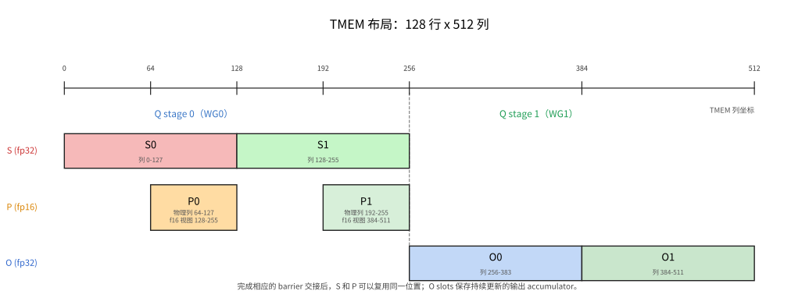
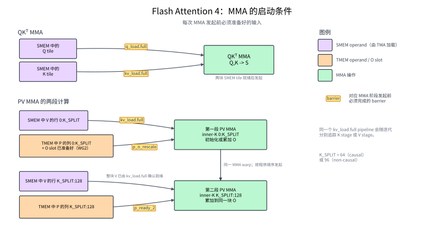
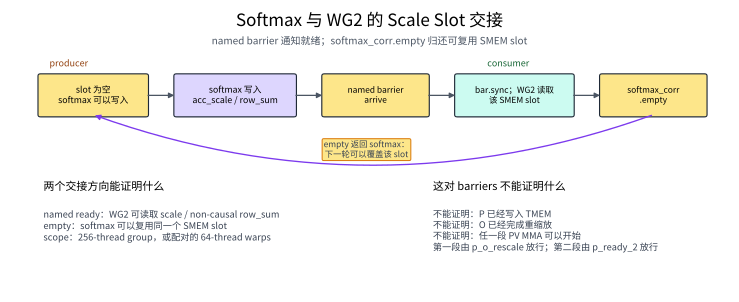
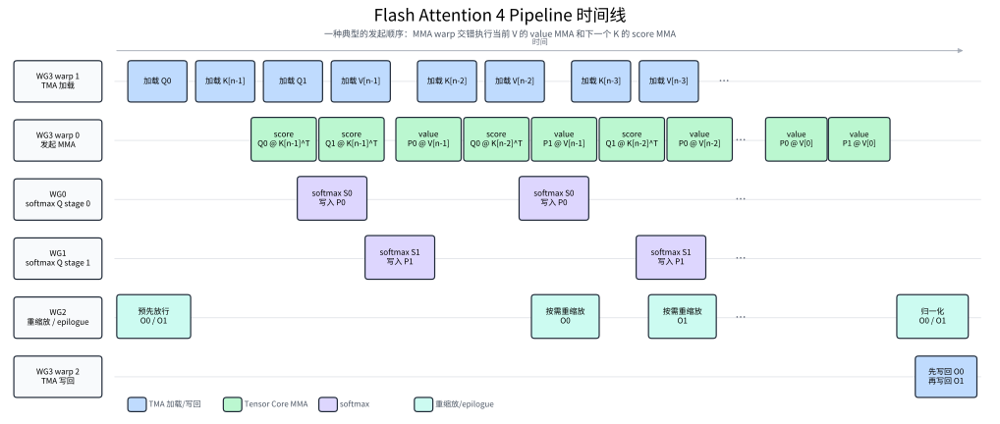

(chap_flash_attention)=
# Flash Attention 4

:::{admonition} 概览
:class: overview

- Flash Attention 按 block 读取 K、V，并逐行维护 `row_max`、`row_sum` 和 output accumulator `O`，从而避免保存完整的 attention matrix。
- 每个 K/V block 依次经过 score MMA、online softmax 和 value MMA；中间结果 `S`、`P`、`O` 共同使用 TMEM。
- Kernel 使用 warp specialization 和 barriers 连接 TMA、Tensor Core 与 CUDA cores，并支持因果掩码和 GQA。
:::

前面的 GEMM kernel 已经使用 TMA 搬运 tiles，用 `tcgen05` 执行 MMA，并将 accumulator 保存在 TMEM 中。Flash Attention 沿用这些数据路径，但计算过程不再是一条重复执行的 MMA 链：score MMA 先计算 `QK^T`，CUDA cores 随后执行 online softmax，value MMA 再用 softmax 的结果更新输出。

Flash Attention 也不会保存完整的 score matrix。Kernel 按 block 读取 K、V，并持续更新每一行的 softmax maximum、denominator 和输出。当新的 maximum 增大时，此前累加的输出仍处于旧尺度，必须先重新缩放，才能继续加入当前 block 的贡献。

本章从这条数据路径出发，依次说明 `S`、`P` 和 `O` 如何共享 TMEM，各个 warpgroups 如何分工，以及 barriers 如何在 TMA、Tensor Core、softmax 和结果写回之间交接数据。

## 算法结构

在安排 tile 的存储位置之前，先看这些 tiles 要完成的计算。对于一个 query block，Flash Attention 计算：

$$O = \text{softmax}(QK^{\top} / \sqrt{d})V$$

如果直接按照公式执行，就需要先生成完整的 score matrix `S = QKᵀ`，再计算 softmax，最后与 `V` 相乘。实际 kernel 不能采用这种方法，因为完整的 `S` 太大。例如，当 sequence length 为 4096 时，每个 head 的 `S` 大约包含 1600 万个元素；使用 fp32 时约占 64 MB，远大于 SMEM 或一块 `128×512` TMEM 区域的容量。

Flash Attention 不会完整保存 `S`。它按 block 流式读取 `K` 和 `V`，并为每一行持续更新三项状态：

- `row_max`：到目前为止见过的最大 score。
- `row_sum`：softmax denominator 的 running sum。
- `O`：running output accumulator。

每处理一个新的 block，running maximum 都可能增大。此时，先前按旧 maximum 计算的状态与新 block 处于不同尺度，因此必须先将旧状态转换到新的尺度，再加入当前 block 的贡献：

```text
S = Q_block @ K_block.T
m_new = max(row_max, rowmax(S))
scale = exp((row_max - m_new) / sqrt(d))
P = exp((S - m_new) / sqrt(d))
row_sum = row_sum * scale + rowsum(P)
O = O * scale + P @ V_block
row_max = m_new
```

这里的 `scale` 同时缩放 running denominator 和 running output，使先前 blocks 与当前 block 的贡献最终处于同一尺度。

为了便于理解，上面的伪代码使用自然指数 `exp`，并显式写出 `/sqrt(d)`。Kernel 中会将 `1/sqrt(d)` 和 `log2(e)` 合并为常量 `scale_log2 = log2(e)/sqrt(d)`，再利用恒等式 `exp(x/sqrt(d)) = exp2(x · scale_log2)`，使用硬件执行更快的 `exp2` 计算指数。

当前 block 的 `P` 只是 softmax numerator。归一化会推迟到所有 K/V blocks 处理完之后，kernel 最后写出 `O / row_sum`。

理解算法之后，还要确定每个 tile 在 kernel 执行期间位于哪里，因为这会直接决定 layout 和 barrier 的写法：

- `S` 是 score tile，由 score MMA 写入 TMEM。
- `P` 是 softmax numerator tile。Softmax 将 `S` 从 TMEM 读入 registers，计算 `P = exp((S - m_new) / sqrt(d))`，再将 `P` 写回 TMEM。
- `O` 是 output accumulator tile。Value MMA 从 TMEM 读取 `P`、从 SMEM 读取 `V`，并将结果累加到 TMEM 中的 `O`。

前面提到的 rescale 同样作用于整个 tile。`row_max` 改变时，旧的 `O` 会从 TMEM 读入 registers，完成乘法后再写回 TMEM，随后 value MMA 才能继续累加。后面的每个阶段都可以按三个问题理解：tile 位于哪里，通过哪条硬件路径移动或计算，以及哪个 barrier 能证明后续 consumer 可以开始执行。

## Tile Primitive 数据流

明确这三项状态及其存储位置后，就可以把一个 K/V block 的处理过程写成具体的 tile 数据流：

```text
Q, K, V in GMEM
  -> Q, K, V in SMEM        by TMA load
  -> S in TMEM              by score MMA: QK^T
  -> P in TMEM              by softmax numerator: TMEM -> RF -> TMEM
  -> O in TMEM              by value MMA: P V
  -> O in GMEM              by normalization, SMEM staging, and TMA store
```

与 GEMM 相比，这条路径在两次 MMA 之间多了 softmax。后面新增的 layout、TMEM 读写和 barriers，基本都用来支持这个中间阶段。

将上面的简化路径展开，可以看到各阶段之间完整的数据交接关系：

| 阶段 | Tile 移动或计算 | TIRx primitive | 硬件路径 |
|---|---|---|---|
| 加载 Q/K/V | GMEM tiles → SMEM tiles | `Tx.copy_async(..., dispatch="tma")` | TMA load |
| Score MMA | SMEM 中的 Q、K → TMEM 中的 score tile `S` | `Tx.warp.gemm_async(..., dispatch="tcgen05")` | `tcgen05.mma` |
| Softmax 读出 | TMEM 中的 `S` → warpgroup register tile | `Tx.wg.copy_async(reg, tmem)` | `tcgen05.ld` |
| Softmax 写回 | registers 中的 numerator tile `P` → fp16 TMEM view | `Tx.copy_async(tmem_as_f16, reg)` | TMEM store，随后执行 `tcgen05.wait.st()` |
| Value MMA | TMEM 中的 `P`、SMEM 中的 V → TMEM 中的 output accumulator `O` | `Tx.warp.gemm_async(..., dispatch="tcgen05")` | 使用 TMEM operand 的 `tcgen05.mma` |
| 重缩放 | TMEM 中的 `O` → registers → TMEM 中的 `O` | TMEM readback、register multiply、TMEM store | `tcgen05.ld` / TMEM store |
| Epilogue | TMEM 中的最终 `O` → registers → SMEM → GMEM | TMEM readback、`Tx.copy`、TMA store | `tcgen05.ld` + TMA store |

Softmax 和重缩放是 GEMM 中没有的两条路径。它们都增加了 TMEM → registers → TMEM 的数据移动，也让 score MMA 与 value MMA 之间多出了新的交接点。

## Warp 角色与 Scope

确定数据路径之后，下一步是决定由哪些 threads 执行每个阶段。这里的一个 CTA 包含 4 个 warpgroups，共 512 个 threads。各个角色按照工作类型划分：

- WG3 负责驱动 TMA 和 Tensor Core：发起 TMA load、MMA 和 TMA store。
- WG0、WG1 和 WG2 负责这些硬件操作之间、主要在 registers 中完成的计算：softmax、重缩放和 epilogue。

具体分工如下：

| Owner | 角色 | 工作内容 |
|---|---|---|
| WG3, warp 1 | TMA load | 将 Q、K、V tiles 从 GMEM 加载到 SMEM |
| WG3, warp 0 | MMA | 发起 score MMA 和 value MMA |
| WG3, warp 2 | TMA store | 将最终的 O tiles 从 SMEM 写回 GMEM |
| WG0 | Q stage 0 的 softmax | 从 TMEM 读取 S，计算 P，再将 P 写回 TMEM |
| WG1 | Q stage 1 的 softmax | 为第二个 Q pipeline stage 执行相同工作 |
| WG2 | 重缩放和 epilogue | 对 TMEM 中的 O 执行 rescale、normalization 和 output staging |

这里的两个 Q stages 对应 Q pipeline 中的两个 slots，与 attention head 的数量无关。WG0 和 WG1 各负责一个 slot，使两个 Q tiles 可以同时处于 pipeline 中。因此，softmax 分别出现在 WG0 和 WG1 两条执行路径中。

代码使用下面两个符号坐标区分这些角色：

```python
wg_id = T.warpgroup_id([4])
warp_id = T.warp_id_in_wg([4])
```

阅读 kernel 时，可以先找到 role branch。它决定了分支内部每个 tile primitive 由哪组 threads 执行：

- WG3 warp 1 发起 TMA load。一个 elected lane 提交 copy，TMA engine 完成数据搬运。
- WG3 warp 0 发起 `tcgen05.mma`。
- WG0 和 WG1 分别以完整 warpgroup scope 执行 softmax。
- WG2 以完整 warpgroup scope 执行 correction 和 epilogue。

这里有一个需要先记住的角色关系：score MMA 和 value MMA 都只由 WG3 warp 0 发起。WG0 和 WG1 不发起 MMA；它们只读取 score tile、执行 softmax，再把 `P` 写回 TMEM。

因此，softmax 前后都需要 barriers。`s_ready` 将 score tile 从 MMA warp 交给 softmax。等 `P` 的前 96 columns 写入 TMEM，并且 `O` slot 已完成 rescale 或确认无需 rescale 后，`p_o_rescale` 才允许第一段 value MMA 开始执行。后文会反复使用这两个 barrier 名称。

## 两个 MMA 阶段

对于每个流式读入的 K/V tile，Flash Attention 都会执行两次 MMA，中间由 softmax 连接：

```text
Q, K -> score MMA -> S
S    -> softmax   -> P
P, V -> value MMA -> O
```

这条路径包含三段连续的生产与消费关系。第一次 MMA 生成 attention scores `S`，softmax 将 `S` 转换为 numerator `P`，第二次 MMA 再使用 `P` 更新 output accumulator `O`。`row_sum` normalization 会一直推迟到 epilogue，在所有 K/V tiles 都处理完后执行。

下面的代码片段取自 [`flash_attention4.py`](https://github.com/mlc-ai/tirx-kernels/blob/main/tirx_kernels/attention/flash_attention4.py)。我们继续使用 GEMM 章节中的 **scope / layout / dispatch** 分析每个 tile operation，并增加一项 **交接**，说明哪个 barrier 将结果交给下一角色。相关的 stage、tile shape 和 barrier 名称会在首次出现时说明。

计算代码不会直接使用 TMEM 的原始 column 编号。Kernel 会将同一块 TMEM allocation 划分为按 stage 组织的视图，也就是 `S_region`、`P_region` 和 `O_region`。Q pipeline 有两个 stages，`q_stage` 和 `i_q` 的取值都是 0 或 1，用来选择当前 Q tile 对应的 `S`、`P` 和 `O` slot。这些视图会在后面的“TMEM 布局与复用”一节中通过 `T.TMEMStages` 定义。

### Score MMA

每次 K/V iteration 首先执行 score MMA：

$$S = Q_{\text{block}}K_{\text{block}}^{\top}$$

结果是一个写入 TMEM 的 `128×128` score tile。代码中的 `MMA_N=128` 表示这个 tile 在 TMEM column 方向上的宽度：

```python
Tx.warp.gemm_async(
    S_region[q_stage],
    Q_smem[q_stage, 0:BLK_M, 0:HEAD_DIM],
    K_smem[kv_stage, 0:BLK_N, 0:HEAD_DIM],
    dispatch="tcgen05",
    cta_group=CTA_GROUP,
)
if T.ptx.elect_sync():
    s_ready.arrive(q_stage)
```

> **Tile primitive：Score MMA**
> - Scope：由 WG3 warp 0 发起；一个 elected lane 向 `s_ready` 报告 arrival。
> - Layout：SMEM 中的 Q、K → TMEM 中的 `S`（`S_region[q_stage]`）。
> - Dispatch：`tcgen05`。
> - 交接：`s_ready`（→ softmax）。

这里的交接只需要 elected thread 对 `s_ready` 执行一次 arrival。它表示 score tile 已经计算完成，softmax warpgroup 可以开始读取。

### 两次 MMA 之间的 Softmax

Softmax 位于两次 MMA 之间，负责将 score tile `S` 转换为 numerator tile `P`：

> **Tile primitive：Softmax**
> - Scope：WG0（Q stage 0）或 WG1（Q stage 1），完整 warpgroup。
> - Layout：TMEM 中的 `S` → registers → fp16 TMEM 中的 `P`（`P_region[wg_id]`）。
> - Dispatch：使用 `tcgen05.ld` 读取，使用 TMEM store 写回；中间的按行计算在 registers 中完成。
> - 交接：等待 `s_ready`；写完前 96 columns 后通知 `p_o_rescale`，写完最后 32 columns 后通知 `p_ready_2`。

这个阶段在 GEMM 中没有对应部分。WG0/WG1 先等待 `s_ready`，再以 32 columns 为一块将 score tile 从 TMEM 读入 registers。代码中的 `chunk_start` 和 `chunk_end` 表示当前 chunk 的范围：

```python
Tx.copy_async(
    s_chunk[:, chunk_start : chunk_end],
    S_region[wg_id, chunk_start : chunk_end],
)
```

这是一次由整个 warpgroup 协作完成的 TMEM-to-register tile read。Scores 进入 registers 后，softmax warpgroup 依次完成三项工作：

1. 计算 row maximum 和 row sum。
2. 计算 softmax numerator tile `P`。
3. 将 `P` 以 fp16 写回 TMEM。

最后一步写成：

```python
Tx.copy_async(
    P_region[wg_id, p_start : p_end],
    p_chunk[:, p_start : p_end],
)
```

为什么刚在 registers 中算出 `P`，又要把它写回 TMEM？这里的 value MMA 使用 `tcgen05.mma`，它要求从 TMEM 读取 `P` operand，不能直接读取 softmax threads 持有的这些 registers。`P_region` 是 fp16 TMEM alias `tmem_as_f16` 上的一个 view，写回后，`P` 才具有下一次 MMA 所需的布局。

### Value MMA

每个 K/V iteration 最后执行 value MMA：

$$O = O + P_{\text{block}}V_{\text{block}}$$

执行到这里时，`O` 已经处于当前 K/V block 对应的正确状态：第一个 block 会初始化它，后续 blocks 则会在必要时先完成 rescale。Value MMA 只需继续累加。它与 GEMM 的主要区别在于 operands 的位置：A operand `P` 位于 TMEM，B operand `V` 位于 SMEM，accumulator `O` 同样位于 TMEM：

```python
# First sub-MMA: columns 0:K_SPLIT (the first 96 of P / rows of V).
Tx.warp.gemm_async(
    O_region[i_q],
    P_region[i_q, 0:K_SPLIT],
    V_smem[kv_stage, 0:K_SPLIT, 0:HEAD_DIM],
    transB=True,
    accum=should_accumulate,
    dispatch="tcgen05",
    cta_group=CTA_GROUP,
)
# The second sub-MMA (same form, accum=True, gated on p_ready_2) covers the
# remaining columns K_SPLIT:BLK_N.
```

> **Tile primitive：Value MMA**
> - Scope：WG3 warp 0。
> - Layout：TMEM 中的 `P` + SMEM 中的 V → TMEM 中的 `O`（`O_region[i_q]`）。
> - Dispatch：使用 TMEM operand 的 `tcgen05`。
> - 交接：等待 `p_o_rescale`、`p_ready_2` 和 `kv_load.full`；完成后通知 `o_ready`（→ epilogue）。

因此，两次 MMA 的 operand placement 不同：

- Score MMA 从 SMEM 读取 Q 和 K。
- Value MMA 从 TMEM 读取 `P`。
- Value MMA 从 SMEM 读取 V。
- 结果累加到 TMEM 中的 `O`。

`accum=should_accumulate` 对应算法中的“初始化或累加”：处理一个 query block 的第一个 K/V tile 时为 false，之后每个 tile 都为 true。

Value MMA 的 inner-K step 为 `MMA_K=16`。Kernel 将前六个 steps 合并为第一段，因此 `K_SPLIT=6*MMA_K=96`；剩余的 32 columns 由第二段处理：

1. Softmax 将 `P` 分成四个 32-column chunks 写入 TMEM。
2. 前三个 chunks 准备好后，value MMA 立即处理 `P` 的前 96 columns 和 V 中对应的 rows。
3. 最后 32 columns 通过 `p_ready_2` 单独等待。
4. 第二段 MMA 处理最后一个 chunk，完成当前 tile。

这样拆分可以减少 Tensor Core 的等待时间。如果只执行一次完整 value MMA，就必须等四个 `P` chunks 全部完成指数计算并写入 TMEM。现在，前 96 columns 准备好后就能启动第一段 MMA，并与最后 32 columns 的 `exp` 和 TMEM write 重叠。

## TMEM 布局与复用

`S`、`P` 和 `O` 需要共同使用一块 `128×512` TMEM allocation。它们的放置方式也解释了为什么本章中的 layout 与 barrier 无法分开讨论。

下图展示了这些区域：score slots、numerator slots 和 output slots 位于同一块 TMEM 中，只有正确的 barrier 协议才能保证这些位置可以安全复用。



先看图中的 fp32 view。`S0` 和 `S1` 分别占用 columns `0–127` 和 `128–255`，保存两个 Q stages 的 score tiles；`O0` 和 `O1` 分别占用 columns `256–383` 和 `384–511`，保存对应的 output accumulators。四个 regions 正好用完 512 个 fp32 columns。

TMEM 中已经没有独立区域保存 `P`。Kernel 因此在同一块物理存储上建立 fp16 view：`P0` 使用 fp16 columns `128–255`，对应 fp32 view 中 `S0` 的后 64 columns；`P1` 使用 fp16 columns `384–511`，对应 `S1` 的后 64 columns。一个 `P` tile 有 128 个 fp16 columns，物理宽度恰好等于 64 个 fp32 columns。

也就是说，`P` 会覆盖已经消费完的部分 `S`。Softmax 只有在 score tile 可以读取后才会生成 `P`，value MMA 也必须在相应的 `P` 写完后才能读取。后面的 barrier 协议正是用来保证这段物理空间不会被过早覆盖或读取。

Kernel 使用 `T.TMEMPool` 建立两个别名视图。它先为 score 和 output accumulators 分配一个 fp32 view `tmem`，随后将 pool base 移回 0，在相同的物理 bytes 上再分配一个 fp16 view `tmem_as_f16`：

```python
tmem_pool = T.TMEMPool(pool, total_cols=N_COLS_TMEM, cta_group=CTA_GROUP, tmem_addr=tmem_addr)
tmem = tmem_pool.alloc((128, N_COLS_TMEM), "float32")
tmem_pool.move_base_to(0)
tmem_as_f16 = tmem_pool.alloc((128, N_COLS_TMEM * 2), "float16")
tmem_pool.commit()
```

Fp16 元素的宽度只有 fp32 的一半，因此在同一组物理 bytes 上，fp16 view 能够提供两倍的可索引 columns。`P` 就存放在这些 fp16 columns 中。建立两个视图后，kernel 再使用 `T.TMEMStages` 将 `S`、`P` 和 `O` 划分为按 stage 索引的 regions：

```python
S_region = T.TMEMStages(tmem,        col_start=0,                       width=MMA_N, stages=SMEM_PIPE_DEPTH_Q, stride=MMA_N)
O_region = T.TMEMStages(tmem,        col_start=MMA_N * SMEM_PIPE_DEPTH_Q, width=MMA_N, stages=SMEM_PIPE_DEPTH_Q, stride=MMA_N)
P_region = T.TMEMStages(tmem_as_f16, col_start=MMA_N,                   width=BLK_N, stages=SMEM_PIPE_DEPTH_Q, stride=MMA_N * 2)
```

`P_region` 的 stride 中出现 `* 2`，是因为三个 regions 使用了两种 column 单位。`S_region` 和 `O_region` 按 fp32 `tmem` columns 计数，`P_region` 则按宽度只有一半的 fp16 `tmem_as_f16` columns 计数。要在 stage 之间移动相同的物理距离，fp16 view 的 stride 必须加倍。

Regions 定义完成后，计算代码只需要使用 `S_region[q_stage]`、`S_region[wg_id, ...]`、`P_region[wg_id, ...]` 和 `O_region[i_q]`，不再直接处理原始的 TMEM column 编号。

## 各个角色如何交接数据

FA4 中的 barriers 数量较多，但用途只有两类：将准备好的数据交给下一个角色，或者确认某块存储空间可以复用。先看主计算路径上的几次交接：

| 交接 | 含义 |
|---|---|
| TMA load → score/value MMA | Q、K 或 V 已经进入 SMEM，可以作为 MMA operand |
| Score MMA → softmax | `S` 已经写入 TMEM |
| Softmax/correction → value MMA | `P` 已经写入 TMEM，并且 `O` 可以安全累加 |
| Value MMA → epilogue | 最终的 `O` 已经写入 TMEM |
| Epilogue → TMA store | `O_smem` 已经准备好，可以写回 GMEM |

表中没有列出的 barriers 主要负责归还 SMEM、TMEM 或 staging buffer。阅读任何一个 barrier 时，都可以先找出 producer、consumer，以及它保护的数据或存储空间。

### 两次 MMA 分别等待什么

下图分别列出了 score MMA 和 value MMA 的开始条件，也就是它们在发起前必须等待哪些数据：



上半部分是 score MMA。它等待 `q_load.full` 和 `kv_load.full`，确认 Q、K 已经进入 SMEM，随后生成 `S`。

下半部分是 value MMA。它既要等待 SMEM 中的 V，也要等待 softmax 写入 TMEM 的 `P`，还要确认旧的 `O` 已经由 WG2 释放或完成重缩放。`P` 的前 96 columns 写完后，第一段 value MMA 可以开始；最后 32 columns 写完后，`p_ready_2` 再放行第二段 MMA。

`p_o_rescale` 同时汇合了两个条件：softmax 已经写完 `P` 的前 96 columns，WG2 也已经处理好 `O`。第一个 K/V block 还没有旧的 `O`，WG2 可以直接报告 arrival；后续 blocks 则要等重缩放完成或确认无需重缩放。

### Softmax 如何把缩放因子交给 WG2

Softmax 还要把逐行数据交给 WG2：K/V loop 中传递 `acc_scale`，epilogue 前传递最终的 `row_sum`。这些值写入 SMEM 中的一个 mailbox slot。由于同一个 slot 会在每轮复用，需要一对 `full`/`empty` barriers 保护：



`softmax_corr.full` 和 `softmax_corr.empty` 构成一组 producer-consumer 协议：

1. Softmax 先等待 `softmax_corr.empty`，确认 scale/sum slot 可以复用。
2. Softmax 将 `acc_scale` 或最终 `row_sum` 写入该 slot。
3. Softmax 向 `softmax_corr.full` 报告 arrival。
4. WG2 等待 `softmax_corr.full`，再读取该 slot。
5. WG2 向 `softmax_corr.empty` 报告 arrival。
6. Softmax warpgroup 可以在下一 phase 中复用该 slot。

这里要区分 `softmax_corr.empty` 与 `p_o_rescale`。前者只表示 WG2 已经读完 mailbox，softmax 可以覆盖这个 SMEM slot；后者才表示 `P` 和 `O` 都满足第一段 value MMA 的要求。

### 完整的 Barrier 对照表

理解上面两条交接路径后，可以用下表查阅其余 barriers：

| Barrier | Producer → consumer | 哪些数据或资源可以安全使用 |
|---|---|---|
| `q_load.full` | TMA load → score MMA | Q SMEM tile 可以作为 MMA operand |
| `q_load.empty` | 当前 Q stage 的所有 score MMAs → TMA load | Q SMEM stage 可以供下一个 task 复用 |
| `kv_load.full` | TMA load → score/value MMA | K 或 V SMEM tile 可以作为 MMA operand |
| `kv_load.empty` | Score/value MMA → TMA load | K/V SMEM stage 可以复用 |
| `s_ready` | Score MMA → softmax | S TMEM tile 可以读取 |
| `p_o_rescale` | Softmax + WG2 → value MMA | P 的前 96 columns 已在 TMEM 中，O slot 可以供 value MMA 累加 |
| `p_ready_2` | Softmax → value MMA | P 的最后 32 columns 已在 TMEM 中 |
| `o_ready` | Value MMA → epilogue | 最终 O accumulator 已经准备好 |
| `softmax_corr.full` | Softmax → WG2 | SMEM mailbox 中的 `acc_scale` 或最终 `row_sum` 已经准备好 |
| `softmax_corr.empty` | WG2 → softmax | WG2 已读完，同一个 SMEM mailbox slot 可以复用 |
| `corr_epi.full` | Epilogue → TMA store | `O_smem` 已经准备好，可以写回 |
| `corr_epi.empty` | TMA store → epilogue | `O_smem` stage 可以复用 |

Barrier 类型取决于 producer 如何报告完成：

- TMA load 使用 `TMABar`。发起操作的 thread 登记需要等待的字节数，TMA engine 在传输完成后扣减 tx-count。
- MMA completion 使用 `TCGen05Bar`，`tcgen05.commit` 会在 MMA 完成后报告通知。
- 纯 thread-to-thread 交接使用 `MBarrier`，参与交接的 threads 显式执行 arrival。

FA4 比 GEMM 多出的 barriers 大多围绕 softmax：score MMA 与 value MMA 之间增加了 register 计算、TMEM rewrite 和 output rescale，每一步都需要明确证明下一角色何时可以读取数据或复用存储空间。

## Pipeline 结构

前一节的 barrier graph 说明了每个角色开始前需要等待什么，但没有展示哪些角色会在同一时间工作。Barrier 可能早在 consumer 到达前就已经满足，也可能让 consumer 等待很久，因此依赖关系与执行时间线需要分开观察。

FA4 没有一个统一的 pipeline depth，因为不同 tile streams 的推进速度并不相同。Kernel 分别为它们维护循环使用的 stages：

- Q pipeline depth 为 2：一个 CTA 同时处理两个 Q stages，WG0 和 WG1 各负责一个。
- KV pipeline depth 为 3：K、V blocks 在 inner loop 中流式推进，而两个 Q stages 会被反复使用。
- TMEM pipeline depth 为 2：每个 Q stage 都有对应的 S/P/O TMEM slots；相应 barriers 完成后，这些 slots 才能复用。

下图使用时间线表示这几组 pipeline 同时运行后，各个角色可以在大致相同的时间执行哪些工作：



这张图应当按时间线阅读，用来观察哪些角色可以同时工作。前面的 barrier-flow 图则用于检查各阶段之间准确的 wait 和 arrival。两张图分别回答“哪些条件必须满足”和“哪些工作可以重叠”这两个问题。

图中的每一行对应一个 role branch：

- WG3 warp 1 发起 TMA loads。
- WG3 warp 0 发起 score MMA 和 value MMA。
- WG0 和 WG1 为两个 Q stages 执行 softmax。
- WG2 释放或 rescale `O`，最后再执行 normalization。
- WG3 warp 2 发起 TMA store。

从左到右可以追踪一轮典型的 pipeline。Load warp 先后准备 `Q0`、`K[n-1]`、`Q1`、`V[n-1]`，随后继续流式加载编号更小的 K/V blocks。MMA warp 先执行 score MMA 生成 `S0` 和 `S1`，WG0/WG1 再将它们转换为 `P0` 和 `P1`。

MMA warp 不会先执行完所有 score MMAs，再执行所有 value MMAs。两个 Q stages 预填充完成后，两类 MMA 会交错执行：先使用当前 V block 执行 value MMA，再使用下一个 K block 执行 score MMA：

```text
score Q0*K[n-1]
score Q1*K[n-1]
value P0*V[n-1]
score Q0*K[n-2]
value P1*V[n-1]
score Q1*K[n-2]
value P0*V[n-2]
...
```

两类 MMA 的交错使图中的 score、softmax、correction 和 value 可以互相重叠，避免各阶段依次串行执行。

WG2 一行标注为 `release / rescale`，对应前面介绍的两种情况。第一个 K/V block 没有旧的 `O`，WG2 只参与允许 value MMA 开始的交接；后续 blocks 则可能需要先 rescale 旧的 `O`。Normalization 和 TMA store 只在当前 attention task 的最后一个 K/V block 完成后执行一次。

FA4 中的 Q、K/V 和 TMEM slots 按不同节奏推进，不能只用一个统一的 stage index 表示所有进度。TIRx 分别使用 tile buffers、`PipelineState` cursors 和 barrier phases 记录它们，kernel 也就能够单独检查每条数据路径的同步关系。

## 重缩放与结果写回

Rescale 是 online softmax 正确性的一部分，不能省略。每处理一个新的 score tile，per-row maximum 都可能增大；此前 blocks 累加得到的 `O` 使用的是旧 maximum，因此必须乘以下面的因子，转换到新尺度：

$$O_{\text{old}} \leftarrow O_{\text{old}} \cdot e^{(m_{\text{old}} - m_{\text{new}}) / \sqrt{d}}$$

如果跳过这一步，先前 blocks 的贡献会相对放大 `exp((m_new - m_old) / sqrt(d))` 倍，最终输出也会错误。

Softmax 和 WG2 共同完成 rescale。Softmax 计算每一行的 scale，并将其写入 SMEM mailbox；WG2 等待 `softmax_corr.full`，从 TMEM 读出当前 `O`，乘以该 scale，再将结果写回 TMEM：

```python
RESCALE_TILE = T.meta_var(16)
o_row = T.wg_reg_tile(RESCALE_TILE)
Tx.copy_async(o_row, O_region[i_q, d_start : d_start + RESCALE_TILE])
Tx.mul(o_row, o_row, acc_scale)
Tx.copy_async(O_region[i_q, d_start : d_start + RESCALE_TILE], o_row)
T.ptx.tcgen05.wait.st()
```

Kernel 不会在 maximum 只有很小变化时总是重写整个 `O` tile。Softmax 使用 `rescale_threshold` 判断是否值得更新尺度：若变化低于阈值，就保留原来的 maximum，并将 `acc_scale` 设为 `1.0`。`should_rescale` 记录每一行是否需要更新，WG2 再通过 `any_sync` 检查整个 warpgroup；只有至少一行需要重缩放时，才执行这次 TMEM → registers → TMEM 操作。

这一步会对完整的 `O` accumulator 执行一次 TMEM → registers → TMEM tile operation：

> **Tile primitive：重缩放（rescale）**
> - Scope：WG2，完整 warpgroup。
> - Layout：TMEM 中的 `O` → registers → TMEM 中的 `O`（`O_region[i_q]`）。
> - Dispatch：使用 `tcgen05.ld` 读取，使用 TMEM store 写回；中间在 registers 中完成乘法。
> - 交接：等待 `softmax_corr.full`；完成后通知 `p_o_rescale`（→ value MMA）和 `softmax_corr.empty`（→ softmax）。

需要重缩放时，完整的交接过程如下：

1. Softmax 将 scale 写入 SMEM。
2. WG2 等待 `softmax_corr.full`。
3. WG2 rescale TMEM 中的 `O`。
4. WG2 向 `p_o_rescale` 报告 arrival。
5. WG3 的 value MMA 读取 `P`，并将结果累加到已经完成 rescale 的 `O`。

WG2 读完 mailbox 后会通知 `softmax_corr.empty`，释放该 SMEM slot，使 softmax 可以在下一 iteration 中复用它。

K/V loop 结束后，WG2 开始执行 epilogue。它等待最终的 `row_sum` 和 `o_ready`，从 TMEM 读出最终 `O`，乘以 `1 / row_sum` 完成前面推迟的 normalization，再转换为 fp16 并写入 `O_smem`。最后，WG3 的 TMA store warp 将 `O_smem` 写回 GMEM。

如果要将这个 kernel 扩展到训练，还需要注意一个限制：当前实现只写出 forward output，没有保存 backward 所需的 log-sum-exp（LSE）。Kernel 中的 `row_max` 保存未经 scale 的原始 `QK^T` maximum，而 `row_sum` 累加的是 `exp((S - row_max) / sqrt(d))`。因此，计算自然对数形式的 LSE 时，需要重新对 `row_max` 应用 `1/√d`：

$$\mathrm{LSE}_i = \log(\mathrm{row\_sum}_i) + \mathrm{row\_max}_i / \sqrt{d}$$

当前实现不会写出 LSE。

## 因果掩码

Causal attention 要求每个 query 只能访问当前位置及之前的 keys。Kernel 通过两种方式处理这一约束：跳过完全无效的 blocks，并在跨越对角线的 blocks 内精确屏蔽无效 columns。

对于完全位于 causal diagonal 上方的 K/V blocks，所有元素都无效。`get_n_block_max(...)` 会计算当前 Q block 最后可能用到的 K/V block，loop 不再加载或计算其后的 blocks。

跨越对角线的 blocks 同时包含有效和无效 columns，仍然需要执行 score MMA。Softmax 会在指数运算前屏蔽无效 columns：它根据当前 query row 的位置和 block offset 计算 column limit，保留不超过该位置的 columns，并在 registers 中将其余 columns 设为 `-inf`。这些位置不会参与 row maximum，也不会对 `exp2` numerator 产生贡献。

实现使用 `mask_r2p(...)` 将 column limit 转换为覆盖整个 32-column score chunk 的 bit mask，从而避免逐元素分支。完全位于对角线下方的 blocks 中，所有 columns 都有效，不需要 mask。

从 tile primitive 的角度看，causal mode 没有改变数据路径。它只会缩短 K/V loop，并在 score MMA 与 `P` writeback 之间、register-resident softmax 内部增加一步 masking。

## GQA 支持

Grouped Query Attention（GQA）允许多个 query heads 共享一个 K/V head，从而减少 K、V 的存储和内存流量。Kernel 会让一组 query heads 同时使用 scheduler 指定的同一个 `kv_head_idx`：

```python
GQA_RATIO = num_qo_heads // num_kv_heads
SEQ_Q_PER_TILE = BLK_M // GQA_RATIO
```

关键是重新解释 128 个 Q-tile rows。当 `GQA_RATIO=4` 时，这些 rows 编码 32 个 sequence positions 与 4 个 query heads 的组合：

```text
seq_pos = row // GQA_RATIO
q_head  = row % GQA_RATIO
```

Q load 使用一个 3D view 表示这种 packing。源数据采用自然的 `Q[batch, seq, qo_head, dim]` layout，目标则是 score MMA 随后按 `128×HEAD_DIM` 二维 operand 读取的同一块 SMEM tile。View 只改变索引方式，不需要额外复制数据：

```python
Q_smem_3d = Q_smem.view(SMEM_PIPE_DEPTH_Q, SEQ_Q_PER_TILE, GQA_RATIO, HEAD_DIM)
Tx.copy_async(
    Q_smem_3d[i_q, :, :, :],
    Q[batch_idx,
      m_start : m_start + SEQ_Q_PER_TILE,
      kv_head_idx * GQA_RATIO : (kv_head_idx + 1) * GQA_RATIO,
      :],
    **tma_copy_q,
)
```

K 和 V 不会为每个 query head 各保存一份。同一个 `kv_head_idx` 对应的 K/V tile，会由打包在 Q rows 中的 `GQA_RATIO` 个 query heads 共同使用。Output path 使用匹配的 3D view，在 epilogue 后将这些 rows 写回 `O[batch, seq, qo_head, dim]`。

因此，GQA 的 shape conversion 只出现在 Q-load 和 O-store 两端。Kernel 内部的 score MMA 仍然读取一个普通的 `128×HEAD_DIM` Q tile，其余 tile-primitive graph 不需要改变。

## Tile 调度

Scheduler 将每个 CTA 映射到一个 `(batch, kv_head, m_block)` attention task。因果掩码会改变不同 tasks 的计算量，因此 causal 与 non-causal mode 使用不同的策略：

- Non-causal mode 使用 `FlashAttentionLinearScheduler`。每个 task 的工作量相同，固定数量的 CTAs 每次前进 `num_ctas` 个 tasks，就能均匀覆盖整个任务空间。
- Causal mode 使用 `FlashAttentionLPTScheduler`。因果掩码会让各 tasks 的工作量差异很大：靠前的 Q block 可能只访问一个 K/V block，靠后的 Q block 则需要访问全部 K/V blocks。Longest-processing-time scheduler 会优先分配较重的 blocks，尽量缩小不同 CTAs 的结束时间差，同时将邻近的 batch/head tasks 放在一起，以改善 L2 locality。

两种 schedulers 使用相同的 loop interface：

```python
while scheduler.valid():
    m_block_idx = scheduler.m_block_idx
    batch_idx = scheduler.batch_idx
    kv_head_idx = scheduler.head_idx
    # process one Q block against its K/V block range
    scheduler.next_tile()
```

区别只在 `next_tile()` 的行为。Non-causal mode 会让当前 CTA 继续处理另一个 task；causal mode 在当前 task 后结束 loop。这只是任务分配方式的差异，决定 CTA 处理哪个 attention tile，不会改变 tile 内部的计算。进入 loop 后，两种模式都会执行相同的 TMA load、score MMA、softmax、value MMA、重缩放和 TMA store。

## 编译与验证

前面使用的都是完整 kernel 中的代码片段。要运行 FA4，可以从 `tirx-kernels` 导入 [`flash_attention4.py`](https://github.com/mlc-ai/tirx-kernels/blob/main/tirx_kernels/attention/flash_attention4.py)，编译后与 PyTorch reference 比较。与 GEMM 的验证代码相比，这里使用 `get_flash_attention4_kernel` 创建 kernel，并额外传入内置 profiler 使用的 `profiler_buf`：

```python
import torch
import torch.nn.functional as F
import tvm
from tirx_kernels.attention.flash_attention4 import (
    get_flash_attention4_kernel, PROFILER_BUFFER_SIZE)

B, S, Hq, Hkv, D = 1, 1024, 32, 8, 128   # GQA: 32 query heads share 8 KV heads
Q = torch.randn(B, S, Hq, D, dtype=torch.float16, device="cuda")
K = torch.randn(B, S, Hkv, D, dtype=torch.float16, device="cuda")
V = torch.randn(B, S, Hkv, D, dtype=torch.float16, device="cuda")
O = torch.empty(B, S, Hq, D, dtype=torch.float16, device="cuda")
prof = torch.zeros(PROFILER_BUFFER_SIZE, dtype=torch.uint64, device="cuda")

kernel = get_flash_attention4_kernel(B, S, S, Hq, Hkv, D, is_causal=False)
target = tvm.target.Target("cuda")
with target:
    ex = tvm.compile(tvm.IRModule({"main": kernel}), target=target, tir_pipeline="tirx")
ex.mod(Q, K, V, O, prof)   # ex.mod takes torch tensors directly, like every other chapter
torch.cuda.synchronize()

# torch reference; enable_gqa lets the 32 query heads share the 8 KV heads
qt, kt, vt = (x.transpose(1, 2).float() for x in (Q, K, V))
ref = F.scaled_dot_product_attention(qt, kt, vt, enable_gqa=True).transpose(1, 2).half()
torch.testing.assert_close(O, ref, rtol=1e-2, atol=1e-2)
print(f"FA4: B={B} S={S} Hq={Hq} Hkv={Hkv} D={D}, non-causal -> PASS")
```

预期输出为 `... -> PASS`。Kernel 使用 fp32 累加 online softmax，但它与高精度 reference 之间仍然存在几项数值差异。输入和 operands 使用 fp16 存储与舍入；softmax 使用 `exp2` 以及 `scale_log2 = log2(e)/√d` 的改写；online softmax 按 block 更新并逐行 rescale，求和顺序也与一次性计算不同；最终 `O` 在写回前还会转换为 fp16。

这里的 `rtol`/`atol` 与原 kernel 自带测试相同，用于覆盖这些误差的共同影响。如果结果明显超出容差，应优先检查 softmax path，例如是否遗漏了 `s_ready`、`p_o_rescale` 或 `p_ready_2` 的 wait，以及 `row_max` / `row_sum` 的更新是否正确传递到 rescale。

## 与 GEMM 的区别

下表总结了 FA4 相对于 GEMM 新增的结构：

| 对比项 | GEMM | Flash Attention 4 |
|---|---|---|
| MMA 阶段 | 重复执行同一种 MMA | Score MMA 和 value MMA |
| 两次 MMA 之间的工作 | 除 pipeline 交接外没有额外计算 | Online softmax、masking 和 O rescaling |
| 持续更新的状态 | 只有 accumulator | Row maximum、row sum 和 O accumulator |
| 主要中间结果 | Accumulator TMEM tile | S、P 和 O 三类 TMEM regions |
| Warp 角色 | TMA producer、MMA consumer、writeback | TMA load、MMA、softmax、correction、TMA store |
| Barriers | 主要连接 load、compute 和 writeback | 还要连接 score、softmax、value 和 correction |
| 调度单位 | Output matrix tile | Attention task：`(batch, kv_head, m_block)` |

这些差异都来自同一个结构变化：FA4 包含两次 MMA，中间还有 softmax。底层的 TIRx 约定没有改变：

- Tile primitive 说明移动或计算哪个 tile。
- 外层 scope 说明哪些 threads 共同执行。
- Layout 说明 tile 位于哪里。
- Barrier 说明下一角色何时可以使用它。

因此，FA4 的难点不在于换了一套硬件，而在于 kernel 中存在更多 tile values，也需要完成更多次数据交接。

## 练习

1. 沿着 `Q/K/V → S → P → O` 的路径，分别列出每次交接的 producer、consumer、源 tile、目标 tile 和硬件路径。哪些步骤在 GEMM 中不存在？
2. 为什么 softmax 要将 numerator tile `P` 写回 TMEM，而不是只保存在 registers 中供 value MMA 使用？
3. `S0`、`S1`、`P0`、`P1`、`O0` 和 `O1` 分别占用哪些物理 TMEM columns？为什么 `P_region` 的 stage stride 是 `MMA_N * 2`？
4. 追踪一个 K/V block 依次经过 `s_ready`、`p_o_rescale`、`p_ready_2` 和 `o_ready`。对于每个 barrier，说明谁等待、谁报告 arrival，以及随后哪块数据可以读取。
5. 选择 epilogue 中的 `Tx.copy_async`、fp32 → fp16 的 `Tx.cast`，或第二段 value MMA，写出它的 scope、layout、dispatch 和交接方式，并回到 kernel 中检查对应的 guard、allocation 和 wait。
