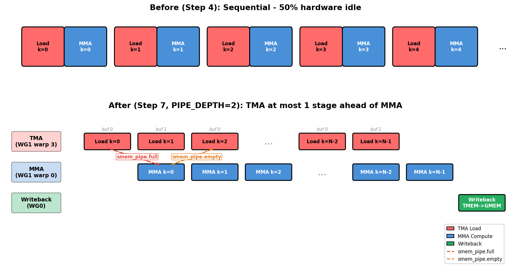

(chap_gemm_advanced)=
# 用 Warp Specialization 和 Cluster 扩展 GEMM

:::{admonition} 概览
:class: overview

- Pipelined GEMM 仍然让一个 warpgroup 按顺序执行 load、MMA 和 writeback，本章要移除的瓶颈正是这一点。
- Step 7 把 warp specialization 成不同角色，Step 8 加入 2-CTA cluster，Step 9 加入多个 consumer。
- 每一步都移除一个串行瓶颈，最终达到接近 state-of-the-art 的吞吐。
:::

上一章（{ref}`chap_gemm_async`）中的 pipelined GEMM 已经很快，但它仍然要求一个 warpgroup 做所有事：发起 load、运行 MMA、再把结果写回。即使有 software pipeline，这一组线程仍然是三个硬件引擎汇合的地方。

症状很容易看出来。Tensor Core 运行时 TMA unit 变安静，结果写回 memory 时 Tensor Core 变安静，每个引擎都通过同一组线程等待其他引擎。突破这个问题的方式，是不再让一组线程做所有事。

我们通过三个逐步扩大协作范围的 step 来贯彻这个想法。Step 7（{ref}`chap_warp_specialization`）把 warp specialization 成 producer、consumer 和 writeback 角色。Step 8（{ref}`chap_cta_cluster`）把两个 CTA 组成一个 cluster，并让它们跨 shared memory 共享 operand。Step 9（{ref}`chap_multi_consumer`）加入第二个 MMA consumer，让一个 staged tile 喂给两份数学计算。

把这三个 step 看作同一个 pattern 在不同尺度上的应用会很有帮助。Step 7 把完整 pipeline 保持在一个 CTA 内部：TMA 和 MMA 共享一个 warpgroup，而 writeback 在另一个 warpgroup 中运行。Step 8 把协作扩大到 CTA 之间，产生跨越两个 CTA 的 256×256 tile。Step 9 进一步提高 compute density：cluster output 增长到 512×256，每个 staged B tile 被两个 consumer 复用，我们到达本教程中最密集的变体。

贯穿这些变化的有一件事保持不变。SMEM、TMEM 和 register layout 仍然遵守前两章建立的 contract；变化的是*谁协作*，而不是数据如何布局。Step 8 是合作 scope 第一次越过单个 CTA，因此 operand tile 会切分到两个 CTA 的 shared memory 中，并且一个布局会沿 `cbx` cluster 轴跨越两个 CTA。


(chap_warp_specialization)=
## Step 7：Warp Specialization + Pipeline

Single-warpgroup kernel 留下性能的原因很简单：每个线程都走同一条路径，先 load，再 compute，再 write。所以在它 load 时 Tensor Core 没事做，在它 compute 时 TMA engine 没事做。修复方式是 *warp specialization*。我们不再要求一组线程依次做每项工作，而是把每项工作交给专门的 warp，并让这些 warp 同时运行，中间由 software pipeline 串接。这是 GEMM 路径中最大的架构变化，本章剩余部分都建立在它之上。本节 benchmark 使用 M=N=K=4096。

> **本 step 改变的内容：Scope**
> - Scope：一个 warpgroup 顺序执行 load -> MMA -> writeback，变成三个并发角色（TMA producer、MMA consumer、writeback），并由 full/empty barrier 连接。
> - Layout：不变，仍然是 Step 6 中的 SMEM stage 和 TMEM accumulator。
> - Dispatch：不变，TMA load 和 `tcgen05` MMA。

**主题。**

- Warp specialization：把不同 warp/warpgroup 专门分配给不同任务

- 高层 barrier abstraction：`TMABar`、`TCGen05Bar`、`MBarrier`

- 用 `PipelineState` 自动管理 stage/phase

- 用于 per-warpgroup synchronization 的 `warpgroup_sync` barrier ID

（多 stage SMEM pipeline 和 persistent `ClusterPersistentScheduler2D` 会从 Steps 5-6 原样复用；这里只新增 scope split。）

### 从顺序到并发

在介绍角色和 barrier 之前，先隔离 warp specialization 要移除的 scheduling bottleneck 会更清楚。下图用 Step-4-style sequential timeline 紧凑表示 Steps 4-6 中 specialization 前的 kernel，然后把它放在 Step 7 warp-specialized schedule 上方，让 engine utilization 的差异一眼可见。



上方是 specialization 前的 single-warpgroup pattern：同一组未 specialization 的线程同时拥有 load path 和 MMA path，所以一个 engine 在另一个 active 时很容易 idle。Steps 5 和 6 通过 double buffering 和 persistent scheduling 改善这个 baseline，但它们还没有把 loading 和 compute 拆成独立 producer/consumer 角色。下方的 specialization 打破了这种轮流执行。TMA producer 在 MMA consumer 忙于计算时 prefetch 下一个 tile，writeback 独立前进。Producer warp 3 在 consumer warp 0 仍在处理当前 MMA 时发起下一次 load，因此两个 engine 都不必等待对方。Load/MMA 交接使用两个 barrier：

- **`tma2mma`**（TMA -> MMA）：表示已加载的 SMEM 数据已经准备好给 MMA 消费。
- **`mma2tma`**（MMA -> TMA）：表示 MMA 已经读完一个 buffer，TMA 可以把它复用于下一次 load。

图中有一个细节第一眼看起来像错误：`mma2tma` 箭头会跳过一个 stage。原因是 ring buffer。`PIPE_DEPTH=2` 时有两个 SMEM buffer，stage 0 和 stage 1；TMA Load k=0 填充 buffer 0，TMA Load k=1 填充 buffer 1。当 MMA Compute k=0 读完 buffer 0 后，它 signal `mma2tma` 表示这个 buffer 空闲，但真正想要拿回 buffer 0 的 load 是 TMA Load k=2，而不是 k=1（它正在使用 buffer 1）。因此从 MMA Compute k=0 发出的 `mma2tma` 箭头会一直指向 TMA Load k=2。Release 跳过一个 stage，只是因为这个 ring 有两个 slot。

### Warp 角色

Timeline 展示了*为什么*要拆分 work；下一个问题是*谁*做每个部分。Specialization 把 load、compute、writeback 三项工作分配给具体 warp，使它们可以同时运行。使用 `WG_NUMBER=2` 时，kernel 使用两个 warpgroup（角色表中缩写为 WG）：

| Actor | Location | Job |
|-------|----------|-----|
| **TMA Producer** | Warpgroup 1, warp 3 | 持续通过 TMA 加载 A 和 B tile |
| **MMA Consumer** | Warpgroup 1, warp 0 | 数据就绪后立即运行 MMA |
| **Writeback** | Warpgroup 0（所有 warp） | 读取 TMEM 结果并写入 GMEM |

### 4 个 Barrier

三个并发 actor 需要四个 barrier，这四个 barrier 可以整齐地分成两个方向。前向路径（TMA -> MMA -> Writeback）发出数据*就绪*信号；它传递的信息是“你等待的 tile 已经到了”。反向路径（Writeback -> MMA -> TMA）发出 buffer *release* 信号：“你想要的 slot 又空出来了”。理解命名约定后，名字本身就能读懂：每个名字都是 `source2destination`，所以 `tma2mma` 就是 TMA 向 MMA 发信号的 barrier。

| Barrier | Type | Direction | Meaning |
|---------|------|-----------|---------|
| **tma2mma** | `TMABar` | TMA -> MMA | “SMEM data is ready” |
| **mma2tma** | `TCGen05Bar` | MMA -> TMA | “SMEM buffer can be reused” |
| **mma2ld** | `TCGen05Bar` | MMA -> Writeback | “TMEM results are ready” |
| **ld2mma** | `MBarrier` | Writeback -> MMA | “TMEM is free for next tile” |

为什么每个 barrier 有对应的 *type*？Type 来自 producer 宣布完成的方式。**TMA load** 使用 `TMABar`，也就是带 byte counting 的 mbarrier：TMA hardware 自己会在 transfer byte 落地后 arrive 到 barrier，consumer 因此无需 thread polling 就能知道数据就绪。**TMA store** 不能使用这个方式（store 没有要通知的对象），所以它回到 `cp_async.bulk.commit_group()` + `wait_group(0)`，由 issuing thread 等待自己的写入 drain。**MMA operation** 使用 `TCGen05Bar`，其中 `tcgen05.commit()` 指令会在 MMA 完成时 signal barrier。

这里有个小细节会在 Step 8 派上用场。`arrive` 调用会传入 `cta_mask=0`，因为在 single-CTA kernel 中没有其他 CTA 需要 signal。当 Step 8 形成 cluster 时，正是这个参数变成非零值，并成为唤醒协作 CTA 的机制。

### PipelineState

四个 barrier 告诉角色 buffer *何时*就绪；但还需要有东西跟踪 pipeline 循环时每个角色位于*哪个* buffer 上。这正是 `PipelineState` 管理的 bookkeeping。Ring buffer 同时携带两类 bookkeeping：当前在哪个 slot，以及正在等待这个 slot 的 barrier 的哪个 “phase”。在 pipelined loop 中手工跟踪这两者，正是容易产生 off-by-one error 的地方，而这里的 off-by-one 会让整个 kernel deadlock。`PipelineState` 把两者绑在一起，避免你手写：

```python
tma_ps = PipelineState(PIPE_DEPTH, phase=1)   # Producer starts ready (phase=1)
# tma_ps.stage = current stage index
# tma_ps.phase = current phase (0 or 1)
tma_ps.advance()                          # Advance to next stage
```

初始 `phase` 决定某个角色第一次 `wait` 是直接通过还是阻塞，而 pipe 两端正确答案正好相反，这也是容易出错的部分：

- `phase=1`（producer）-> 第一次 `wait(phase=1)` 看到 barrier 仍处于 phase 0，因为 0 != 1，所以会**立即通过**。这正是我们想要的，因为 buffer 初始为空，producer 应该可以立刻开始填充。

- `phase=0`（consumer）-> 第一次 `wait(phase=0)` 看到 barrier 处于 phase 0，因为 0 == 0，所以会**阻塞**。这也是我们想要的，因为还没有数据，consumer 在 producer arrive 前没有东西可读。

如果给两端相同 starting phase，就会得到 deadlock，或者更糟的静默 corruption，因此这个选择值得认真对待。

### `warpgroup_sync` Barrier ID

Specialization 会引入一个很容易踩到的 synchronization hazard。一旦每个 warpgroup 走不同 code path，熟悉的 `cta_sync()` 就会 deadlock：它使用硬件 barrier #0，并要求*每个* CTA thread 都 arrive，但在 warpgroup branch 内只有部分线程存在。我们需要的是作用域限定在单个 warpgroup 内的 barrier。GPU 提供 16 个 named barrier（ID 0-15），所以 kernel 使用 `warpgroup_sync(10)`，它只同步一个 warpgroup 内的线程。当多个 warpgroup 各自需要同步时，例如 multi-consumer Step 9，会通过 `warpgroup_sync(wg_id + 10)` 使用不同 ID，避免撞到同一个硬件 barrier。

**实现。**

这里使用 `PIPE_DEPTH=2`，这是仍能让 load 和 compute 重叠的最小深度。更深 pipeline 可以隐藏更多 memory latency，直到 SMEM 预算达到上限；下面的 *When Step 7 misbehaves* 会详细讨论这个取舍。现在所有组件都齐了：角色、四个 barrier、`PipelineState` 和 warpgroup-scoped sync，可以组合出完整 kernel：

```python
import tvm
from tvm.script import tirx as T
from tvm.script.tirx import tile as Tx
from tvm.tirx.layout import TileLayout, S, TLane, TCol, tid_in_wg
from tvm.tirx.cuda.operator.tile_primitive.tma_utils import tma_shared_layout, SwizzleMode
from tvm.tirx.lang.pipeline import TMABar, TCGen05Bar, MBarrier, PipelineState
from tvm.tirx.lang.tile_scheduler import ClusterPersistentScheduler2D

SM_COUNT = 148  # Number of SMs on NVIDIA B200 GPU
F16_SIZE = 2

def hgemm_v7(M, N, K):
    a_type = tvm.DataType("float16")
    b_type = tvm.DataType("float16")
    d_type = tvm.DataType("float16")
    acc_type = tvm.DataType("float32")

    BLK_M, BLK_N, BLK_K = 128, 128, 64
    K_TILES = K // BLK_K
    PIPE_DEPTH = 2
    WG_NUMBER = 2

    A_layout = tma_shared_layout(a_type, SwizzleMode.SWIZZLE_128B_ATOM, (PIPE_DEPTH, BLK_M, BLK_K))
    B_layout = tma_shared_layout(b_type, SwizzleMode.SWIZZLE_128B_ATOM, (PIPE_DEPTH, BLK_N, BLK_K))
    D_layout = tma_shared_layout(d_type, SwizzleMode.SWIZZLE_128B_ATOM, (BLK_M, BLK_N))

    @T.prim_func
    def kernel(
        A: T.Buffer((M, K), a_type),
        B: T.Buffer((N, K), b_type),
        D: T.Buffer((M, N), d_type),
    ):
        T.device_entry()
        bx = T.cta_id([SM_COUNT])
        wg_id = T.warpgroup_id([WG_NUMBER])
        warp_id = T.warp_id_in_wg([4])
        lane_id = T.lane_id([32])

        # --- Allocation ---
        pool = T.SMEMPool()
        tmem_addr = pool.alloc((1,), "uint32")
        tma2mma = TMABar(pool, PIPE_DEPTH)
        mma2tma = TCGen05Bar(pool, PIPE_DEPTH)
        mma2ld  = TCGen05Bar(pool, 1)
        ld2mma  = MBarrier(pool, 1)
        pool.move_base_to(1024)
        Asmem = pool.alloc((PIPE_DEPTH, BLK_M, BLK_K), a_type, layout=A_layout)
        Bsmem = pool.alloc((PIPE_DEPTH, BLK_N, BLK_K), b_type, layout=B_layout)
        Dsmem = pool.alloc((BLK_M, BLK_N), d_type, layout=D_layout)

        # --- Barrier init ---
        tma2mma.init(1)
        mma2tma.init(1)
        mma2ld.init(1)
        ld2mma.init(128)   # all 128 Warpgroup 0 threads arrive
        pool.commit()

        # --- TMEM alloc + fence ---
        if wg_id == 0:
            if warp_id == 0:
                T.ptx.tcgen05.alloc(T.address_of(tmem_addr), n_cols=512, cta_group=1)
        T.ptx.fence.proxy_async("shared::cta")
        T.ptx.fence.mbarrier_init()
        T.cuda.cta_sync()

        tmem = T.decl_buffer(
            (128, 512), acc_type, scope="tmem", allocated_addr=tmem_addr[0],
            layout=TileLayout(S[(128, 512) : (1@TLane, 1@TCol)]))

        # --- Tile scheduler ---
        tile_scheduler = ClusterPersistentScheduler2D(
            "ts", num_m_tiles=M // BLK_M, num_n_tiles=N // BLK_N,
            l2_group_size=8, num_clusters=SM_COUNT)
        tile_scheduler.init(bx)
        m_st = T.meta_var(tile_scheduler.m_idx * BLK_M)
        n_st = T.meta_var(tile_scheduler.n_idx * BLK_N)

        # =============================================
        # Warpgroup 1: TMA Producer (warp 3) + MMA Consumer (warp 0)
        # =============================================
        if wg_id == 1:
            if warp_id == 3:
                # === TMA Producer ===
                tma_ps = PipelineState(PIPE_DEPTH, phase=1)

                @T.inline
                def tma_load(k_offset):
                    Tx.copy_async(Asmem[tma_ps.stage, :, :],
                                  A[m_st:m_st+BLK_M, k_offset:k_offset+BLK_K],
                                  dispatch="tma", cta_group=1,
                                  mbar=tma2mma.ptr_to([tma_ps.stage]))
                    Tx.copy_async(Bsmem[tma_ps.stage, :, :],
                                  B[n_st:n_st+BLK_N, k_offset:k_offset+BLK_K],
                                  dispatch="tma", cta_group=1,
                                  mbar=tma2mma.ptr_to([tma_ps.stage]))

                if T.filter(lane_id, T.ptx.elect_sync()):
                    while tile_scheduler.valid():
                        for k in range(K_TILES):
                            mma2tma.wait(tma_ps.stage, tma_ps.phase)
                            tma_load(k * BLK_K)
                            tma2mma.arrive(tma_ps.stage,
                                           (BLK_M * BLK_K + BLK_N * BLK_K) * F16_SIZE)
                            tma_ps.advance()
                        tile_scheduler.next_tile()

            elif warp_id == 0:
                # === MMA Consumer ===
                mma_ps = PipelineState(PIPE_DEPTH, phase=0)
                ld_ps = PipelineState(1, phase=1)

                if T.filter(lane_id, T.ptx.elect_sync()):
                    while tile_scheduler.valid():
                        # Wait for TMEM to be free from previous tile's writeback
                        ld2mma.wait(ld_ps.stage, ld_ps.phase)
                        ld_ps.advance()

                        for k in range(K_TILES):
                            tma2mma.wait(mma_ps.stage, mma_ps.phase)
                            Tx.gemm_async(
                                tmem[:, :BLK_N],
                                Asmem[mma_ps.stage, :, :],
                                Bsmem[mma_ps.stage, :, :],
                                accum=(k != 0), dispatch="tcgen05", cta_group=1)
                            mma2tma.arrive(mma_ps.stage, cta_group=1, cta_mask=0)
                            mma_ps.advance()

                        # Signal results ready for writeback
                        mma2ld.arrive(0, cta_group=1, cta_mask=0)
                        tile_scheduler.next_tile()

        # =============================================
        # Warpgroup 0: Writeback
        # =============================================
        elif wg_id == 0:
            wb_ps = PipelineState(1, phase=0)
            reg_f16 = T.alloc_local((BLK_N,), d_type)

            while tile_scheduler.valid():
                # Wait for MMA results
                mma2ld.wait(wb_ps.stage, wb_ps.phase)
                wb_ps.advance()

                # Read TMEM -> registers (warpgroup scope)
                reg = T.alloc_local((BLK_N,), acc_type)
                reg_wg = reg.view(128, BLK_N,
                    layout=TileLayout(S[(128, BLK_N) : (1@tid_in_wg, 1)]))
                Tx.wg.copy_async(reg_wg[:], tmem[:, :BLK_N])
                T.ptx.tcgen05.wait.ld()

                # Signal TMEM free (all 128 threads arrive)
                ld2mma.arrive(0, cta_id=0, pred=True)

                # Cast fp32 -> fp16
                Tx.cast(reg_f16[:], reg[:])

                # Write to Dsmem + TMA store
                Tx.copy(Dsmem[warp_id * 32 + lane_id, :], reg_f16[:])
                T.ptx.fence.proxy_async("shared::cta")
                T.cuda.warpgroup_sync(10)
                if warp_id == 0:
                    if lane_id == 0:
                        Tx.copy_async(D[m_st:m_st+BLK_M, n_st:n_st+BLK_N],
                                      Dsmem[:, :], dispatch="tma")
                        T.ptx.cp_async.bulk.commit_group()
                        T.ptx.cp_async.bulk.wait_group(0)
                T.cuda.warpgroup_sync(10)

                tile_scheduler.next_tile()

        # --- Cleanup ---
        T.cuda.cta_sync()
        if warp_id == 0:
            T.ptx.tcgen05.relinquish_alloc_permit(cta_group=1)
            T.ptx.tcgen05.dealloc(tmem_addr[0], n_cols=512, cta_group=1)

    return kernel
```

要运行这些 kernel，复用 Step 1 中展示过的 compile / run / check harness（{ref}`chap_gemm_basics`）：把 `hgemm_v1` 换成 `hgemm_v7`、`hgemm_v8` 或 `hgemm_v9`，并选择类似 `M=N=K=4096` 的问题规模。注意 clustered step 要求 `M` 和 `N` 是 cluster tile 的倍数（Step 8 是 `256×256`，Step 9 是 `512×256`），所以很小的 `128×128` 尺寸不会产生任何 tile。每个新的 Python session 只编译一个 step；切换 step 前重启 kernel，因为这些 kernel 会复用内部名字，而编译器持有 per-session state。各 step 的 timing 汇总在下面的 *End-to-End Result* 中。

### Epilogue（Writeback）细节

Step 7 可以使用一个很简单的 epilogue。由于只有 `BLK_N=128` 列，writeback warpgroup 可以一次把整个 TMEM tile 读入寄存器，然后发起一次 TMA store。Steps 8 和 9 没有这个便利，这也是它们后面要引入 chunking 的原因；但目前序列是：

1. 等待 MMA：`mma2ld.wait(phase)`。本教程中的 Steps 8 和 9 会在这里加一个 `fence.after_thread_sync()` 作为保守额外操作；MMA-completion mbarrier 已经覆盖 ordering，大多数 kernel（包括 CUTLASS）会省略它，所以 Step 7 也省略。
2. 读取 TMEM -> registers（每个线程 128 个 fp32，warpgroup scope，通过 `Tx.copy_async(reg_wg, tmem[:, :BLK_N])` 后接 `T.ptx.tcgen05.wait.ld()`）。
3. Signal MMA：`ld2mma.arrive(0, cta_id=0, pred=True)`（全部 128 个线程 arrive）；TMEM 现在可以给下一个 tile 复用。两个 `arrive` kwarg 会在 clustered step 中再次出现：`cta_id` 指定 signal *哪个 CTA 的* barrier copy（`0` = 当前 CTA，也就是 local barrier；Step 8 中 cooperative arrive 会改为通过 `cta_mask` 指向 CTA-0），`pred` 是 per-thread predicate，决定这个线程是否真的 arrive（这里是 `True`，所以每个 writeback thread 都计入 arrival total）。
4. 在寄存器中 cast fp32 -> fp16。
5. 写 registers -> Dsmem，然后用 `fence.proxy_async("shared::cta") + warpgroup_sync(10)` flush。
6. 通过 `cp_async.bulk.commit_group() + wait_group(0)` 执行 TMA store Dsmem -> GMEM。

Step 8（`BLK_N=256`）和 Step 9（每个 consumer 的 `MMA_N=256`）无法保持这种 one-pass 形式，原因是寄存器压力。每个线程读取 256 个 fp32 值，意味着每个线程的寄存器中同时要保存 256 × 4 = 1024 byte，这可能 spill 到 local memory，并且还会迫使 Dsmem buffer 变大。因此这些 step 会把 writeback 拆成 `EPI_N` 列的 chunk（`EPI_N=64`）：每次 iteration 只保持 `EPI_N` 个 fp32 register live，并发起对应更小的 TMA store，用更多 store 指令换取舒适的寄存器预算。

**实现备注。**

- **Persistent kernel**：`bx = T.cta_id([SM_COUNT])`，每个 SM 一个 CTA，循环处理多个 tile

- **L2-friendly scheduling**：`ClusterPersistentScheduler2D` 按 cache locality 排列 tile

- 这种 pattern，即 warp specialization 加 software pipelining，在高性能 GEMM kernel 中很常见，包括 CUTLASS 风格设计。

### 当 Step 7 出问题时

Step 7 是第一个让 TMA load、`tcgen05` MMA 和 writeback 同时在飞行中的 GEMM kernel。同样的 failure pattern 会在 Steps 8 和 9 中反复出现：barrier count 不匹配、role guard 放错位置、缺少 fence，或者 staging buffer 在 TMA store drain 之前被复用。用于这些情况的调试 checklist 收集在 {ref}`chap_warp_spec_debug` 中。

**Pipeline depth tuning。** Step 7 kernel 使用最小的 `PIPE_DEPTH=2`。把它推到 4 或 6 可以让 TMA producer 更早跑在 MMA consumer 前面，隐藏更多 memory latency，但代价是消耗更多 SMEM，而 SMEM 有限。B200 每个 SM 提供 228 KB（见 {ref}`chap_background` 中的 *Numbers to Keep in Mind*）。在 `BLK_M=BLK_N=128, BLK_K=64, fp16` 下，每个 pipeline stage 的 A 和 B 合起来消耗 `(128*64 + 128*64) * 2 = 32 KB`，`Dsmem` writeback staging buffer 额外增加 32 KB。因此 `PIPE_DEPTH=4` 大约是 160 KB，`PIPE_DEPTH=6` 大约是 224 KB，已经贴近预算。想更深，就必须重新考虑 writeback staging 策略。

---

Warp specialization 让一个 CTA 内的线程开始协作。下一步会把协作范围扩大到 CTA 边界之外，让两个 CTA 为一个更大的 tile 工作。


(chap_cta_cluster)=
## Step 8：2-CTA Cluster

Step 7 让各个 engine 重叠起来，但每个 CTA 仍然独立计算自己的 128×128 tile，并重新加载邻居无法借用的 operand。Step 8 打破这种隔离。两个 CTA 组成一个 cluster，并获得访问彼此 shared memory 的能力，因此单个 cooperative `tcgen05` MMA 可以产生跨越两个 CTA 的 256×256 tile，而一次 B load 现在可以喂给两倍的 MMA work。和之前一样，M=N=K=4096。

> **本 step 改变的内容：Scope + Layout + Dispatch**
> - Scope：协作范围现在跨越 cluster 中的两个 CTA，而不是一个 CTA。
> - Layout：operand tile 切分到两个 CTA 的 SMEM 中；CTA 0 拥有共享 completion barrier（`remote_view`）。
> - Dispatch：MMA 获得 `cta_group` / `cta_mask`，使 `tcgen05` 作为 2-CTA cooperative op 运行。

**主题。**

- CTA cluster：多个 CTA 协作处理更大的 tile

- 通过 `map_shared_rank` 做 cross-CTA SMEM access

- 用 `cta_group=2` 在 256x256 cluster tile 上执行 cooperative MMA

- 用 `cta_mask` 做 cross-CTA barrier signaling


### Cluster Tile Shape

整个优化建立在一个硬件能力上：使用 `cta_group=2` 时，MMA 可以读取*两个* CTA staged 的 operand tile，而不仅仅是自己所在 CTA 的 tile。每个 CTA 加载 stored B 的一个 128-row slice，经过 transpose 后，它会变成 128 个逻辑 output column；cooperative MMA 会把两个 slice 重新拼成一个 operand。下图展示两个 CTA 的 A 和 B slice 如何组合成一个 256×256 cluster tile：

```{raw} html
<div style="overflow-x:auto;">
<iframe src="../demo_zh/cta_cluster.html" title="A 2-CTA cluster: cooperative MMA via cross-CTA SMEM read" loading="lazy"
        style="width:100%; min-width:720px; height:580px; border:1px solid var(--pst-color-border, #d0d0d0); border-radius:6px;"></iframe>
</div>
```
*交互图：每个 CTA 拥有一个 A row slice 和一个 stored-B row slice，然后通过 cluster（DSMEM）读取另一个 CTA 的 stored-B slice。经过 `B.T` 后，两个 stored-B slice 覆盖完整 output-column span，因此这一对 CTA 产生一个 256×256 output tile。*

**为什么 A 和 B 要在 cluster 中切分**：要理解 256×256 tile 如何 partition，回想本教程把 GEMM 写成 `D = A @ B.T`，其中 stored B 的 shape 是 `N x K`。两个 CTA 组成 cluster 后，切分方式很自然：

- **A 竖直切分**：CTA-0 持有 A0（rows 0-127），CTA-1 持有 A1（rows 128-255）。叠起来是 `[A0; A1]`（256 行）。
- **Stored B 按 row 切分**：CTA-0 加载 B rows 0-127，CTA-1 加载 B rows 128-255。因为数学使用 `B.T`，这两个 stored row slice 会变成逻辑右操作数的两个 128-column slice。
- 使用 `cta_group=2` 时，MMA 硬件通过 cross-CTA shared memory access 从**两个** CTA 的 SMEM 中读取 B，因此它看到完整的逻辑 output-column span。
- 结果：两个 CTA 协作处理一个 256x256 output tile。每个 CTA 写这个 tile 的一个 128x256 row stripe。

这里值得停一下，看看为什么这是真正收益而不只是 work 重新排列。每个 CTA 仍然只加载 128×K 的 A 和 128×K 的 B，因此整个 cluster staged 的 operand 大约是单个 CTA 的 2×，但它产生的是 256×256 tile，拥有 128×128 tile 大约 4× 的 output FLOP。MMA 因此对每个 staged-operand byte 做大约两倍工作，因为每个 CTA 的 B slice 会通过 cooperative MMA 与另一个 CTA 的 A slice 复用。换句话说，算术强度大约翻倍，而这正是仍偏 memory-leaning 的 kernel 需要的杠杆：End-to-End 表中的约 2.2× speedup 来自把同样 byte 喂给更多数学计算。

### Tile Address Calculation

现在 cluster 是 work 的单位，tile scheduler 也必须按 cluster tile 计数。它返回的每个 `(m_idx, n_idx)` 都命名一个完整 256×256 region，而 cluster 内的两个 CTA 会切分这个 region。把 cluster coordinate 转换成每个 CTA 实际加载的 per-CTA slice，如下：

```python
m_st = (m_idx * CTA_GROUP + cbx) * BLK_M
n_st = (n_idx * CTA_GROUP + cbx) * BLK_N
```

两个 CTA 处理的是*同一个* 256×256 cluster tile，单个 coordinate `cbx`（CTA 在 cluster 内的位置，0 或 1）选择这个 CTA 沿两个轴贡献的部分。`m_st` 选择该 CTA 拥有的 output row stripe，`n_st` 选择它喂给 cooperative MMA 的 stored-B slice，writeback 稍后会写出 256-column output span 的两个 128-column half。还要注意，`num_m_tiles = M // 256` 和 `num_n_tiles = N // 256` 计数的是 cluster tile，不是单个 CTA tile。

乍一看，`cbx` 同时出现在 `m_st` 和 `n_st` 中，像是 row offset 泄漏到了 column 里，但两处都是正确的，值得拆开理解。在 writeback 路径上，`cbx` 只属于 M 轴：每个 CTA 拥有不同的 128-row stripe（`m_st = (m_idx * CTA_GROUP + cbx) * BLK_M`，所以 CTA-0 写 rows `m_idx*256 .. +128`，CTA-1 写接下来的 128），但两个 CTA 都写 cluster tile 的*完整* 256 个 output column。因此 store 的 column 来自 cluster 的 `n_idx`（`n_st_epi = n_idx * 256 + no * 128`，完全没有 `cbx`），而不是来自 per-CTA 的 `n_st`。`n_st` 带有 `cbx` 的原因是每个 CTA 要把不同 stored-B row slice 加载进 MMA：在那里，`cbx` 是一个 *load* offset，不是该 CTA 的 output-column offset。

### 与 Step 7 的代码差异

相对 Step 7 的 diff 有六处，每一处都编码了刚才描述的 cluster contract 的一个部分：

```python
# 1. Cluster launch
cbx, cby = T.cta_id_in_cluster([CTA_GROUP, 1])   # cbx = CTA index within cluster (0 or 1)

# 2. Cooperative MMA (was cta_group=1)
Tx.gemm_async(..., cta_group=2)

# 3. Cross-CTA shared memory access
B_remote = T.ptx.map_shared_rank(Bsmem, cta_id=1)

# 4. Cross-CTA barrier
tma2mma_cta0 = T.decl_buffer(
    [CTA_GROUP], "uint64",
    data=T.ptx.map_shared_rank(tma2mma.ptr_to([0]), 0),
    scope="shared"
)

# 5. mma2tma / mma2ld arrives go from cta_mask=0 (single CTA, Step 7)
#    to cta_mask=3 (signal both CTAs in the cluster)
mma2tma.arrive(mma_ps.stage, cta_group=CTA_GROUP, cta_mask=3)
mma2ld.arrive(0, cta_group=CTA_GROUP, cta_mask=3)

# 6. Cluster sync replaces cta_sync at the end
T.cuda.cluster_sync()
```


### Cluster-Scope 变化

这六处修改都来自同一个转变：协作 scope 现在是 cluster，而不是单个 CTA。下面逐项说明这种扩大在实践中意味着什么：每个 CTA 如何找到自己的位置，cluster 通过谁的 barrier 协调，以及哪个 CTA 实际发起 cooperative MMA。

- **Cluster CTA ID**：`cbx` 告诉每个 CTA 自己在 cluster 中的位置（0 或 1）。CTA-0 处理 A rows 0-127，CTA-1 处理 rows 128-255。

- **Remote barrier view**：在一个 cluster 中，每个 CTA 都有自己的 SMEM 和自己的 barrier，这带来一个明显问题：如果 CTA-1 需要等待 CTA-0 产生的东西，它实际触碰谁的 barrier？答案是指定 CTA-0 的 barrier 作为唯一 coordination point，并允许 cluster 中任意 CTA 访问它。`map_shared_rank(tma2mma.ptr_to([0]), 0)` 返回一个指向 CTA-0 barrier 的 cluster-wide pointer；TIRx wrapper `tma2mma.remote_view(0)` 提供这个能力，从此之后每个 arrive 和 wait 都指向 CTA-0 的 copy。

- **MMA dispatch 只来自 CTA-0**：容易把 `cta_group=2` 理解成两个 engine 并行 firing，但实际不是这样。CTA-0 发起恰好一次 `tcgen05.mma`，硬件随后驱动一个跨两个 CTA 的*单个 cooperative* MMA，从两个 SM 的 SMEM 读取 operand，并把 accumulator 写到两个 SM 的 TMEM 中。CTA-1 不发起 MMA。（每个 SM 只有一个 `tcgen05` engine，因此 `cta_group=2` 是一个 cross-SM MMA，而不是两个 engine side by side 运行。）这就是为什么代码用 `if cbx == 0:` guard MMA。

- **Multicast arrive**：`tcgen05.commit(..., cta_group=2, cta_mask=3)` 只由 CTA-0 发起，但会 signal 两个 CTA 的 barrier。`cta_mask=3`（binary `11`）表示目标是 CTA-0 和 CTA-1。

- **ld2mma init count**：`init(128 * CTA_GROUP)`，两个 CTA 的 writeback warpgroup（每个 128 线程）都会 arrive。


**实现。**

```python
def hgemm_v8(M, N, K):
    a_type = tvm.DataType("float16")
    b_type = tvm.DataType("float16")
    d_type = tvm.DataType("float16")
    acc_type = tvm.DataType("float32")

    CTA_GROUP = 2
    BLK_M, BLK_N, BLK_K = 128, 128, 64
    MMA_M, MMA_N = 256, 256
    K_TILES = K // BLK_K
    PIPE_DEPTH = 4
    WG_NUMBER = 2
    F16_SIZE = 2  # fp16

    A_layout = tma_shared_layout(a_type, SwizzleMode.SWIZZLE_128B_ATOM, (PIPE_DEPTH, BLK_M, BLK_K))
    B_layout = tma_shared_layout(b_type, SwizzleMode.SWIZZLE_128B_ATOM, (PIPE_DEPTH, BLK_N, BLK_K))
    D_layout = tma_shared_layout(d_type, SwizzleMode.SWIZZLE_128B_ATOM, (BLK_M, 128))

    @T.prim_func
    def kernel(
        A: T.Buffer((M, K), a_type),
        B: T.Buffer((N, K), b_type),
        D: T.Buffer((M, N), d_type),
    ):
        T.device_entry()
        bx = T.cta_id([SM_COUNT])
        cbx, cby = T.cta_id_in_cluster([CTA_GROUP, 1])
        wg_id = T.warpgroup_id([WG_NUMBER])
        warp_id = T.warp_id_in_wg([4])
        lane_id = T.lane_id([32])

        # --- Allocation ---
        pool = T.SMEMPool()
        tmem_addr = pool.alloc((1,), "uint32")
        tma2mma = TMABar(pool, PIPE_DEPTH)
        mma2tma = TCGen05Bar(pool, PIPE_DEPTH)
        mma2ld  = TCGen05Bar(pool, 1)
        ld2mma  = MBarrier(pool, 1)
        pool.move_base_to(1024)
        Asmem = pool.alloc((PIPE_DEPTH, BLK_M, BLK_K), a_type, layout=A_layout)
        Bsmem = pool.alloc((PIPE_DEPTH, BLK_N, BLK_K), b_type, layout=B_layout)
        Dsmem = pool.alloc((BLK_M, 128), d_type, layout=D_layout)

        # --- Barrier init ---
        tma2mma.init(1)
        mma2tma.init(1)
        mma2ld.init(1)
        ld2mma.init(128 * CTA_GROUP)  # both CTAs' writeback threads
        pool.commit()

        # --- TMEM alloc (cooperative) ---
        if wg_id == 0:
            if warp_id == 0:
                T.ptx.tcgen05.alloc(T.address_of(tmem_addr), n_cols=512, cta_group=CTA_GROUP)
        T.ptx.fence.proxy_async("shared::cta")
        T.ptx.fence.mbarrier_init()
        T.cuda.cta_sync()

        tmem = T.decl_buffer(
            (128, 512), acc_type, scope="tmem", allocated_addr=tmem_addr[0],
            layout=TileLayout(S[(128, 512) : (1@TLane, 1@TCol)]))

        # --- Tile scheduler (cluster tiles) ---
        tile_scheduler = ClusterPersistentScheduler2D(
            "ts", num_m_tiles=M // 256, num_n_tiles=N // 256,
            l2_group_size=8, num_clusters=SM_COUNT // CTA_GROUP)
        tile_scheduler.init(bx // CTA_GROUP)
        m_idx = T.meta_var(tile_scheduler.m_idx)
        n_idx = T.meta_var(tile_scheduler.n_idx)
        m_st = T.meta_var((m_idx * CTA_GROUP + cbx) * BLK_M)
        n_st = T.meta_var((n_idx * CTA_GROUP + cbx) * BLK_N)

        # --- Cross-CTA barrier view ---
        tma2mma_cta0 = tma2mma.remote_view(0)

        # =============================================
        # Warpgroup 1: TMA Producer (warp 3) + MMA Consumer (warp 0)
        # =============================================
        if wg_id == 1:
            if warp_id == 3:
                tma_ps = PipelineState(PIPE_DEPTH, phase=1)

                @T.inline
                def tma_load(k_offset):
                    Tx.copy_async(Asmem[tma_ps.stage, :, :],
                                  A[m_st:m_st+BLK_M, k_offset:k_offset+BLK_K],
                                  dispatch="tma", cta_group=CTA_GROUP,
                                  mbar=tma2mma_cta0.ptr_to([tma_ps.stage]))
                    Tx.copy_async(Bsmem[tma_ps.stage, :, :],
                                  B[n_st:n_st+BLK_N, k_offset:k_offset+BLK_K],
                                  dispatch="tma", cta_group=CTA_GROUP,
                                  mbar=tma2mma_cta0.ptr_to([tma_ps.stage]))

                if T.filter(lane_id, T.ptx.elect_sync()):
                    while tile_scheduler.valid():
                        for k in range(K_TILES):
                            mma2tma.wait(tma_ps.stage, tma_ps.phase)
                            tma_load(k * BLK_K)
                            if cbx == 0:
                                tma2mma_cta0.arrive(tma_ps.stage,
                                    CTA_GROUP * (BLK_M * BLK_K + BLK_N * BLK_K) * F16_SIZE)
                            tma_ps.advance()
                        tile_scheduler.next_tile()

            elif warp_id == 0:
                mma_ps = PipelineState(PIPE_DEPTH, phase=0)
                ld_ps = PipelineState(1, phase=1)

                if cbx == 0:
                    if T.filter(lane_id, T.ptx.elect_sync()):
                        while tile_scheduler.valid():
                            ld2mma.wait(ld_ps.stage, ld_ps.phase)
                            ld_ps.advance()

                            for k in range(K_TILES):
                                tma2mma.wait(mma_ps.stage, mma_ps.phase)
                                Tx.gemm_async(
                                    tmem[:, :MMA_N],
                                    Asmem[mma_ps.stage, :, :],
                                    Bsmem[mma_ps.stage, :, :],
                                    accum=(k != 0), dispatch="tcgen05", cta_group=CTA_GROUP)
                                mma2tma.arrive(mma_ps.stage, cta_group=CTA_GROUP, cta_mask=3)
                                mma_ps.advance()

                            mma2ld.arrive(0, cta_group=CTA_GROUP, cta_mask=3)
                            tile_scheduler.next_tile()

        # =============================================
        # Warpgroup 0: Writeback (256 columns in 2 x 128-column chunks)
        # =============================================
        elif wg_id == 0:
            wb_ps = PipelineState(1, phase=0)
            reg_f16 = T.alloc_local((128,), d_type)

            while tile_scheduler.valid():
                mma2ld.wait(wb_ps.stage, wb_ps.phase)
                wb_ps.advance()
                T.ptx.tcgen05.fence.after_thread_sync()

                for no in T.unroll(2):  # 2 chunks of 128 columns = 256 total
                    reg = T.alloc_local((128,), acc_type)
                    reg_wg = reg.view(128, 128,
                        layout=TileLayout(S[(128, 128) : (1@tid_in_wg, 1)]))
                    Tx.wg.copy_async(reg_wg[:], tmem[:, no * 128:(no + 1) * 128])
                    T.ptx.tcgen05.wait.ld()
                    Tx.cast(reg_f16[:], reg[:])
                    Tx.copy(Dsmem[warp_id * 32 + lane_id, :], reg_f16[:])
                    T.ptx.fence.proxy_async("shared::cta")
                    T.cuda.warpgroup_sync(10)
                    if warp_id == 0:
                        if lane_id == 0:
                            n_st_epi = T.meta_var(n_idx * 256 + no * 128)
                            Tx.copy_async(D[m_st:m_st+BLK_M, n_st_epi:n_st_epi+128],
                                          Dsmem[:, :], dispatch="tma")
                            T.ptx.cp_async.bulk.commit_group()
                            T.ptx.cp_async.bulk.wait_group(0)
                    T.cuda.warpgroup_sync(10)

                ld2mma.arrive(0, cta_id=0, pred=True)
                tile_scheduler.next_tile()

        # --- Cleanup ---
        T.cuda.cluster_sync()
        if warp_id == 0:
            T.ptx.tcgen05.relinquish_alloc_permit(cta_group=CTA_GROUP)
            T.ptx.tcgen05.dealloc(tmem_addr[0], n_cols=512, cta_group=CTA_GROUP)

    return kernel
```

**2 个 CTA 带来的变化。**

- `CTA_GROUP = 2`，`MMA_N = BLK_N * CTA_GROUP = 256`

- `ld2mma.init(128 * CTA_GROUP)`，两个 CTA 的 writeback WG 都会 arrive

- TMA arrive byte count 包含两个 CTA：`CTA_GROUP * (BLK_M * BLK_K + BLK_N * BLK_K) * F16_SIZE`

- `tcgen05.alloc` 和 `tcgen05.dealloc` 必须使用 `cta_group=2`

- Writeback 把 256 个 output column 拆成两个 128-column chunk；一次性读取全部 256 个 TMEM column 会超过寄存器容量。Step 9 会进一步把 chunk 缩小到 `EPI_N=64`

- 末尾用 `cluster_sync()` 替代 `cta_sync()`，确保所有 CTA 在 TMEM dealloc 前都完成

这些额外算术强度会直接体现在 wall clock 上：Step 8 在 4096³ 上达到 **0.104 ms**，相对同规模下 70 ms 的 Step-1 算法约 676×（见 End-to-End 表）。Kernel 现在开始偏向 compute-bound，这正好为 Step 9 做铺垫：我们会加入第二个 MMA consumer，让更多 Tensor Core work 保持在飞行中。

如果 Step 8 反而比 Step 7 *更慢*，问题几乎总是某个新的 cluster contract 写错。优先检查三件事：TMA arrive byte count 是否是 `CTA_GROUP * (BLK_M*BLK_K + BLK_N*BLK_K) * F16_SIZE`；scheduler 维度是否是 256×256 cluster tile 对应的 `num_m_tiles=M//256, num_n_tiles=N//256`；writeback 是否发起两次 TMA store，每个 128-column chunk 一次，并且每次都在 Dsmem 复用前 drain。

---

Cluster 提高了 CTA *之间*的复用。最后一步转向内部，在每个 CTA 内通过给 producer 增加第二个 MMA consumer 来提高 compute density。


(chap_multi_consumer)=
## Step 9：Multi-Consumer Warp Specialization

到 Step 8 时，MMA 已经真正忙起来了，但一个 consumer warp 消费 staged B tile 的速度有限，而这个 B tile 在 SMEM 中一直可用，任何愿意读取它的人都能读。最后一个优化就利用这一点：加入第二个 MMA consumer，让它把*不同* A block 与*同一个* B tile 相乘。每个 CTA 的 compute density 翻倍，cluster output 从 256×256 增长到 512×256。和之前一样，M=N=K=4096。

> **本 step 改变的内容：Scope + Layout**
> - Scope：一个 MMA consumer 变成两个，由 `warp_id` 选择。
> - Layout：一个 staged B tile 被两个 consumer 复用；A 增加 consumer axis。
> - Dispatch：不变。

**主题。**

- 多个 MMA warp（consumer）提高吞吐

- 多个 writeback warpgroup 使用独立 barrier slot

- 本教程中最优化 GEMM 变体使用的结构


### Multi-Consumer Structure

加入第二个 consumer 后，kernel 现在需要安排更多不同角色：两个 MMA warp，而不是一个；并配套第二个 writeback warpgroup 来 drain 额外 accumulator。使用 `NUM_CONSUMER=2` 和 `WG_NUMBER=3` 时，kernel 跨三个 warpgroup（角色表中缩写为 WG）：

| Warpgroup | Warp | Role |
|-----------|------|------|
| **WG 2** | warp 0 | MMA consumer 0：`Asmem[..., 0] x B` -> TMEM cols `[0:256]` |
| **WG 2** | warp 1 | MMA consumer 1：`Asmem[..., 1] x B` -> TMEM cols `[256:512]` |
| **WG 2** | warp 3 | TMA producer：每个 stage 加载 2x A block + 1x B block |
| **WG 0** | all | consumer 0 的 writeback：读取 TMEM `[0:256]` |
| **WG 1** | all | consumer 1 的 writeback：读取 TMEM `[256:512]` |

整个安排依赖一个不对称性。每个 consumer 都把自己的 A block 与*同一个* staged B tile 相乘，因此单次 B load 现在喂给 2× MMA work，B 的每有效 FLOP load cost 实际减半。我们共享 B 而不是 A 的原因是，两个 consumer 覆盖不同 M-row stripe：它们的 A block 真实不同，而 B 对二者相同。练习 3 会要求你说服自己，这是唯一可行的共享。

### 相对 Step 8 的变化

具体来说，支持第二个 consumer 会触碰 kernel 中少数几处，而每个变化都可以追溯到同一个事实：现在每个 stage 有两个 A block 和两个 TMEM range 需要喂给并 drain，而 B 保持共享。下面的修改会 stage 额外 A block，给每个 consumer 自己的 barrier slot，并为更高的 512×256 cluster tile 调整 tile addressing。

- `Asmem = pool.alloc((PIPE_DEPTH, NUM_CONSUMER, BLK_M, BLK_K), ...)`：每个 stage 两个 A block，每个 consumer 一个

- TMA 同时加载 `Asmem[stage, 0]` 和 `Asmem[stage, 1]`，TMA arrive byte 现在是 `CTA_GROUP * (NUM_CONSUMER * BLK_M * BLK_K + BLK_N * BLK_K) * F16_SIZE`（额外 A block）

- MMA warp `warp_id` 选择哪个 A block 和 TMEM range

- `mma2tma.init(NUM_CONSUMER)`：每个 stage 两个 consumer 都要向 TMA signal

- `mma2ld` 和 `ld2mma` 的 `depth=NUM_CONSUMER`：每个 consumer 使用自己的 barrier slot（MMA 侧用 `warp_id`，writeback 侧用 `wg_id`）

- Tile address：`m_st = (m_idx * NUM_CONSUMER * CTA_GROUP + cbx) * BLK_M`。M 方向有额外 `NUM_CONSUMER` 因子，因为每个 cluster tile 现在沿 M 跨越 `NUM_CONSUMER` 个 consumer。Tile scheduler 使用 `num_m_tiles = M // 256 // NUM_CONSUMER`（cluster tile 是 512x256）

- Writeback 使用 chunked `EPI_N`，让每次 iteration 中 live 的 TMEM-readback register 更少


**实现。**

```python
def hgemm_v9(M, N, K):
    a_type = tvm.DataType("float16")
    b_type = tvm.DataType("float16")
    d_type = tvm.DataType("float16")
    acc_type = tvm.DataType("float32")

    CTA_GROUP = 2
    NUM_CONSUMER = 2
    BLK_M, BLK_N, BLK_K = 128, 128, 64
    MMA_N = BLK_N * CTA_GROUP   # 256
    K_TILES = K // BLK_K
    PIPE_DEPTH = 4
    EPI_N = 64
    WG_NUMBER = 3
    F16_SIZE = 2  # fp16

    A_layout = tma_shared_layout(a_type, SwizzleMode.SWIZZLE_128B_ATOM,
                                 (PIPE_DEPTH, NUM_CONSUMER, BLK_M, BLK_K))
    B_layout = tma_shared_layout(b_type, SwizzleMode.SWIZZLE_128B_ATOM,
                                 (PIPE_DEPTH, BLK_N, BLK_K))
    D_layout = tma_shared_layout(d_type, SwizzleMode.SWIZZLE_128B_ATOM,
                                 (NUM_CONSUMER, BLK_M, EPI_N))

    @T.prim_func
    def kernel(
        A: T.Buffer((M, K), a_type),
        B: T.Buffer((N, K), b_type),
        D: T.Buffer((M, N), d_type),
    ):
        T.device_entry()
        bx = T.cta_id([SM_COUNT])
        cbx, cby = T.cta_id_in_cluster([CTA_GROUP, 1])
        wg_id = T.warpgroup_id([WG_NUMBER])
        warp_id = T.warp_id_in_wg([4])
        lane_id = T.lane_id([32])

        # --- Allocation ---
        pool = T.SMEMPool()
        tmem_addr = pool.alloc((1,), "uint32")
        tma2mma = TMABar(pool, PIPE_DEPTH)
        mma2tma = TCGen05Bar(pool, PIPE_DEPTH)
        mma2ld  = TCGen05Bar(pool, NUM_CONSUMER)   # depth=2, one slot per consumer
        ld2mma  = MBarrier(pool, NUM_CONSUMER)     # depth=2, one slot per consumer
        pool.move_base_to(1024)
        Asmem = pool.alloc((PIPE_DEPTH, NUM_CONSUMER, BLK_M, BLK_K), a_type, layout=A_layout)
        Bsmem = pool.alloc((PIPE_DEPTH, BLK_N, BLK_K), b_type, layout=B_layout)
        Dsmem = pool.alloc((NUM_CONSUMER, BLK_M, EPI_N), d_type, layout=D_layout)

        # --- Barrier init ---
        tma2mma.init(1)
        mma2tma.init(NUM_CONSUMER)  # each stage expects 2 arrivals
        mma2ld.init(1)              # each slot gets 1 arrival
        ld2mma.init(128 * CTA_GROUP)  # both CTAs' writeback threads
        pool.commit()

        # --- TMEM alloc (cooperative) ---
        if wg_id == 0:
            if warp_id == 0:
                T.ptx.tcgen05.alloc(T.address_of(tmem_addr), n_cols=512, cta_group=CTA_GROUP)
        T.ptx.fence.proxy_async("shared::cta")
        T.ptx.fence.mbarrier_init()
        T.cuda.cta_sync()

        tmem = T.decl_buffer(
            (128, 512), acc_type, scope="tmem", allocated_addr=tmem_addr[0],
            layout=TileLayout(S[(128, 512) : (1@TLane, 1@TCol)]))

        # --- Tile scheduler (512x256 cluster tiles) ---
        tile_scheduler = ClusterPersistentScheduler2D(
            "ts", num_m_tiles=M // 256 // NUM_CONSUMER, num_n_tiles=N // 256,
            l2_group_size=8, num_clusters=SM_COUNT // CTA_GROUP)
        tile_scheduler.init(bx // CTA_GROUP)
        m_idx = T.meta_var(tile_scheduler.m_idx)
        n_idx = T.meta_var(tile_scheduler.n_idx)
        m_st = T.meta_var((m_idx * NUM_CONSUMER * CTA_GROUP + cbx) * BLK_M)
        n_st = T.meta_var((n_idx * CTA_GROUP + cbx) * BLK_N)

        tma2mma_cta0 = tma2mma.remote_view(0)

        # =============================================
        # Warpgroup 2: TMA Producer (warp 3) + 2 MMA Consumers (warp 0, 1)
        # =============================================
        if wg_id == 2:
            if warp_id == 3:
                # === TMA Producer: loads 2 A blocks + 1 B block per stage ===
                tma_ps = PipelineState(PIPE_DEPTH, phase=1)

                @T.inline
                def tma_load(k_offset):
                    m_st_c1 = T.meta_var(m_st + CTA_GROUP * BLK_M)
                    Tx.copy_async(Asmem[tma_ps.stage, 0, :, :],
                                  A[m_st:m_st+BLK_M, k_offset:k_offset+BLK_K],
                                  dispatch="tma", cta_group=CTA_GROUP,
                                  mbar=tma2mma_cta0.ptr_to([tma_ps.stage]))
                    Tx.copy_async(Asmem[tma_ps.stage, 1, :, :],
                                  A[m_st_c1:m_st_c1+BLK_M, k_offset:k_offset+BLK_K],
                                  dispatch="tma", cta_group=CTA_GROUP,
                                  mbar=tma2mma_cta0.ptr_to([tma_ps.stage]))
                    Tx.copy_async(Bsmem[tma_ps.stage, :, :],
                                  B[n_st:n_st+BLK_N, k_offset:k_offset+BLK_K],
                                  dispatch="tma", cta_group=CTA_GROUP,
                                  mbar=tma2mma_cta0.ptr_to([tma_ps.stage]))

                if T.filter(lane_id, T.ptx.elect_sync()):
                    while tile_scheduler.valid():
                        for k in range(K_TILES):
                            mma2tma.wait(tma_ps.stage, tma_ps.phase)
                            tma_load(k * BLK_K)
                            if cbx == 0:
                                tma2mma_cta0.arrive(tma_ps.stage,
                                    CTA_GROUP * (NUM_CONSUMER * BLK_M * BLK_K + BLK_N * BLK_K) * F16_SIZE)
                            tma_ps.advance()
                        tile_scheduler.next_tile()

            elif warp_id < NUM_CONSUMER:
                # === MMA Consumer: warp_id selects A block and TMEM range ===
                mma_ps = PipelineState(PIPE_DEPTH, phase=0)
                ld_ps = PipelineState(1, phase=1)

                if cbx == 0:
                    if T.filter(lane_id, T.ptx.elect_sync()):
                        while tile_scheduler.valid():
                            ld2mma.wait(warp_id, ld_ps.phase)
                            ld_ps.advance()

                            for k in range(K_TILES):
                                tma2mma.wait(mma_ps.stage, mma_ps.phase)
                                Tx.gemm_async(
                                    tmem[:, warp_id * MMA_N:warp_id * MMA_N + MMA_N],
                                    Asmem[mma_ps.stage, warp_id, :, :],
                                    Bsmem[mma_ps.stage, :, :],
                                    accum=(k != 0), dispatch="tcgen05", cta_group=CTA_GROUP)
                                mma2tma.arrive(mma_ps.stage, cta_group=CTA_GROUP, cta_mask=3)
                                mma_ps.advance()

                            mma2ld.arrive(warp_id, cta_group=CTA_GROUP, cta_mask=3)
                            tile_scheduler.next_tile()

        # =============================================
        # Warpgroup 0/1: Writeback (each reads its consumer's TMEM range)
        # =============================================
        elif wg_id < NUM_CONSUMER:
            wb_ps = PipelineState(1, phase=0)
            reg_f16 = T.alloc_local((EPI_N,), d_type)

            while tile_scheduler.valid():
                mma2ld.wait(wg_id, wb_ps.phase)  # wait for THIS consumer
                wb_ps.advance()
                T.ptx.tcgen05.fence.after_thread_sync()

                # Read TMEM in EPI_N=64 column chunks (4 iterations for 256 cols)
                for i in T.unroll(MMA_N // EPI_N):
                    reg = T.alloc_local((EPI_N,), acc_type)
                    reg_wg = reg.view(128, EPI_N,
                        layout=TileLayout(S[(128, EPI_N) : (1@tid_in_wg, 1)]))
                    col_st = T.meta_var(wg_id * MMA_N + i * EPI_N)
                    col_end = T.meta_var(wg_id * MMA_N + i * EPI_N + EPI_N)
                    Tx.wg.copy_async(reg_wg[:], tmem[:, col_st:col_end])
                    T.ptx.tcgen05.wait.ld()
                    Tx.cast(reg_f16[:], reg[:])
                    Tx.copy(Dsmem[wg_id, warp_id * 32 + lane_id, :], reg_f16[:])
                    T.ptx.fence.proxy_async("shared::cta")
                    T.cuda.warpgroup_sync(wg_id + 10)
                    if warp_id == 0:
                        if lane_id == 0:
                            m_st_epi = T.meta_var(
                                (m_idx * NUM_CONSUMER * CTA_GROUP + wg_id * CTA_GROUP + cbx) * BLK_M)
                            n_st_epi = T.meta_var(n_idx * MMA_N + i * EPI_N)
                            Tx.copy_async(
                                D[m_st_epi:m_st_epi+BLK_M, n_st_epi:n_st_epi+EPI_N],
                                Dsmem[wg_id, :, :], dispatch="tma")
                            T.ptx.cp_async.bulk.commit_group()
                            T.ptx.cp_async.bulk.wait_group(0)
                    T.cuda.warpgroup_sync(wg_id + 10)

                ld2mma.arrive(wg_id, cta_id=0, pred=True)
                tile_scheduler.next_tile()

        # --- Cleanup ---
        T.cuda.cluster_sync()
        if warp_id == 0:
            T.ptx.tcgen05.relinquish_alloc_permit(cta_group=CTA_GROUP)
            T.ptx.tcgen05.dealloc(tmem_addr[0], n_cols=512, cta_group=CTA_GROUP)

    return kernel
```

**实现备注。**

- 在 Step 9 设计中，`mma2ld` 和 `ld2mma` 都是一个 `depth=NUM_CONSUMER` 的共享对象，而不是每个 consumer 一个对象。Slot 0 连接 MMA warp 0 和 Warpgroup 0，slot 1 连接 MMA warp 1 和 Warpgroup 1；MMA 侧用 `warp_id` 索引，writeback 侧用 `wg_id` 索引。

## End-to-End Result

下表报告了从 naive baseline 到 warp-specialized cluster kernel 的实测里程碑，并列出 cuBLAS reference。参考数字来自 NVIDIA B200，M=N=K=4096，fp16，locked clocks，1000-iteration timed benchmark：

| Step | Technique | Time | Speedup |
|------|-----------|------|---------|
| 1 | Sync load + MMA | 70 ms | 1× |
| 2 | K-loop accumulation | --- | Handle K larger than one tile |
| 3 | Spatial tiling | 53.6 ms | ~1.3× |
| 4 | TMA async load | 0.49 ms | ~142× |
| 5 | Software pipeline | --- | Overlap load + compute |
| 6 | Persistent kernel | --- | L2 cache locality |
| 7 | Warp specialization | 0.23 ms | ~309× |
| 8 | 2-CTA cluster | 0.104 ms | ~676× |
| 9 | Multi-consumer | 0.094 ms | ~744× |
| --- | cuBLAS (reference) | 0.094 ms | ~744× |

这张表中的所有时间，包括 70 ms 的 Step 1 baseline，都在同一个 M=N=K=4096 规模下测得，因此 speedup chain 可以端到端比较。这里需要精确说明 70 ms 到底是什么，因为很容易误读。它*不是* {ref}`chap_gemm_basics` 中的 single-tile Step-1 kernel 在 4096³ 上运行；那个 kernel 只会计算一个 128×128 tile，并且只在小规模上运行。70 ms 指的是一个 naive full-size baseline，它采用同样的 sequential、single-tile 思路，并扩展到完整 4096³ 问题。Steps 1-3 在 {ref}`chap_gemm_basics` 中以小规模（128×128 和 256³）介绍，是为了让最初的 walkthrough 简单；这里 Step 1 和 Step 3 行是它们的 full-size benchmark counterpart。剩下的 dash（Steps 2、5、6）表示这些 step 用于展示结构，但没有单独计时。

请把这些数字看作受控条件下的一次 B200 reference run，而不是 leaderboard。每个 step 中嵌入的 `{.python .input}` benchmark cell 是 smoke benchmark：适合观察趋势，不适合声明峰值性能。

几乎所有收益都来自四项技术：

1. **TMA Async Data Movement**：硬件 copy engine 替代 software copy（Step 1 -> Step 4 约 142×）。要正确理解这个 142×：它反映的是从单个 128×128-tile kernel（grid 1×1）一路变成带 K-loop、spatial tiling、多 CTA 和 TMA 的 full tiled-and-parallel kernel；这不是 TMA 单独贡献。要隔离 TMA，需要比较两个只在 copy mechanism 上不同的 full-size kernel。
2. **Software Pipelining + Warp Specialization**：通过给 load 和 compute 各自专门角色来重叠二者（Step 4 -> Step 7 约 2.2×）。
3. **CTA Clusters**：2-SM cooperative MMA 提高 CTA 间的 B-tile 复用（本 benchmark 中 Step 7 -> Step 8 约 2.2×）。
4. **Multi-Consumer**：两个 MMA warp 提高 compute density（Step 8 -> Step 9 约 10%）。

把这些 measured milestone 画出来，同样四项贡献会描出从同步 tiled kernel 走向 cuBLAS reference 的下降曲线。下图展示选中的 measured point：


注意，越往后 gain 越小，这背后有结构性原因，而不是优化力度下降。早期 step 攻击的是*内存*瓶颈（TMA 替代 software copy，cluster 提高 arithmetic intensity），而 70 ms 中大部分时间确实花在这里，所以这些 step 收益最大。到 Step 8，kernel 已经在 cuBLAS 的约 10% 以内（0.104 vs 0.094 ms），并接近 *compute-bound*，这意味着几乎没有多少 memory stall 可隐藏；Step 9 的 multi-consumer overlap 收回了剩下的大部分空间。接近 compute ceiling 时，最后约 10% gain 正是预期中的 diminishing return：问题几乎已经解决，而不是优化本身薄弱。

本章构建的所有内容（TMA load、`tcgen05` MMA、TMEM readback 和 warp-specialized barrier）都会直接带到下一章。Flash Attention 会复用所有这些能力，然后通过在两个 MMA phase 之间插入 online-softmax step，而不是简单重复同一个 MMA，进一步提高难度。


## 练习

1. 如果在 Step 7 中把 TMA 和 MMA `PipelineState` 的初始 `phase` 都设为 `0`，会发生什么？画出 deadlock 场景。
2. Step 8 使用 `cta_group=2` 时，TMA arrive byte count 是 `CTA_GROUP * (BLK_M*BLK_K + BLK_N*BLK_K) * F16_SIZE`。既然每个 CTA 加载自己的数据，为什么还要乘以 `CTA_GROUP`？
3. Step 9 中，每个 consumer 处理不同 M row，但使用同一个 B tile。为什么共享 B 而不是 A 是正确选择？

**Try with your agent**：粘贴 Step 7 kernel，让它 trace 一个 K-tile 穿过四个 barrier（`tma2mma`、`mma2tma`、`mma2ld`、`ld2mma`）。对每个 barrier，问清楚谁 wait、谁 arrive、哪个 tile 变得可读，以及哪个 buffer 随后变得可复用。
