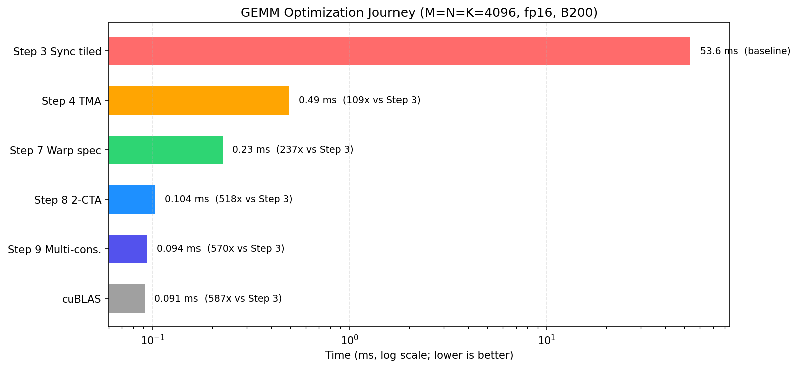

(chap_gemm_advanced)=
# 使用 Warp Specialization 和 Cluster 扩展 GEMM

:::{admonition} 概览
:class: overview

- 上一章的 pipelined GEMM 仍由一个 warpgroup 依次完成 load、MMA 和 writeback，本章将消除这个串行瓶颈。
- 第 7 步为不同 warps 分配专门角色，第 8 步引入 two-CTA cluster，第 9 步增加多个 MMA consumers。
- 每一步都扩大协作范围并减少一个串行阶段，最终在本章测试条件下接近 cuBLAS reference。
:::

上一章的 pipelined GEMM（{ref}`chap_gemm_async`）已经使用 TMA、software pipeline 和 persistent scheduling，但 load、MMA 和 writeback 仍由同一个 warpgroup 依次完成。三个硬件执行路径最终都要经过同一组 threads。

结果是，Tensor Cores 计算时 TMA engine 可能处于空闲状态，结果写回 memory 时计算单元又可能停下来。要让这些阶段真正并行，首先要让不同 warps 各自负责固定的工作。

本章分三步扩大协作范围：先把 TMA、MMA 和 writeback 分配给不同角色，再让两个 CTAs 协作计算一个更大的 tile，最后增加第二个 MMA consumer。前两章建立的数据路径保持不变，变化的是哪些执行单元共同使用这些数据，以及它们如何通过 barriers 交接资源。


(chap_warp_specialization)=
## 第 7 步：Warp Specialization 与 Pipeline

单 warpgroup kernel 中，所有 threads 都沿着 load、compute、writeback 的同一条路径执行。加载数据时 Tensor Cores 无事可做，执行计算时 TMA engine 也可能空闲。Warp specialization 将这些工作交给不同 warps，再用 software pipeline 在它们之间传递数据，使多个阶段可以同时运行。本章的 benchmark 仍使用 `M=N=K=4096`。

> **这一步改变 Scope**
> - Scope：一个 warpgroup 依次执行 load → MMA → writeback，改为由 TMA producer、MMA consumer 和 writeback 三个角色并行工作，并通过 full/empty barriers 交接数据。
> - Layout：不变，继续使用第 6 步中的 SMEM stages 和 TMEM accumulator。
> - Dispatch：不变，仍使用 TMA loads 和 `tcgen05` MMA。

多级 SMEM pipeline 和 persistent `ClusterPersistentScheduler2D` 沿用第 5、6 步的实现，这里只改变工作分配方式。

### 从串行执行到并发 Pipeline

下图比较 warp specialization 前后的调度方式。上半部分用第 4 步的串行时间线概括第 4 至 6 步尚未拆分角色时的执行方式，下半部分则表示第 7 步的并发调度。


在上半部分，同一组 threads 同时负责 load 和 MMA，一条路径工作时，另一条路径很容易空闲。第 5、6 步虽然加入了 double buffering 和 persistent scheduling，但尚未把 load 与 compute 拆成独立的 producer 和 consumer。下半部分中，TMA producer 会在 MMA consumer 计算当前 tile 时预取下一个 tile，writeback 也独立执行。Producer warp 3 发起下一次 load 时，consumer warp 0 仍可继续当前 MMA。

图中的 `smem_pipe.full` 和 `smem_pipe.empty`，在下面的实现中分别对应 `tma2mma` 和 `mma2tma`。

Load 与 MMA 之间通过两个 barriers 交接 SMEM buffer：

- **`tma2mma`**（TMA → MMA）：表示 SMEM data 已经加载完成，可以由 MMA 读取。
- **`mma2tma`**（MMA → TMA）：表示 MMA 已经读完当前 buffer，TMA 可以用它加载下一块数据。

图中的 `mma2tma` 箭头会跨过一个 stage，这是由 ring buffer 的复用顺序决定的。`PIPE_DEPTH=2` 时，TMA Load k=0 填充 stage 0，TMA Load k=1 填充 stage 1。MMA Compute k=0 读完 stage 0 后，真正需要复用该位置的是 TMA Load k=2，而不是正在使用 stage 1 的 k=1。因此，从 MMA Compute k=0 发出的 `mma2tma` 信号会对应到 TMA Load k=2。

### Warp 角色

`WG_NUMBER=2` 时，kernel 使用两个 warpgroups，并将 load、compute 和 writeback 分配如下：

| 角色 | 位置 | 工作 |
|------|------|------|
| **TMA Producer** | Warpgroup 1，warp 3 | 持续通过 TMA 加载 A、B tiles |
| **MMA Consumer** | Warpgroup 1，warp 0 | 数据准备好后执行 MMA |
| **Writeback** | Warpgroup 0（全部 warps） | 从 TMEM 读取结果并写回 GMEM |

### 四个 Barriers

三个并发角色之间需要四个 barriers。正向路径 TMA → MMA → Writeback 表示数据已经准备好；反向路径 Writeback → MMA → TMA 表示 buffer 已经释放。Barrier 名称采用 `source2destination`，例如 `tma2mma` 表示 TMA 向 MMA 发送通知。

| Barrier | 类型 | 方向 | 含义 |
|---------|------|------|------|
| **tma2mma** | `TMABar` | TMA → MMA | SMEM data 已准备好 |
| **mma2tma** | `TCGen05Bar` | MMA → TMA | SMEM buffer 可以复用 |
| **mma2ld** | `TCGen05Bar` | MMA → Writeback | TMEM results 已准备好 |
| **ld2mma** | `MBarrier` | Writeback → MMA | TMEM 可以供下一个 tile 使用 |

Barrier 类型取决于 producer 如何报告完成。**TMA load** 使用带 byte counting 的 `TMABar`，传输完成后由 TMA hardware 更新 barrier。**TMA store** 的完成状态则由发起指令的 thread 通过 async group 跟踪：先执行 `cp_async.bulk.commit_group()`，再用 `wait_group(0)` 等待写入完成。**MMA operation** 使用 `TCGen05Bar`，`tcgen05.commit()` 会在 MMA 完成后更新该 barrier。

这里的 `arrive` 调用传入 `cta_mask=0`，因为当前 kernel 只涉及一个 CTA。第 8 步组成 cluster 后，这个参数会用来通知另一个 CTA。

### PipelineState

四个 barriers 说明 buffer 何时可用，`PipelineState` 则记录每个角色当前使用哪个 stage，以及应该等待该 stage 的哪个 phase。手工同时维护这两个值容易产生 off-by-one error，并导致整个 kernel deadlock。`PipelineState` 将它们放在同一个状态对象中：

```python
tma_ps = PipelineState(PIPE_DEPTH, phase=1)   # Producer starts ready (phase=1)
# tma_ps.stage = current stage index
# tma_ps.phase = current phase (0 or 1)
tma_ps.advance()                          # Advance to next stage
```

初始 `phase` 决定一个角色的第一次 `wait` 是直接通过还是等待。Pipeline 两端的初始状态正好相反：
- `phase=1`（producer）：第一次 `wait(phase=1)` 看到 barrier 仍处于 phase 0，因此会直接通过。Buffer 初始为空，producer 可以立即开始填充。

- `phase=0`（consumer）：第一次 `wait(phase=0)` 看到 barrier 处于 phase 0，因此会等待。此时尚无数据，必须等 producer 完成加载后才能继续。

如果两端使用相同的初始 phase，kernel 可能 deadlock，也可能在数据尚未准备好时继续执行。

### `warpgroup_sync` 的 Barrier ID

Warp specialization 之后，各个 warpgroups 会执行不同的代码路径。此时不能在分支内部使用要求整个 CTA 参与的 `cta_sync()`，否则未进入该分支的 threads 无法到达同步点，kernel 会 deadlock。

这里改用只同步一个 warpgroup 的 `warpgroup_sync(10)`。GPU 提供 16 个 named barriers（ID 0–15）；当多个 warpgroups 需要分别同步时，例如第 9 步中的多个 consumers，可以使用 `warpgroup_sync(wg_id + 10)` 为它们分配不同 IDs，避免落到同一个 hardware barrier 上。

下面的实现使用 `PIPE_DEPTH=2`，这是能够让 load 与 compute 重叠的最小深度。更深的 pipeline 可以隐藏更多 memory latency，但也会占用更多 SMEM。完整 kernel 如下：

```python
import tvm
from tvm.script import tirx as T
from tvm.script.tirx import tile as Tx
from tvm.tirx.layout import TileLayout, S, TLane, TCol, tid_in_wg
from tvm.tirx.cuda.operator.tile_primitive.tma_utils import tma_shared_layout, SwizzleMode
from tvm.tirx.lang.pipeline import TMABar, TCGen05Bar, MBarrier, PipelineState
from tvm.tirx.lang.tile_scheduler import ClusterPersistentScheduler2D

SM_COUNT = 148  # Number of SMs on NVIDIA B200 GPU
F16_SIZE = 2

def hgemm_v7(M, N, K):
    a_type = tvm.DataType("float16")
    b_type = tvm.DataType("float16")
    d_type = tvm.DataType("float16")
    acc_type = tvm.DataType("float32")

    BLK_M, BLK_N, BLK_K = 128, 128, 64
    K_TILES = K // BLK_K
    PIPE_DEPTH = 2
    WG_NUMBER = 2

    A_layout = tma_shared_layout(a_type, SwizzleMode.SWIZZLE_128B_ATOM, (PIPE_DEPTH, BLK_M, BLK_K))
    B_layout = tma_shared_layout(b_type, SwizzleMode.SWIZZLE_128B_ATOM, (PIPE_DEPTH, BLK_N, BLK_K))
    D_layout = tma_shared_layout(d_type, SwizzleMode.SWIZZLE_128B_ATOM, (BLK_M, BLK_N))

    @T.prim_func
    def kernel(
        A: T.Buffer((M, K), a_type),
        B: T.Buffer((N, K), b_type),
        D: T.Buffer((M, N), d_type),
    ):
        T.device_entry()
        bx = T.cta_id([SM_COUNT])
        wg_id = T.warpgroup_id([WG_NUMBER])
        warp_id = T.warp_id_in_wg([4])
        lane_id = T.lane_id([32])

        # --- Allocation ---
        pool = T.SMEMPool()
        tmem_addr = pool.alloc((1,), "uint32")
        tma2mma = TMABar(pool, PIPE_DEPTH)
        mma2tma = TCGen05Bar(pool, PIPE_DEPTH)
        mma2ld  = TCGen05Bar(pool, 1)
        ld2mma  = MBarrier(pool, 1)
        pool.move_base_to(1024)
        Asmem = pool.alloc((PIPE_DEPTH, BLK_M, BLK_K), a_type, layout=A_layout)
        Bsmem = pool.alloc((PIPE_DEPTH, BLK_N, BLK_K), b_type, layout=B_layout)
        Dsmem = pool.alloc((BLK_M, BLK_N), d_type, layout=D_layout)

        # --- Barrier init ---
        tma2mma.init(1)
        mma2tma.init(1)
        mma2ld.init(1)
        ld2mma.init(128)   # all 128 Warpgroup 0 threads arrive
        pool.commit()

        # --- TMEM alloc + fence ---
        if wg_id == 0:
            if warp_id == 0:
                T.ptx.tcgen05.alloc(T.address_of(tmem_addr), n_cols=512, cta_group=1)
        T.ptx.fence.proxy_async("shared::cta")
        T.ptx.fence.mbarrier_init()
        T.cuda.cta_sync()

        tmem = T.decl_buffer(
            (128, 512), acc_type, scope="tmem", allocated_addr=tmem_addr[0],
            layout=TileLayout(S[(128, 512) : (1@TLane, 1@TCol)]))

        # --- Tile scheduler ---
        tile_scheduler = ClusterPersistentScheduler2D(
            "ts", num_m_tiles=M // BLK_M, num_n_tiles=N // BLK_N,
            l2_group_size=8, num_clusters=SM_COUNT)
        tile_scheduler.init(bx)
        m_st = T.meta_var(tile_scheduler.m_idx * BLK_M)
        n_st = T.meta_var(tile_scheduler.n_idx * BLK_N)

        # =============================================
        # Warpgroup 1: TMA Producer (warp 3) + MMA Consumer (warp 0)
        # =============================================
        if wg_id == 1:
            if warp_id == 3:
                # === TMA Producer ===
                tma_ps = PipelineState(PIPE_DEPTH, phase=1)

                @T.inline
                def tma_load(k_offset):
                    Tx.copy_async(Asmem[tma_ps.stage, :, :],
                                  A[m_st:m_st+BLK_M, k_offset:k_offset+BLK_K],
                                  dispatch="tma", cta_group=1,
                                  mbar=tma2mma.ptr_to([tma_ps.stage]))
                    Tx.copy_async(Bsmem[tma_ps.stage, :, :],
                                  B[n_st:n_st+BLK_N, k_offset:k_offset+BLK_K],
                                  dispatch="tma", cta_group=1,
                                  mbar=tma2mma.ptr_to([tma_ps.stage]))

                if T.filter(lane_id, T.ptx.elect_sync()):
                    while tile_scheduler.valid():
                        for k in range(K_TILES):
                            mma2tma.wait(tma_ps.stage, tma_ps.phase)
                            tma_load(k * BLK_K)
                            tma2mma.arrive(tma_ps.stage,
                                           (BLK_M * BLK_K + BLK_N * BLK_K) * F16_SIZE)
                            tma_ps.advance()
                        tile_scheduler.next_tile()

            elif warp_id == 0:
                # === MMA Consumer ===
                mma_ps = PipelineState(PIPE_DEPTH, phase=0)
                ld_ps = PipelineState(1, phase=1)

                if T.filter(lane_id, T.ptx.elect_sync()):
                    while tile_scheduler.valid():
                        # Wait for TMEM to be free from previous tile's writeback
                        ld2mma.wait(ld_ps.stage, ld_ps.phase)
                        ld_ps.advance()

                        for k in range(K_TILES):
                            tma2mma.wait(mma_ps.stage, mma_ps.phase)
                            Tx.gemm_async(
                                tmem[:, :BLK_N],
                                Asmem[mma_ps.stage, :, :],
                                Bsmem[mma_ps.stage, :, :],
                                accum=(k != 0), dispatch="tcgen05", cta_group=1)
                            mma2tma.arrive(mma_ps.stage, cta_group=1, cta_mask=0)
                            mma_ps.advance()

                        # Signal results ready for writeback
                        mma2ld.arrive(0, cta_group=1, cta_mask=0)
                        tile_scheduler.next_tile()

        # =============================================
        # Warpgroup 0: Writeback
        # =============================================
        elif wg_id == 0:
            wb_ps = PipelineState(1, phase=0)
            reg_f16 = T.alloc_local((BLK_N,), d_type)

            while tile_scheduler.valid():
                # Wait for MMA results
                mma2ld.wait(wb_ps.stage, wb_ps.phase)
                wb_ps.advance()
                T.ptx.tcgen05.fence.after_thread_sync()

                # Read TMEM -> registers (warpgroup scope)
                reg = T.alloc_local((BLK_N,), acc_type)
                reg_wg = reg.view(128, BLK_N,
                    layout=TileLayout(S[(128, BLK_N) : (1@tid_in_wg, 1)]))
                Tx.wg.copy_async(reg_wg[:], tmem[:, :BLK_N])
                T.ptx.tcgen05.wait.ld()

                # Signal TMEM free (all 128 threads arrive)
                ld2mma.arrive(0, cta_id=0, pred=True)

                # Cast fp32 -> fp16
                Tx.cast(reg_f16[:], reg[:])

                # Write to Dsmem + TMA store
                Tx.copy(Dsmem[warp_id * 32 + lane_id, :], reg_f16[:])
                T.ptx.fence.proxy_async("shared::cta")
                T.cuda.warpgroup_sync(10)
                if warp_id == 0:
                    if lane_id == 0:
                        Tx.copy_async(D[m_st:m_st+BLK_M, n_st:n_st+BLK_N],
                                      Dsmem[:, :], dispatch="tma")
                        T.ptx.cp_async.bulk.commit_group()
                        T.ptx.cp_async.bulk.wait_group(0)
                T.cuda.warpgroup_sync(10)

                tile_scheduler.next_tile()

        # --- Cleanup ---
        T.cuda.cta_sync()
        if warp_id == 0:
            T.ptx.tcgen05.relinquish_alloc_permit(cta_group=1)
            T.ptx.tcgen05.dealloc(tmem_addr[0], n_cols=512, cta_group=1)

    return kernel
```

### Epilogue（Writeback）

第 7 步中 `BLK_N=128`，writeback warpgroup 可以一次将整个 TMEM tile 读入 registers，再发起一次 TMA store。执行顺序如下：

1. 使用 `mma2ld.wait(phase)` 等待 MMA 完成，再执行 `T.ptx.tcgen05.fence.after_thread_sync()`，将后续的 `tcgen05.ld` 排在这次跨 thread 的完成通知之后。
2. 将 TMEM 读入 registers。每个 thread 接收 128 个 fp32 values；warpgroup 先执行 `Tx.copy_async(reg_wg, tmem[:, :BLK_N])`，再使用 `T.ptx.tcgen05.wait.ld()` 等待 load 完成。
3. 所有 128 个 writeback threads 执行 `ld2mma.arrive(0, cta_id=0, pred=True)`，通知 MMA 当前 TMEM 已经可以供下一个 tile 使用。`cta_id=0` 表示更新当前 CTA 的 local barrier；`pred=True` 表示每个 writeback thread 都执行 arrival。第 8 步会改用 `cta_mask` 通知 cluster 中的 CTAs。
4. 在 registers 中将 fp32 转换为 fp16。
5. 将 registers 写入 `Dsmem`，再执行 `fence.proxy_async("shared::cta")` 和 `warpgroup_sync(10)`。
6. 使用 `cp_async.bulk.commit_group()` 和 `wait_group(0)`，通过 TMA 将 `Dsmem` 写回 GMEM。

这里的 mbarrier wait 和 `tcgen05.wait.ld()` 负责等待两项不同的工作：前者确认 MMA 已经完成，`fence.after_thread_sync()` 建立跨 thread 的 `tcgen05` 执行顺序，后者再确认异步 TMEM load 已经写入目标 registers。

第 8 步的 `BLK_N=256`，第 9 步中每个 consumer 的 `MMA_N=256`。若仍一次读取整个 tile，每个 thread 需要同时保存 256 个 fp32 values，也就是 1024 bytes，不仅会增加 register pressure，甚至可能 spill 到 local memory，还会要求更大的 `Dsmem`。因此，后面两个版本将 writeback 拆成 `EPI_N=64` 列的 chunks。每轮只保留 `EPI_N` 个 fp32 registers，并发起一次较小的 TMA store，以更多 store instructions 换取可控的 register 用量。

实现中还保留了以下两点：

- **Persistent kernel**：`bx = T.cta_id([SM_COUNT])`，每个 CTA 循环处理多个 tiles。

- **有利于 L2 locality 的调度**：`ClusterPersistentScheduler2D` 调整 tiles 的处理顺序。

Warp specialization 与 software pipelining 的组合也常见于 CUTLASS 等高性能 GEMM 实现。

### 第 7 步的常见错误

第 7 步首次让 TMA load、`tcgen05` MMA 和 writeback 同时在途。第 8、9 步也会遇到相同类型的错误：barrier count 不匹配、role guard 放错位置、缺少 fence，或者 TMA store 尚未完成就复用 staging buffer。排查时应先确认每个 barrier 的等待者、通知者和 arrival count，再检查 buffer 复用前的 wait 与 fence 是否完整。

**调整 pipeline depth。** 第 7 步使用最小可用深度 `PIPE_DEPTH=2`。增加到 4 或 6，可以让 TMA producer 更早准备后续数据，从而隐藏更多 memory latency，但也会消耗更多 SMEM。B200 的每个 SM 提供 228 KB SMEM。取 `BLK_M=BLK_N=128`、`BLK_K=64` 和 fp16 时，每个 stage 中 A、B 合计占用 `(128*64 + 128*64) * 2 = 32 KB`，`Dsmem` writeback buffer 还需 32 KB。因此，`PIPE_DEPTH=4` 大约使用 160 KB，`PIPE_DEPTH=6` 则约为 224 KB，已经接近容量上限。若继续增加深度，就需要重新设计 writeback staging。

---

Warp specialization 已经让一个 CTA 内的不同 warps 并发工作。下一步将协作范围扩展到两个 CTAs，让它们共同计算一个更大的 tile。


(chap_cta_cluster)=
## 第 8 步：Two-CTA Cluster

第 7 步已经让多个 engines 重叠执行，但每个 CTA 仍独立计算自己的 $128\times128$ tile，相邻 CTA 无法复用它加载的 operands。第 8 步让两个 CTAs 组成 cluster，并访问彼此的 shared memory。一条 cooperative `tcgen05` MMA 会跨越两个 CTAs，生成一个 $256\times256$ tile；一份 B data 也可以支持更多 MMA 计算。问题规模仍为 `M=N=K=4096`。

> **这一步改变 Scope、Layout 和 Dispatch**
> - Scope：协作范围由一个 CTA 扩展到 cluster 中的两个 CTAs。
> - Layout：operand tiles 分布在两个 CTAs 的 SMEM 中；CTA 0 持有共享的 completion barrier，另一个 CTA 通过 `remote_view` 访问它。
> - Dispatch：MMA 使用 `cta_group` 和 `cta_mask`，使 `tcgen05` 以 two-CTA cooperative operation 的方式执行。

### Cluster Tile 的 Shape

`cta_group=2` 允许 MMA 读取两个 CTAs 分别准备的 operand tiles。每个 CTA 加载 stored B 中包含 128 行的一个 slice；转置后，这些行对应 logical B operand 的 128 个 output columns。Cooperative MMA 再将两个 slices 合并为完整 operand。下面的交互图展示两个 CTAs 的 A、B slices 如何组成一个 $256\times256$ cluster tile：

```{raw} html
<div style="overflow-x:auto;">
<iframe src="../demo_zh/cta_cluster.html" title="A 2-CTA cluster: cooperative MMA via cross-CTA SMEM read" loading="lazy"
        style="width:100%; min-width:720px; height:580px; border:1px solid var(--pst-color-border, #d0d0d0); border-radius:6px;"></iframe>
</div>
```
*每个 CTA 持有一个 A row slice 和一个 stored-B row slice，并通过 cluster 中的 distributed shared memory（DSMEM）读取另一个 CTA 的 stored-B slice。经过 `B.T` 后，两个 slices 覆盖完整的 output columns，因此两个 CTAs 共同生成一个 $256\times256$ output tile。*

本教程将 GEMM 写成 `D = A @ B.T`，其中 stored B 的 shape 为 `N × K`。两个 CTAs 对 operands 的分工如下：

- **A 沿 M 维切分**：CTA 0 持有 A0（rows 0–127），CTA 1 持有 A1（rows 128–255）。两部分合起来共有 256 行。
- **Stored B 沿 N 维切分**：CTA 0 加载 B rows 0–127，CTA 1 加载 B rows 128–255。由于计算使用 `B.T`，这两个 stored row slices 会成为 logical right-hand operand 的两个 128-column slices。
- 使用 `cta_group=2` 后，MMA hardware 通过 cross-CTA shared memory access 读取两个 CTAs 的 B slices，得到完整的 logical output-column 范围。
- 两个 CTAs 共同计算一个 $256\times256$ output tile，每个 CTA 最终写回其中一个 $128\times256$ row stripe。

每个 CTA 仍只加载 $128\times K$ 的 A 和 $128\times K$ 的 B，因此 cluster 准备的 operand data 大约是单 CTA 的两倍；但它生成的 $256\times256$ tile 所包含的 FLOPs 约为 $128\times128$ tile 的四倍。Cooperative MMA 会让每个 CTA 的 B slice 与另一个 CTA 的 A slice 组合，从而使每个 staged-operand byte 支持约两倍的计算。算术强度由此接近翻倍，也解释了本章末尾结果表中约 2.2 倍的性能提升。

### Tile 地址计算

Cluster 成为调度单位后，tile scheduler 也按 cluster tile 计数。每个 `(m_idx, n_idx)` 表示一个完整的 $256\times256$ 区域，cluster 内的两个 CTAs 再分别加载自己的 slices：

```python
m_st = (m_idx * CTA_GROUP + cbx) * BLK_M
n_st = (n_idx * CTA_GROUP + cbx) * BLK_N
```

两个 CTAs 处理同一个 $256\times256$ cluster tile。`cbx` 表示 CTA 在 cluster 中的位置，取值为 0 或 1。`m_st` 选择该 CTA 拥有的 output row stripe，`n_st` 选择它为 cooperative MMA 提供的 stored-B slice。Writeback 时，每个 CTA 都会写出 output 的两个 128-column halves。`num_m_tiles = M // 256` 和 `num_n_tiles = N // 256` 统计的也是 cluster tiles，而不是单 CTA tiles。

令 `m_base = m_idx * 256`、`n_base = n_idx * 256`，两个 CTAs 实际负责的数据如下：

| CTA | 加载的 A slice | 加载的 stored-B slice | 写回的 D 区域 |
|-----|----------------|-----------------------|----------------|
| CTA 0 | `A[m_base:m_base+128, :]` | `B[n_base:n_base+128, :]` | `D[m_base:m_base+128, n_base:n_base+256]` |
| CTA 1 | `A[m_base+128:m_base+256, :]` | `B[n_base+128:n_base+256, :]` | `D[m_base+128:m_base+256, n_base:n_base+256]` |

因此，`cbx` 在 `m_st` 中选择该 CTA 负责的 output rows，在 `n_st` 中选择它要加载的 stored-B rows。后者只是 cooperative MMA 的输入坐标，并不表示该 CTA 只负责对应的 output columns。Writeback 时，两个 CTAs 都覆盖完整的 256 个 output columns，所以 column 起点使用 `n_st_epi = n_idx * 256 + no * 128`，其中不含 `cbx`。

### 相比第 7 步的代码改动

与第 7 步相比，cluster 版本主要有六处改动：

```python
# 1. Cluster launch
cbx, cby = T.cta_id_in_cluster([CTA_GROUP, 1])   # cbx = CTA index within cluster (0 or 1)

# 2. Cooperative MMA (was cta_group=1)
Tx.gemm_async(..., cta_group=2)

# 3. Cross-CTA shared memory access
B_remote = T.ptx.map_shared_rank(Bsmem, cta_id=1)

# 4. Cross-CTA barrier
tma2mma_cta0 = T.decl_buffer(
    [CTA_GROUP], "uint64",
    data=T.ptx.map_shared_rank(tma2mma.ptr_to([0]), 0),
    scope="shared"
)

# 5. mma2tma / mma2ld arrives go from cta_mask=0 (single CTA, Step 7)
#    to cta_mask=3 (signal both CTAs in the cluster)
mma2tma.arrive(mma_ps.stage, cta_group=CTA_GROUP, cta_mask=3)
mma2ld.arrive(0, cta_group=CTA_GROUP, cta_mask=3)

# 6. Cluster sync replaces cta_sync at the end
T.cuda.cluster_sync()
```


### Cluster 内的协作

这些改动都来自同一件事：协作 scope 已经从单个 CTA 扩展到 cluster。具体包括：

- **Cluster CTA ID**：`cbx` 表示 CTA 在 cluster 中的位置。CTA 0 处理 A rows 0–127，CTA 1 处理 rows 128–255。

- **Remote barrier view**：每个 CTA 都有自己的 SMEM 和 barriers。这里选择 CTA 0 的 barrier 作为统一协调点，cluster 中的其他 CTA 通过 remote pointer 访问它。`map_shared_rank(tma2mma.ptr_to([0]), 0)` 返回指向 CTA 0 barrier 的 cluster-wide pointer；TIRx 中可用 `tma2mma.remote_view(0)` 表示。后续 arrive 和 wait 都作用于 CTA 0 的这份 barrier。

- **只由 CTA 0 发起 MMA**：`cta_group=2` 并不表示两个 CTAs 分别发起一条 MMA。CTA 0 发出一条 `tcgen05.mma`，hardware 执行跨越两个 CTAs 的 cooperative MMA，从两侧 SMEM 读取 operands，并将 accumulator 写入两侧 TMEM。CTA 1 不再发出相同指令，因此代码使用 `if cbx == 0:` 保护 MMA path。

- **Multicast arrive**：`tcgen05.commit(..., cta_group=2, cta_mask=3)` 只由 CTA 0 发出，但会通知两个 CTAs 的 barriers。`cta_mask=3` 即二进制 `11`，表示 CTA 0 和 CTA 1 都是目标。

- **`ld2mma` 的 init count**：`init(128 * CTA_GROUP)`，两个 CTAs 的 writeback warpgroups 各有 128 个 threads，全部都要执行 arrival。

- **Cluster-wide resource accounting**：TMA arrival byte count 要包含两个 CTAs 搬运的数据，`tcgen05.alloc` 和 `tcgen05.dealloc` 都使用 `cta_group=2`；释放 TMEM 前还要执行 `cluster_sync()`，确认两侧 CTA 都已经完成访问。


完整实现如下：

```python
def hgemm_v8(M, N, K):
    a_type = tvm.DataType("float16")
    b_type = tvm.DataType("float16")
    d_type = tvm.DataType("float16")
    acc_type = tvm.DataType("float32")

    CTA_GROUP = 2
    BLK_M, BLK_N, BLK_K = 128, 128, 64
    MMA_M, MMA_N = 256, 256
    K_TILES = K // BLK_K
    PIPE_DEPTH = 4
    WG_NUMBER = 2
    F16_SIZE = 2  # fp16

    A_layout = tma_shared_layout(a_type, SwizzleMode.SWIZZLE_128B_ATOM, (PIPE_DEPTH, BLK_M, BLK_K))
    B_layout = tma_shared_layout(b_type, SwizzleMode.SWIZZLE_128B_ATOM, (PIPE_DEPTH, BLK_N, BLK_K))
    D_layout = tma_shared_layout(d_type, SwizzleMode.SWIZZLE_128B_ATOM, (BLK_M, 128))

    @T.prim_func
    def kernel(
        A: T.Buffer((M, K), a_type),
        B: T.Buffer((N, K), b_type),
        D: T.Buffer((M, N), d_type),
    ):
        T.device_entry()
        bx = T.cta_id([SM_COUNT])
        cbx, cby = T.cta_id_in_cluster([CTA_GROUP, 1])
        wg_id = T.warpgroup_id([WG_NUMBER])
        warp_id = T.warp_id_in_wg([4])
        lane_id = T.lane_id([32])

        # --- Allocation ---
        pool = T.SMEMPool()
        tmem_addr = pool.alloc((1,), "uint32")
        tma2mma = TMABar(pool, PIPE_DEPTH)
        mma2tma = TCGen05Bar(pool, PIPE_DEPTH)
        mma2ld  = TCGen05Bar(pool, 1)
        ld2mma  = MBarrier(pool, 1)
        pool.move_base_to(1024)
        Asmem = pool.alloc((PIPE_DEPTH, BLK_M, BLK_K), a_type, layout=A_layout)
        Bsmem = pool.alloc((PIPE_DEPTH, BLK_N, BLK_K), b_type, layout=B_layout)
        Dsmem = pool.alloc((BLK_M, 128), d_type, layout=D_layout)

        # --- Barrier init ---
        tma2mma.init(1)
        mma2tma.init(1)
        mma2ld.init(1)
        ld2mma.init(128 * CTA_GROUP)  # both CTAs' writeback threads
        pool.commit()

        # --- TMEM alloc (cooperative) ---
        if wg_id == 0:
            if warp_id == 0:
                T.ptx.tcgen05.alloc(T.address_of(tmem_addr), n_cols=512, cta_group=CTA_GROUP)
        T.ptx.fence.proxy_async("shared::cta")
        T.ptx.fence.mbarrier_init()
        T.cuda.cta_sync()

        tmem = T.decl_buffer(
            (128, 512), acc_type, scope="tmem", allocated_addr=tmem_addr[0],
            layout=TileLayout(S[(128, 512) : (1@TLane, 1@TCol)]))

        # --- Tile scheduler (cluster tiles) ---
        tile_scheduler = ClusterPersistentScheduler2D(
            "ts", num_m_tiles=M // 256, num_n_tiles=N // 256,
            l2_group_size=8, num_clusters=SM_COUNT // CTA_GROUP)
        tile_scheduler.init(bx // CTA_GROUP)
        m_idx = T.meta_var(tile_scheduler.m_idx)
        n_idx = T.meta_var(tile_scheduler.n_idx)
        m_st = T.meta_var((m_idx * CTA_GROUP + cbx) * BLK_M)
        n_st = T.meta_var((n_idx * CTA_GROUP + cbx) * BLK_N)

        # --- Cross-CTA barrier view ---
        tma2mma_cta0 = tma2mma.remote_view(0)

        # =============================================
        # Warpgroup 1: TMA Producer (warp 3) + MMA Consumer (warp 0)
        # =============================================
        if wg_id == 1:
            if warp_id == 3:
                tma_ps = PipelineState(PIPE_DEPTH, phase=1)

                @T.inline
                def tma_load(k_offset):
                    Tx.copy_async(Asmem[tma_ps.stage, :, :],
                                  A[m_st:m_st+BLK_M, k_offset:k_offset+BLK_K],
                                  dispatch="tma", cta_group=CTA_GROUP,
                                  mbar=tma2mma_cta0.ptr_to([tma_ps.stage]))
                    Tx.copy_async(Bsmem[tma_ps.stage, :, :],
                                  B[n_st:n_st+BLK_N, k_offset:k_offset+BLK_K],
                                  dispatch="tma", cta_group=CTA_GROUP,
                                  mbar=tma2mma_cta0.ptr_to([tma_ps.stage]))

                if T.filter(lane_id, T.ptx.elect_sync()):
                    while tile_scheduler.valid():
                        for k in range(K_TILES):
                            mma2tma.wait(tma_ps.stage, tma_ps.phase)
                            tma_load(k * BLK_K)
                            if cbx == 0:
                                tma2mma_cta0.arrive(tma_ps.stage,
                                    CTA_GROUP * (BLK_M * BLK_K + BLK_N * BLK_K) * F16_SIZE)
                            tma_ps.advance()
                        tile_scheduler.next_tile()

            elif warp_id == 0:
                mma_ps = PipelineState(PIPE_DEPTH, phase=0)
                ld_ps = PipelineState(1, phase=1)

                if cbx == 0:
                    if T.filter(lane_id, T.ptx.elect_sync()):
                        while tile_scheduler.valid():
                            ld2mma.wait(ld_ps.stage, ld_ps.phase)
                            ld_ps.advance()

                            for k in range(K_TILES):
                                tma2mma.wait(mma_ps.stage, mma_ps.phase)
                                Tx.gemm_async(
                                    tmem[:, :MMA_N],
                                    Asmem[mma_ps.stage, :, :],
                                    Bsmem[mma_ps.stage, :, :],
                                    accum=(k != 0), dispatch="tcgen05", cta_group=CTA_GROUP)
                                mma2tma.arrive(mma_ps.stage, cta_group=CTA_GROUP, cta_mask=3)
                                mma_ps.advance()

                            mma2ld.arrive(0, cta_group=CTA_GROUP, cta_mask=3)
                            tile_scheduler.next_tile()

        # =============================================
        # Warpgroup 0: Writeback (256 columns in 2 x 128-column chunks)
        # =============================================
        elif wg_id == 0:
            wb_ps = PipelineState(1, phase=0)
            reg_f16 = T.alloc_local((128,), d_type)

            while tile_scheduler.valid():
                mma2ld.wait(wb_ps.stage, wb_ps.phase)
                wb_ps.advance()
                T.ptx.tcgen05.fence.after_thread_sync()

                for no in T.unroll(2):  # 2 chunks of 128 columns = 256 total
                    reg = T.alloc_local((128,), acc_type)
                    reg_wg = reg.view(128, 128,
                        layout=TileLayout(S[(128, 128) : (1@tid_in_wg, 1)]))
                    Tx.wg.copy_async(reg_wg[:], tmem[:, no * 128:(no + 1) * 128])
                    T.ptx.tcgen05.wait.ld()
                    Tx.cast(reg_f16[:], reg[:])
                    Tx.copy(Dsmem[warp_id * 32 + lane_id, :], reg_f16[:])
                    T.ptx.fence.proxy_async("shared::cta")
                    T.cuda.warpgroup_sync(10)
                    if warp_id == 0:
                        if lane_id == 0:
                            n_st_epi = T.meta_var(n_idx * 256 + no * 128)
                            Tx.copy_async(D[m_st:m_st+BLK_M, n_st_epi:n_st_epi+128],
                                          Dsmem[:, :], dispatch="tma")
                            T.ptx.cp_async.bulk.commit_group()
                            T.ptx.cp_async.bulk.wait_group(0)
                    T.cuda.warpgroup_sync(10)

                ld2mma.arrive(0, cta_id=0, pred=True)
                tile_scheduler.next_tile()

        # --- Cleanup ---
        T.cuda.cluster_sync()
        if warp_id == 0:
            T.ptx.tcgen05.relinquish_alloc_permit(cta_group=CTA_GROUP)
            T.ptx.tcgen05.dealloc(tmem_addr[0], n_cols=512, cta_group=CTA_GROUP)

    return kernel
```

增加 arithmetic intensity 后，第 8 步在 $4096^3$ 问题上达到 **0.104 ms**，相对于相同规模下耗时 70 ms 的第 1 步约快 676 倍。Kernel 此时已经逐渐接近 compute-bound。第 9 步会增加第二个 MMA consumer，让更多 Tensor Core work 同时在途。

如果第 8 步反而比第 7 步慢，应先检查新增的 cluster contracts：

1. TMA arrival byte count 是否为 `CTA_GROUP * (BLK_M*BLK_K + BLK_N*BLK_K) * F16_SIZE`。
2. 对于 $256\times256$ cluster tile，scheduler dimensions 是否为 `num_m_tiles=M//256` 和 `num_n_tiles=N//256`。
3. Writeback 是否对两个 128-column chunks 分别发起 TMA store，并在复用 `Dsmem` 前等待每次 store 完成。

---

Cluster 提高了 CTAs 之间的数据复用。最后一步会增加第二个 MMA consumer，进一步提高每个 CTA 内部的计算密度。


(chap_multi_consumer)=
## 第 9 步：Multi-Consumer Warp Specialization

第 8 步已经让 MMA 保持忙碌，但每个 staged B tile 仍只供一个 consumer warp 使用。最后一步增加第二个 MMA consumer，让它使用另一块 A 与同一份 B tile 相乘。每个 CTA 的计算密度由此翻倍，cluster output 也从 $256\times256$ 扩展到 $512\times256$。问题规模仍为 `M=N=K=4096`。

> **这一步改变 Scope 和 Layout**
> - Scope：MMA consumer 由一个增加到两个，并通过 `warp_id` 区分。
> - Layout：两个 consumers 复用同一个 staged B tile；A layout 增加 consumer axis。
> - Dispatch：不变。

### Multi-Consumer 结构

增加第二个 consumer 后，kernel 需要两个 MMA warps，以及两个分别负责对应 accumulator 的 writeback warpgroups。设置 `NUM_CONSUMER=2` 和 `WG_NUMBER=3` 后，各个角色分配如下：

| Warpgroup | Warp | 角色 |
|-----------|------|------|
| **WG 2** | warp 0 | MMA consumer 0：`Asmem[..., 0] × B` → TMEM cols `[0:256]` |
| **WG 2** | warp 1 | MMA consumer 1：`Asmem[..., 1] × B` → TMEM cols `[256:512]` |
| **WG 2** | warp 3 | TMA producer：每个 stage 加载 2 个 A blocks 和 1 个 B block |
| **WG 0** | 全部 warps | Consumer 0 的 writeback：读取 TMEM `[0:256]` |
| **WG 1** | 全部 warps | Consumer 1 的 writeback：读取 TMEM `[256:512]` |

两个 consumers 分别计算不同的 M-row stripes，因此需要不同的 A blocks；它们处理的 output columns 相同，所以可以共用 B。这样，一次 B load 可以支持两倍的 MMA work，B 相对于有效 FLOPs 的加载成本也近似减半。

### 相比第 8 步的改动

第二个 consumer 会让每个 stage 包含两个 A blocks，并产生两个需要分别写回的 TMEM ranges，而 B 仍由两者共享。代码需要做以下调整：

- `Asmem = pool.alloc((PIPE_DEPTH, NUM_CONSUMER, BLK_M, BLK_K), ...)`：每个 stage 存放两个 A blocks，每个 consumer 使用一个

- TMA 同时加载 `Asmem[stage, 0]` 和 `Asmem[stage, 1]`。由于多出一个 A block，arrival bytes 改为 `CTA_GROUP * (NUM_CONSUMER * BLK_M * BLK_K + BLK_N * BLK_K) * F16_SIZE`

- MMA warp 使用 `warp_id` 选择 A block 和 TMEM range

- `mma2tma.init(NUM_CONSUMER)`：每个 stage 都需要收到两个 consumers 的通知

- `mma2ld` 和 `ld2mma` 的 `depth=NUM_CONSUMER`：这两个对象各自包含两个 slots。Slot 0 连接 MMA warp 0 与 Warpgroup 0，slot 1 连接 MMA warp 1 与 Warpgroup 1；MMA 侧按 `warp_id` 索引，writeback 侧按 `wg_id` 索引

- Tile address 改为 `m_st = (m_idx * NUM_CONSUMER * CTA_GROUP + cbx) * BLK_M`。每个 cluster tile 沿 M 维包含 `NUM_CONSUMER` 组 consumers，因此 M offset 多出这个因子。Cluster tile 的 shape 为 $512\times256$，scheduler 使用 `num_m_tiles = M // 256 // NUM_CONSUMER`

- Writeback 按 `EPI_N` 分块，使每轮只有较少的 TMEM readback values 同时保存在 registers 中


完整实现如下：

```python
def hgemm_v9(M, N, K):
    a_type = tvm.DataType("float16")
    b_type = tvm.DataType("float16")
    d_type = tvm.DataType("float16")
    acc_type = tvm.DataType("float32")

    CTA_GROUP = 2
    NUM_CONSUMER = 2
    BLK_M, BLK_N, BLK_K = 128, 128, 64
    MMA_N = BLK_N * CTA_GROUP   # 256
    K_TILES = K // BLK_K
    PIPE_DEPTH = 4
    EPI_N = 64
    WG_NUMBER = 3
    F16_SIZE = 2  # fp16

    A_layout = tma_shared_layout(a_type, SwizzleMode.SWIZZLE_128B_ATOM,
                                 (PIPE_DEPTH, NUM_CONSUMER, BLK_M, BLK_K))
    B_layout = tma_shared_layout(b_type, SwizzleMode.SWIZZLE_128B_ATOM,
                                 (PIPE_DEPTH, BLK_N, BLK_K))
    D_layout = tma_shared_layout(d_type, SwizzleMode.SWIZZLE_128B_ATOM,
                                 (NUM_CONSUMER, BLK_M, EPI_N))

    @T.prim_func
    def kernel(
        A: T.Buffer((M, K), a_type),
        B: T.Buffer((N, K), b_type),
        D: T.Buffer((M, N), d_type),
    ):
        T.device_entry()
        bx = T.cta_id([SM_COUNT])
        cbx, cby = T.cta_id_in_cluster([CTA_GROUP, 1])
        wg_id = T.warpgroup_id([WG_NUMBER])
        warp_id = T.warp_id_in_wg([4])
        lane_id = T.lane_id([32])

        # --- Allocation ---
        pool = T.SMEMPool()
        tmem_addr = pool.alloc((1,), "uint32")
        tma2mma = TMABar(pool, PIPE_DEPTH)
        mma2tma = TCGen05Bar(pool, PIPE_DEPTH)
        mma2ld  = TCGen05Bar(pool, NUM_CONSUMER)   # depth=2, one slot per consumer
        ld2mma  = MBarrier(pool, NUM_CONSUMER)     # depth=2, one slot per consumer
        pool.move_base_to(1024)
        Asmem = pool.alloc((PIPE_DEPTH, NUM_CONSUMER, BLK_M, BLK_K), a_type, layout=A_layout)
        Bsmem = pool.alloc((PIPE_DEPTH, BLK_N, BLK_K), b_type, layout=B_layout)
        Dsmem = pool.alloc((NUM_CONSUMER, BLK_M, EPI_N), d_type, layout=D_layout)

        # --- Barrier init ---
        tma2mma.init(1)
        mma2tma.init(NUM_CONSUMER)  # each stage expects 2 arrivals
        mma2ld.init(1)              # each slot gets 1 arrival
        ld2mma.init(128 * CTA_GROUP)  # both CTAs' writeback threads
        pool.commit()

        # --- TMEM alloc (cooperative) ---
        if wg_id == 0:
            if warp_id == 0:
                T.ptx.tcgen05.alloc(T.address_of(tmem_addr), n_cols=512, cta_group=CTA_GROUP)
        T.ptx.fence.proxy_async("shared::cta")
        T.ptx.fence.mbarrier_init()
        T.cuda.cta_sync()

        tmem = T.decl_buffer(
            (128, 512), acc_type, scope="tmem", allocated_addr=tmem_addr[0],
            layout=TileLayout(S[(128, 512) : (1@TLane, 1@TCol)]))

        # --- Tile scheduler (512x256 cluster tiles) ---
        tile_scheduler = ClusterPersistentScheduler2D(
            "ts", num_m_tiles=M // 256 // NUM_CONSUMER, num_n_tiles=N // 256,
            l2_group_size=8, num_clusters=SM_COUNT // CTA_GROUP)
        tile_scheduler.init(bx // CTA_GROUP)
        m_idx = T.meta_var(tile_scheduler.m_idx)
        n_idx = T.meta_var(tile_scheduler.n_idx)
        m_st = T.meta_var((m_idx * NUM_CONSUMER * CTA_GROUP + cbx) * BLK_M)
        n_st = T.meta_var((n_idx * CTA_GROUP + cbx) * BLK_N)

        tma2mma_cta0 = tma2mma.remote_view(0)

        # =============================================
        # Warpgroup 2: TMA Producer (warp 3) + 2 MMA Consumers (warp 0, 1)
        # =============================================
        if wg_id == 2:
            if warp_id == 3:
                # === TMA Producer: loads 2 A blocks + 1 B block per stage ===
                tma_ps = PipelineState(PIPE_DEPTH, phase=1)

                @T.inline
                def tma_load(k_offset):
                    m_st_c1 = T.meta_var(m_st + CTA_GROUP * BLK_M)
                    Tx.copy_async(Asmem[tma_ps.stage, 0, :, :],
                                  A[m_st:m_st+BLK_M, k_offset:k_offset+BLK_K],
                                  dispatch="tma", cta_group=CTA_GROUP,
                                  mbar=tma2mma_cta0.ptr_to([tma_ps.stage]))
                    Tx.copy_async(Asmem[tma_ps.stage, 1, :, :],
                                  A[m_st_c1:m_st_c1+BLK_M, k_offset:k_offset+BLK_K],
                                  dispatch="tma", cta_group=CTA_GROUP,
                                  mbar=tma2mma_cta0.ptr_to([tma_ps.stage]))
                    Tx.copy_async(Bsmem[tma_ps.stage, :, :],
                                  B[n_st:n_st+BLK_N, k_offset:k_offset+BLK_K],
                                  dispatch="tma", cta_group=CTA_GROUP,
                                  mbar=tma2mma_cta0.ptr_to([tma_ps.stage]))

                if T.filter(lane_id, T.ptx.elect_sync()):
                    while tile_scheduler.valid():
                        for k in range(K_TILES):
                            mma2tma.wait(tma_ps.stage, tma_ps.phase)
                            tma_load(k * BLK_K)
                            if cbx == 0:
                                tma2mma_cta0.arrive(tma_ps.stage,
                                    CTA_GROUP * (NUM_CONSUMER * BLK_M * BLK_K + BLK_N * BLK_K) * F16_SIZE)
                            tma_ps.advance()
                        tile_scheduler.next_tile()

            elif warp_id < NUM_CONSUMER:
                # === MMA Consumer: warp_id selects A block and TMEM range ===
                mma_ps = PipelineState(PIPE_DEPTH, phase=0)
                ld_ps = PipelineState(1, phase=1)

                if cbx == 0:
                    if T.filter(lane_id, T.ptx.elect_sync()):
                        while tile_scheduler.valid():
                            ld2mma.wait(warp_id, ld_ps.phase)
                            ld_ps.advance()

                            for k in range(K_TILES):
                                tma2mma.wait(mma_ps.stage, mma_ps.phase)
                                Tx.gemm_async(
                                    tmem[:, warp_id * MMA_N:warp_id * MMA_N + MMA_N],
                                    Asmem[mma_ps.stage, warp_id, :, :],
                                    Bsmem[mma_ps.stage, :, :],
                                    accum=(k != 0), dispatch="tcgen05", cta_group=CTA_GROUP)
                                mma2tma.arrive(mma_ps.stage, cta_group=CTA_GROUP, cta_mask=3)
                                mma_ps.advance()

                            mma2ld.arrive(warp_id, cta_group=CTA_GROUP, cta_mask=3)
                            tile_scheduler.next_tile()

        # =============================================
        # Warpgroup 0/1: Writeback (each reads its consumer's TMEM range)
        # =============================================
        elif wg_id < NUM_CONSUMER:
            wb_ps = PipelineState(1, phase=0)
            reg_f16 = T.alloc_local((EPI_N,), d_type)

            while tile_scheduler.valid():
                mma2ld.wait(wg_id, wb_ps.phase)  # wait for THIS consumer
                wb_ps.advance()
                T.ptx.tcgen05.fence.after_thread_sync()

                # Read TMEM in EPI_N=64 column chunks (4 iterations for 256 cols)
                for i in T.unroll(MMA_N // EPI_N):
                    reg = T.alloc_local((EPI_N,), acc_type)
                    reg_wg = reg.view(128, EPI_N,
                        layout=TileLayout(S[(128, EPI_N) : (1@tid_in_wg, 1)]))
                    col_st = T.meta_var(wg_id * MMA_N + i * EPI_N)
                    col_end = T.meta_var(wg_id * MMA_N + i * EPI_N + EPI_N)
                    Tx.wg.copy_async(reg_wg[:], tmem[:, col_st:col_end])
                    T.ptx.tcgen05.wait.ld()
                    Tx.cast(reg_f16[:], reg[:])
                    Tx.copy(Dsmem[wg_id, warp_id * 32 + lane_id, :], reg_f16[:])
                    T.ptx.fence.proxy_async("shared::cta")
                    T.cuda.warpgroup_sync(wg_id + 10)
                    if warp_id == 0:
                        if lane_id == 0:
                            m_st_epi = T.meta_var(
                                (m_idx * NUM_CONSUMER * CTA_GROUP + wg_id * CTA_GROUP + cbx) * BLK_M)
                            n_st_epi = T.meta_var(n_idx * MMA_N + i * EPI_N)
                            Tx.copy_async(
                                D[m_st_epi:m_st_epi+BLK_M, n_st_epi:n_st_epi+EPI_N],
                                Dsmem[wg_id, :, :], dispatch="tma")
                            T.ptx.cp_async.bulk.commit_group()
                            T.ptx.cp_async.bulk.wait_group(0)
                    T.cuda.warpgroup_sync(wg_id + 10)

                ld2mma.arrive(wg_id, cta_id=0, pred=True)
                tile_scheduler.next_tile()

        # --- Cleanup ---
        T.cuda.cluster_sync()
        if warp_id == 0:
            T.ptx.tcgen05.relinquish_alloc_permit(cta_group=CTA_GROUP)
            T.ptx.tcgen05.dealloc(tmem_addr[0], n_cols=512, cta_group=CTA_GROUP)

    return kernel
```

运行这三个 kernels 时，可以复用第 1 步（{ref}`chap_gemm_basics`）中的 compile、run 和 check 代码，只需将 `hgemm_v1` 换成 `hgemm_v7`、`hgemm_v8` 或 `hgemm_v9`。第 8、9 步要求 `M` 和 `N` 能被对应的 cluster tile 整除，其 tile shapes 分别为 $256\times256$ 和 $512\times256$；使用过小的输入时，scheduler 不会生成任何 tile。不同版本会复用内部名称，切换 kernel 前应重新启动 Python session。

## 完整优化结果

下表列出从朴素 baseline 到 warp-specialized cluster kernel 的各个阶段，并给出 cuBLAS 作为参考。测试使用 NVIDIA B200、`M=N=K=4096`、fp16 和固定 clocks，每个版本计时 1000 次：

| 步骤 | 优化方法 | 时间 | 相对第 1 步的累计加速比 |
|------|----------|------|--------|
| 1 | Sync load + MMA | 70 ms | 1× |
| 2 | K-loop accumulation | --- | 支持 K 大于单个 tile |
| 3 | Spatial tiling | 53.6 ms | ~1.3× |
| 4 | TMA async load | 0.49 ms | ~142× |
| 5 | Software pipeline | --- | 重叠 load 与 compute |
| 6 | Persistent kernel | --- | 改善 L2 cache locality |
| 7 | Warp specialization | 0.23 ms | ~309× |
| 8 | Two-CTA cluster | 0.104 ms | ~676× |
| 9 | Multi-consumer | 0.094 ms | ~744× |
| --- | cuBLAS（参考） | 0.094 ms | ~744× |

表中所有时间都在相同的 `M=N=K=4096` 规模下测量，因此可以直接比较。第 1 步的 70 ms 不是将 {ref}`chap_gemm_basics` 中只计算一个 $128\times128$ tile 的示例直接用于 $4096^3$，而是把相同的串行思路扩展到完整问题后得到的 naive full-size baseline。第 1 至 3 步在基础章节中使用 $128\times128$ 和 $256^3$ 等小规模输入，是为了便于讲解；这里第 1、3 步对应的是它们的 full-size benchmark。第 2、5、6 步只用于展示结构，没有单独计时，因此以横线表示。

这些数字来自一组受控条件下的 B200 reference run，并不是通用排行榜结果。各步骤中的 `{.python .input}` benchmark cells 适合观察趋势，不应当用来宣称硬件峰值性能。

主要性能提升来自四项改动：

1. **TMA Async Data Movement**：第 4 步相对第 1 步约快 142 倍。这个累计结果还包含 K-loop、spatial tiling 和多 CTA 并行，不能单独归因于 TMA。
2. **Software Pipelining 与 Warp Specialization**：让 load 和 compute 使用独立角色并重叠执行，从第 4 步到第 7 步约快 2.2 倍。
3. **CTA Cluster**：two-SM cooperative MMA 提高 B tile 在 CTAs 之间的复用，本次测试中从第 7 步到第 8 步约快 2.2 倍。
4. **Multi-Consumer**：使用两个 MMA warps 提高计算密度，从第 8 步到第 9 步约快 10%。

下图将已测量的几个版本与 cuBLAS reference 放在一起：



越接近最终版本，单步加速幅度越小。前几步主要解决 memory bottleneck：TMA 替换 software copy，cluster 提高 arithmetic intensity，因此收益最大。第 8 步已经达到 0.104 ms，与 cuBLAS 的 0.094 ms 相差约 10%，kernel 也逐渐接近 compute-bound，可隐藏的 memory stall 已经很少。第 9 步通过 multi-consumer 进一步回收剩余空间，获得约 10% 的提升。

下一章的 Flash Attention 会继续使用 TMA loads、`tcgen05` MMA、TMEM readback 和 warp-specialized barriers，并在两次 MMA phases 之间加入 online softmax。


## 练习

1. 第 7 步中，如果 TMA 和 MMA 的 `PipelineState` 都将初始 `phase` 设为 `0`，会发生什么？画出 deadlock 过程。
2. 第 8 步使用 `cta_group=2` 时，TMA arrival byte count 为 `CTA_GROUP * (BLK_M*BLK_K + BLK_N*BLK_K) * F16_SIZE`。既然每个 CTA 分别加载自己的数据，为什么还要乘以 `CTA_GROUP`？
3. 第 9 步中，每个 consumer 处理不同的 M rows，但使用相同的 B tile。为什么应该共享 B，而不是 A？

**使用你的 agent 练习**：粘贴第 7 步的 kernel，让它追踪一个 K tile 依次经过四个 barriers（`tma2mma`、`mma2tma`、`mma2ld`、`ld2mma`）的过程。对于每个 barrier，说明谁执行 wait、谁执行 arrival、哪个 tile 随后可以安全读取，以及哪个 buffer 可以复用。
