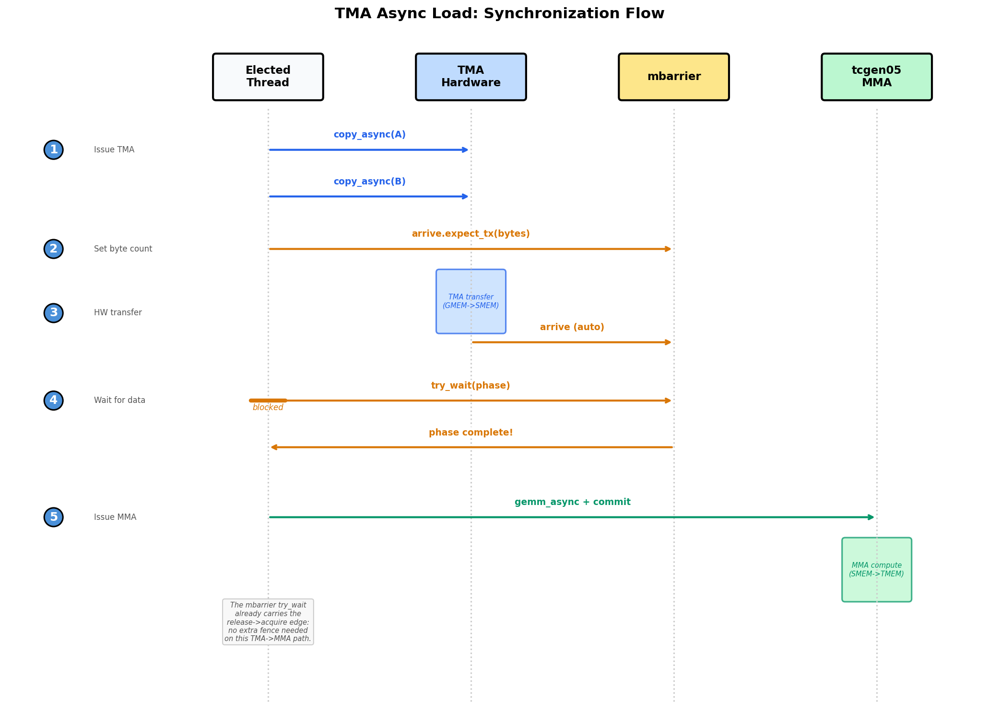

(chap_gemm_async)=
# 用 TMA 为 GEMM 建立 Pipeline

:::{admonition} 概览
:class: overview

- 基础 GEMM 在两个本可同时运行的阶段之间轮流执行：copy 一个 tile、compute、再 copy 下一个 tile，因此浪费了大量时间。
- Step 4 切换到 TMA async load，Step 5 对 SMEM 做 double buffering 并 prefetch（`PIPE_DEPTH=2`）；完整 load/compute overlap 要等到 Step 7 的 warp specialization，Step 6 则通过 tile scheduler 把 kernel 变成 persistent kernel。
- 目标是在 Tensor Core 计算当前 tile 的同时，加载下一个 tile。
:::

Tensor Core 是芯片上最昂贵的单元，而上一章正确的 tiled GEMM 让它在大部分时钟周期里空闲。Kernel 轮流执行：线程把一个 tile copy 到 shared memory，Tensor Core 消费它，线程再 copy 下一个 tile，Tensor Core 等待。每个阶段都卡在前一个阶段之后，尽管加载下一个 tile 和计算当前 tile 使用的是完全不同的硬件，本可以同时运行。要缩小这个差距，不需要新数据路径；tile、layout 和数学都已经正确。需要改变的是 work *何时*发生，以及由*谁*调度。本章保持 tile 数据路径完全不变，直接攻击空闲时间。

我们通过三个递进 step 到达那里。先知道终点会有帮助。Step 4 把 bulk GMEM <-> SMEM transfer 交给 TMA，让专用 copy 硬件移动 tile，而不是由线程移动。Step 5 加入两级 software pipeline，让下一个 K tile 在当前 tile 仍被乘法消费时有地方落下。Step 6 把 launch 重塑为由 tile scheduler 驱动的 persistent kernel，摊销 per-tile setup，并允许我们选择能让 operand 保持 hot 的 tile order。整个过程中，SMEM、TMEM 和 register layout 都保持上一章留下的样子。真正的新思想只有硬件单元之间的异步交接：让一个引擎跑在另一个前面，而不是让它们 lockstep 前进。

(chap_tma_async)=
## Step 4：TMA Async Load

第一步是把 copy 本身移出关键路径。回想 Steps 1-3 中 CTA 在做什么：每个线程都计算地址并发出 load 指令，目的只是把 tile 搬进 SMEM。这些指令带宽花在了 plumbing 上，而不是数学计算上。Step 4 用 TMA 替换同步 `Tx.copy`：一个线程发出一条命令，TMA engine 自己完成整个 tile transfer。从这里开始，示例使用完整 M=N=K=4096 规模，而不再使用 Steps 1-3 中的小规模；它们的 end-to-end timing 会出现在 {ref}`chap_gemm_advanced` 末尾的 *End-to-End Result* 表中。

> **本 step 改变的内容：Dispatch**
> - Scope：不变，一个 warpgroup。
> - Layout：不变，同样的 SMEM/TMEM/register tile。
> - Dispatch：GMEM -> SMEM load 从同步 `Tx.copy` 切换到 TMA engine。

### TMA 发起模式

Step 4 的唯一变化是把同步 tile copy 换成 TMA load，因此值得仔细看这个 load 如何发起。源码修改只有几行，但这些行背后的执行模型完全不同。同步 `Tx.copy` 是 CTA 线程自己用自己的指令完成的 work；TMA copy 是一个线程发出的命令，之后所有移动都由 TMA 硬件完成。把两者并排看最清楚。

**之前（Step 3）**：全部 128 个线程参与 copy，然后 `cta_sync` 让 shared-memory write 可见：

```python
Tx.cta.copy(Asmem[:, :], A[m_st:m_st+BLK_M, i*BLK_K:(i+1)*BLK_K])   # all 128 threads
Tx.cta.copy(Bsmem[:, :], B[n_st:n_st+BLK_N, i*BLK_K:(i+1)*BLK_K])
T.cuda.cta_sync()
```

**之后（Step 4）**：一个线程发起 TMA load，mbarrier 跟踪硬件 transfer 何时完成：

```python
tid = warp_id * 32 + lane_id                 # 0..127 within the warpgroup
if tid == 0:  # exactly one thread starts TMA
    Tx.copy_async(Asmem, A[...], dispatch="tma")
    Tx.copy_async(Bsmem, B[...], dispatch="tma")
    T.ptx.mbarrier.arrive.expect_tx(tma_bar, byte_count)  # bytes expected from TMA
T.ptx.mbarrier.try_wait(tma_bar, phase)                  # wait before MMA reads SMEM
```

注意，load 用 `tid == 0` gate，而不是用 `elect_sync()`；这个差异比看起来更重要。`elect.sync` 会在*每个 warp* 中选择一个 active lane，而一个 warpgroup 有四个 warp，因此 `elect_sync()` 实际会让四个线程进入 load protocol。问题在于，这个 protocol 会向 mbarrier 宣告 expected byte count，而且必须只宣告一次；四次宣告会破坏计数，让 wait 无法正确 release。用 warpgroup-wide id 精确选择一个线程，是避免这个问题的干净方法。

也要诚实说明 speedup 来自哪里。Step 4 仍然在每次 TMA load 后等待，所以还没有让 load 与 compute 重叠；那是 Step 5 的工作。这里的收益纯粹来自 data-movement path 的改变：

- `Tx.copy` 使用 CTA 线程计算地址，并发出 load/store 指令。
- TMA 使用一条发起命令启动硬件 tile transfer。地址生成、coalescing 和 swizzling 由 TMA descriptor 描述，并由 TMA engine 执行。

因此，即使 Step 4 仍然阻塞在每次 load 上，它也会更快。TMA 吸收了 bulk transfer，让 CTA 线程不必花指令带宽搬 tile；仅这一点就足以改善性能。

### TMA Load 和 Store 同步

我们已经看过 TMA copy 如何发起；故事的另一半是如何知道它已经完成。切换到 TMA 会同时改变两件事：谁开始 copy，以及代码如何知道它完成。第一件事在代码中很明显；第二件事很容易忽略，而一旦搞错，得到的是静默 correctness bug，不是 crash。使用 `Tx.cta.copy` 时，CTA 线程共同完成 copy，后面的 `cta_sync()` 足以说明它完成。使用 TMA 时，一个被选中的线程发起 `Tx.copy_async(..., dispatch="tma")`，engine 按自己的 schedule 执行 transfer，并通过 mbarrier 发出完成信号。

这正是为什么 `cta_sync()` 不再足够。`cta_sync()` 只等待 CTA 自己的线程，并且只排序这些线程的 shared-memory write；它对正在飞行的 TMA transfer 一无所知，因此可能在 tile 仍在到达时就返回。修复方法是显式表达完成：对于 TMA load，被选中的线程先告诉 mbarrier 要期待多少 byte，然后 CTA 在任何 MMA 触碰 SMEM tile 之前等待*这个* mbarrier。下图完整追踪了这个 handshake。



上图隔离了 load 侧的 handshake：一个选中的线程 launch TMA，mbarrier 计数 expected byte，MMA 在读取 SMEM 之前等待 release。图中 “Elected Thread” 指的是发起 TMA 的 selected thread，在我们的代码里就是 `tid == 0` 线程，而不是 `elect_sync()` 选出的 lane。

把 load 路径合起来看：selected thread 发起两个 `copy_async` 调用，然后执行 `arrive.expect_tx(total_bytes)`，其中 byte count 精确说明 mbarrier 应该等待多少数据。Engine 移动完这些 byte 后，匹配的 `mbarrier.try_wait(phase)` 才 release，只有这时 SMEM tile 才能安全喂给 MMA。

Store 侧经过同一套硬件，但等待方式不同，所以最好在脑中清楚区分两个 protocol：load 用 mbarrier 和 byte count 跟踪完成，而 store 用 commit group 和 wait group 跟踪完成。线程把 fp16 结果写入 `Dsmem` 并同步后，一个 selected thread 发起 `Tx.copy_async(D[...], Dsmem, dispatch="tma")`，然后 `cp_async.bulk.commit_group()` 加 `cp_async.bulk.wait_group(0)` 会阻塞直到 store drain。这个 wait 不是可选的：上一轮 store 完成前，`Dsmem` 不能被下一个 tile 复用。

**Try with your agent**：Trace Step 4 中一个 K tile 的 load 和 store 同步。指出哪个线程启动每条 TMA 命令，哪个 mbarrier 或 commit group 跟踪完成，哪个 wait 保护 MMA 对 `Asmem` 和 `Bsmem` 的读取，哪个 wait 保护 `Dsmem` 的复用。为什么这里用 `elect_sync()` 选择 TMA load 线程是错误的？

### 完整 Kernel

完整 kernel 把 TMA load 和 store 合入 Step 3 的结构，其余结构保持不变。Import 与之前相同：

```python

import tvm
from tvm.script import tirx as T
from tvm.script.tirx import tile as Tx
from tvm.tirx.layout import TileLayout, S, TLane, TCol, tid_in_wg
from tvm.tirx.cuda.operator.tile_primitive.tma_utils import tma_shared_layout, SwizzleMode
```

它包在 `hgemm_v4(M, N, K)` 中，这是本书一直采用的模式：wrapper 把 shape-dependent constant 和 layout 放在使用它们的 kernel 旁边。

```python
def hgemm_v4(M, N, K):
    a_type = tvm.DataType("float16")
    b_type = tvm.DataType("float16")
    d_type = tvm.DataType("float16")
    acc_type = tvm.DataType("float32")

    BLK_M, BLK_N, BLK_K = 128, 128, 64
    K_TILES = K // BLK_K
    F16_SIZE = 2

    A_layout = tma_shared_layout(a_type, SwizzleMode.SWIZZLE_128B_ATOM, (BLK_M, BLK_K))
    B_layout = tma_shared_layout(b_type, SwizzleMode.SWIZZLE_128B_ATOM, (BLK_N, BLK_K))
    D_layout = tma_shared_layout(d_type, SwizzleMode.SWIZZLE_128B_ATOM, (BLK_M, BLK_N))

    @T.prim_func
    def kernel(
        A: T.Buffer((M, K), a_type),
        B: T.Buffer((N, K), b_type),
        D: T.Buffer((M, N), d_type),
    ):
        T.device_entry()
        bx, by = T.cta_id([M // BLK_M, N // BLK_N])
        wg_id = T.warpgroup_id([1])
        warp_id = T.warp_id_in_wg([4])
        lane_id = T.lane_id([32])

        # --- SMEM allocation (now includes Dsmem for TMA store) ---
        pool = T.SMEMPool()
        tmem_addr = pool.alloc((1,), "uint32")
        tma_bar = pool.alloc((1,), "uint64", align=8)
        mma_bar = pool.alloc((1,), "uint64", align=8)
        pool.move_base_to(1024)
        Asmem = pool.alloc((BLK_M, BLK_K), a_type, layout=A_layout)
        Bsmem = pool.alloc((BLK_N, BLK_K), b_type, layout=B_layout)
        Dsmem = pool.alloc((BLK_M, BLK_N), d_type, layout=D_layout)
        pool.commit()

        # --- Barrier + TMEM init ---
        if warp_id == 0 and lane_id == 0:
            T.ptx.mbarrier.init(mma_bar.ptr_to([0]), 1)
            T.ptx.mbarrier.init(tma_bar.ptr_to([0]), 1)
        if warp_id == 0:
            T.ptx.tcgen05.alloc(T.address_of(tmem_addr), n_cols=512, cta_group=1)

        T.ptx.fence.proxy_async("shared::cta")
        T.ptx.fence.mbarrier_init()
        T.cuda.cta_sync()

        tmem = T.decl_buffer(
            (128, 512), "float32", scope="tmem", allocated_addr=tmem_addr[0],
            layout=TileLayout(S[(128, 512) : (1@TLane, 1@TCol)])
        )

        m_st = T.meta_var(bx * BLK_M)
        n_st = T.meta_var(by * BLK_N)
        phase_tma: T.int32 = 0
        phase_mma: T.int32 = 0

        # --- Inline helpers ---
        @T.inline
        def tma_load(k_st):
            tma_config = T.meta_var({
                "dispatch": "tma", "cta_group": 1,
                "mbar": tma_bar.ptr_to([0])
            })
            Tx.copy_async(Asmem[:, :],
                          A[m_st : m_st + BLK_M, k_st : k_st + BLK_K],
                          **tma_config)
            Tx.copy_async(Bsmem[:, :],
                          B[n_st : n_st + BLK_N, k_st : k_st + BLK_K],
                          **tma_config)
            T.ptx.mbarrier.arrive.expect_tx(
                tma_bar.ptr_to([0]),
                (BLK_M * BLK_K + BLK_N * BLK_K) * F16_SIZE
            )

        @T.inline
        def mma(accum):
            Tx.gemm_async(
                tmem[:, :BLK_N], Asmem[:, :], Bsmem[:, :],
                accum=accum, dispatch="tcgen05", cta_group=1
            )
            T.ptx.tcgen05.commit(mma_bar.ptr_to([0]), cta_group=1)

        # --- K-loop with TMA async ---
        tid = T.meta_var(warp_id * 32 + lane_id)
        for k in range(K_TILES):
            k_st = T.meta_var(k * BLK_K)

            # Single thread issues TMA load
            if tid == 0:
                tma_load(k_st)

            # Wait for TMA to finish; the mbarrier release carries SMEM
            # visibility to the subsequent MMA, so no extra fence is needed.
            T.ptx.mbarrier.try_wait(tma_bar.ptr_to([0]), phase_tma)

            # Single thread issues MMA
            if tid == 0:
                mma(accum=k != 0)

            # Wait for MMA to finish
            T.ptx.mbarrier.try_wait(mma_bar.ptr_to([0]), phase_mma)
            phase_tma ^= 1
            phase_mma ^= 1

        # --- TMA Store Writeback ---
        Dreg = T.alloc_local((BLK_N,), acc_type)
        Dreg_f16 = T.alloc_local((BLK_N,), d_type)
        Dreg_wg = Dreg.view(128, BLK_N,
                            layout=TileLayout(S[(128, BLK_N) : (1@tid_in_wg, 1)]))

        # Read TMEM -> registers (async; wait.ld then cta_sync to ensure read completes)
        Tx.wg.copy_async(Dreg_wg[:, :], tmem[:, :BLK_N])
        T.ptx.tcgen05.wait.ld()
        T.cuda.cta_sync()
        # Cast fp32 -> fp16
        Tx.cast(Dreg_f16[:], Dreg[:])
        # Write registers -> Dsmem, flush, then sync
        Tx.copy(Dsmem[warp_id * 32 + lane_id, 0:BLK_N], Dreg_f16[:])
        T.ptx.fence.proxy_async("shared::cta")
        T.cuda.warpgroup_sync(10)
        # TMA store: Dsmem -> GMEM. One selected thread starts the store and drains the
        # store group before Dsmem is reused.
        if tid == 0:
            Tx.copy_async(D[m_st : m_st + BLK_M, n_st : n_st + BLK_N],
                          Dsmem[:, :], dispatch="tma")
            T.ptx.cp_async.bulk.commit_group()
            T.ptx.cp_async.bulk.wait_group(0)
        T.cuda.warpgroup_sync(10)

        # --- Deallocate TMEM ---
        T.cuda.cta_sync()
        if warp_id == 0:
            T.ptx.tcgen05.relinquish_alloc_permit(cta_group=1)
            T.ptx.tcgen05.dealloc(tmem_addr[0], n_cols=512, cta_group=1)

    return kernel
```

### Kernel 中的 TMA 配置

这个 kernel 里的大部分内容都继承自 Step 3。真正携带 TMA 语义的配置点只有五个，值得逐一认识：

- **TMA config**：`{"dispatch": "tma", "cta_group": 1, "mbar": tma_bar.ptr_to([0])}` 告诉 `Tx.copy_async` 使用 TMA，并通过 `tma_bar` 报告 load completion。

- **Byte count**：`(BLK_M * BLK_K + BLK_N * BLK_K) * 2` 是两个 fp16 operand tile 加载的 byte 数。`arrive.expect_tx(...)` 把这个 count 交给 mbarrier。

- **mbarrier initialization**：`init(tma_bar.ptr_to([0]), 1)` 创建 TMA load 使用的 completion barrier。

- **`@T.inline`**：`tma_load(...)` 和 `mma(...)` 是 helper function。它们在编译时展开到 kernel body 中，并且可以使用外围 kernel 的变量。

- **TMA store synchronization**：Epilogue 先把 fp16 row 写入 `Dsmem`。`fence.proxy_async` 和 `warpgroup_sync` 让这些由线程写入的 SMEM 值准备好供 TMA store path 使用。Store 随后使用 `commit_group()` 和 `wait_group(0)` 等待 SMEM-to-GMEM transfer 完成。

现在我们有了正确的组件，但节奏仍然不对。Step 4 仍然会在开始匹配 MMA 前完成每次 load，所以 load 和 multiply 从未真正同时运行；我们努力分开的两个引擎仍然在轮流工作。下一步保持 TMA load 和 store 路径完全不变，只重新安排 schedule，让一个 K tile 的加载可以在另一个 tile 上的 compute 运行时进行。

(chap_software_pipeline)=
## Step 5：Software Pipeline（PIPE_DEPTH=2）

既然 load 和 compute 明显是独立引擎，为什么 Step 4 仍然无法重叠它们？障碍其实是 storage。只有一对 SMEM tile 时，下一个 load 没地方落：它必须等当前 MMA 读完这对 tile 后才能开始，否则会覆盖仍在使用的数据。Step 5 通过 double-buffering shared memory 消除这个 storage conflict。Single-warpgroup loop 仍然会在 launch 下一次 TMA load 之前等待每次 MMA，但现在有不同 stage 可以 prefetch 和复用。我们仍然使用完整 M=N=K=4096 规模。

> **本 step 改变的内容：Layout**
> - Scope：不变，一个 warpgroup。
> - Layout：单个 SMEM tile pair 变成 `PIPE_DEPTH` stage 的 ring buffer。
> - Dispatch：不变，仍然是 TMA load 和 `tcgen05` MMA；这个 step 加入 prefetch 和 stage reuse，完整 load/compute overlap 会在 Step 7 到来。

### Pipeline Walkthrough

当 `PIPE_DEPTH=2` 时，kernel 会分配两个 SMEM stage，让 load 路径和 MMA 路径有不同 slot 可以工作。

请把下图理解成两级 buffer 想要支持的 pipeline structure，而不是这个 single-warpgroup kernel 的精确执行 trace。Step 5 构建 ring buffer 并 prefetch 后续 stage，但主循环仍然在发起下一次 TMA load 前等待当前 MMA。完整 load/compute overlap 会在 Step 7 到来，那时 warp specialization 会把 TMA 和 MMA 分成不同角色。


Primed 之后，loop 会在两个 stage 间交替。最开始两次 TMA load 会填充两个 stage；之后，loop 等待当前 stage、在其上运行 MMA、等待该 MMA 读完这个 stage，然后把 `k + PIPE_DEPTH` 的 load 发到刚刚变得可复用的 stage 中。这还不是并发 TMA/MMA schedule，但它建立了 Step 7 会拆分到 producer 和 consumer role 中的 ring-buffer 结构。

具体来说，代码与 Step 4 有四处不同：

1. `Asmem` 和 `Bsmem` 增加一个前导 `PIPE_DEPTH` 维度，因此每个 stage 都有自己的 SMEM storage。
2. `tma_bar` 变成一个 array，每个 stage 一个 mbarrier。
3. 主 K loop 之前，kernel prefetch 前两个 stage。
4. K loop 使用 `stage = k % PIPE_DEPTH`：等待当前 stage，在其上运行 MMA，然后把这个 stage 复用于 `k + PIPE_DEPTH`。

### Pipeline 机制

**1. Prefetch**：主循环开始前，我们加载前 `PIPE_DEPTH` 个 stage，因此 loop 第一次 iteration 就能发现数据已经在等它：

```python
for s in range(min(PIPE_DEPTH, K_TILES)):
    tma_load(s, s * BLK_K)
```

**2. Main loop**：对每个 K tile，等待对应 stage ready，在其上运行 MMA，然后立刻把这个刚释放的 stage 重新投入工作，发起领先 `PIPE_DEPTH` 的 tile load：

```python
stage = k % PIPE_DEPTH
wait(tma_bar[stage], phase_tma)
mma(stage, accum)
wait(mma_bar[0], phase_mma)
phase_mma ^= 1
tma_load(stage, next_k * BLK_K)
```

**3. Phase management**：这是容易绊倒人的地方，但规则比第一眼看上去简单。每个 barrier 的 phase-flip 规则直接来自这个 barrier 有多少个 slot，因此两个 barrier 的翻转节奏不同。MMA accumulator 位于一个 TMEM slot 中，所以 `mma_bar` 是单个 barrier（`mma_bar.ptr_to([0])`），每次 iteration 都会再次访问；每次 iteration 都会访问的 barrier，每次 iteration 都必须 flip phase。TMA barrier 的故事不同：它们形成一个长度为 `PIPE_DEPTH` 的 array，每个 stage 一个 barrier；某个具体 stage 的 barrier 只有在 ring 转一圈后才会再次被访问。因此 `phase_tma` 只在 stage index wrap 回 0 前后，也就是当前 stage 是最后一个 stage 时翻转：

```python
if stage == PIPE_DEPTH - 1:
    phase_tma ^= 1
```

**Try with your agent**：设 `PIPE_DEPTH=2` 且 `K_TILES=5`，让它 trace 主循环。对每个 `k`，列出 `stage`、传给 wait 的 `phase_tma` 和 `phase_mma` 值，以及是否发起新的 prefetch。`phase_tma` 精确在哪里 flip？为什么最后两个 iteration 没有 prefetch？

### 完整 Kernel

完整 kernel 保持 Step 4 的 TMA load 和 store 路径原样，然后把它包进刚才描述的 staged buffer 和 phase 逻辑中。Import 不变：

```python

import tvm
from tvm.script import tirx as T
from tvm.script.tirx import tile as Tx
from tvm.tirx.layout import TileLayout, S, TLane, TCol, tid_in_wg
from tvm.tirx.cuda.operator.tile_primitive.tma_utils import tma_shared_layout, SwizzleMode
```

它包在 `hgemm_v5(M, N, K)` 中。常量 `PIPE_DEPTH=2` 设置 pipeline stage 数量（这里是两个，正好是 double buffering）：

```python
PIPE_DEPTH = 2

def hgemm_v5(M, N, K):
    a_type = tvm.DataType("float16")
    b_type = tvm.DataType("float16")
    d_type = tvm.DataType("float16")
    acc_type = tvm.DataType("float32")
    F16_SIZE = 2
    BLK_M, BLK_N, BLK_K = 128, 128, 64
    K_TILES = K // BLK_K

    # Double-buffered layouts: first dimension is pipeline stage
    A_layout = tma_shared_layout(a_type, SwizzleMode.SWIZZLE_128B_ATOM,
                                  (PIPE_DEPTH, BLK_M, BLK_K))
    B_layout = tma_shared_layout(b_type, SwizzleMode.SWIZZLE_128B_ATOM,
                                  (PIPE_DEPTH, BLK_N, BLK_K))
    D_layout = tma_shared_layout(d_type, SwizzleMode.SWIZZLE_128B_ATOM,
                                  (BLK_M, BLK_N))

    @T.prim_func
    def kernel(
        A: T.Buffer((M, K), a_type),
        B: T.Buffer((N, K), b_type),
        D: T.Buffer((M, N), d_type),
    ):
        T.device_entry()
        bx, by = T.cta_id([M // BLK_M, N // BLK_N])
        wg_id = T.warpgroup_id([1])
        warp_id = T.warp_id_in_wg([4])
        lane_id = T.lane_id([32])

        # --- SMEM allocation ---
        pool = T.SMEMPool()
        tmem_addr = pool.alloc((1,), "uint32")
        # Double-buffered TMA barriers (one per stage), single MMA barrier
        tma_bar = pool.alloc((PIPE_DEPTH,), "uint64", align=8)
        mma_bar = pool.alloc((1,), "uint64", align=8)
        pool.move_base_to(1024)
        Asmem = pool.alloc((PIPE_DEPTH, BLK_M, BLK_K), a_type, layout=A_layout)
        Bsmem = pool.alloc((PIPE_DEPTH, BLK_N, BLK_K), b_type, layout=B_layout)
        Dsmem = pool.alloc((BLK_M, BLK_N), d_type, layout=D_layout)
        pool.commit()

        # Initialize barriers: PIPE_DEPTH for TMA, 1 for MMA
        if warp_id == 0:
            if lane_id == 0:
                T.ptx.mbarrier.init(mma_bar.ptr_to([0]), 1)
                for s in range(PIPE_DEPTH):
                    T.ptx.mbarrier.init(tma_bar.ptr_to([s]), 1)
        if warp_id == 0:
            T.ptx.tcgen05.alloc(T.address_of(tmem_addr), n_cols=512, cta_group=1)

        T.ptx.fence.proxy_async("shared::cta")
        T.ptx.fence.mbarrier_init()
        T.cuda.cta_sync()

        tmem = T.decl_buffer(
            (128, 512), acc_type, scope="tmem", allocated_addr=tmem_addr[0],
            layout=TileLayout(S[(128, 512) : (1@TLane, 1@TCol)])
        )

        m_st = T.meta_var(bx * BLK_M)
        n_st = T.meta_var(by * BLK_N)
        phase_tma: T.int32 = 0
        phase_mma: T.int32 = 0

        @T.inline
        def tma_load(stage, k_offset):
            tma_config = T.meta_var({
                "dispatch": "tma", "cta_group": 1,
                "mbar": tma_bar.ptr_to([stage])
            })
            Tx.copy_async(Asmem[stage, :, :],
                          A[m_st:m_st+BLK_M, k_offset:k_offset+BLK_K],
                          **tma_config)
            Tx.copy_async(Bsmem[stage, :, :],
                          B[n_st:n_st+BLK_N, k_offset:k_offset+BLK_K],
                          **tma_config)
            T.ptx.mbarrier.arrive.expect_tx(
                tma_bar.ptr_to([stage]),
                (BLK_M * BLK_K + BLK_N * BLK_K) * F16_SIZE)

        @T.inline
        def mma(stage, accum):
            Tx.gemm_async(tmem[:, :BLK_N], Asmem[stage, :, :], Bsmem[stage, :, :],
                          accum=accum, dispatch="tcgen05", cta_group=1)
            T.ptx.tcgen05.commit(mma_bar.ptr_to([0]), cta_group=1)

        tid = T.meta_var(warp_id * 32 + lane_id)

        # === Prefetch: load first PIPE_DEPTH stages ===
        if tid == 0:
            for s in range(min(PIPE_DEPTH, K_TILES)):
                tma_load(s, s * BLK_K)

        # === Main loop ===
        for k in range(K_TILES):
            stage = k % PIPE_DEPTH

            # Wait for TMA to finish loading this stage
            T.ptx.mbarrier.try_wait(tma_bar.ptr_to([stage]), phase_tma)

            # MMA on this stage's data
            if tid == 0:
                mma(stage, accum=(k != 0))

            T.ptx.mbarrier.try_wait(mma_bar.ptr_to([0]), phase_mma)
            phase_mma ^= 1

            # Issue next prefetch load (k + PIPE_DEPTH)
            next_k = k + PIPE_DEPTH
            if next_k < K_TILES:
                if tid == 0:
                    tma_load(stage, next_k * BLK_K)

            # TMA phase flips when stage wraps around
            if stage == PIPE_DEPTH - 1:
                phase_tma ^= 1

        # === TMA Store Writeback: TMEM -> RF -> Dsmem -> TMA -> GMEM ===
        Dreg = T.alloc_local((BLK_N,), acc_type)
        Dreg_f16 = T.alloc_local((BLK_N,), d_type)
        Dreg_wg = Dreg.view(128, BLK_N,
                            layout=TileLayout(S[(128, BLK_N) : (1@tid_in_wg, 1)]))
        Tx.wg.copy_async(Dreg_wg[:, :], tmem[:, :BLK_N])
        T.ptx.tcgen05.wait.ld()
        T.cuda.cta_sync()
        Tx.cast(Dreg_f16[:], Dreg[:])
        Tx.copy(Dsmem[warp_id * 32 + lane_id, 0:BLK_N], Dreg_f16[:])
        T.ptx.fence.proxy_async("shared::cta")
        T.cuda.warpgroup_sync(10)
        if tid == 0:
            Tx.copy_async(D[m_st : m_st + BLK_M, n_st : n_st + BLK_N],
                          Dsmem[:, :], dispatch="tma")
            T.ptx.cp_async.bulk.commit_group()
            T.ptx.cp_async.bulk.wait_group(0)
        T.cuda.warpgroup_sync(10)

        # Deallocate TMEM
        T.cuda.cta_sync()
        if warp_id == 0:
            T.ptx.tcgen05.relinquish_alloc_permit(cta_group=1)
            T.ptx.tcgen05.dealloc(tmem_addr[0], n_cols=512, cta_group=1)

    return kernel
```

(chap_persistent_kernel)=
## Step 6：Persistent Kernel + Tile Scheduler

到目前为止，我们优化的都是单个 tile 内部的工作。Step 6 改变问题的尺度，开始跨 tile 优化。

Step 5 为每个 128 x 128 output tile launch 一个 CTA。对于 4096 x 4096 输出，这意味着 1024 个独立 CTA，每个都支付自己的 setup cost，并在完成 tile 后立刻消失。

Step 6 改为 launch 固定数量的 CTA pool，然后让每个 CTA 依次处理多个 tile。这带来两个收益：setup work 被摊销到多个 tile 上；tile assignment 进入 kernel 内部，scheduler 可以选择复用 operand 的顺序。我们仍然保持完整 M=N=K=4096 规模。

> **本 step 改变的内容：Scope**
> - Scope：固定数量的 persistent CTA，每个 CTA 通过 scheduler loop 处理多个 output tile。
> - Layout：不变，同样的 per-tile SMEM/TMEM/register 路径。
> - Dispatch：不变。

### Persistent Scheduling

Persistent kernel 的定义性思想是按硬件规模而不是问题规模设置 grid。它 launch `SM_COUNT` 个 CTA，大致每个 SM 一个，不论 output tile 实际有多少，目标是让每个 SM 持续有工作。这里故意说“大致”：精确 1:1 residency 并不保证，因为它取决于 occupancy，也取决于硬件如何调度 CTA。

在这里目标的 B200 上，`SM_COUNT=148`。这 148 个 CTA 中的每一个，都会循环处理 `ClusterPersistentScheduler2D` 分配给它的 tile。

第一个收益是摊销。TMEM allocation、barrier initialization 和 scheduler state 现在每个 CTA 只发生一次，并在这个 CTA 处理的大约 7 个 tile 之间复用，而不是在 1024 个一次性 CTA 上反复执行。

第二个收益来自 scheduler 选择的顺序。设置 `l2_group_size=8` 会把邻近 tile 分组在一起，因此共享同一 row band 的 tile 会复用同样的 A row-tile，共享同一 column band 的 tile 会复用同样的 B tile。连续运行这些 tile 可以让 operand 保持在 L2 中，而不是从 HBM 重新 fetch。这正是 Step 3 没有利用的复用。

```python
bx = T.cta_id([SM_COUNT])  # 1D grid, one CTA per SM

tile_scheduler = ClusterPersistentScheduler2D(
    "ts",
    num_m_tiles=M // BLK_M,
    num_n_tiles=N // BLK_N,
    l2_group_size=8,       # Group 8 nearby tiles together
    num_clusters=SM_COUNT
)
tile_scheduler.init(bx)
```

循环处理多个 tile 带来一个容易忽略的 correctness consequence。每个 tile 都运行自己全新的 K-loop，这意味着它的 barrier phase 必须从已知状态开始。Step 5 中一个 CTA 只处理一个 tile，因此只初始化一次 `phase_tma` 和 `phase_mma` 完全没问题。Step 6 中，这些 initializer 必须移动到 `while tile_scheduler.valid()` loop *内部*，让每个 tile 都用与自己 TMA 和 MMA work 匹配的 phase state 开始，而不是继承上一个 tile 恰好留下的状态：

```python
while tile_scheduler.valid():
    phase_tma: T.int32 = 0
    phase_mma: T.int32 = 0
    ...
```

### 完整 Kernel

结构上，这个 kernel 只是把 Step 5 的 pipeline 包在 tile-level outer loop 中。唯一新的依赖是 scheduler 本身，我们和其他内容一起 import：

```python

import tvm
from tvm.script import tirx as T
from tvm.script.tirx import tile as Tx
from tvm.tirx.layout import TileLayout, S, TLane, TCol, tid_in_wg
from tvm.tirx.cuda.operator.tile_primitive.tma_utils import tma_shared_layout, SwizzleMode
from tvm.tirx.lang.tile_scheduler import ClusterPersistentScheduler2D
```

Grid dimension 现在只是 `SM_COUNT`，而不再是 `(M//BLK_M, N//BLK_N)`；`ClusterPersistentScheduler2D` 接管了给每个 CTA 分配 tile 的工作：

```python
SM_COUNT = 148  # Number of SMs on NVIDIA B200 GPU
PIPE_DEPTH = 2

def hgemm_v6(M, N, K):
    a_type = tvm.DataType("float16")
    b_type = tvm.DataType("float16")
    d_type = tvm.DataType("float16")
    acc_type = tvm.DataType("float32")
    F16_SIZE = 2
    BLK_M, BLK_N, BLK_K = 128, 128, 64
    K_TILES = K // BLK_K

    A_layout = tma_shared_layout(a_type, SwizzleMode.SWIZZLE_128B_ATOM,
                                  (PIPE_DEPTH, BLK_M, BLK_K))
    B_layout = tma_shared_layout(b_type, SwizzleMode.SWIZZLE_128B_ATOM,
                                  (PIPE_DEPTH, BLK_N, BLK_K))
    D_layout = tma_shared_layout(d_type, SwizzleMode.SWIZZLE_128B_ATOM,
                                  (BLK_M, BLK_N))

    @T.prim_func
    def kernel(
        A: T.Buffer((M, K), a_type),
        B: T.Buffer((N, K), b_type),
        D: T.Buffer((M, N), d_type),
    ):
        T.device_entry()
        # 1D grid: one CTA per SM (not a 2D grid anymore!)
        bx = T.cta_id([SM_COUNT])
        wg_id = T.warpgroup_id([1])
        warp_id = T.warp_id_in_wg([4])
        lane_id = T.lane_id([32])

        # --- SMEM allocation (same as Step 5) ---
        pool = T.SMEMPool()
        tmem_addr = pool.alloc((1,), "uint32")
        tma_bar = pool.alloc((PIPE_DEPTH,), "uint64", align=8)
        mma_bar = pool.alloc((1,), "uint64", align=8)
        pool.move_base_to(1024)
        Asmem = pool.alloc((PIPE_DEPTH, BLK_M, BLK_K), a_type, layout=A_layout)
        Bsmem = pool.alloc((PIPE_DEPTH, BLK_N, BLK_K), b_type, layout=B_layout)
        Dsmem = pool.alloc((BLK_M, BLK_N), d_type, layout=D_layout)
        pool.commit()

        # --- Barrier + TMEM init (same as Step 5) ---
        if warp_id == 0 and lane_id == 0:
            T.ptx.mbarrier.init(mma_bar.ptr_to([0]), 1)
            for s in range(PIPE_DEPTH):
                T.ptx.mbarrier.init(tma_bar.ptr_to([s]), 1)
        if warp_id == 0:
            T.ptx.tcgen05.alloc(T.address_of(tmem_addr), n_cols=512, cta_group=1)
        T.ptx.fence.proxy_async("shared::cta")
        T.ptx.fence.mbarrier_init()
        T.cuda.cta_sync()

        tmem = T.decl_buffer(
            (128, 512), acc_type, scope="tmem", allocated_addr=tmem_addr[0],
            layout=TileLayout(S[(128, 512) : (1@TLane, 1@TCol)])
        )

        # Tile scheduler: assigns tiles to CTAs in L2-friendly order
        tile_scheduler = ClusterPersistentScheduler2D(
            "ts",
            num_m_tiles=M // BLK_M,
            num_n_tiles=N // BLK_N,
            l2_group_size=8,
            num_clusters=SM_COUNT
        )
        tile_scheduler.init(bx)

        tid = T.meta_var(warp_id * 32 + lane_id)

        @T.inline
        def tma_load(stage, k_offset, m_st, n_st):
            tma_config = T.meta_var({
                "dispatch": "tma", "cta_group": 1,
                "mbar": tma_bar.ptr_to([stage])
            })
            Tx.copy_async(Asmem[stage, :, :],
                          A[m_st:m_st+BLK_M, k_offset:k_offset+BLK_K],
                          **tma_config)
            Tx.copy_async(Bsmem[stage, :, :],
                          B[n_st:n_st+BLK_N, k_offset:k_offset+BLK_K],
                          **tma_config)
            T.ptx.mbarrier.arrive.expect_tx(
                tma_bar.ptr_to([stage]),
                (BLK_M * BLK_K + BLK_N * BLK_K) * F16_SIZE)

        @T.inline
        def mma(stage, accum):
            Tx.gemm_async(tmem[:, :BLK_N], Asmem[stage, :, :], Bsmem[stage, :, :],
                          accum=accum, dispatch="tcgen05", cta_group=1)
            T.ptx.tcgen05.commit(mma_bar.ptr_to([0]), cta_group=1)

        # === Outer loop: iterate over tiles ===
        while tile_scheduler.valid():
            # Get current tile position from scheduler
            m_st = T.meta_var(tile_scheduler.m_idx * BLK_M)
            n_st = T.meta_var(tile_scheduler.n_idx * BLK_N)

            # === Inner loop: same pipeline as Step 5 ===
            phase_tma: T.int32 = 0
            phase_mma: T.int32 = 0

            # Prefetch first PIPE_DEPTH stages
            if tid == 0:
                for s in range(min(PIPE_DEPTH, K_TILES)):
                    tma_load(s, s * BLK_K, m_st, n_st)

            # Main K-loop
            for k in range(K_TILES):
                stage = k % PIPE_DEPTH
                T.ptx.mbarrier.try_wait(tma_bar.ptr_to([stage]), phase_tma)
                if tid == 0:
                    mma(stage, accum=(k != 0))
                T.ptx.mbarrier.try_wait(mma_bar.ptr_to([0]), phase_mma)
                phase_mma ^= 1
                next_k = k + PIPE_DEPTH
                if next_k < K_TILES:
                    if tid == 0:
                        tma_load(stage, next_k * BLK_K, m_st, n_st)
                if stage == PIPE_DEPTH - 1:
                    phase_tma ^= 1

            # === TMA Store Writeback: TMEM -> RF -> Dsmem -> TMA -> GMEM ===
            Dreg = T.alloc_local((BLK_N,), acc_type)
            Dreg_f16 = T.alloc_local((BLK_N,), d_type)
            Dreg_wg = Dreg.view(128, BLK_N,
                                layout=TileLayout(S[(128, BLK_N) : (1@tid_in_wg, 1)]))
            Tx.wg.copy_async(Dreg_wg[:, :], tmem[:, :BLK_N])
            T.ptx.tcgen05.wait.ld()
            T.cuda.cta_sync()
            Tx.cast(Dreg_f16[:], Dreg[:])
            Tx.copy(Dsmem[warp_id * 32 + lane_id, 0:BLK_N], Dreg_f16[:])
            T.ptx.fence.proxy_async("shared::cta")
            T.cuda.warpgroup_sync(10)
            if tid == 0:
                Tx.copy_async(D[m_st : m_st + BLK_M, n_st : n_st + BLK_N],
                              Dsmem[:, :], dispatch="tma")
                T.ptx.cp_async.bulk.commit_group()
                T.ptx.cp_async.bulk.wait_group(0)
            T.cuda.warpgroup_sync(10)

            T.cuda.cta_sync()
            tile_scheduler.next_tile()  # Move to next tile

        # Deallocate TMEM
        T.cuda.cta_sync()
        if warp_id == 0:
            T.ptx.tcgen05.relinquish_alloc_permit(cta_group=1)
            T.ptx.tcgen05.dealloc(tmem_addr[0], n_cols=512, cta_group=1)

    return kernel
```

## 练习

1. 在 Step 4 中，`arrive.expect_tx` 使用 `(BLK_M * BLK_K + BLK_N * BLK_K) * 2` byte。如果这个 byte count 太小或太大，mbarrier 会等待什么？
2. 在 Step 5 中，为什么每个 SMEM stage 都需要自己的 TMA barrier，而不是两个 stage 共用同一个 `tma_bar`？
3. 在 Step 6 中，一个 4096 x 4096 output 且 `BLK_M=BLK_N=128` 时有多少 output tile？如果 `SM_COUNT=148`，每个 persistent CTA 平均处理多少 tile？
