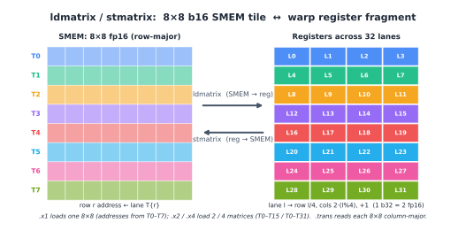
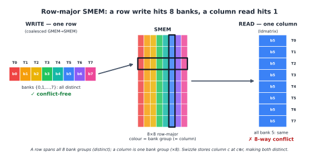
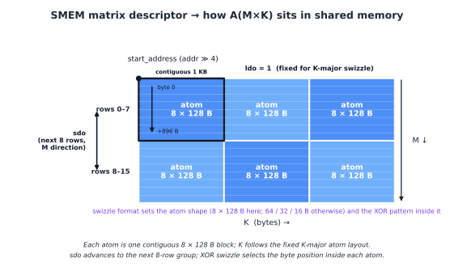
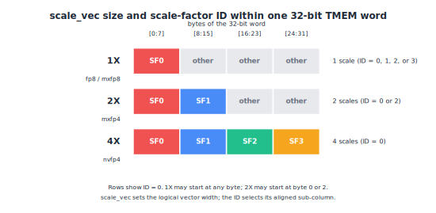

(chap_layout_generations)=
# Tensor Core 数据布局的演进

:::{admonition} 概览
:class: overview

- Ampere 的 `mma.sync` 从 warp 内各 thread 的寄存器中读取 A、B 和 C，计算结果 D 也保存在寄存器中。
- Hopper 的 `wgmma.mma_async` 可以通过 matrix descriptor 直接读取 shared memory 中的输入，累加器仍由各 thread 的寄存器持有。
- Blackwell 的 `tcgen05.mma` 将累加器移入 TMEM；block-scaled MMA 使用的 scale factors 也存放在 TMEM 中。
:::

从数学上看，三代 Tensor Core 做的事情没有改变，都是矩阵乘加：

$$
D = AB + C
$$

其中，A、B 是相乘的两个矩阵，C 是传入的累加项，D 是输出结果。公式没有告诉我们这些矩阵存放在哪里，也没有说明 Tensor Core 按什么顺序读取它们。

这正是本章要讨论的问题。Tensor Core 指令会按照固定的硬件规则来解读寄存器、shared memory 地址或 TMEM 坐标。某个元素一旦放错位置，指令就会把它当成另一个矩阵元素参与计算，最后得到错误结果。

下面我们沿着 Ampere、Hopper、Blackwell 追踪数据路径，每一代都回答同样的三个问题：MMA 从哪里读取输入？累加结果保存在哪里？kernel 又如何描述指令要求的 layout？描述具体映射时，我们会继续使用“{ref}`数据布局 <chap_data_layout>`”一章引入的记号。

## 先记住两项访存要求

在看具体指令之前，先回顾 layout 设计还要满足的两项要求。数据从 global memory 搬运时，一个 warp 访问的地址应尽量合并成少量连续且对齐的 memory transactions。访问 shared memory 时，地址还要尽量分散到不同 banks，避免 bank conflict。

加上 Tensor Core 自身的布局要求，一个 kernel 的 layout 实际上要同时通过三项检查：global memory 访问是否合并、shared memory 访问是否产生 bank conflict，以及每个元素是否位于 MMA 指令规定的位置。前两项已经在前文介绍，下面集中讨论第三项。

## Ampere：寄存器中的操作数与累加器

先看 Ampere。它常用 `mma.sync.aligned.m16n8k*` 系列指令执行 Tensor Core 矩阵乘加。`mma.sync` 从寄存器中取得 A、B 和 C，计算得到的 D 也写回寄存器。

一条 `mma.sync` 由整个 warp 协同执行。A、B 和 C/D 矩阵 tile 会按照 PTX 规定的方式，分散到 warp 中 32 个 threads 的寄存器里。每个 thread 只持有 tile 的一部分，这一部分称为该 thread 的 register fragment；把 32 个 threads 持有的部分合在一起，才得到完整的矩阵 tile。

因此，Ampere kernel 在执行 MMA 前，通常先把 A 和 B 暂存到 shared memory，再用 `ldmatrix` 把它们装入正确的 thread 寄存器，组成 `mma.sync` 需要的 fragments：

```text
SMEM --ldmatrix--> registers
registers --mma.sync--> registers
registers --普通 store--> SMEM 或 GMEM
```

`mma.sync` 执行时，唯一重要的就是各寄存器中的内容。上面是高性能 kernel 最常见的数据路径；其他 load 或寄存器操作也可以准备这些值。

### 一个具体的 fragment 映射

接下来以 `mma.sync.aligned.m16n8k16` 为例，看看一个矩阵 tile 的元素如何分配到 warp 中 32 个 threads 的寄存器里。这里令 A 为 row-major、B 为 column-major，A/B 使用 `fp16` 或 `bf16`，C/D 使用 `fp32`。整个 warp 共同计算：

$$
D_{16\times8}=A_{16\times16}B_{16\times8}+C_{16\times8}.
$$

每个 thread 的 lane ID 决定它持有 A、B、C 和 D 中的哪些元素。先从最容易观察的 C/D 累加器开始。

观察 PTX 规定的映射，可以发现它每 4 个 lanes 重复一次：lanes 0–3 负责第 0 行和第 8 行，lanes 4–7 负责第 1 行和第 9 行，后面的 lanes 依次类推。因此，可以把 32 个 lanes 分成 8 个连续的 4-lane groups。记当前 lane 的 ID 为 $l$，并定义：

$$
g=l\mathbin{//}4,\qquad t=l\bmod 4.
$$

整数除法得到 group 编号 $g$，取余得到 lane 在 group 内的位置 $t$。

第 $g$ 个 group 共同负责输出 tile 的第 $g$ 行和第 $g+8$ 行。group 内第 $t$ 个 lane 负责这两行中的第 $2t$ 列和第 $2t+1$ 列。因此，每个 lane 持有四个 `fp32` 累加值，其逻辑坐标为：

$$
(g,2t),\qquad
(g,2t+1),\qquad
(g+8,2t),\qquad
(g+8,2t+1).
$$

例如，lane 5 对应：

$$
g=5\mathbin{//}4=1,\qquad t=5\bmod4=1,
$$

所以它持有 C/D 中的四个元素：

$$
(1,2),\quad(1,3),\quad(9,2),\quad(9,3).
$$

A fragment 使用相同的 $g$ 和 $t$，但此时坐标表示的是 $(m,k)$。每个 lane 持有 8 个 `fp16` 或 `bf16` 元素，每两个元素打包在一个 32-bit register 中：

$$
\begin{aligned}
\text{register 0}:&\ (g,\ 2t+\{0,1\}),\\
\text{register 1}:&\ (g+8,\ 2t+\{0,1\}),\\
\text{register 2}:&\ (g,\ 2t+\{8,9\}),\\
\text{register 3}:&\ (g+8,\ 2t+\{8,9\}).
\end{aligned}
$$

换成矩阵坐标来看，该 lane 在 $m=g$ 和 $m=g+8$ 两行中，各持有 K 低半区和高半区的一对相邻元素。

B fragment 的坐标表示为 $(k,n)$。每个 lane 持有 4 个 `fp16` 或 `bf16` 元素，同样每两个元素打包在一个 32-bit register 中：

$$
\begin{aligned}
\text{register 0}:&\ (2t+\{0,1\},\ g),\\
\text{register 1}:&\ (2t+\{8,9\},\ g).
\end{aligned}
$$

到了 B fragment，$g$ 决定 $n$ 坐标，$t$ 与 register 编号共同决定 $k$ 坐标。

现在把这组坐标换成前一章的 layout 记号。C/D 前 8 行形成一个 `8×8` 的局部模式，可以写成：

```text
S[(8, 4, 2) : (4@laneid, 1@laneid, 1@reg)]
```

三个维度依次表示：

```text
(row, column_pair, element_in_pair)
```

其中，相邻两列组成一个 `column_pair`，`element_in_pair` 表示元素在这一列对中的位置。因此，矩阵坐标 `(row, col)` 对应的 atom 坐标是：

```text
(row, col // 2, col % 2)
```

前两个坐标确定 lane ID，最后一个坐标确定该 lane 内的 fragment slot：

```text
lane_id = row·4 + col // 2
slot    = col % 2
```

以刚才 lane 5 持有的 `(1,2)` 和 `(1,3)` 为例，它们的 atom 坐标分别是 `(1,1,0)` 和 `(1,1,1)`，因此都映射到 lane `1·4+1=5`，并分别存放在 slot 0 和 slot 1 中。

完整的 C/D fragment 在 M 方向上包含两个这样的局部模式。这里抽出 `8×8` atom 是为了方便描述布局，硬件执行的仍然是一条完整的 `mma.m16n8k16` 指令。

### `ldmatrix`：从 shared memory 构造 fragment

上面已经知道 `mma.sync` 需要什么样的 register fragment。接下来的问题是：A、B 已经放在 shared memory 中，怎样一次把它们送到正确的 thread 寄存器？Ampere 为此提供了 `ldmatrix`。下面讨论它的 `.m8n8.b16` 形式：

```text
ldmatrix.sync.aligned.m8n8.x1.shared.b16
ldmatrix.sync.aligned.m8n8.x2.shared.b16
ldmatrix.sync.aligned.m8n8.x4.shared.b16
```

这组指令由整个 warp 协同执行。`.x1`、`.x2` 和 `.x4` 分别加载 1、2 和 4 个 `8×8` 矩阵块。对于第 `m` 个矩阵块的第 `r` 行，起始地址由 lane `m·8+r` 提供。因此，`.x1` 使用 lanes 0–7 提供地址，`.x2` 使用 lanes 0–15，`.x4` 使用全部 32 个 lanes。

下图展示的是 `.x1`。图左侧的 T0–T7 分别提供八行的起始地址，但“提供地址”和“接收数据”是两回事：加载得到的 64 个元素会分发给全部 32 个 threads。lane $l$ 接收：

```text
row  = l // 4
cols = 2·(l % 4), 2·(l % 4) + 1
```

例如，第 0 行的八个元素会分配给 lanes 0–3：lane 0 接收 columns 0–1，lane 1 接收 columns 2–3，以此类推。每个 lane 接收的两个 `fp16` 元素会打包到一个 32-bit register 中。图左侧画的是地址由谁提供，图右侧画的是数据最终由谁持有。反向箭头表示 Hopper（`sm_90`）加入的 `stmatrix`，它把 register fragment 写回 shared memory。

可选的 `.trans` 修饰符会以 column-major 方式加载每个 `8×8` 矩阵块。如果不使用 `ldmatrix`，kernel 也可以通过普通 loads 和寄存器操作构造 fragment，但需要自己完成这套跨 lane 的数据分发。



### 写回结果与对 shared memory 做 swizzle

`mma.sync` 完成后，C/D 仍然保存在 register fragment 中。在 Ampere 上，epilogue 通常由各 thread 执行普通 stores，将结果写入 shared memory 或 global memory，必要时再配合 warp shuffles 或局部重排。

再看输入侧。普通 store 希望连续写入一行，`ldmatrix` 却会跨行读取；同一个 shared-memory layout 必须同时兼顾这两种访问。以一个 `(8,64)` 的 `float16` tile 为例，每行恰好占 128 bytes。在常见的 4-byte bank 粒度下，固定列的 8 个元素可能因为 128-byte row stride 而落到同一 bank，形成 8-way conflict。

Ampere kernel 通常手写 XOR 地址计算来改变 shared memory 中的物理排列。这样既能保留连续的行访问，又能把跨行读取分散到不同 banks。上一章已经详细介绍了这个过程，下面的图再次给出直观对比。



## Hopper：从 Shared Memory 直接读取

### WGMMA：由四个 warp 协同计算

到了 Hopper，MMA 的协作范围从一个 warp 扩大到一个 warpgroup。一个 warpgroup 由 4 个连续的 warps 组成，也就是 128 个 threads；它们共同执行 `wgmma.mma_async`。

更重要的变化发生在输入路径上。B 通过 matrix descriptor 从 shared memory 读取；A 既可以同样来自 shared memory，也可以来自寄存器。这两种形式通常简称为 SS 和 RS：

```text
SS: A from SMEM, B from SMEM -> wgmma -> register accumulator
RS: A from registers, B from SMEM -> wgmma -> register accumulator
```

当输入来自 shared memory 时，kernel 无需再用 `ldmatrix` 构造 A/B register fragment。WGMMA 会直接读取数据，但它仍然需要知道矩阵从哪里开始、跨到下一组数据时移动多少字节，以及 shared memory 使用了哪种 swizzle。这些信息都放在 matrix descriptor 中。

### matrix descriptor 怎样找到一个 tile

matrix descriptor 是一个保存在寄存器中的 64-bit 值。可以把它看成 WGMMA 读取 shared memory 的“寻址说明”：矩阵数据仍然留在 shared memory 中，descriptor 只记录怎样找到并遍历这个 tile。

| 字段 | descriptor 记录的内容 |
|---|---|
| `matrix start address` | shared memory 中的矩阵起点 |
| `leading dimension byte offset`（`ldo`） | 沿 leading dimension 跨到下一组数据时使用的 byte offset |
| `stride dimension byte offset`（`sdo`） | 沿 stride dimension 跨到下一组数据时使用的 byte offset |
| `matrix base offset` | 矩阵起点在 swizzle 重复模式中的位置 |
| `swizzle mode` | no swizzle、32 B、64 B 或 128 B swizzle |

WGMMA 先从 `matrix start address` 找到 tile 的起点，再用 `ldo` 和 `sdo` 跨到后续的数据组。这三个地址字段都以 16 bytes 为单位编码。至于 leading dimension 和 stride dimension 各自对应矩阵的哪个方向，则由 major mode 和 swizzle mode 决定。

以 K-major 的 swizzled layout 为例，`ldo` 使用固定编码值 1，`sdo` 表示从前 8 行跨到后 8 行的 byte offset。`swizzle mode` 决定 atom 的形状和 atom 内部的 XOR 地址重排；`matrix base offset` 则指出矩阵起点位于这套重复模式中的什么位置。起点恰好对齐到模式边界时，base offset 为 0。

下图直观地展示了这一过程。例子中的 A 使用 K-major 和 128 B swizzle：横向是 K 维，纵向是 M 维，每个色块是一个 `8×128 B` atom。左上角的黑点给出 `start_address`；K 方向按固定的 atom layout 展开，所以 `ldo` 编码为 1；向下跨过 8 行时，则使用 `sdo` 到达下一组。找到目标 atom 后，swizzle mode 再确定元素在 atom 内的 byte position。



现在就能看出 descriptor 为什么必须和真实字节排列一致。假设 TMA 按 128 B swizzle 把数据写入 shared memory，WGMMA descriptor 也要按 128 B swizzle 解释这块数据。TMA 和 WGMMA 各有一份 descriptor，它们服务于不同指令，却要描述同一种物理排列。

### 累加器仍在寄存器中

WGMMA 直接读取 shared memory 中的输入，计算得到的 C/D 仍然分散在 warpgroup 内各 thread 的寄存器中。Epilogue 随后处理这些 register fragments。每个 thread 持有多少个累加值，由 WGMMA 的 instruction shape 和累加类型决定。

于是，Hopper kernel 中会同时看到两种布局表示：shared memory 中的 A/B 用 matrix descriptor 描述，寄存器中的 A 和 C/D 则采用 per-thread register fragment。B 一直来自 shared memory，A 可以选择其中一条路径。

## Blackwell：累加器进入 TMEM

### TMEM 中的累加器

到了 Blackwell，输入侧延续了 Hopper 的做法：`tcgen05.mma` 通过 descriptor 找到 shared memory 中的 A、B，并按照 descriptor 指定的布局读取它们。某些模式也允许 A 来自 TMEM。

而最主要的变化在于累加器的存放位置。Hopper 将 C/D 保存在各 thread 的寄存器中；Blackwell 则把它们放进 Tensor Memory，也就是 TMEM。等到 epilogue 需要处理结果时，再通过 `tcgen05.ld` 将数据加载到寄存器中：

```text
A/B in SMEM --tcgen05.mma--> C/D in TMEM
C/D in TMEM --tcgen05.ld--> register fragment --store--> GMEM
```

`tcgen05.mma` 会异步执行。发出指令后，kernel 要先等待 MMA 完成，epilogue 才能通过 `tcgen05.ld` 读取结果。`tcgen05.ld` 本身也是异步的；在使用目标寄存器前，还需要执行 `tcgen05.wait::ld`。这里的读写布局必须相互匹配：`tcgen05.mma` 把结果写到哪些 TMEM lane/column，`tcgen05.ld` 就要从对应位置取出数据，并将它们分配到各 thread 的寄存器中。

### Block-Scaled MMA 的 Scale Factors

上一章的 <a href="../chapter_data_layout/index.html#tmem-scale-factors-warp">TMEM 中 Scale Factors 的跨 Warp 广播</a> 已经用 `M=128`、`SFK=4` 的例子，推导了 scale factors 在 TMEM 中的打包和 `.warpx4` replication。现在沿着数据路径继续往下看：这些值怎样进入 TMEM，MMA 又怎样选中当前需要的几个 bytes。

Block-scaled MMA 需要两组 scale factors：

```text
SFA(M, SFK)
SFB(N, SFK)
```

`SFA[m,sfk]` 用于缩放 A 第 `m` 行、第 `sfk` 个 K-scale block 的元素；`SFB[n,sfk]` 对 B 的第 `n` 列做同样的缩放。这里沿用上一章的逻辑索引顺序；PTX 表格把同一个 B 侧矩阵写成 `SFB[sfk,n]`，shape 为 `SFB_M x N`。

A 和 B 通常由 TMA 加载到 shared memory，再由 MMA 直接读取。Scale factors 需要进入 TMEM，而 TMA 的搬运路径只到 shared memory，所以中间还要经过一次 `tcgen05.cp`：

```text
A, B:     GMEM --TMA--> SMEM --tcgen05.mma--> Tensor Core
SFA, SFB: GMEM --TMA--> SMEM --tcgen05.cp--> TMEM --tcgen05.mma--> Tensor Core
```

### `tcgen05.cp` 如何写入 TMEM

先回忆上一章得到的完整 layout：

```text
S[(4, 32, 4) : (4@TCol, 1@TLane, 1@TCol)]
+ R[4 : 32@TLane]
```

其中，`S[...]` 把 `(Mgroup, lane, sfk)` 映射到 TMEM 中的 byte 位置。在带有数据类型的 TIRx layout 中，`@TCol` stride 以 buffer element 为单位。这里每个 scale factor 占 8 bits，因此逻辑 TCol 位置为 `4*Mgroup+sfk`；每四个连续位置打包进一个 32-bit hardware TCol cell。等价地，`hardware_TCol=(4*Mgroup+sfk)//4`，`byte_in_word=(4*Mgroup+sfk)%4`。

`R[...]` 表示沿 `TLane` 轴复制四份。`tcgen05.cp` 的 `.32x128b.warpx4` 形式正好完成这件事：先写入一个 32-lane window，再把同一份数据广播到另外三个 warp windows。

### `scale_vec` 的 Word 内复制

数据已经放进 TMEM，接下来还要看一个 32-bit TMEM word 内部如何排列 scales。`scale_vec` 决定 SFA 每行或 SFB 每列包含 1、2 还是 4 个逻辑 scales。为了填满 4-byte word，较短的 scale vector 会在 word 内重复：

```text
scale_vec::1X: [SF0, SF0, SF0, SF0]
scale_vec::2X: [SF0, SF1, SF0, SF1]
scale_vec::4X: [SF0, SF1, SF2, SF3]
```

`SFA_ID` 或 `SFB_ID` 则告诉 MMA 该读取哪一个副本。1X 可以选择 byte offset 0、1、2 或 3；2X 可以选择 offset 0 或 2，也就是低 half-word 或高 half-word；4X 使用全部 4 bytes，因此 ID 必须为 0。

这里的 word 内复制与前面的 `R[4 : 32@TLane]` 是两件事：前者复制 32-bit word 中的 bytes，后者把数据复制到四个 TMEM lane windows。而一个 scale 会被它所在 K-block 内的每个 K 元素共用，这是第三件事，与前两者都不同。



## 三代架构中的 Per-Thread Register Fragment

把三代架构放在一起看，矩阵数据都会在某些阶段以 register fragment 的形式分布到各 thread 的寄存器中。Fragment 的具体 shape 和映射由相应指令决定。

在 Ampere 上，`ldmatrix` 从 shared memory 加载数据，并构造 `mma.sync` 读取的 register fragment。

在 Hopper 上，`wgmma` 将累加结果写入 register fragment，交给 epilogue 继续处理。

到了 Blackwell，计算期间的累加器存放在 TMEM 中；epilogue 开始前，`tcgen05.ld` 再把结果加载成 register fragment。

因此，register fragment 在三代架构中承担着不同角色。Ampere 和 Hopper 在计算期间用它保存累加器；Blackwell 则主要在 TMEM 与 epilogue 的交界处使用它。前面介绍的 m8n8-style atom 是一个常见例子；`tcgen05.ld` 和 `tcgen05.st` 还支持其他 data-movement shapes。

## 三种数据路径的对比

| 架构 | 主要 MMA 指令 | A/B 主要来源 | 累加器位置 | Shared-memory layout 如何表达 |
| --- | --- | --- | --- | --- |
| Ampere | `mma.sync` | registers | registers | kernel 通常手写地址计算和 swizzle |
| Hopper | `wgmma.mma_async` | A 可来自 registers 或 SMEM；B 来自 SMEM | registers | matrix descriptor 记录 strides 和 swizzle mode |
| Blackwell | `tcgen05.mma` | 主要来自 SMEM；某些 A 模式可来自 TMEM | TMEM | descriptor 描述 SMEM 输入，TMEM layout 另行描述累加器和 scale factors |

三代对照来看，这条演进脉络就很清晰了：Ampere 先把输入整理成 per-lane register fragments；Hopper 让 Tensor Core 通过 descriptor 直接读取 shared memory；Blackwell 再把累加器和 scale factors 移入 TMEM。

写 kernel 时，可以顺着数据流逐段检查：上一条指令把数据写成什么排列，下一条指令就要用什么 layout 或 descriptor 去读。只要中间有一处解释不一致，Tensor Core 就可能读错元素；即使结果仍然正确，也可能因为访存方式不合适而损失性能。
