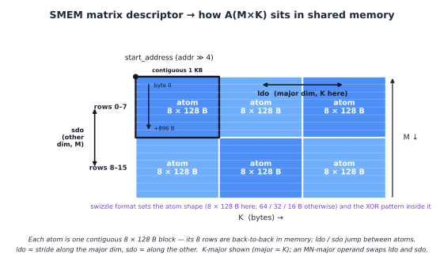

(chap_layout_generations)=
# 跨 GPU 世代的 Tensor Core 操作数布局

:::{admonition} 概览
:class: overview

- 从 Ampere 到 Hopper 再到 Blackwell，Tensor Core 执行的高层操作仍然相同：`D = A B + C`。
- 每一代发生变化的是：操作数如何到达 Tensor Core，支持哪些 tile shape 与 dtype，以及 accumulator 放在哪里。
- Ampere 使用 warp-level register fragment。Shared memory tile 通过 `ldmatrix` 加载到 fragment 中，accumulator 保持在寄存器里。
- Hopper 让 `wgmma` 通过 matrix descriptor 直接从 shared memory 读取操作数。Descriptor 会命名 Tensor Core 期望的 shared-memory swizzle format。
- Blackwell 保留 shared-memory operand path，但把 accumulator 移到 TMEM 中。Block-scaled MMA 还会通过 TMEM staging scale factor。
- 两个内存约束跨所有世代都始终存在：global memory coalescing 和 shared memory bank conflict。
:::

从远处看，Tensor Core 操作似乎一直很稳定。它把 A 和 B 的 tile 相乘，加上 accumulator C，并产生 D。这个形式从 Volta 起就是这样。

但围绕这个操作的细节并没有保持不变。在某一代上很快的 kernel，到了下一代可能会变慢。使用错误布局的 kernel 也可能算出错误答案，即使逻辑数学仍然写作 `D = A B + C`。原因是 Tensor Core 消费的不是抽象矩阵，而是非常具体的硬件布局中的操作数。

本章会沿着三代硬件追踪这份布局契约。Ampere 通过 warp-level register fragment 暴露 Tensor Core。Hopper 把输入操作数移到 shared memory descriptor 上。Blackwell 保留 shared memory 操作数，但把 accumulator 移到 TMEM 中。操作仍然是 matrix-multiply-accumulate，但进入 Tensor Core 和离开 Tensor Core 的路径每一代都在改变。

{ref}`数据布局 <chap_data_layout>` 一章中的布局记号，是我们描述这些契约的语言。Blackwell TMEM 的细节会在 {ref}`chap_tmem` 中单独介绍。

## 两个始终存在的约束

在 Tensor Core 参与之前，两个普通内存约束就已经在塑造 GPU kernel 的布局。

第一个是 global memory coalescing。当一个 warp 的 32 个 lane 发起 global memory load 时，内存系统希望这些地址落在少量连续且对齐的 memory segment 中。如果地址分散，warp load 就会变成多次 memory transaction。同样的逻辑数据搬运会消耗更多带宽和更多时间。

第二个是 shared memory bank conflict。Shared memory 被分成 32 个 bank。如果 warp 中多个 lane 访问映射到同一个 bank 的不同地址，这些访问无法同时服务，硬件会把它们串行化。因此，一个看起来只是扁平 shared memory array 的布局，可能因为 bank pattern 而变慢。

Swizzling 是修复 shared memory 侧问题的常见方法。逻辑 tile 保持不变，但物理地址映射被重排，让访问 pattern 分散到不同 bank 上，而不是堆到同一个 bank。

这两个约束即使在完全不用 Tensor Core 的 kernel 中也存在。Tensor Core kernel 会再加上第三个约束：操作数必须按照 Tensor Core 指令自身期望的布局排列。本章剩下的内容，就是看这个第三个约束如何在 Ampere、Hopper 和 Blackwell 之间变化。

## Ampere：Warp Lane 上的寄存器 Fragment

在 Ampere 级别的 GPU 上，主要 Tensor Core 指令是 warp-level 的 `mma.sync.aligned.m16n8k*` 系列。最重要的事实是这条指令从哪里读写数据：寄存器。

A、B，以及 C 或 D accumulator，都是分布在 warp 的 32 个 lane 上的 per-thread register fragment。Shared memory 只是 staging area。在 MMA 运行之前，operand tile 必须从 shared memory 移到这条指令期望的精确 register fragment 布局中。

数据路径如下：

```text
SMEM to registers with ldmatrix
registers to registers with mma.sync
registers back to SMEM with ordinary stores
```

Ampere 的大部分布局故事都来自这条路径。Kernel 必须先把 tile 以一种能高效加载的形式存入 shared memory，然后用 `ldmatrix` 产生 `mma.sync` 需要的 register fragment。

## Ampere Tensor Core 期望的输入

Ampere Tensor Core 读取由 8 by 8 subtile unit 构成的 register fragment。这些 unit 正是 `ldmatrix` 加载的单位，也是 MMA 消费的单位。

以带 fp16 或 bf16 输入、fp32 accumulation 的 `mma.m16n8k16` 为具体例子。Accumulator tile 的形状是 `16 by 8`，并以固定 pattern 分布到 32 个 lane 上。

对于 C 或 D accumulator，lane `l` 持有的行是：

```text
l / 4
l / 4 + 8
```

列是：

```text
2 * (l % 4)
2 * (l % 4) + 1
```

因此每个 lane 拥有四个 fp32 accumulator 值：来自两个 8-row half 的两行，与两个相邻列交叉组合。连续四个 lane 覆盖某一行的八个列。

A operand 使用同样的 M-side row carve。K 维度分散在 `l % 4` 以及 lane 持有的寄存器中。对于 fp16 或 bf16，每个 32-bit 寄存器会打包两个 K 值。

B operand 使用匹配的 K placement，并把 N 侧分散到 lane group 和寄存器中。

具体细节会随 instruction shape 和 dtype 而变，但原则固定：Tensor Core 期望一个特定的 per-lane register fragment。如果值没有按这个 pattern 放到这些寄存器里，指令就会把错误元素相乘。

在布局记号中，m8n8 fragment 就是用命名 lane 轴写出的那类 pattern，例如：

```text
S[(8, 4, 2) : (4@laneid, 1@laneid, 1@m)]
```

两个 `laneid` 迭代器共同描述 row 和 column piece 如何分散到 lane 上，而最后的 `m` component 描述 per-lane register slot。

## `ldmatrix`：从 Shared Memory 到寄存器 Fragment

`ldmatrix` 是 Ampere 上连接 shared memory 与 Tensor Core register fragment 的指令。它是 warp-collective load。一条指令会把一个或多个 8 by 8 的 16-bit 矩阵从 shared memory 移到 `mma.sync` 期望的分布式 register layout 中。

指令形式是：

```text
ldmatrix.sync.aligned.m8n8.x1.shared.b16
ldmatrix.sync.aligned.m8n8.x2.shared.b16
ldmatrix.sync.aligned.m8n8.x4.shared.b16
```

并且可以带一个可选的 `.trans` qualifier。

`.x1`、`.x2` 和 `.x4` 形式分别加载一个、两个或四个 8 by 8 矩阵。Row base address 由 lane 提供。对于矩阵 `m` 和行 `r`，base address 来自 lane `m * 8 + r`。这意味着 `.x1` 使用 lane 0 到 7 作为 row address，`.x2` 使用 lane 0 到 15，`.x4` 使用 lane 0 到 31。

结果会直接落入 MMA fragment。对于基本的 8 by 8 情况，lane `l` 会收到 Tensor Core 期望的 row/column pair。普通 per-lane `ld.shared` 指令循环必须手动复现这种 scatter。`ldmatrix` 则把 shared-memory 到 fragment 的重排作为一条 warp-collective 指令完成。

`.trans` 形式会在加载每个 8 by 8 矩阵时做 transpose。当 operand 的存储方向与 MMA 指令期望方向相反时，会使用这个形式。


## 写回 Ampere Fragment

`mma.sync` 完成之后，accumulator 仍然是 register fragment。Epilogue 必须把这个 fragment 移出去。

Ampere 上没有专门的 `ldmatrix` 反向指令。Kernel 使用普通 per-thread store，有时在 store 之前配合 warp shuffle 或局部重排，把 accumulator 写入 shared memory 或 global memory 中的有用布局。

这让 Ampere 模型保持简单，但也把很多布局工作暴露给 kernel。输入侧用 `ldmatrix` 创建 fragment。Compute 指令读写 register fragment。输出侧由这些 fragment 上的普通 store 处理。

## Ampere 上的 Swizzle

Ampere kernel 已经需要 shared memory swizzle。原因是 shared memory tile 通常以一种访问 pattern 写入，又以另一种访问 pattern 读取。

假设一个 tile 沿 row 从 global memory 填充。Row-major layout 让这种写入 coalesced 且 bank friendly。但 `ldmatrix` 稍后可能用一种等价于沿 column 或跨 8 by 8 subtile 行走的 pattern 读取这个 tile。使用普通 row-major layout 时，这些读取可能堆到同一个 shared memory bank 上。

对于一个简单的 `(8, 64)` float16 tile，一行是：

```text
64 * 2 bytes = 128 bytes
```

这刚好是一整条 shared memory bank line。沿固定 column 向下走时，每行前进 128 byte，因此 bank index 会重复。八行可能全部落到同一个 bank 上，产生 8-way conflict。

改成普通 column-major layout 并不能完整解决问题。它通常只是把 conflict 移到另一次访问上。Row write 变差，而 column-style read 变好。

XOR swizzle 通过让物理 column 依赖 row 来解决这个问题。一个简单版本是：

```text
physical_col = logical_col xor row
```

逻辑 tile 不变。Shared memory 中的物理 placement 被重排，使 row-style write 和 Tensor Core read pattern 都能避免 bank conflict。

在 Ampere 上，这种 swizzle 通常通过手写 shared memory index math 表达。后续世代会把它变成硬件 engine 使用的 descriptor format 的一部分。


## Hopper：`wgmma`、Shared Memory Descriptor 和 Swizzle Format

Hopper 改变了 Tensor Core 路径的输入侧。Hopper `wgmma` 不再要求每个 operand 都通过 `ldmatrix` 加载到寄存器，而是可以直接从 shared memory 读取 operand。

B operand 从 shared memory matrix descriptor 中读取。A operand 可以从 shared memory descriptor 读取，也可以从寄存器读取，对应 `.ss` 和 `.rs` 形式。

这移除了 SMEM-sourced operand 上显式的 `ldmatrix` 步骤。但它没有移除布局要求。Tensor Core 仍然期望 operand 以精确的 shared memory format 存放。区别在于，现在这个 format 通过 matrix descriptor 告诉硬件。

## Hopper Tensor Core 期望的输入

Hopper shared memory matrix descriptor 是 shared memory 中矩阵 tile 的紧凑描述。它告诉 `wgmma` 如何把逻辑 operand coordinate 转换成 shared memory address。

Descriptor 包含如下字段：

```text
start address
leading dimension offset
stride dimension offset
swizzle mode
base offset
```

具体解释取决于 operand major mode。对于 K-major tile，一个 stride 沿 K 前进，另一个沿 M 前进。对于 MN-major tile，这些角色会交换。

Swizzle mode 是 shared memory descriptor format 之一，例如：

```text
SWIZZLE_NONE
SWIZZLE_32B
SWIZZLE_64B
SWIZZLE_128B
```

Swizzle mode 决定两件事。它决定 descriptor 使用的 atom shape，也决定在 atom 内应用的 XOR permutation。例如，128-byte swizzle mode 会把 operand 看作 8-row by 128-byte atom 的网格，并在每个 atom 内应用 swizzle。

Kernel 仍然必须正确放置 byte。TMA 通常负责填充 shared memory tile，而 TMA descriptor 必须使用与后续 `wgmma` descriptor 命名的 swizzle format 相同的格式。如果 TMA 写入一个 128-byte swizzled tile，`wgmma` descriptor 就必须把它作为 128-byte swizzled tile 读取。如果 descriptor 和数据不一致，Tensor Core 就会读取被打乱的 operand。

这是相对 Ampere 的主要变化。Swizzle 不再只是隐藏在手写 shared memory indexing 里。Hopper 把它变成一等 descriptor format。写 tile 的 TMA load 和读 tile 的 `wgmma` 指令都可以命名同一种 format。



## Hopper 输出仍然使用寄存器

Hopper 改变了输入路径，但 accumulator 仍然位于寄存器中。

一条 `wgmma` 指令会把 accumulator 写成 per-thread register fragment。具体 fragment 大小和寄存器数量取决于 instruction shape，例如 `m64nNk16` 中 N 会改变 accumulator register 的数量。但基本思想和 Ampere 相同：epilogue 消费的是 register fragment。

因此，Hopper 具有混合布局模型。输入 operand 可以直接来自 shared memory descriptor，并由硬件描述 swizzle。输出 accumulator 仍然是一个 register layout 问题。

Blackwell 改变了输出侧。

## Blackwell：`tcgen05` 和 TMEM

Blackwell 保留了数据 operand 上的 shared memory descriptor 思想。A 和 B 仍然以 Tensor Core 期望的布局准备在 shared memory 中。有些 mode 也可以从 TMEM 读取 A operand。

主要变化是 accumulator。`tcgen05.mma` 会把 accumulator 写入 Tensor Memory，也就是 TMEM，而不是把它作为长生命周期 register fragment 保持住。在 compute phase 中，accumulator 位于 TMEM。Epilogue 随后用 `tcgen05.ld` 把它加载回寄存器。

这把输出布局问题从寄存器移动到了 TMEM。Kernel 必须分配 TMEM，选择正确的 TMEM 布局，等待 MMA 完成，然后使用匹配的 `tcgen05.ld` 路径把 accumulator fragment 恢复出来供 epilogue 使用。

`cta_group::1` 和 `cta_group::2` 如何把 accumulator 切分到一个或两个 CTA 上，会在 {ref}`chap_tensor_cores` 中介绍。与早期世代差异最大的布局，是 block-scaled scale-factor layout。

## TMEM 中的 Scale Factor Layout

Block-scaled MMA mode，例如 `mxfp8` 和 `nvfp4`，会添加 scale-factor operand。除了 A 和 B，MMA 还会读取：

```text
SFA(M, SFK)
SFB(N, SFK)
```

其中 `SFK` 是 K scale block 的数量。

数据 operand A 和 B 位于 shared memory。Scale factor 位于 TMEM。因此它们有不同的数据移动路径。

TMA 从 global memory 加载到 shared memory。它不会直接加载到 TMEM。因此 scale factor 通常分两步移动：

```text
global memory to shared memory with TMA
shared memory to TMEM with tcgen05.cp
```

只有完成这次 copy 后，scale factor 才会位于 `tcgen05.mma` 期望读取的内存空间中。

TMEM scale-factor layout 使用 TMEM 的硬件坐标 Lane 和 Col。在 TIRx 布局记号中，这些轴写作 `TLane` 和 `TCol`。

一个 128-row scale vector 会紧凑压缩到一个 32-lane group 中，然后复制到 TMEM 的四个 32-lane window 上。在布局记号中，核心 pattern 是：

```text
S[(32, sf_per_mma) : (1@TLane, 1@TCol)] + R[4 : 32@TLane]
```

Shard 放置 base 32-row group：

```text
TLane = r
TCol  = s
```

Replica term 在 lane offset 0、32、64 和 96 处添加副本：

```text
TLane = r + 32 * q, where q in {0, 1, 2, 3}
TCol  = s
```

这就是 `warpx4` broadcast pattern。同一组紧凑 scale factor 会在完整 128-lane TMEM 空间中变得可见。

32-bit `TCol` cell 内部还有 byte packing。Packing 取决于 `scale_vec` mode：

```text
1X: one scale value is broadcast across the 32-bit cell
2X: two scale values are packed, each duplicated
4X: four K-block scale values are packed
```


这个 packing 在 Ampere 或 Hopper 中没有直接对应物，因为那些世代没有用于 `tcgen05` block-scaled MMA 的 TMEM scale-factor operand。

在 `cta_group::2` 中，scale factor 会跟随它们缩放的数据。SFA 缩放 A，因此它会按 M 在两个 CTA 之间切分，匹配每个 CTA 拥有的 A 行。SFB 缩放 B，而 B 被计算的两个 CTA half 共享，因此 SFB 会 multicast 给两个 CTA（{ref}`chap_tensor_cores`）。

## 一个反复出现的 Fragment

虽然周围的内存路径不断变化，但有一个结构反复出现：m8n8-style register fragment。

在 Ampere 上，`ldmatrix` 构造这个 fragment，供 `mma.sync` 读取。

在 Hopper 上，`wgmma` 把 accumulator 写成 register fragment，供 epilogue 使用。

在 Blackwell 上，accumulator 在 compute 期间位于 TMEM，但 `tcgen05.ld` 会在 epilogue 处理和存储之前，把它重新加载到 register fragment 中（{ref}`chap_tmem`）。

所以 fragment 并没有消失，它的角色变了。早期世代会让 accumulator 在整个 compute phase 中都留在这里。Blackwell 主要在 TMEM 与 epilogue 之间的边界上使用它。

## 主线

在 Ampere 上，kernel 显式构建 Tensor Core register fragment。Shared memory swizzle 大多由 kernel 通过 index math 负责。

在 Hopper 上，Tensor Core 可以通过 matrix descriptor 直接从 shared memory 读取 operand。Swizzle 变成 TMA 和 `wgmma` 共享的命名 descriptor format。

在 Blackwell 上，输入侧仍然使用 shared memory operand，但 accumulator 移到 TMEM 中。Block-scaled MMA 还添加了必须 staged 到 TMEM 的 scale-factor operand。

Descriptor 并不会消除布局工作。它们只是把契约显式化。Kernel 仍然必须确保数据搬运路径、内存布局和 Tensor Core 指令全都一致。写入 swizzled SMEM tile 的 TMA descriptor、读取这个 tile 的 MMA descriptor，以及附着在 buffer 上的布局，都必须描述同一个物理排列。

如果其中任意一项不一致，硬件仍然会运行。它只会读到错误的 byte，或者以很慢的方式读取它们。这就是为什么布局不是 Tensor Core kernel 周围的装饰；它是指令接口的一部分。
