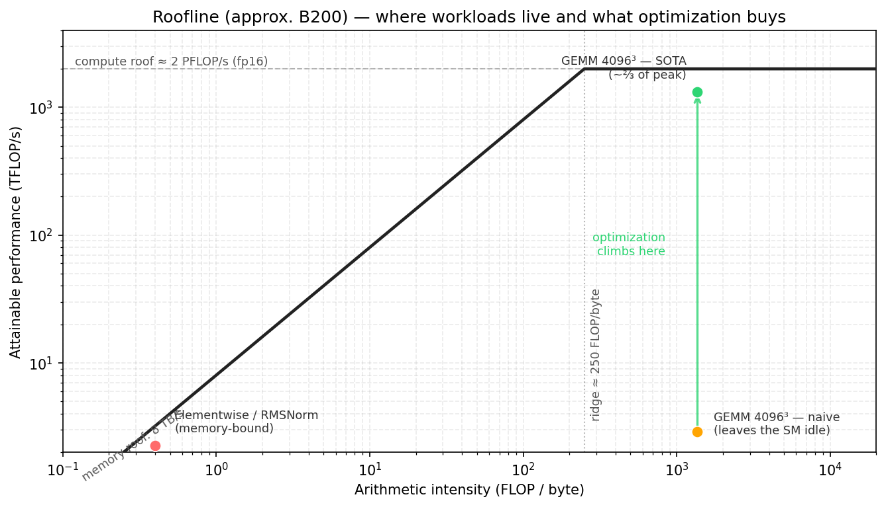
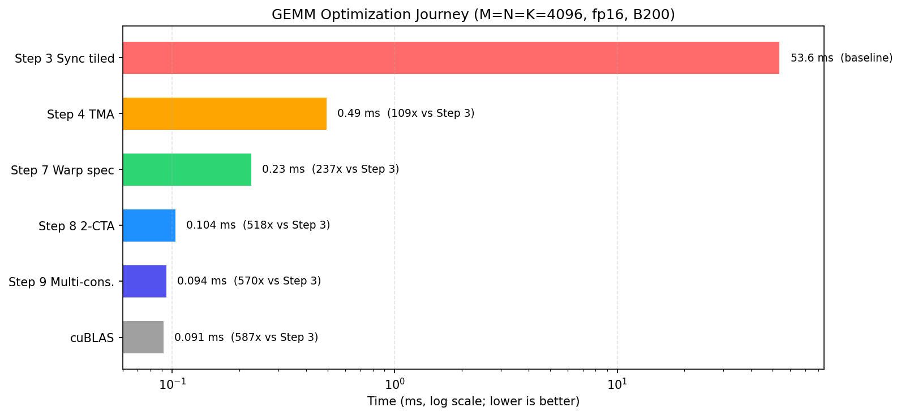

(chap_performance)=
# Kernel 性能从何而来

:::{admonition} 概览
:class: overview

- roofline 模型用内存带宽和计算吞吐给出 kernel 的性能上限，而算术强度决定当前受哪个上限限制。
- 低算术强度通常意味着 memory-bound，也就是性能主要受内存带宽限制。优化重点是减少 HBM 流量、提高复用、融合操作，并尽量接近内存带宽上限。
- 高算术强度通常意味着 compute-bound，也就是性能主要受计算吞吐限制。优化重点是让 Tensor Cores 保持忙碌，并通过重叠执行（overlap）减少计算路径上的空闲时间。

:::

一个 kernel 快不快，不能只看它的绝对吞吐数字，而要看它离硬件性能上限有多近。像 330 TFLOP/s 这样的数字单独看起来可能很大，但如果对应的 GPU 在 dense fp16 或 bf16 Tensor Core 计算上能够持续达到约 2 PFLOP/s，那么这个数字的意义就完全不同了。没有性能上限作为参照，我们就很难判断一个 kernel 是已经接近硬件极限，还是仍然让芯片的大部分算力处于空闲状态。

本章使用 roofline 模型来建立这个参照，并用 NVIDIA B200 作为具体的硬件平台来代入分析。本章会沿用 {ref}`chap_background` 中的约定，我们使用便于推理的近似上限：dense fp16 或 bf16 Tensor Core 吞吐约为 2 PFLOP/s，HBM3e 带宽约为 8 TB/s。实际可达到的性能会受到具体设备配置、时钟频率、功耗限制和测量环境等因素影响。因此，这里的数字应理解为便于分析的近似上限，而不是官方规格中的精确数值。


## roofline 模型

从性能分析的角度看，一个 kernel 的执行时间主要来自两部分：数据搬运和计算。roofline 模型给出了一个简单的判断方式：kernel 的性能上限由计算吞吐上限和内存带宽上限共同决定，更具体地说，是由二者中更低的那个上限决定。

这里的计算吞吐上限，也就是“峰值计算吞吐”，指的是硬件在当前 kernel 所使用的计算路径上能够提供的最大 FLOP/s。对于 B200 上的 dense FP16/BF16 Tensor Core GEMM，这个上限通常来自 Tensor Core 吞吐；对于 scalar 或 elementwise kernel，这个上限则可能来自 CUDA Core、特殊函数单元，或者其他指令执行单元的吞吐。

内存带宽对应的性能上限可以用 HBM 带宽乘以算术强度来估算。如果一个 kernel 每搬运一个 byte 只做少量计算，它的性能通常会被 HBM 带宽限制；如果每个 byte 对应很多次计算，那么它更有机会进入 compute-bound 区域，性能上限也更可能由计算吞吐决定。


以 FLOP/s 为单位，基本的 roofline 性能上界是：

$$
\text{可达到的性能}
\le \min(\text{峰值计算吞吐}, \text{内存带宽} \times \text{算术强度})
$$

算术强度定义为：

$$
\text{算术强度}
= \frac{\text{计算量}}{\text{搬运的数据量}}
$$

这里的计算量指算法上真正想完成的数学计算量，通常用 FLOPs 表示，而不是 kernel 执行过程中所有指令的总数。FLOPs 的统计需要遵循常用约定：一次浮点加法或乘法计为 1 FLOP，一次 fused multiply-add，也就是融合乘加 `a * b + c`，计为 2 FLOPs。因此，对于 GEMM `C = A @ B`，如果 `A` 的形状是 `M × K`，`B` 的形状是 `K × N`，那么 GEMM 的计算量通常记为：

$$
2 \times M \times N \times K
$$

这里的“搬运的数据量”也必须对应到具体的内存层级。对于 HBM roofline 模型，它指的是 kernel 对 HBM 产生的读写字节数；对于 L2 roofline 模型，它指的是经过 L2 的读写字节数；对于 SMEM roofline 模型，它指的是 shared memory 中的读写字节数。本章默认讨论的是 HBM roofline 模型。


在 roofline 图中，横轴表示**算术强度**，单位是 **FLOP/byte**；纵轴表示 kernel 能达到的性能。由内存带宽给出的性能上限是一条斜线：

$$
\text{性能} = \text{带宽} \times \text{算术强度}
$$
由计算吞吐给出的性能上限是一条水平线：

$$
\text{性能} = \text{峰值计算吞吐}
$$

这条水平线和前面的内存带宽上限线相交的位置称为**拐点（ridge point）**，也就是从 memory-bound（受内存限制）过渡到 compute-bound（受计算限制）的分界点：

$$
\text{拐点} = \frac{\text{峰值计算吞吐}}{\text{带宽}}
$$

用本章的 B200 近似数值代入，拐点的单位是 FLOP/byte：

$$
\text{拐点}
\approx \frac{2000}{8}
\approx 250
$$
这个值表示：在这个粗略模型下，一个 kernel 平均每从 HBM 搬运 1 byte 数据，需要产生大约 250 次 FLOP，才有可能摆脱 HBM 带宽限制，接近 Tensor Core 的计算吞吐上限。
也就是说，在 HBM roofline 模型下，如果一个 kernel 的算术强度低于这个值，它就是 **memory-bound**。它无法达到 Tensor Core 的峰值吞吐，因为它每秒搬不来足够多的数据，导致计算单元等待数据。

roofline 模型真正有用的地方并不在于那张图本身，而在于它能告诉我们：当前到底是哪一种资源在限制性能。对于 memory-bound 的 kernel，稍微改进几条数学指令并不会让它变快；对于 compute-bound 的 kernel，省下几个无关紧要的字节也不会带来本质提升。优化的第一步，是先判断这个 kernel 位于拐点的哪一侧。




## 常见算子的算术强度

算术强度很多时候首先取决于算法本身，而不是具体实现。通常在写 kernel 之前，我们就已经可以先做一个大致判断。


### Elementwise 和 Reduction

像 GELU 这样的 elementwise kernel，以及像 RMSNorm 这样的 reduction 类 kernel，通常都要读写很大的 tensor，但每个元素上真正做的计算并不多。

因此，这类 kernel 的算术强度通常很低，在 roofline 图上会落在拐点很左侧。优化重点通常不是增加计算指令，而是减少 HBM 流量，并尽量接近内存带宽上限。常见方法包括 fusion（融合多个操作，避免中间结果写回 HBM）、coalesced / vectorized 访存（让相邻线程或单条指令更规整地读写连续数据）、在适用时使用 TMA 这样的硬件搬运机制，以及更小的存储 dtype。如果没有数据复用，也没有 fusion 的机会，那么内存上限就是这类 kernel 真正的性能上限。


### GEMM

GEMM 则正好相反。它的算术强度会随着问题规模增大而提高，因为每个被加载进来的 tile 都可以被复用，用来执行许多次乘加操作。

对于一个方阵 fp16 matmul，假设 M = N = K，理想情况下的算术强度（AI）大约为：

$$
\mathrm{AI} \approx \frac{2N^3}{3 \cdot 2N^2}
= \frac{N}{3}
$$

单位是 FLOP/byte。这个估计假设 A 和 B 各只从 HBM 读取一次，C 只写入一次，beta 为零，也就是不需要把原来的 C 从 HBM 读回来再累加；同时还假设片上复用是完美的，并且没有额外的 metadata、padding 或冗余访存。这里的 metadata 指伴随数据一起使用的额外描述信息，比如低精度格式里的 scale。真实 kernel 搬运的数据通常会比这个理想模型更多，但这个估计仍然很有参考价值。

### Attention

Attention 介于这两个极端之间。它的算术强度取决于序列长度、head dimension、tiling 方式、mask 方式，以及是否会实际生成中间张量。

标准 attention 的核心问题在于 score matrix，也就是由 `QK^T` 得到的 attention 分数矩阵。如果 kernel 把 score matrix 写到 HBM，之后又从 HBM 读回来，就会让一个很大的中间结果在内存中来回搬运。Flash Attention，包括 Flash Attention 4，通过把相关的 tile 保留在片上，并避免这次 HBM 往返，从而提高算术强度。

所以，attention 优化一部分是减少 HBM 流量、提高算术强度的问题，一部分是调度问题。算法层面会被改写，让更少的数据写入或读出 HBM；kernel 层面再通过调度，让剩下的数据搬运和计算尽可能重叠。


## 当算术强度较低时

在 roofline 模型中，如果一个 kernel 位于拐点左侧，它通常被认为是 memory-bound。此时性能主要受 HBM 带宽限制，而不是受算术指令吞吐限制；Tensor Cores 或 CUDA cores 可能会因为等待数据而空转。面对这种情况，首先要看能不能提高算术强度，也就是让每次从 HBM 搬来的数据支持更多计算。

算子融合通常是最直接的方法。低算术强度的一个常见来源是：kernel 把中间张量写入 HBM，而下一个操作又立刻把它读回来。把 producer（产生中间结果的操作）和 consumer（使用中间结果的操作）融合在一起后，这个中间结果就可以保留在寄存器或片上存储中，例如 SMEM 或 TMEM，从而避免这次 HBM 往返。

例子包括：

```text
GEMM 与 elementwise epilogue 融合
将 normalization 融合进相邻的算子
在不实际生成完整 score matrix 的情况下计算 attention
```

另一个办法是通过 blocking 提高复用。Blocking 的意思是把大问题切成较小的 tile，让 tile 加载到片上后被多次使用。对 GEMM 来说，A 的一个元素会参与同一行多个 C 元素的计算，B 的一个元素也会参与同一列多个 C 元素的计算；如果每次使用都重新从 HBM 读取，HBM 流量就会很大。相对于没有充分复用 A/B 数据的实现，blocking 把 A/B tile 留在片上复用，让同样的 `2MNK` 次有效计算对应更少的 HBM 访问字节数，因此 HBM roofline 下的算术强度更高。其他 workload 只要存在对同一个 tile 的重复使用，也可以采用同样的思路。

我们可以先用一个简化模型来刻画这种复用。对一个 CTA tile，假设它计算 `B_M × B_N` 的 C tile；每个 K-stage 加载 `B_M × B_K` 的 A tile 和 `B_K × B_N` 的 B tile；每个元素大小是 `s` bytes。先只看这一 stage 的 A/B global memory 访问，不考虑 C read/write，那么这一 stage 的算术强度近似为：

$$
\mathrm{AI}
\approx
\frac{2 \times B_M \times B_N \times B_K}
{s \times (B_M \times B_K + B_K \times B_N)}
=
\frac{2 \times B_M \times B_N}
{s \times (B_M + B_N)}
$$

如果 `B_M = B_N = B`，就变成：

$$
\mathrm{AI} \approx \frac{B}{s}
$$

举个带数字的例子。这里整个 GEMM 的矩阵尺寸 `M`、`N`、`K` 不变，总计算量 `2MNK` 也不变；我们只是在比较同一个 GEMM 下不同 CTA tile 大小带来的片上复用差异。假设是 FP16/BF16，所以 `s = 2 bytes`，并且每个 K-stage 取 `B_K = 64`。如果 CTA tile 是 `16 × 16`，这一 stage 的计算量是：

$$
2 \times 16 \times 16 \times 64 = 32768
$$

A/B 从 global memory 读取的数据量是：

$$
2 \times (16 \times 64 + 64 \times 16) = 4096
$$

所以这一 stage 的 A/B global-memory 算术强度是 `32768 / 4096 = 8 FLOP/byte`。如果把 CTA tile 改成 `64 × 64`，仍然使用 `B_K = 64`，计算量变成：

$$
2 \times 64 \times 64 \times 64 = 524288
$$

A/B 读取的数据量变成：

$$
2 \times (64 \times 64 + 64 \times 64) = 16384
$$

于是算术强度变成 `524288 / 16384 = 32 FLOP/byte`。这就是 blocking 最基本的 roofline 直觉：tile 变大后，每个从 global memory 读来的 A/B 元素在片上被复用的次数更多，A/B global memory 访问对应的算术强度也更高。

实际 kernel 还要加上 C read/write、L2 reuse、occupancy、register pressure、SMEM bandwidth、Tensor Core issue 等因素，所以这只是第一层模型。但它抓住了 blocking 提高算术强度的核心原因：同一个 A/B 元素从 global memory 读进来后，会在 tile 内服务更多次乘加。

除了增加片上复用、减少重复 HBM 读取之外，还可以减少每个数值本身占用的 byte 数。从 fp32 换成 fp16、fp8 或 fp4，可以减少数据搬运量，并提高每 byte 对应的有效计算量。不过，如果这些格式需要额外的 metadata、scale factor，或者额外的转换开销，那么实际收益会小于只按 dtype 大小比例估算出来的收益。Scale factor 指低精度数值对应的缩放系数，block-scaled fp8 和 fp4 就是这样的例子。即便如此，更小的 dtype 仍然通常是让 kernel 在 roofline 图上向右移动的最直接方法之一。

如果算术强度很难再提高，就需要接受这个 kernel 本质上是 memory-bound 的，并把目标改成尽量接近内存带宽上限。比如纯 copy、简单的 elementwise 操作，或者对大 tensor 做一次 single-pass reduction，通常没有足够的中间结果可以融合，也没有足够的复用可以利用。这时优化重点就变成让内存访问少搬、顺序搬，并保持内存管线忙碌：

```text
每个 byte 只搬一次
避免冗余读取
使用 coalesced 或 vectorized 访存
对规则的大块 tile 使用 TMA
让足够多的 memory requests 同时进行，避免内存管线空闲
```

一旦一个 memory-bound kernel 已经达到内存上限，进一步优化计算部分就不会有帮助。唯一能让它更快的方法，是改变算法，让它搬运更少的数据。

## 优化阶梯

roofline 模型可以帮助我们判断一个 kernel 的性能上限，但它并不说明实际实现中要付出多少代价才能接近这个上限。

一个大规模 fp16 GEMM 在理论上可能是 compute-bound 的。但这只说明 HBM 层的内存上限不是主要瓶颈，并不意味着任意一种实现都能达到 Tensor Core 的计算上限。要缩小这中间的差距，需要正确的指令、layout、staging、同步和调度。后续 GEMM 章节会在 B200 上通过一系列步骤展示这一点：每一步都保持相同的基本算法，但改变 tile 的计算方式或调度方式。

在 GEMM 的优化阶梯中，第一个明显的实测性能跃升，是从 thread-copy tiled 路径切换到 TMA-backed 路径。前者由 CTA 中的普通线程执行 GMEM 到 SMEM 的拷贝；后者把这种规则的 tile 搬运交给 TMA 硬件引擎，让 kernel 可以通过硬件管理的大块拷贝来持续为 Tensor Cores 提供数据。

在第一次跃升之后，主要的提升来自重叠执行和调度。TMA 将后续 tile 提前搬入 shared memory；`tcgen05.mma` 异步执行矩阵乘；epilogue（输出后处理阶段）则负责对已经算完的结果做输出侧处理，例如读出 accumulator、做必要转换，并写回内存。Software pipelining 和 warp specialization 会把这些部分组织起来，让多个硬件引擎能够同时保持活跃。

有些中间步骤本身不一定立刻提速。像 warp specialization 这样的步骤，可能会暂时把资源花在一种新的结构上，而这个结构并不会立刻改善性能数字。但如果它能支持后续更复杂的重叠执行，而更简单的结构无法表达这种重叠执行，那么它仍然是正确的一步。

下图给出后续 GEMM 章节会展开的优化路线。这里先把它当作路线图来看：每个点对应一种实现结构，后续章节会逐步解释 TMA、warp specialization、CTA cluster 和 multi-consumer execution 分别改变了什么。



## 重叠执行是最主要的优化抓手

一旦 GEMM 已经是 compute-bound 的，并且已经使用了 Tensor Cores，剩下的性能差距通常来自于硬件的空闲时间。

一个简单的 kernel 可能会这样执行：

```text
load tile k
compute tile k
store tile k
load tile k + 1
compute tile k + 1
store tile k + 1
```

这种调度会让硬件处于空闲状态。load 在运行时，Tensor Core 可能在等待；Tensor Core 在计算时，copy engine 可能处于空闲；store 在写回时，两者都可能在等待。

相比之下，一个 pipelined kernel 会尽量让相互独立的阶段同时运行：

```text
load tile k + 1
compute tile k
store tile k - 1
```

这是 Blackwell kernel 结构背后的核心思想。TMA 负责异步数据搬运。`tcgen05.mma` 负责异步 Tensor Core 计算。epilogue 和 store 负责输出侧处理与写回。`mbarrier` 对象把这些阶段连接起来，让每个 consumer 只在真正需要数据时等待。

重点不是消除依赖关系，而是围绕依赖关系进行调度。tile `k` 的 MMA 不能在 tile `k` 加载完成前开始。tile `k` 的 epilogue 不能在 tile `k` 的 MMA 完成前读取 accumulator。但 tile `k + 1` 的 load 通常可以在 tile `k` 的 MMA 正在执行时运行，tile `k - 1` 的 store 也通常可以同时排空。

这就是为什么后面许多章节都会关注异步机制：

```text
TMA：负责 global memory 到 shared memory 的搬运
mbarrier：负责 load completion（加载完成通知）和 resource handoff（资源交接）
tcgen05：负责异步 Tensor Core 计算
TMEM：保存生命周期较长的 accumulator
warp specialization：分离 producer 和 consumer 角色
cluster：支持更大的 cooperative tile 和 multicast
```

这些机制各不相同，但都服务于同一个调度目标：让多个硬件路径同时运行有用工作。

## SM 占用率与资源压力

除了重叠执行（overlap），GPU 还可以通过提高 SM 占用率（occupancy）来隐藏延迟。

SM 占用率描述的是一个 SM 上同时驻留了多少工作。如果一个 warp stall 了，scheduler 就可以切换去执行另一个已经 ready 的 warp。它通过维持一组相互独立、随时可以被调度的 warp 来隐藏延迟。

SM 占用率受每个 SM 上可用资源的限制。主要限制来自 registers、shared memory、warp slots 和 CTA slots。这里的 warp slots 和 CTA slots 可以理解为一个 SM 能同时容纳的 warp 数和 CTA 数上限。如果一个 kernel 中每个 thread 使用很多 registers，或者每个 CTA 使用大量 shared memory，那么一个 SM 上能容纳的 CTAs 或 warps 就会变少，从而导致 occupancy 较低。

许多现代 Tensor Core kernel 会主动消耗更多资源，即使这会降低 occupancy。多 stage 的 shared memory pipeline 会占用 SMEM；较大的 register fragments 会占用 registers；TMEM allocation 会占用 Tensor Memory 容量；warp specialization 也可能把整组 warp 固定分配给 producer 或 consumer 角色。

这是一个主动的取舍。这些 kernel 不是依靠大量彼此无关的 warp 同时驻留来隐藏延迟，而是在较少的驻留 CTA 内部，通过显式重叠执行来隐藏延迟。只要 pipeline 能让 TMA、Tensor Cores 和 stores 持续做有用工作，低 occupancy 的 kernel 仍然可以很快。

这两种方式没有哪一种永远更好。有些 kernel 需要高 occupancy，因为它们的内存访问不规则，或者缺少足够的显式重叠执行。另一些 kernel 则需要更深的 staging 和 specialization，也就是更复杂的数据暂存和角色分工，因为这是持续驱动 Tensor Cores 的唯一方式。因此，判断一个 kernel 好不好，不能只看 occupancy 高不高，而要看关键硬件单元有没有被持续有效地利用起来。


## 对后续章节的意义

本书后面的章节会反复使用同一个判断框架：一个 kernel 到底受哪条上限约束？当前最紧张的资源是什么？我们应该改哪里，才能让它更接近硬件给出的上限？

如果一个 kernel 是 memory-bound，那么优化的重点通常不是增加计算，而是减少不必要的数据搬运，并让实际的内存访问尽可能接近硬件带宽峰值。比如减少重复读写、提高访存合并程度、改善数据布局，或者把多个操作融合在一起，都是为了降低带宽压力。

如果一个 kernel 是 compute-bound，典型例子就是大规模 GEMM，那么核心问题就变成如何让计算单元一直保持忙碌。第一步当然是使用 Tensor Cores；但仅仅使用 Tensor Cores 还不够。kernel 还需要提前把 operands 搬到合适的片上存储中，通过异步数据搬运和异步 MMA 形成 pipeline，使 load、compute 和 store 尽量重叠，而不是让 Tensor Cores 等数据。

Flash Attention 介于这两类思路之间。它首先通过把 score tile 和 probability tile 保留在片上，避免把完整 attention matrix 写回 HBM，从而显著提高算术强度。之后，它又会使用和高性能 GEMM 类似的优化工具：tile 化的数据搬运、shared memory staging、异步计算，以及不同执行阶段之间精确的资源交接。

因此，实际优化一个 kernel 时，可以先按这个顺序分析：估计算术强度，找到对应的性能上限，判断它更接近 memory-bound 还是 compute-bound，然后再优化真正限制性能的资源。

如果没有这个判断，kernel 优化很容易变成凭感觉试参数。有了这个框架，每个改动都会有清楚的目的：要么提高算术强度，要么让访存路径更接近带宽峰值，要么减少计算单元的空闲时间。
