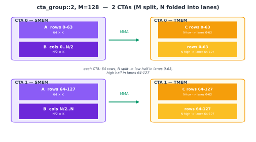
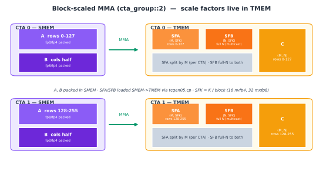

(chap_tensor_cores)=
# Blackwell Tensor Core：`tcgen05.mma`

:::{admonition} 概览
:class: overview

- `tcgen05.mma` 通常从 SMEM 读取 A、B，并在 TMEM 中更新 C/D accumulator；epilogue 再通过 `tcgen05.ld` 将结果读回 registers。
- `cta_group::1` 使用当前 CTA，`cta_group::2` 同时使用一个 CTA pair；两种模式对应不同的 TMEM accumulator 映射。
- Block-scaled MMA 还需要位于 TMEM 的 SFA、SFB；在本章采用的加载路径中，它们先进入 SMEM，再由 `tcgen05.cp` 搬入 TMEM，并根据 A、B 在 CTA pair 中的分工进行分片或复制。
:::

“{ref}`Tensor Core 数据布局的演进 <chap_layout_generations>`”一章已经介绍了矩阵乘累加（Matrix Multiply-Accumulate，MMA）在 Ampere、Hopper 和 Blackwell 架构上的数据路径。本章将进一步聚焦 Blackwell 的 `tcgen05.mma`：一条 MMA 指令如何发起，累加器如何映射到 TMEM，以及 `cta_group` 如何决定操作使用当前 CTA 还是一个 CTA pair 的资源。

前一章讨论的 TMA（{ref}`chap_tma`）通常负责将 A、B tile 异步搬入 SMEM。这里从 A、B 已经位于 SMEM 中这一阶段开始，介绍 `tcgen05.mma` 如何执行矩阵乘累加，结果如何映射到 TMEM，以及为什么 block-scaled MMA 还需要一条额外的 scale-factor 数据路径。

```{raw} html
<div style="overflow-x:auto;">
<iframe src="../demo_zh/tcgen05_intro.html?v=block-units-20260713" title="tcgen05 与 Tensor Memory" loading="lazy"
        style="width:100%; min-width:1320px; height:640px; border:1px solid var(--pst-color-border, #d0d0d0); border-radius:6px;"></iframe>
</div>
```
*保持默认设置 `M=128`、`N=16`，并沿 K 维逐步推进计算，可以观察各次迭代产生的部分和如何累加到 TMEM 中。也可以切换 A、B 的 transpose 设置，或者改变 N，比较不同配置下输入 tile、输出 tile 和指令参数的变化。*

先看图中的默认状态。图中的每个 cell 表示一个 `16×16` element block，因此输出 tile C 的 shape 虽然是 `128×16`，在图中会显示为纵向 8 个、横向 1 个 cells。每次点击 **K iteration**，Tensor Core 会读取 A 的一个 `128×16` slice，也就是 `8×1` 个 blocks，以及 B 的一个 `16×16` slice，也就是 1 个 block，并生成一个 `128×16` 的部分和。

第一次迭代使用 `accum=0`，不读取 TMEM 中原有的累加值，而是直接将当前乘积写入对应的 C tile：

```text
C[0:128, 0:16] =
    A[0:128, k:k+16] × B[k:k+16, 0:16]
```

后续迭代切换为 `accum=1`，将新的部分和累加到 TMEM 中已有的结果上：

```text
C[0:128, 0:16] +=
    A[0:128, k:k+16] × B[k:k+16, 0:16]
```

所有 K iterations 都会更新同一块 `128×16` TMEM 区域。只有在最后一次 K iteration 完成后，这块区域中才保存着最终的 C tile。

图底部还给出了本次 MMA 使用的 descriptors 和 PTX 指令。下一节会逐一说明其中的字段。

接下来介绍指令发起方式、`cta_group` 的操作范围和 TMEM layout。

## `tcgen05.mma` 如何执行

`tcgen05.mma` 是 Blackwell Tensor Core 的矩阵乘累加指令。它处理的是一个完整的矩阵 tile，而不是由某个 thread 独立完成的标量乘加。

与 Ampere 的 `mma.sync` 和 Hopper 的 `wgmma.mma_async` 不同，`tcgen05.mma` 具有 single-thread semantics。只需由一个选中的 thread 发出指令，硬件就会启动完整的 tile-level 矩阵乘累加，其他 threads 不需要分别提交同一条 MMA 指令。

下面是 A、B 都来自 SMEM，且不使用 block scaling 时，`tcgen05.mma` 的常见指令格式：

```text
tcgen05.mma.cta_group.kind
    [d-tmem], a-desc, b-desc, idesc,
    {disable-output-lane}, enable-input-d {, scale-input-d};
```

各部分的作用如下：

| 字段 | 作用 |
| --- | --- |
| `cta_group` | 指定 MMA 使用当前 CTA，还是一个 CTA pair 的资源 |
| `kind` | 指定 A、B 元素所属的数据类型类别 |
| `d-tmem` | C/D accumulator 在 TMEM 中的起始地址 |
| `a-desc`、`b-desc` | 描述 A、B 在 SMEM 中的地址与布局 |
| `idesc` | 指定 M、N、K、A/B 和 C/D 的具体数据类型，以及 operand major mode 等指令参数 |
| `disable-output-lane` | 指定不更新结果的 TMEM lanes；默认示例不屏蔽任何 lane |
| `enable-input-d` | 对应交互图中的 `accum`；它为 false 时计算 `D=A×B`，为 true 时计算 `D=A×B+D` |
| `scale-input-d` | 可选参数，用于在累加前缩放原有的 D；本章的例子不使用它 |

交互图的默认配置使用 `cta_group::1.kind::f16`。本书后续的 kernels 也通常使用 `.kind::f16`，并在 `idesc` 中选择 `f32` accumulator。`.kind::f16` 只指定 A、B 属于 16-bit 浮点类型类别；A、B 具体使用 `f16` 还是 `bf16`，以及 C/D 使用 `f16` 还是 `f32`，都由 `idesc` 指定。

`cta_group` 不改变 single-thread semantics，只决定这次 MMA 使用当前 CTA，还是一个 CTA pair 的资源。具体的 CTA 分工和 TMEM 映射，以及 block-scaled 形式所需的 SFA、SFB TMEM 地址，将在下方相关小节说明。

对于本章主要讨论的 A、B 来自 SMEM 的路径，需要同时考虑两类 layout：

- SMEM layout 决定 Tensor Core 如何解释和读取 A、B；
- TMEM layout 决定 C/D accumulator 如何映射到 TMEM 的 lanes 和 columns。

这两种 layout 位于不同的 memory spaces，具体映射由当前 `tcgen05.mma` 的 instruction shape、数据类型和 operand major mode 决定。本章沿用“{ref}`数据布局及其记号 <chap_data_layout>`”一章介绍的命名轴和 swizzle 概念来描述这些映射。

发出 `tcgen05.mma` 只表示异步操作已经启动，并不表示结果已经写入完成。同一个 thread 可以连续发出一个或多个 MMA，然后执行

```text
tcgen05.commit
```

让一个 `mbarrier` 跟踪该 thread 此前发出的异步 `tcgen05` 操作。硬件完成这些操作后，会在对应的 `mbarrier` 上发出完成信号。

在等待期间，kernel 中的其他 warps 可以继续搬运或准备后续 tiles。真正需要通过 `tcgen05.ld` 读取 accumulator 时，consumer 必须先等待对应的 `mbarrier` 完成，并执行

```text
tcgen05.fence::after_thread_sync
```

建立完成通知与后续 TMEM 访问之间的顺序。否则，epilogue 可能读到仍在更新的 TMEM 数据。后面的异步同步章节会详细介绍这套机制。

## TMEM 中的 Accumulator

在 Ampere 和 Hopper 上，从 PTX 编程模型来看，accumulator 位于 registers 中。MMA 生成的结果以 register fragment 的形式分布在参与计算的 threads 之间，epilogue 可以直接读取并处理这些值。Accumulator tile 越大，这些长期存活的 fragments 占用的 registers 就越多。

Blackwell 将长期存活的 accumulator 移入 TMEM。TMEM 是一种作用域为 CTA 的二维片上 memory space；在 `sm_100a` 上，每个 CTA 的 TMEM 包含 128 个 Lane rows 和 512 个 Col columns，每个 cell 为 32 bits。`tcgen05.mma` 在计算过程中不断更新 TMEM 中的 accumulator，epilogue 最后再通过 `tcgen05.ld` 将结果加载到 registers，用于类型转换、elementwise 操作和 store。

`tcgen05.ld` 本身也是异步指令。在使用其目标 registers 之前，必须执行 `tcgen05.wait::ld`，确认此前由该 warp 发出的 TMEM load 已经完成。

这样一来，accumulator 不再需要在整个主循环期间长期占用 registers。相应地，问题转变为 TMEM 的分配与布局：MMA 必须将结果写入正确的 TMEM 坐标，epilogue 也必须按照匹配的 layout 将这些值读回。下一章会进一步介绍 TMEM 的分配、寻址和读写。

## `cta_group` 如何决定操作范围

使用 `cta_group::1` 时，MMA 只更新当前 CTA 的 TMEM。以下先讨论 A 为稠密矩阵的常见情况，也就是 A 的所有元素都显式存储，并且 A、B 均通过 descriptor 从 SMEM 读取；某些 `tcgen05.mma` 变体也允许 A 来自 TMEM。

使用 `cta_group::2` 时，MMA 同时访问一个 CTA pair 中两个 CTA 的 TMEM。CTA pair 由同一 cluster 中 `%cluster_ctarank` 仅最低位不同的两个 CTA 组成：其中一个 rank 为偶数，另一个 rank 为奇数。下文分别称它们为偶数 CTA 和奇数 CTA。

硬件只要求 CTA pair 中的一个 thread 发出 `tcgen05.mma`；指令既可以由偶数 CTA 发出，也可以由奇数 CTA 发出，但 peer CTA 必须仍然处于 active 状态。本书后续的 kernels 通常约定由偶数 CTA 中的一个 thread 发出 MMA，并通过 `tcgen05.commit` 提交完成通知。

Accumulator layout 由 `cta_group`、M 维大小、A 是稠密矩阵还是结构化稀疏矩阵，以及是否使用 `tcgen05.mma.ws` 共同决定。这个 layout 规定逻辑坐标 `(m,n)` 如何映射到 `TLane` 和 `TCol`。

`N` 由 instruction descriptor 指定。在本节讨论的 `f16`/`bf16` 路径中，`cta_group::1` 支持从 8 到 256、以 8 为步长的 `N`，`cta_group::2` 支持从 16 到 256、以 16 为步长的 `N`。下面四张图用符号 `N` 表示这些合法取值；紫色表示 SMEM operands，橙色表示 TMEM accumulator，绿色表示 Tensor Core MMA 的数据路径。

### `cta_group::1`，`M = 128`

这是最直接的情况。一个 CTA 计算包含 128 行的 output tile，而该 CTA 的 TMEM 也恰好包含 128 个 Lane rows。因此，accumulator 的第 `m` 行直接映射到 TMEM Lane `m`，N 维则沿 TMEM columns 展开。

最终结果占据 128 个 Lane rows 和 N 个 Col columns。该 CTA 从自己的 SMEM 中读取 A、B，并在自己的 TMEM 中保存完整的 accumulator tile。


### `cta_group::1`，`M = 64`（不使用 `.ws`）

当 `M = 64` 时，输出 accumulator `C` 的逻辑 shape 是 `64xN`：`C` 表示 MMA 生成的矩阵，`M` 和 `N` 分别表示它的行数和列数。TMEM 仍然包含 128 个 Lane rows。这里讨论的是普通的 `tcgen05.mma`，而不是带 `.ws` 后缀的 weight-stationary 形式；它的 TMEM 映射采用 Layout F。

Layout F 按硬件数据路径将 128 条 TMEM lanes 分成四个 32-lane 区域，分别对应 `warp-rank % 4 = 0,1,2,3`。64 个 M rows 也被分成四组，每组 16 行，并依次放入这四个区域。由于每组只有 16 行，一个 32-lane 区域中只有一半 lanes 会被当前 tile 使用。

令 `a` 表示 TMEM lane alignment，取值为 0 或 16。逻辑行 `m` 对应的 TMEM Lane 为：

```text
group        = m // 16
row_in_group = m % 16
TLane        = group * 32 + a + row_in_group
```

当 TMEM lane alignment 为 0 时，映射为：

```text
rows  0-15  -> lanes   0-15
rows 16-31  -> lanes  32-47
rows 32-47  -> lanes  64-79
rows 48-63  -> lanes 96-111
```

因此，lanes `16-31`、`48-63`、`80-95` 和 `112-127` 不属于这个 tile。

同一个 Layout F 也允许 lane alignment 为 16。此时，另一个独立的 `M=64` tile 可以占据上述互补位置：

```text
rows  0-15  -> lanes  16-31
rows 16-31  -> lanes  48-63
rows 32-47  -> lanes  80-95
rows 48-63  -> lanes 112-127
```

这样，两个独立的 `M=64` tiles 就能够共享 TMEM 的 128-lane 结构，而不会覆盖彼此的数据。N 维仍然沿 TMEM columns 展开，变化的只是 M rows 在 Lane 轴上的放置方式。


### `cta_group::2`，`M = 256`

当 `M = 256` 时，一个 CTA 的 128 个 Lane rows 无法容纳完整的 M 维，因此 accumulator 被分布到 CTA pair 的两块 TMEM 中。

偶数 CTA 保存逻辑 rows `0-127`，奇数 CTA 保存逻辑 rows `128-255`。两个 CTA 都使用自己 TMEM 中的 lanes `0-127`，N 维则沿各自完整的 TMEM columns 展开。

物理上，这是分别属于两个 CTA 的两块 128-row TMEM；逻辑上，它们共同表示一个 `256×N` accumulator tile。A、B 如何分布到两个 CTA 的 SMEM，由具体 kernel 的数据组织方式决定，并不是该 accumulator layout 的一部分。


### `cta_group::2`，`M = 128`（A 为稠密矩阵）

当 `cta_group::2, M=128` 且 A 为稠密矩阵时，PTX 使用 Layout B 组织 accumulator。首先沿 M 维分工：偶数 CTA 保存 C 的 rows `0-63`，奇数 CTA 保存 rows `64-127`。

然后，每个 CTA 内部再把自己的 64 个 M rows 分成两组，每组 32 行；N 维也分成前后两半。这两组 M rows 和两个 N 半区组成一个 `2×2` 的映射，分别放入该 CTA 的四个 32-lane 区域：

| N 范围 | CTA 内的 M rows | TMEM lanes |
| --- | --- | --- |
| `0 ... N/2-1` | `0-31` | `0-31` |
| `0 ... N/2-1` | `32-63` | `32-63` |
| `N/2 ... N-1` | `0-31` | `64-95` |
| `N/2 ... N-1` | `32-63` | `96-127` |

令 `m_local = m % 64`，那么逻辑元素 `C[m,n]` 所在的 CTA 和 TLane 可以写成：

```text
CTA   = even,  if m < 64
        odd,   if m >= 64

TLane = m_local,       if n < N/2
        64 + m_local,  if n >= N/2
```

例如，当 `N=16` 时，`C[10,3]` 位于偶数 CTA 的 TLane 10；`C[10,11]` 仍位于偶数 CTA，但由于它属于 N 的后一半，因此映射到 TLane 74。

这里描述的是稠密 A 对应的 Layout B。若 A 为结构化稀疏矩阵，则 `cta_group::2, M=128` 使用不同的 Layout C，不能直接套用上述映射。



这四种 layout 规定了 `tcgen05.mma` 将每个 accumulator 元素写到哪个 CTA 的哪个 TMEM 位置。后续的 `tcgen05.ld` 必须使用与之匹配的 TMEM 地址和 load shape，才能把原来的逻辑 C tile 正确读回。

## Block-Scaled MMA

MXFP8 和 NVFP4 是前文介绍的两种具体 block-scaled 格式。<a href="../chapter_data_layout/index.html#tmem-scale-factors-warp">数据布局章节</a>已经介绍了 block scaling 的计算方式，以及 SFA、SFB 在 TMEM 中的 packing 和跨 warp replication；<a href="../chapter_layout_generations/index.html#block-scaled-mma-scale-factors">Tensor Core 数据布局的演进</a>进一步说明了 `tcgen05.cp` 数据路径和 `scale_vec` 的 byte selection。这里不再重复这些细节，只看 scale factors 在 CTA pair 中如何放置。

这里需要用到两个关系：`SFA(M,SFK)` 为 A 的每一行提供 scale factors，`SFB(N,SFK)` 为 B 的每一列提供 scale factors。Block-scaled `tcgen05.mma` 从 TMEM 读取它们，而 A、B 仍然从 SMEM 读取：

```text
A, B:     global memory -> SMEM -> tcgen05.mma
SFA, SFB: global memory -> SMEM -> tcgen05.cp -> TMEM -> tcgen05.mma
```

### 两个 CTA 如何放置 Scale Factors

对于逻辑坐标 `(m,n)` 上的输出，A 使用 `SFA[m,sfk]`，B 使用 `SFB[n,sfk]`。因此，scale factors 在 CTA pair 中的放置取决于 M 和 N 两个维度如何分工。

以图中 `M=256` 的 MMA 为例，偶数 CTA 计算 C 的 rows `0-127`，奇数 CTA 计算 rows `128-255`。它们只需要自己这些 rows 对应的 SFA：

```text
偶数 CTA: SFA[0:128,   :]
奇数 CTA: SFA[128:256, :]
```

图中采用一种常见实现：两个 CTA 各自在 SMEM 中准备 B 的一半 N columns，cooperative MMA 再将两部分作为完整的 B tile 使用。因此，两侧都需要完整的：

```text
SFB[0:N, :]
```

常见的 `cta_group::2` block-scaled kernel 会把这组 SFB multicast 到 CTA pair，使两个 CTA 的 TMEM 都能按 MMA 要求的 layout 提供它。所以，图中 SFA 沿 M 维分给两个 CTA，SFB 则在两侧各有一份完整副本。



## `tcgen05` 指令如何正确交接数据

`tcgen05.mma` 虽然只需要由一个 thread 发起，但它执行的是一次 tile-level 的协同操作。`cta_group` 决定这次操作使用当前 CTA，还是同时使用一个 CTA pair 的 SMEM 和 TMEM；对应的 TMEM layout 则决定每个 accumulator 元素最终写入哪个 CTA 的哪些 `TLane` 和 `TCol` 坐标。在本章采用的 block-scaled 路径中，SFA 和 SFB 会先通过 `tcgen05.cp` 搬入 TMEM，再按照 A、B 在 CTA pair 中的分工方式进行分片或复制。

因此，在连接 `tcgen05.cp`、`tcgen05.mma` 和 `tcgen05.ld` 等异步指令时，需要同时保证三件事：操作作用于正确的 CTA 或 CTA pair，生产者生成的数据布局与消费者预期的布局相匹配，并且消费者已经通过相应的完成与顺序机制确认数据可以安全使用。只要其中任一条件不满足，硬件就可能从错误的 TMEM 坐标解释数据，或者在数据仍在更新时提前读取它。

理解 `tcgen05` 的关键，也可以归结为这三个问题：这条指令使用哪些 CTA 的资源，数据映射到什么位置，以及结果从什么时候开始可以被下一阶段读取。
