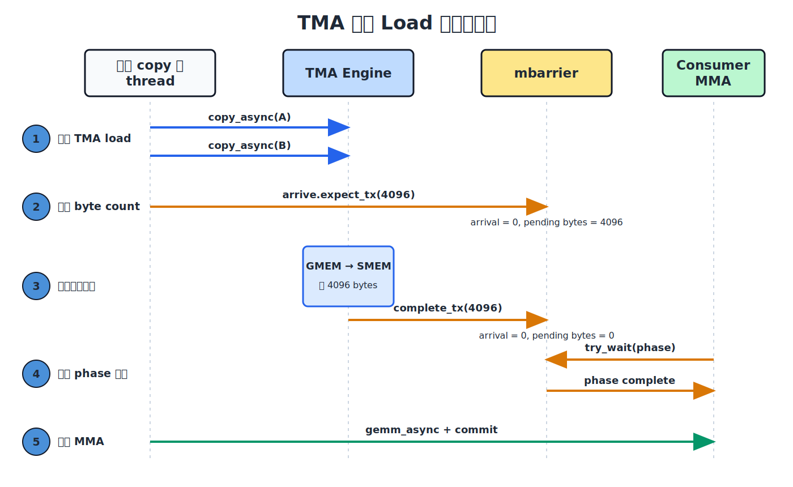

(chap_tma)=
# 异步数据搬运：TMA

:::{admonition} 概览
:class: overview

- TMA 负责在 global memory 和 shared memory 之间异步搬运 tile。一个 warp 中只需一个 thread 发起操作，后续的地址计算和数据传输由硬件完成。
- Tensor Map descriptor 说明 global tensor 如何组织，包括 shape、strides、tile shape 和 swizzle mode；TMA 指令再给出当前 tile 的坐标和 shared-memory 地址。执行 load 时，TMA 可以在写入 shared memory 的同时应用 swizzle，使 tile 直接采用后续 MMA 所需的布局。
- TMA load 和 store 使用不同的完成通知。Load 通过 `mbarrier` 按已传输的字节数判断数据是否就绪；store 通过 commit group 和 wait group 确认 source buffer 可以复用。
:::

先看 GEMM mainloop 中最常见的场景。Tensor Core 正在计算第 $k$ 个 tile 时，下一组 A、B tiles 必须在当前计算结束前搬入 shared memory。数据如果没有按时到达，Tensor Core 就只能停下来等待，pipeline 中也会出现气泡（pipeline bubble），也就是计算单元因等待数据而空闲的周期。

一种搬运方法是让多个 threads 合作：每个 thread 计算自己负责的 global memory 和 shared memory 地址，再执行 load 和 store。Tensor Memory Accelerator，也就是 TMA，提供了另一种方法。一个 thread 只负责提交 tile copy，后续的地址计算和数据传输由专用的 TMA engine 完成。

TMA 在写入 shared memory 时还可以应用 swizzle，让 tile 直接采用后续 MMA 所需的物理排列。下面的交互图展示了这条路径。左侧的 global tensor 包含 `16×128` 个 `fp16` 元素，蓝色方框选中一个 `8×64` tile；右侧显示这个 tile 写入 shared memory 后的排列。图中每个 cell 表示连续的 8 个 `fp16`，也就是 16 bytes。切换 swizzle mode，可以比较 linear layout 和 128-byte swizzled layout。

```{raw} html
<div style="overflow-x:auto;">
<iframe src="../demo_zh/tma_intro.html?v=tutorial-review-20260713" title="TMA：Tensor Memory Accelerator" loading="lazy"
        style="width:100%; min-width:1320px; height:640px; border:1px solid var(--pst-color-border, #d0d0d0); border-radius:6px;"></iframe>
</div>
```
*将鼠标悬停在左侧任意 source cell 上，可以查看它写入 shared memory 后的物理位置。*

## 一个 thread 如何描述整个 tile

发起 TMA copy 的 thread 不会遍历 tile 中的元素。它只需要向硬件提供两类信息。

第一类是 Tensor Map descriptor。它描述 global tensor 的数据类型、各维 shape 和 strides、一次 copy 的 tile shape，以及写入 shared memory 时使用的 swizzle mode。同一个 descriptor 通常可以供多次 tile copies 复用。

第二类是本次 copy 的参数，包括 tile 在 global tensor 中的起始坐标，以及 shared memory 中的目标地址。可以把两者的分工理解为：descriptor 说明“整个 tensor 怎样组织”，指令参数说明“这一次从哪里开始搬、搬到哪里”。

发出 TMA 指令时，warp 仍然按照 SIMT 模型执行，只有被选中的 thread 参与这条指令，同一 warp 中的其他 threads 会被屏蔽。这个状态只持续到请求提交完成。随后，TMA engine 异步搬运数据，发起操作的 warp 和 CTA 中的其他 warps 都可以继续执行；真正使用这块数据前，再等待搬运完成。

## TMA 如何写入 swizzled layout

回到上面的交互图，先选择 `None`。此时 tile 的每一行都按原来的顺序写入 shared memory，逻辑 sector `c` 仍然落在物理 sector `c`。

再切换到 `128B`。图中一行包含 8 个 16-byte sectors，正好是 128 bytes。对于这个简化且对齐的例子，第 `row` 行的逻辑 sector `col` 会写到：

```text
physical_sector = col XOR row
```

这样，同一逻辑列在不同行中的 sectors 会落到不同的物理位置，跨行访问也就不容易集中到同一组 shared-memory banks。这个地址重排由 TMA engine 在写入时完成，发起 copy 的 thread 不需要逐个计算 swizzled address。

Swizzle 只改变 tile 的物理排列，不改变它的逻辑内容。TMA descriptor、shared-memory tile layout 和后续 MMA 指令必须描述同一种物理排列（{ref}`chap_data_layout`）。如果 TMA 按 128-byte swizzle 写入，而 MMA 按 linear layout 读取，数据虽然已经到达 shared memory，Tensor Core 仍会把这些字节解释成错误的矩阵元素。

## 用 3D TMA 搬运多个 swizzle atoms

`SWIZZLE_128B` 以 `8 rows × 128 bytes` 为一个重复单元，也就是一个 swizzle atom。地址重排只在 atom 内进行，因此 TMA box 的最内层连续维度不能超过 128 bytes。对于 `fp16`，这段空间正好容纳 64 个元素。

现在考虑一个 `16×128` 的 `fp16` matrix slice。它的每一行有 128 个 `fp16`，共 256 bytes，无法直接作为一个 128-byte swizzle atom 的行。要使用 `SWIZZLE_128B`，必须先把每一行拆成两个 groups，每组 64 个 `fp16`：

```text
group 0: columns 0–63    = 128 bytes
group 1: columns 64–127  = 128 bytes
```

设 slice 中的列坐标为 `j`，可以将它拆成：

```text
group = j // 64
col   = j % 64

global[row, j] = global3[group, row, col]
```

这样，同一块数据就有了一个 `(group=2, row=16, col=64)` 的三维视图。这个 reshape 只改变 tensor map 解释坐标的方式，不会预先移动 global memory 中的数据。增加 `group` 维度后，最内层的 `col` 维只有 64 个 `fp16`，恰好符合 128-byte 限制。

下面的交互图把这个过程画了出来。左侧是完整的 `16×256` global matrix，每个 cell 表示一个 16-byte sector，也就是 8 个 `fp16`。蓝色区域选中其中一个 `16×128` slice。一次 3D TMA copy 会把这个 slice 的两个 groups 分别写入右侧的 `g0` 和 `g1`。

每个 group 有 16 行，而一个 swizzle atom 只有 8 行，所以 `g0` 和 `g1` 又各自包含两个 atoms：rows 0–7 属于第一个 atom，rows 8–15 属于第二个。整个 slice 最终对应四个 atoms。开启 `128B` 后，TMA 会在每个 atom 内按照 `physical_sector = logical_sector XOR (row % 8)` 重排 sectors。

```{raw} html
<div style="overflow-x:auto;">
<iframe class="demo-tma3d" src="../demo_zh/tma_3d.html?v=tutorial-review-20260713" title="使用 3D TMA 搬运多个 swizzle atoms" loading="lazy"
        style="width:100%; min-width:1320px; height:640px; border:1px solid var(--pst-color-border, #d0d0d0); border-radius:6px;"></iframe>
</div>
```
*切换 `Col offset` 可以选择原矩阵的前 128 列或后 128 列；将鼠标悬停在蓝色区域的任意 cell 上，可以查看对应的 16-byte sector 写入 shared memory 后的位置。*

### 128-byte swizzle 的分组要求

为什么要把 256-byte 的一行拆成两个 128-byte groups？除了满足 TMA box 的宽度限制，分组还会改变跨行访问落到哪些 shared-memory banks。

考虑一个 `16×16` sector grid。每个 sector 是 16 bytes，因此一行共 256 bytes。现在从连续 8 行中各读取同一个 sector column，一共会发出 8 次并行的 16-byte 访问。

一次 16-byte 访问会覆盖 4 个相邻的 shared-memory banks。为了便于观察，下面把 32 个 banks 按每 4 个相邻 banks 分成 8 个 bank sectors，记为 `S0` 到 `S7`。不同访问如果落到同一个 bank sector，就会争用同一组 banks。

先把每行拆成两个 128-byte groups。设完整 grid 中的列号为 `col`，那么 `col // 8` 选择左、右两个 groups，`local_col = col % 8` 表示组内列号。对于 rows 0–7，swizzle 后的 bank sector 是：

```text
bank_sector = local_col XOR (row % 8)
```

连续 8 行会得到 8 个不同的结果，因此这些访问可以并行完成。

如果不分组，仍然保留 256-byte row stride，那么每跨过一行就相当于跨过两个 128-byte 单元。用于 XOR 的编号也会每行前进 2：

```text
bank_sector = local_col XOR ((2·row + col // 8) % 8)
```

这时只有 4 个不同的结果，每个 bank sector 被访问两次，形成 2-way conflict。这里的未分组状态只是一个对照，它并不是合法的 `SWIZZLE_128B` TMA box。

下面的交互图展示了这两种情况。左侧选择原始 grid 中的一个 `Column` 和连续 8 行，右侧带黑色边框的 cells 显示这些访问在 swizzled layout 中的位置。`Tiling` 选择“是”时，每行先拆成 `g0` 和 `g1` 两个 128-byte groups；选择“否”时，则保留 256-byte row stride 作为对照。底部的 `S0` 到 `S7` 汇总各次访问使用的 bank sectors。`dtype` 只改变一个 sector 中包含多少个元素，不影响这里的地址映射。

```{raw} html
<div style="overflow-x:auto;">
<iframe class="demo-tma3d" src="../demo_zh/tiling_constraint.html?v=tutorial-review-20260713" title="128-byte 分组对 bank conflict 的影响" loading="lazy"
        style="width:100%; min-width:1320px; height:640px; border:1px solid var(--pst-color-border, #d0d0d0); border-radius:6px;"></iframe>
</div>
<script>
(function () {
  window.addEventListener('message', function (e) {
    var d = e.data;
    if (!d || d.type !== 'demoHeight' || !d.height) return;
    document.querySelectorAll('iframe.demo-tma3d').forEach(function (f) {
      if (e.source === f.contentWindow) f.style.height = d.height + 'px';
    });
  });
})();
</script>
```
*切换是否进行 tiling，再选择 column 和连续的 8 行，可以比较分组前后两种 layout 的 bank-sector 使用情况。*

在 tile 尺寸和目标访问模式允许时，通常选择能够容纳的最宽 swizzle，使访问分散到更多 banks。宽度为 `N` bytes 的 swizzle atom 要求连续维度至少能够容纳 `N` bytes；如果放不下 128-byte atom，就要改用 64-byte 或 32-byte swizzle（{ref}`chap_data_layout`）。

## 如何等待 TMA load 完成

TMA load 是异步操作。发出指令只表示搬运已经开始，consumer 还不能读取目标 tile。TMA 使用 `mbarrier` 完成这次交接：producer 告诉 barrier 本轮预计传输多少字节，TMA engine 在实际写完这些字节后更新 barrier，consumer 则等待当前 barrier phase 完成。

`mbarrier` 的一个 phase 同时记录 arrival count 和 pending transaction bytes。只有 arrival count 与 pending bytes 都归零，这个 phase 才算完成。

具体看一个例子。假设 kernel 同时加载 A、B 两个 operand tiles，每块 `2048 bytes`，并让它们通过同一个 `mbarrier` 通知完成，那么本轮一共要等待：

```text
2048 + 2048 = 4096 bytes
```

假设初始化 `mbarrier` 时将 expected arrival count 设为 1。发起 copy 的 thread 把 A、B 两次 TMA load 关联到这个 barrier，并执行 `mbarrier.arrive.expect_tx(4096)`。这一步既完成该 thread 的一次 arrival，也把 pending bytes 设为 4096：

```text
发出 expect_tx 后: arrival count = 0, pending bytes = 4096
TMA 完成搬运后:   arrival count = 0, pending bytes = 0
```

此后，每次 TMA copy 完成时，engine 都会通过 complete-tx 扣减相应的 byte count。consumer 使用 `try_wait(phase)` 等待；两次 copy 共完成 4096 bytes 后，pending bytes 才会归零，consumer 也才能安全读取 A、B tiles。下图按时间顺序画出了这次交接。



## 如何等待 TMA store 完成

TMA store 沿相反方向把数据从 shared memory 写回 global memory。这里需要解决的问题也随之改变：load 的 consumer 要知道目标 tile 何时可以读取，store 的 producer 则要知道 source buffer 何时可以复用。

例如，epilogue 已经把输出 tile 写入 `Dsmem`，接下来通过 TMA store 将它写回 `D`。发出 store 后，kernel 不能立刻覆盖 `Dsmem`，否则 TMA engine 可能读到下一轮写入的数据。store 路径使用 bulk async group 来等待：

```text
发起一个或多个 TMA stores
cp.async.bulk.commit_group
cp.async.bulk.wait_group 0
复用 Dsmem
```

`commit_group` 把此前尚未提交的 stores 组成一个 bulk async group。`wait_group 0` 等到先前提交的 groups 全部完成；它返回之后，`Dsmem` 才能安全复用。

因此，两条路径可以这样区分：

```text
TMA load:  consumer 通过带 byte count 的 mbarrier 等待数据到达
TMA store: producer 通过 commit group 和 wait group 等待 source 可复用
```

## 把 TMA 放进 pipeline

TMA 可以减少 copy 指令，更重要的是让数据搬运与计算重叠。以两个 shared-memory stages 为例：

```text
时间 t:    MMA 读取 stage 0    TMA 填充 stage 1
时间 t+1:  MMA 读取 stage 1    TMA 填充 stage 0
```

Tensor Core 读取 stage 0 时，TMA 把下一块 tile 写入 stage 1；下一轮再交换两个 stages 的角色。MMA 读取一个 stage 前，要等待对应的 TMA load 完成；TMA 覆盖一个 stage 前，也要确认上一轮计算已经不再使用其中的数据。

因此，TMA 负责异步搬运，barrier 负责在 producer 和 consumer 之间交接每个 stage。两者配合后，等待数据的时间才有机会被当前 tile 的计算隐藏起来。
