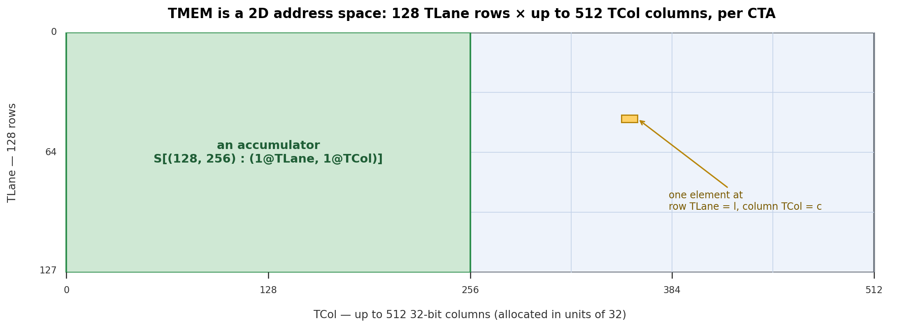
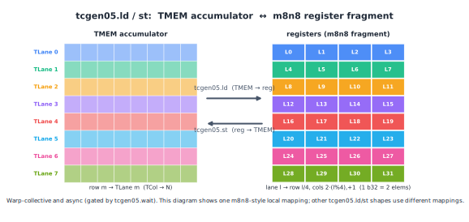

(chap_tmem)=
# 特殊内存：TMEM

<!--
翻译模板

英文源文件：chapter_tmem/index.md
建议：保留 TMEM/TLane/TCol、alloc/free、tcgen05.ld/st 等术语。
-->

:::{admonition} 概览
:class: overview

- TODO：翻译本章 overview 第一条。
- TODO：翻译本章 overview 第二条。
- TODO：翻译本章 overview 第三条。
:::

TODO：翻译导言部分。

## 二维地址空间

TODO：翻译 “A 2D Address Space” 小节。

## 分配

TODO：翻译 “Allocation” 小节。

## 读写 TMEM

TODO：翻译 “Reading and Writing TMEM” 小节。

